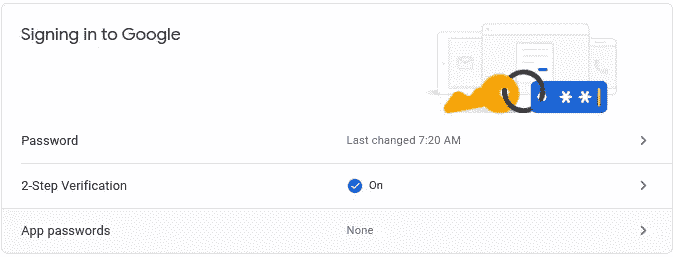
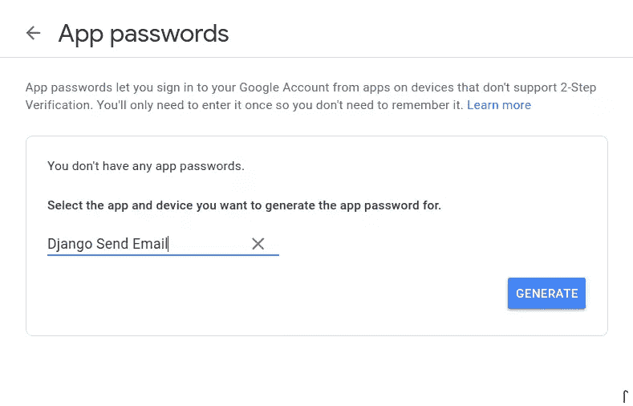
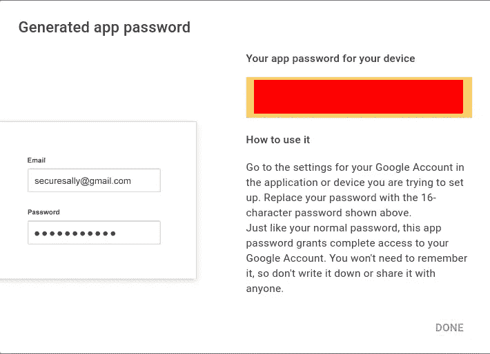
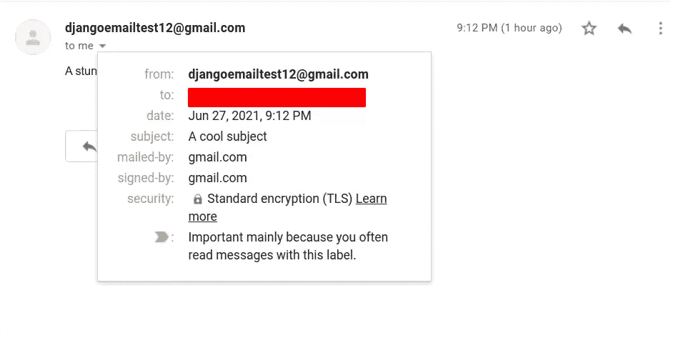
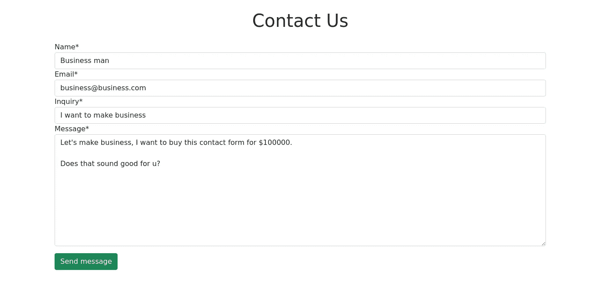
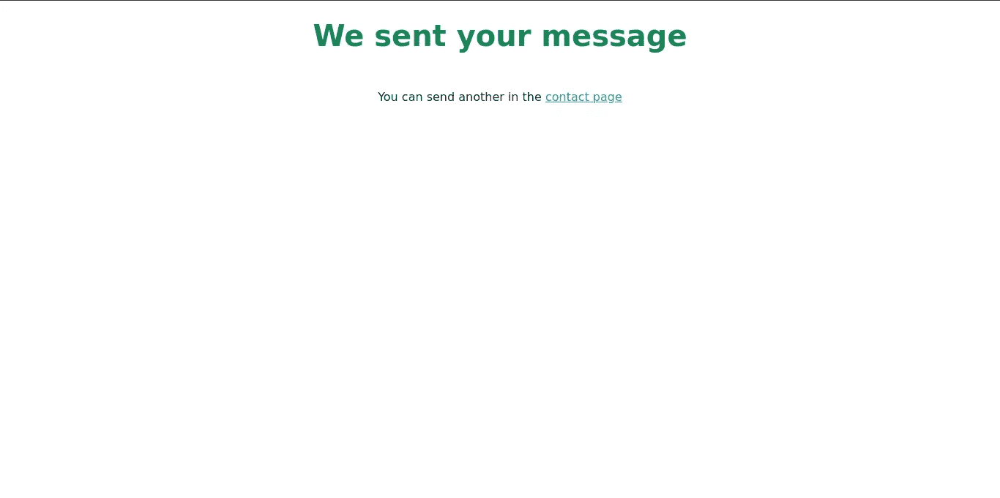
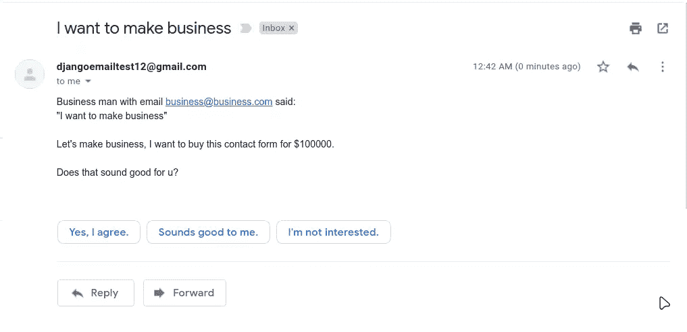

# 如何用 Django 发送电子邮件

> 原文：<https://www.sitepoint.com/django-send-email/>

在本教程中，我们将介绍如何使用 Django 发送电子邮件。我们将介绍如何配置 Django SMTP 连接，如何为您的电子邮件提供商设置应用程序密码，以及如何通过 Django shell 发送电子邮件。我们还将了解如何为您的 Django 应用程序设置联系表单，这将允许您的客户联系您。

大多数 web 应用程序使用电子邮件来管理重要的操作，例如重置密码、激活帐户、接收客户反馈、发送时事通讯和营销活动。这些任务中的大部分都需要一个专门的服务，如 [SendGrid](https://sendgrid.com/) 或 [Mailgun](https://www.mailgun.com/) 。但是如果你不希望你的网站有大量的访问者，你可以通过你的个人邮件提供商完成很多事情。

对于小型项目或测试项目来说，用你的个人邮箱发送邮件是一个合理的选择，所以为了简单起见，我们在这里采用这种方法。然而，在制作网站上使用个人电子邮件服务并不是一个好主意。您可以了解更多关于 [Gmail 发送限制](https://support.google.com/a/answer/166852)的信息，或者参考您的电子邮件提供商的限制。

*注意:本教程的完整代码可以在 [GitHub](https://github.com/sitepoint-editors/Email-Django-app) 上获得。*

## 了解 SMTP

SMTP(或简单邮件传输协议)是一组规则，用于确定电子邮件如何从发件人传输到收件人。SMTP 服务器使用此协议发送和转发传出的电子邮件。(注意，其他协议控制着*如何接收电子邮件*。)

一个 SMTP 服务器总是有一个唯一的地址，和一个发送消息的特定端口，在大多数情况下是 **587** 。我们将在用 Django 发送电子邮件时看到端口是如何相关的。

由于我们将使用 Gmail，我们将使用的地址是`smtp.gmail.com`，端口是 587。

现在让我们看看如何用 Django 发送电子邮件。

## 创建 Django 项目

每个 Django 项目都应该有一个虚拟环境，因为我们不想弄乱项目的依赖关系。要创建一个，请运行以下命令:

```
python -m venv .venv 
```

*注意:如果你不熟悉虚拟环境，一定要查看我们的 [Python 虚拟环境指南](https://www.sitepoint.com/virtual-environments-python-made-easy/)。*

上面的命令创建了一个名为`.venv`的虚拟环境。要激活这个虚拟环境，您可以使用以下方法:

```
source .venv/bin/activate 
```

因为 Django 是一个第三方包，所以您必须用 pip 安装它:

```
pip install django 
```

这将安装 Django 的最新版本，你可以用`pip freeze`检查。

要创建 Django 项目，您可以调用命令行实用程序 [django-admin](https://docs.djangoproject.com/en/dev/ref/contrib/admin/) :

```
django-admin startproject EmailProject 
```

使用上面的命令，您正在创建一个名为`EmailProject`的 Django 项目，但是您可以使用您想要的任何名称来创建这个项目。

现在，进入项目目录并运行服务器:

```
cd EmailProject
python manage.py runserver 
```

运行 Django 服务器后，在浏览器中访问 [http://localhost:8000](http://localhost:8000) 。您将看到一个自动生成的页面，上面有最新的 Django 发行说明。


## 修改设置

在发送电子邮件之前，您需要修改设置文件，所以让我们用命令`tree`找到该文件:

注意:为了简单起见，我们将只使用 UNIX (macOS 或 Linux)系统命令。

```
tree 
```

`tree`命令输出一个目录的文件结构。在这种情况下，由于我们没有给它一个特定的目录路径，如果我们在项目的根文件夹中，我们将得到类似如下的内容:

```
├── EmailProject
│   ├── asgi.py
│   ├── __init__.py
│   ├── settings.py
│   ├── urls.py
│   └── wsgi.py
└── manage.py

1 directory, 6 files 
```

我们将在本教程中不断修改的文件是位于`EmailProject`文件夹中的 [settings.py](https://docs.djangoproject.com/en/dev/topics/settings/) 。

保存你需要的所有项目配置，并允许你设置自定义变量。正如 Django 文档所说，“设置文件只是一个带有模块级变量的 Python 模块”。

让我们看看用 Django 发送邮件所需的设置。打开`EmailProject/settings.py`文件，将以下设置粘贴到文件底部:

```
# EmailProject/settings.py

# Bottom of the file
EMAIL_BACKEND = 'django.core.mail.backends.smtp.EmailBackend'
EMAIL_HOST = ''
EMAIL_PORT = 587
EMAIL_USE_TLS = True
EMAIL_HOST_USER = ''
EMAIL_HOST_PASSWORD = '' 
```

让我们通过分析这些设置来分解上面的代码。

### 电子邮件后端

[EMAIL_BACKEND](https://docs.djangoproject.com/en/3.2/ref/settings/#email-backend) 设置声明了 Django 项目将用来连接 SMTP 服务器的后端。

这个变量指向接收发送电子邮件所需的所有参数的`smtp.EmailBackend`类。我强烈建议你直接看一下 [Django 源代码](https://github.com/django/django/blob/8a7ac78b706797a03d26b88eddb9d1067ed35b66/django/core/mail/backends/smtp.py#L12)上的类构造函数。您会对这段代码的可读性感到惊讶。

*注意:虽然这个类是默认的`EMAIL_BACKEND`，但是在 Django 设置中显式使用它被认为是一个好的实践。*

所有其他电子邮件设置都将基于这个 [EmailBackend 类](https://docs.djangoproject.com/en/3.2/topics/email/#smtp-backend)的构造函数。

### 电子邮件主机

`EMAIL_HOST`设置指的是您将使用的 SMTP 服务器域。这取决于您的电子邮件提供商。下表列出了对应于三个常见提供商的 SMTP 服务器主机:

| 电子邮件提供商 | SMTP 服务器主机 |
| --- | --- |
| 谷歌邮箱 | smtp.gmail.com |
| Outlook/Hotmail | smtp-mail.outlook.com |
| 美国 Yahoo 公司(提供互联网的信息检索服务) | smtp.mail.yahoo.com |

我们现在将这个设置留空，因为我们稍后将使用一个`.env`文件来避免硬编码的敏感键或每个站点的配置。您不应该直接在代码中设置凭据。

我们将利用 Django environment 来解决这个问题。

### 电子邮件端口

必须将`EMAIL_PORT`设置为`587`，因为它是大多数 SMTP 服务器的默认端口。对于个人电子邮件提供商来说，情况依然如此。

此端口与 TLS 加密一起使用，以确保电子邮件发送的安全性。

### 使用 TLS 发送电子邮件

[传输层安全性](https://en.wikipedia.org/wiki/Transport_Layer_Security) (TLS)是一种跨 web 使用的安全协议，用于加密 Web 应用程序(Django)和服务器(SMTP 服务器)之间的通信。

最初，我们将`EMAIL_USE_TLS`变量设置为`True`。这意味着 Django 将使用传输层安全性连接到 SMTP 服务器并发送电子邮件。(对于个人电子邮件提供商来说，这是强制性的。)

### 电子邮件主机用户

`EMAIL_HOST_USER`设置是您的个人电子邮件地址。暂时将其留空，因为我们将使用`django-environ`来设置所有这些凭证。

### 电子邮件主机密码

`EMAIL_HOST_PASSWORD`设置是您将从电子邮件帐户获得的应用程序密码——我们将在本节结束后立即执行该过程。

同样的情况:将该设置留空，因为我们稍后将使用环境变量。

## 在 Gmail 中设置应用程序密码

要使用`EMAIL_HOST_PASSWORD`设置，您需要激活**不太安全的应用访问**，并从您的个人电子邮件地址获取应用密码。

如果你不激活**不太安全的应用访问**，你很可能会得到一个`SMTPAuthenticationError`，因为 Django 没有办法遵守谷歌安全协议。

你可以选择使用普通密码，但这比使用应用程序密码更有风险。我的建议是创建一个新的 Gmail 帐户或使用一个“测试”电子邮件地址。

考虑到这一点，您可以通过以下步骤获得一个 [Gmail 应用程序密码](https://support.google.com/accounts/answer/185833?hl=en)。请注意，如果您使用现有帐户并启用了两步验证，您可以跳过步骤 2 和 3:

1.  创建或登录 Gmail 帐户
2.  前往[myaccount.google.com/lesssecureapps](https://myaccount.google.com/lesssecureapps)，开启不太安全的应用选项。
    
3.  启用[双因素认证](https://myaccount.google.com/signinoptions/two-step-verification/enroll-welcome)，因为需要获取应用程序密码。
    
4.  现在您已经启用了双因素身份验证，是时候获取应用程序密码了。你可以通过进入谷歌账户的[安全区](https://myaccount.google.com/security)，向下滚动到登录谷歌区，点击**应用密码**来完成。
    

在被重定向到应用程序密码页面之前，您需要重新提示您的密码(帐户密码)。

一旦你进入，点击**选择应用**，在这里你将为应用密码选择一个自定义名称——比如“Django 发送电子邮件”——然后点击**生成**。



将出现一个新窗口，并提供 16 个字符的密码。复制它，因为我们需要它来配置我们的 Django 项目。



如果您使用其他电子邮件提供商，请务必阅读以下指南:

*   [雅虎应用密码](https://help.yahoo.com/kb/generate-separate-password-sln15241.html)
*   [Outlook 或 Hotmail 应用程序密码](https://docs.microsoft.com/en-us/azure/active-directory/user-help/multi-factor-authentication-end-user-app-passwords)

## 使用 Django Environ 隐藏敏感密钥

即使你只是在开发中发送电子邮件，你也不应该直接在源代码中写密码。当使用一个[版本控制系统](https://www.sitepoint.com/git-for-beginners/)和 GitHub 来托管你的项目时，这变得更加重要。*你不希望人们访问你的数据。*

让我们看看如何通过使用 [Django-environ](https://pypi.org/project/django-environ/) 来防止这种情况。

用下面的命令在`EmailProject`目录下(T2 文件所在的位置)创建一个`.env`文件:

```
cd EmailProject/
ls

settings.py # The settings file must be here

touch .env 
```

现在，打开那个`.env`文件，输入下面的键值对:

```
EMAIL_HOST=smtp.gmail.com
EMAIL_HOST_USER=YourEmail@address
EMAIL_HOST_PASSWORD=YourAppPassword
RECIPIENT_ADDRESS=TheRecieverOfTheMails 
```

分解此文件的内容:

*   `EMAIL_HOST`:您的电子邮件提供商 SMTP 服务器地址。请参见上面的电子邮件主机表以获得快速指导。在这种情况下，我使用的是 Gmail SMTP 地址`smtp.gmail.com`。
*   你的电子邮件地址。
*   `EMAIL_HOST_PASSWORD`:您刚刚生成的 app 密码。请记住，它不包括任何空格。
*   `RECIPIENT_ADDRESS`:你接收信息的电子邮件地址。这是一个自定义设置，我们将在稍后创建，以便将所有电子邮件发送给同一个收件人。

为了利用这些环境变量，我们需要安装`Django-environ`:

```
pip install django-environ 
```

注意:确保你的虚拟环境已经激活。

现在，打开位于`EmailProject`目录的`settings.py`，使用下面的代码:

```
# EmailProject/settings.py
# This should be at the start of the file
import environ

env = environ.Env()
environ.Env.read_env()

# Previous settings ...
EMAIL_BACKEND = 'django.core.mail.backends.smtp.EmailBackend'
EMAIL_HOST = env('EMAIL_HOST')
EMAIL_PORT = 587
EMAIL_USE_TLS = True
EMAIL_HOST_USER = env('EMAIL_HOST_USER')
EMAIL_HOST_PASSWORD = env('EMAIL_HOST_PASSWORD')

# Custom setting. To email
RECIPIENT_ADDRESS = env('RECIPIENT_ADDRESS') 
```

首先，我们在设置文件的顶部导入`environ`包。记住所有的导入都应该在开始。

然后我们创建一个`env`变量，它将包含`.env`上所有可用的键值对。

`env('KEY')`语句意味着我们正在查找那个键的值。在继续之前，请确保您已经设置了您的`.env`文件，因为如果没有设置某个环境变量，您将得到一个 Django `ImproperlyConfigured`错误。

请注意，`RECIPIENT_ADDRESS`是一个自定义设置，我们将使用它将电子邮件发送到我们可以访问的地址。

**不要忘记**将`.env`文件包含在你的[中。gitignore](https://git-scm.com/docs/gitignore) 以防你使用 Git 和 GitHub。您可以通过打开它并添加以下行来完成此操作:

```
.env 
```

## 1.用 Django Shell 发送电子邮件

最后，我们进入了文章有趣的部分！是时候给姜戈发第一封邮件了。

打开终端，激活虚拟环境，然后运行:

```
python manage.py shell 
```

这将创建一个 shell，其中包含已经为我们配置的所有 Django 设置。在这个全新的外壳中，粘贴以下代码:

```
>>> from django.core.mail import send_mail
>>> from django.conf import settings
>>> send_mail(
...     subject='A cool subject',
...     message='A stunning message',
...     from_email=settings.EMAIL_HOST_USER,
...     recipient_list=[settings.RECIPIENT_ADDRESS])
1 
```

我们也可以在不指定参数的情况下编写一行程序:

```
>>> send_mail('A cool subject', 'A stunning message', settings.EMAIL_HOST_USER, [settings.RECIPIENT_ADDRESS])
1 
```

我们来分解一下上面的代码:

*   我们导入 Django [send_mail](https://docs.djangoproject.com/en/3.2/topics/email/#send-mail) 函数。
*   然后我们导入包含所有[全局设置](https://github.com/django/django/blob/main/django/conf/global_settings.py)和每个站点设置(在`settings.py`文件中)的`settings`对象。
*   最后，我们将所有需要的参数传递给`send_mail`函数。该函数返回发送的邮件数量，在本例中为 **1** 。

请注意我们是如何使用`settings`对象来获取`from_email`(您用来发送电子邮件的电子邮件)和`recipient_list`(我们在`.env`中定义的`RECIPIENT_ADDRESS`自定义设置)。

现在，如果我检查我的收件箱——当我将环境变量`RECIPIENT_ADDRESS`设置为我的电子邮件地址时——我将收到 Django 发送的消息。



## 2.与 Django 建立一个自动联系表单

在这一节中，我们将使用 Django 表单和内置的`send_mail`函数构建一个自动化的联系人表单。此外，我们将在 contact 表单中创建一个自定义函数`send()`，以便更容易在视图中实现它。

让我们从创建联系人应用程序开始。进入项目根目录——`manage.py`所在的位置——并运行:

```
python manage.py startapp contact 
```

然后，将它安装在`EmailProject/settings.py`文件中的`INSTALLED_APPS`变量中:

```
# EmailProject/settings.py

INSTALLED_APPS = [
    'django.contrib.admin',
    ...

    # Custom
    'contact',
] 
```

在使用`contact`应用程序之前，让我们在`EmailProject/urls.py`文件中配置`urlpatterns`。为此，导入`django.urls.include`函数并在整个项目中包含联系人 URL。不用担心；我们稍后将配置联系人 URL:

```
# EmailProject/urls.py

from django.contrib import admin
from django.urls import path, include # New import

urlpatterns = [
    path('admin/', admin.site.urls),
    path('', include('contact.urls')) # Include Contact URLs
] 
```

### 联系方式

进入`contact` app 文件夹，创建一个`forms.py`文件。在一个`forms.py`文件中定义所有的表单是一个很好的实践，但是这不是强制性的。这就是为什么 Django 默认不包含这个文件。

您可以使用以下命令创建表单文件:

```
cd ../contact/
# You were inside the EmailProject folder
touch forms.py 
```

打开刚刚创建的文件，进行以下导入:

```
# contact/forms.py
from django import forms
from django.conf import settings
from django.core.mail import send_mail 
```

Django [表单模块](https://docs.djangoproject.com/en/3.2/topics/forms/#the-django-form-class)为我们提供了创建联系人表单所需的所有类和字段。我们再次导入`settings`对象和`send_mail`函数来发送电子邮件。

我们的联系表单将包含几个字段，并使用两个自定义方法:`get_info()`，它格式化用户提供的信息，以及`send()`，它将发送消息。

让我们看看这是如何在代码中实现的:

```
# contact/forms.py
class ContactForm(forms.Form):

    name = forms.CharField(max_length=120)
    email = forms.EmailField()
    inquiry = forms.CharField(max_length=70)
    message = forms.CharField(widget=forms.Textarea)

    def get_info(self):
        """
        Method that returns formatted information
        :return: subject, msg
        """
        # Cleaned data
        cl_data = super().clean()

        name = cl_data.get('name').strip()
        from_email = cl_data.get('email')
        subject = cl_data.get('inquiry')

        msg = f'{name} with email {from_email} said:'
        msg += f'\n"{subject}"\n\n'
        msg += cl_data.get('message')

        return subject, msg

    def send(self):

        subject, msg = self.get_info()

        send_mail(
            subject=subject,
            message=msg,
            from_email=settings.EMAIL_HOST_USER,
            recipient_list=[settings.RECIPIENT_ADDRESS]
        ) 
```

这是一门很大的课，所以让我们把每一部分的内容分解一下。首先，我们定义了发送消息所需的四个字段:

*   `name`和`enquiry`是代表联系信息名称和原因的[字符域](https://docs.djangoproject.com/en/3.2/ref/forms/fields/#charfield)。
*   `email`是一个[电子邮件字段](https://docs.djangoproject.com/en/3.2/ref/forms/fields/#emailfield)，代表试图联系你的人的电子邮件。考虑到电子邮件不会通过用户的电子邮件地址发送，而是通过您在 Django 项目中设置的电子邮件地址发送。
*   `message`是另一个`CharField`，只是我们使用的是[文本区域](https://docs.djangoproject.com/en/3.2/ref/forms/widgets/#textarea)小部件。这意味着，当显示表单时，它将呈现一个`<textarea>`标签，而不是一个简单的`<input>`。

在定制方法中，我们只使用了`get_info`方法来格式化用户提供的信息并返回两个变量:`subject`，它只不过是`inquiry`字段，以及`message`，它将是 Django 发送的实际消息。

另一方面，`send()`方法只从`get_info`获取格式化的信息，并用`send_mail`函数发送消息。

尽管这一部分相当大，但是您将看到我们如何通过实现所有发送逻辑到`ContactForm`本身来简化联系人视图。

### 联系人视图

打开`contact/views.py`文件并添加以下导入:

```
# contact/views.py
from django.views.generic import FormView, TemplateView
from .forms import ContactForm
from django.urls import reverse_lazy 
```

正如你所看到的，我们将使用 [Django 通用视图](https://docs.djangoproject.com/en/3.2/topics/class-based-views/)，这在执行简单任务时节省了我们大量的时间——例如，当用`FormView`设置一个表单或者创建一个仅用`TemplateView`呈现模板的视图时。

此外，我们正在导入我们在上一节构建的`ContactForm`和在使用*基于类的视图*时使用的 [reverse_lazy](https://docs.djangoproject.com/en/3.2/ref/urlresolvers/#reverse-lazy) 函数。

继续查看视图，让我们编写`ContactView`:

```
# contact/views.py

class ContactView(FormView):
    template_name = 'contact/contact.html'
    form_class = ContactForm
    success_url = reverse_lazy('contact:success')

    def form_valid(self, form):
        # Calls the custom send method
        form.send()
        return super().form_valid(form) 
```

如您所见，我们正在使用我们创建的`ContactForm`构建一个简单的[表单视图](https://docs.djangoproject.com/en/3.2/ref/class-based-views/generic-editing/#formview)。我们还建立了`template_name`和`success_url`。稍后我们将编写 HTML 模板并设置 URL。

只有当表单的所有字段都有效时，[表单有效](https://docs.djangoproject.com/en/3.2/ref/class-based-views/mixins-editing/#django.views.generic.edit.FormMixin.form_valid)方法才允许我们使用`ContactForm.send()`方法发送电子邮件。这意味着，如果用户输入了无效的输入，例如未格式化的电子邮件地址，邮件将不会被发送。

在基于函数的视图中，上面的`form_valid`方法实现等同于下面的:

```
# Previous function based contact_view ...

if request.method == 'POST':
    form = ContactForm(request.POST)
    if form.is_valid():
        form.send()
        return redirect('contact:success')
else:
    form = ContactForm()) 
```

结束这一部分，我们将编写一个`ContactSucessView`，它将向用户显示一条成功消息。因为我们已经导入了`TemplateView`类，我们只需要继承它并定义`template_name`属性:

```
# contact/views.py
class ContactSuccessView(TemplateView):
    template_name = 'contact/success.html' 
```

如果你有任何疑问，你可以在 [GitHub 库](https://github.com/sitepoint-editors/Email-Django-app/blob/main/EmailProject/contact/views.py)上查看`views.py`文件。

### 联系人 URL

是时候创建`contact`应用程序的 URL 模式了。由于 Django 默认没有给我们`urls.py`文件，我们需要用下面的命令创建它(确保在`contact`应用程序文件夹中):

```
pwd
# /path/to/project/EmailProject/contact
touch urls.py 
```

打开文件并设置`app_name`和`urlpatterns`变量:

```
from django.urls import path
from .views import ContactView, ContactSuccessView

app_name = 'contact'

urlpatterns = [
    path('', ContactView.as_view(), name="contact"),
    path('success/', ContactSuccessView.as_view(), name="success"),
] 
```

我们使用[路径](https://docs.djangoproject.com/en/3.2/ref/urls/#path)将路线及其对应的视图包含到应用程序的 URL 配置中。当我们将`app_name`变量设置为`'contact'`时，这意味着应用程序的 URL *名称间距*将如下所示:

```
contact:name_of_path
# For ContactView
contact:contact
# For ContactSuccessView
contact:success 
```

注意:名称空间是我们在 Django 模板和视图中动态调用的 URL。

您可以在官方文档中了解更多关于 Django URL dispatcher 的信息。

### 编写模板

Django 模板是动态显示数据的首选方式，它使用了 Django 模板语言提供的 [HTML](https://www.sitepoint.com/html-css/html/) 和特殊标签。

对于这个特定的应用程序，我们将使用三个模板:

*   所有其他模板都将继承它。它将包含所有模板必须拥有的所有 HTML 框架，以及到 Bootstrap 的链接。
*   `contact.html`:显示联系人表单。
*   `success.html`:显示成功消息。

让我们首先创建联系人的应用程序模板结构(确保您位于联系人应用程序文件夹内):

```
mkdir -p templates/contact/
cd templates/contact
touch base.html contact.html success.html 
```

上面的命令创建了可重用 Django 应用程序的典型模板结构— `appname/templates/appname` —以及我之前提到的树模板文件。

应用程序文件结构现在应该是这样的:

```
.
├── admin.py
├── apps.py
├── forms.py
├── __init__.py
├── migrations
│   └── __init__.py
├── models.py
├── templates
│   └── contact
│       ├── base.html
│       ├── contact.html
│       └── success.html
├── tests.py
├── urls.py
└── views.py 
```

让我们进入`base.html`模板的内容:

```
<!-- contact/templates/contact/base.html -->

<!DOCTYPE html>
<html lang="en">

  <head>
    <meta charset="UTF-8" />
    <meta http-equiv="X-UA-Compatible" content="IE=edge" />
    <meta name="viewport" content="width=device-width, initial-scale=1.0" />
    <title>Django Email Send</title>
    <link href="https://cdn.jsdelivr.net/npm/bootstrap@5.0.0/dist/css/bootstrap.min.css" rel="stylesheet"
      integrity="sha384-wEmeIV1mKuiNpC+IOBjI7aAzPcEZeedi5yW5f2yOq55WWLwNGmvvx4Um1vskeMj0" crossorigin="anonymous" />
  </head>

  <body>
    

    
    <script src="https://cdn.jsdelivr.net/npm/bootstrap@5.0.0/dist/js/bootstrap.bundle.min.js"
      integrity="sha384-p34f1UUtsS3wqzfto5wAAmdvj+osOnFyQFpp4Ua3gs/ZVWx6oOypYoCJhGGScy+8" crossorigin="anonymous">  </script>
  </body>

</html> 
```

如你所见，这是一个 HTML 文件的简单框架，包括到 [Bootstrap 5](https://getbootstrap.com/docs/5.0/getting-started/introduction/) 的链接。这允许我们不用 CSS 文件就能风格化我们的联系人应用程序。

标签允许我们设置一个“子模板”将使用的占位符。这个标签的使用使得[模板继承](https://docs.djangoproject.com/en/3.2/ref/templates/language/#template-inheritance)变得很容易。

在进入表单之前，您需要安装 [Django crispy forms](https://django-crispy-forms.readthedocs.io/en/latest/) 包，它允许我们轻松地对它们进行风格化:

```
pip install django-crispy-forms 
```

同样，`crispy_forms`是一个 Django 应用程序，我们需要将它包含在`INSTALLED_APPS`列表中:

```
# config/settings.py

INSTALLED_APPS = [
    ...

    # 3rd party apps
    'crispy_forms',

    # Custom apps
    'contact',
]

# Indicates the frontend framework django crispy forms use
CRISPY_TEMPLATE_PACK = 'bootstrap4' 
```

我们使用 Bootstrap 4 的模板包，因为 Bootstrap 表单类在第 4 版和第 5 版之间是兼容的(在撰写本文时)。

现在，让我们开始制作`contact.html`模板:

```
<!-- contact/templates/contact/contact.html -->





<div class="mx-auto my-4 text-center">
    <h1>Contact Us</h1>
</div>
<div class="container">
    <form action="" method="post">
        
        {{ form | crispy }}
    <button class="btn btn-success my-3" type="submit">Send message</button>
    </form>
</div>
 
```

请注意我们是如何扩展基本模板并利用块占位符的。这就是 Django 模板语言如此高效的原因，因为它让我们节省了大量的 HTML 复制和粘贴工作。

谈到表单，我们使用的是方法`"post"`，这意味着我们的`ContactView`将处理用户给出的数据，如果表单有效，就发送电子邮件。

出于安全原因，``在每种形式中都是强制性的。Django 的文档中有一个关于 [CSRF 令牌](https://docs.djangoproject.com/en/3.2/ref/csrf/)以及在处理表单时使用它们的原因的专门页面。

我们将用`crispy`模板标签来呈现表单，这就是为什么我们用``来加载 crispy 标签。

最后，我们来编写`success.html`模板:

```



<div class="mx-auto my-4 text-center">
    <h1 class="fw-bolder text-success">We sent your message</h1>
    <p class="my-5">You can send another in the <a href="">contact page</a></p>
</div>
 
```

如您所见，这是一个简单的成功公告，包括一个到联系表单的链接，以防用户想要发送另一条消息。

让我们再次运行服务器并访问 [http://localhost:8000](http://localhost:8000) (确保您激活了`.venv`，并且您在项目根文件夹中):

```
python manage.py runserver 
```

下图显示了最终的联系方式。



这是成功信息的图像。



这是收件箱里邮件的图片。



## 包扎

恭喜你。您已经学习了如何用 Django 发送电子邮件，以及如何构建 Django 联系表单。

和 Django 发邮件有很多方法。在本教程中，您已经使用了您的个人电子邮件地址，但是我希望您探索其他工具，并将它们集成到您的项目中。

在本教程中，我们介绍了以下内容:

*   如何设置 Django 设置来服务电子邮件
*   如何在小型项目中使用个人电子邮件帐户发送电子邮件
*   如何使用`.env`文件在 Django 项目中使用敏感数据
*   如何建立自动联系表单

关于 Django 的更多信息，请查看“[用 Django](https://www.sitepoint.com/django-photo-sharing-app/) 构建一个照片分享应用”。

## 分享这篇文章