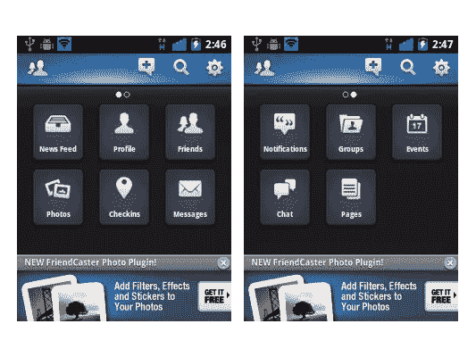
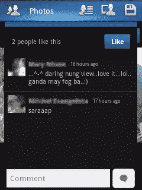
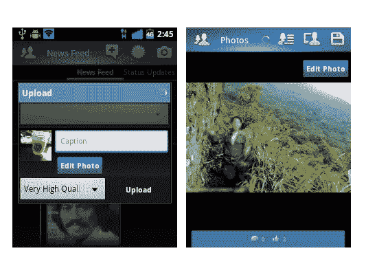

# 使用 Android 版 Friendcaster 脸书客户端做更多事情

> 原文：<https://www.sitepoint.com/do-more-with-friendcaster-facebook-client-for-android/>

Friendcaster 是脸书的一个客户端，提供的功能比脸书自己的安卓版要多，这使得它成为官方应用的一个极好的替代品。首先，你可以在 Friendcaster 上做很多标准的脸书手机应用程序做不到的事情。

### 用户界面

仅在界面内，Friendcaster 就提供了更多的按钮，从而提供了更多的选项。输入您的登录详细信息后，该应用程序会将您带到主菜单，您可以在主菜单上横向滑动，以进入下一页的特性和功能。

这些选项以非常直观和有组织的方式呈现，因此您可以从一开始就决定您想要访问什么。当然，你必须熟悉每个按钮的功能，否则这个菜单一开始可能会让你有点困惑。

要查看您朋友的所有更新，请点击**新闻源**按钮。它会将您带到默认页面，与您从 PC/MAC、官方移动应用程序或网站打开脸书时看到的页面相同。

Friendcaster 做得更多，它根据类别提供不同的新闻源，如*状态更新、照片、链接、*和你已经创建的现有好友列表。

这种特殊的“feed filtering”功能可以最大限度地减少浏览你所有朋友的帖子——尤其是那些你可能不感兴趣或没有意义的帖子。有了这个应用程序，信息就会被过滤，这样你就可以选择接受哪些信息，而不会被无关的信息淹没，正如你所知，这在脸书很容易发生。

使用 Friendcaster 浏览、点赞和评论个人帖子是一种非常令人印象深刻的体验。在这里，它可以展示它伟大的应用程序设计。点击一篇文章或一张照片的底部，会以抽屉的形式显示评论和赞。

点击“ *X 人*喜欢这个”，它会显示一个单独的弹出窗口，上面有那些“喜欢”这个帖子的人的名字。你可以通过点击手机的**返回**按钮来关闭这个窗口并返回。

### 通知

Friendcaster 不仅仅是为那些想要“过滤”他们的脸书信息的人准备的。如果你是那种不想错过任何进入你的脸书账户的东西的人，那么你也会喜欢这个应用程序。Friendcaster 将通知提升到了另一个层次:当你收到一条消息或评论时，会出现一个弹出框，给你一个预览。然后你可以在那个窗口里回复，甚至不用打开 Friendcaster 应用程序。这是一个非常令人印象深刻的特性，对于那些非常活跃于脸书的人来说，这是一个非常有用的特性。

可以在**通知类型**下的*设置*菜单中配置弹出通知，包括**收件箱消息**、**好友生日**、**好友请求**、**活动邀请**和**群邀请**。选中(或取消选中)其中任何一项，以自定义您对这些通知类型的控制。

此外，Friendcaster 允许你在创建帖子时非常精确地定制你的隐私设置。与脸书官方手机应用程序不同，在过滤谁可以查看帖子时，你只能选择一个列表，Friendcaster 允许你勾选多个列表，允许你将帖子发送给多个精心选择的脸书朋友群。

在准确选择了哪些人可以查看你的新帖子后，只需点击手机的**返回**按钮即可返回并继续撰写帖子。您还可以选择在帖子中标记朋友或包含链接。

### 上传和下载

在这个应用程序中上传照片也很容易。默认情况下，脸书官方应用会将你手机上传的照片放入相册*手机上传*。有了 Friendcaster，你可以改变这一点，并从你帐户中的任何相册中进行选择。

您还可以调整正在上传的照片的分辨率和质量(从 600 像素到 2048 像素)。上传后，您可以浏览照片，并标记您的朋友或将其作为您的个人资料照片(如果需要)。

当查看任何相册中的照片时，您可以点击顶部的磁盘图标，并将图像保存到您的手机中。

### 缺点

在稳定的互联网连接下，该应用程序的下载和上传性能非常令人满意。然而，滚动浏览你的**新闻提要**一段时间会消耗相当多的电池寿命。

该应用的图标也可以更加用户友好和直观。在一些屏幕上，顶部的一些图标不能清楚地代表你当前正在使用的应用程序的哪个部分(除非你点击它)。清晰地展示每个特性和功能的图标会让 Friendcaster 更加用户友好。

因为这个应用程序是免费的，所以在屏幕底部会弹出广告，这会占用宝贵的屏幕空间，如果不小心按下，会很麻烦。然而，用户可以升级到一个 **[付费版本](https://market.android.com/details?id=uk.co.senab.blueNotify&feature=search_result#?t=W251bGwsMSwxLDEsInVrLmNvLnNlbmFiLmJsdWVOb3RpZnkiXQ..)** ，完全删除这些广告。

### 结论

考虑到脸书官方应用的局限性，Friendcaster 是一个受欢迎的替代品。除了更稳定、更快之外，它的功能远远超过了脸书的应用。

总的来说，Friendcaster 提供的功能水平是不可否认的。此外，在今天的安卓市场上，没有其他脸书客户端像它一样。虽然其他客户集成了 Twitter 和其他社交网站，但 Friendcaster 是脸书的专属，这对于死忠的脸书用户和不想被脸书信息淹没的“朋友过滤者”来说都非常有效。

尽管这款应用并不完美(它有广告，菜单和图标也很难使用)，但它的好处足以让人忽略这些小缺陷。对于那些想在脸书账户上做更多事情的人来说，没有比 Friendcaster 更好的应用了。

## 分享这篇文章