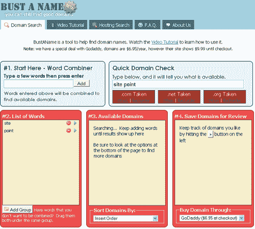
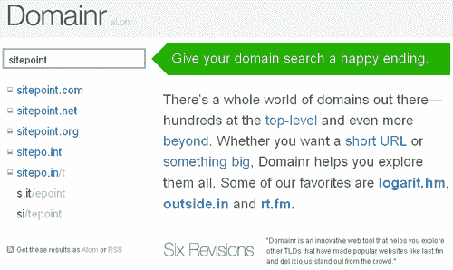
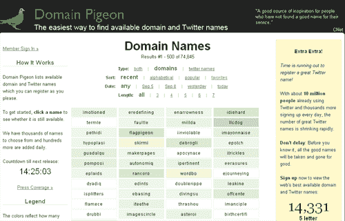
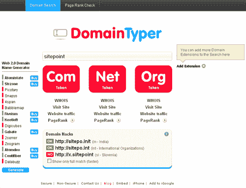
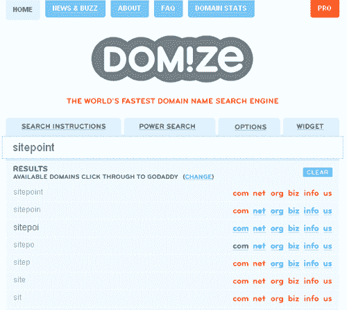
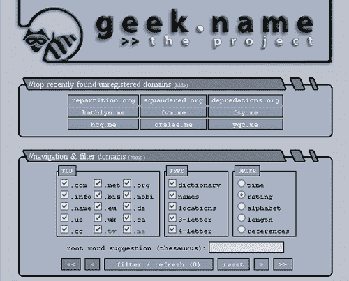
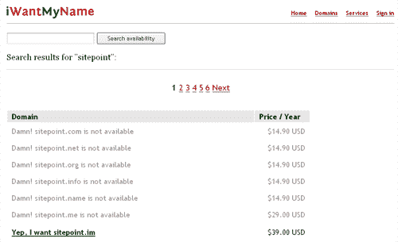
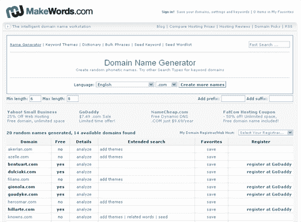
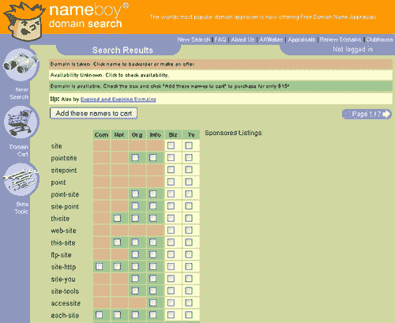

# 11 个域名生成器和搜索工具

> 原文：<https://www.sitepoint.com/domain-name-generators-search-tools/>

有时候感觉绝对没有好域名了。好吧，幸运的是，不仅还有一些不错的工具，而且还有一些工具可以帮助你解决这些问题！

我们收集了 11 个域名工具，可以帮助你生成域名，搜索域名，甚至注册域名。见鬼，他们中的一些甚至提供 iPhone 和 iPod Touch 应用程序，这样你就可以在任何时候得到灵感的时候搜索域名！

:BustAName 为你的域名搜索提供了众多选项，比如只需输入一般的单词或更具体的东西。您还可以选择它应该寻找哪些扩展名，删除最后一个元音，添加连字符等等。如果你找到一个你喜欢的名字，你可以从多个注册商中选择购买。

**[domai . NR](http://domai.nr/)**:domai . NR 允许你输入单词并接收建议，这些建议不仅包含。com，。net 和。org，但也有国家和其他扩展，所以你可以像 sitepo.int 一样结束。唯一的缺点是它向你展示了所有的可能性，然后你必须点击每一个来看看它是否可用。

:不仅仅局限于域名，DomainPigeon 向你展示了众多的名单。仍然可用的 com 名称，以及 Twitter 用户名，以防您仍然需要。结果是彩色编码的，所以你可以看到在你决定购买之前有多少人对一个给定的术语感兴趣。

:域名输入器会开始显示你在搜索框中输入的每个字母的建议。虽然初步结果只显示。com，。net 和。org，你可以点击添加对其他扩展名的搜索。还有一个 Web 2.0 名称生成器，它会像承诺的那样做，并向您显示一些仍然可用的最奇怪的名称。这项服务还有一个 iPhone 应用程序，所以你可以随时随地查看姓名。

:Domize 快速返回你在搜索栏中输入的域名和变体的结果。它也有一些“强大的搜索”选项，让你上传一个搜索列表，缩小元音，搜索同义词等等。

Geek.name :使用 Geek.name，你可以看到它已经找到的未注册域名的列表，或者你可以开始选择你想要的扩展名，它应该有多少个字母，排序顺序，使用同义词库来查找名称和其他一些选项。它方便快捷。

:如果你心中有一个特定的名字，你想看看它是否适用于世界上所有的分机，这就是你要的工具。只需输入您想要的名字，每个分机的可用性就会很快得到查询。你也可以通过这个网站注册，他们提供了一个 iPhone 应用程序，这样你就可以在旅途中查看姓名。

:make words 生成多种语言的单词列表，并检查它们是否可作为. com 选项。你可以在语言之间切换，添加前缀和后缀，选择你感兴趣的域名的最小和最大长度等等。

**[【Nameboy.com】](http://nameboy.com)**:name boy 为你的搜索提供了很多选项，允许你输入两个完全独立的单词，选择是否需要连字符，或者让它押韵，然后得到无数页的可能性。可用的名字很容易显示出来，然后你就可以选择你想要购买的。结果告诉你。com，。网，。组织，。信息，。商业和。电视选项。

## 分享这篇文章