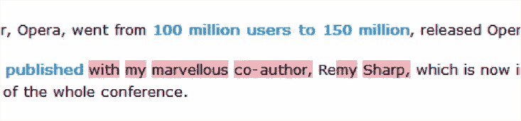

# 不要忘记 HTML5 的“小家伙”

> 原文：<https://www.sitepoint.com/dont-forget-about-html5s-little-guys/>

如果你一直站在新网络技术的前沿，那么你可能已经开始在你的网页和网络应用中融入一些 HTML5 的优点。

也许您已经开始使用简化的方法来声明 [doctype](http://dev.w3.org/html5/spec/syntax.html#the-doctype) 和字符编码。当插入脚本和链接的样式表时，您可能已经开始省略`"type=text/javascript"`或`"type=text/css"`。可能你已经开始用新的语义元素构建布局，比如`<section>`、`<article>`、`<header>`、`<footer>`和`<nav>`。

但是你忘了 HTML5 的“小家伙们”了吗？HTML5 现在包含了许多可能没有得到太多关注的新元素，所以我想在这里总结一下其中三个不太常用的元素。我还将提到这些可能在您的项目中使用的一些方法，这样您可以更清楚地看到它们的价值。

## `<hgroup>`元素

[< hgroup >元素](http://www.whatwg.org/specs/web-apps/current-work/multipage/sections.html#the-hgroup-element)是一个有趣的小金块，似乎是更大的`<section>`和`<article>`元素的副产品。随着这些新的结构元素的引入，网页的不同部分现在具有了更好的可移植性和可聚合性，并且每个单独的部分可以包含一个顶级标题(`<h1>`)。

这就是`<hgroup>`的用武之地。在某些情况下，您不希望子标题在文档树中创建子节点，例如，如果主标题(`<h1>`)有一个与之关联的标签行(`<h2>`)。虽然你可以把标语放在普通的`<span>`或`<div>`中，但这并不理想。

`<hgroup>`元素允许你将整个标题和标签行包装起来，作为文档树中的一个主标题单元，而不影响语义价值。下面是一个典型的例子:

```
<hgroup>
<h1>Main Heading</h1>
<h2>Tagline below the main heading</h2>
</hgroup>

<h2>Subheading</h2>

<p>Content here...</p>

<h2>Another Subheading</h2>

<p>More Content here...</p>
```

随后的文档大纲可能如下所示:

1.  主标题
    1.  副标题
    2.  另一个副标题

因为有了`<hgroup>`包装器，标语没有包含在文档大纲中，这正是我们在这个例子中想要的。

虽然`<hgroup>`最实际的用途是用于标签行，但是您也可以使用它来对元数据或其他辅助文本进行分组，您不希望它们的内容出现在文档树中。

## `<aside>`元素

旁侧>元素的 [<被保留用于包装切向相关的内容。虽然它可以用来保存博客上的典型侧边栏，但它的含义和名称并不是指内容的物理位置。它可以在页面的“边”上，但也可以在中间的某个地方，或者在底部。](http://www.whatwg.org/specs/web-apps/current-work/multipage/sections.html#the-aside-element)

`<aside>`应该用来包装一部分内容，该部分内容与其所在的整体有某种关系，但不能作为一个单独的可移植内容独立存在。

所以你可以用它来保存一个术语表，一个作者简介，一个“你知道吗？”一个框，一个注释，一个引用，甚至是一个与相关的主要内容相关的广告。

## `<mark>`元素

最后，我们有了`<mark>`元素。正如规范中所解释的，[<标记>元素](http://www.whatwg.org/specs/web-apps/current-work/multipage/text-level-semantics.html#the-mark-element)“表示文档中由于可能与用户当前活动相关而被突出显示的部分。”这使得这个特殊的标签很有趣，因为它依赖于用户行为。

`<mark>`的主要用途是在搜索结果的上下文中。`<mark>`标签将通过突出显示或其他风格变化来指示用户搜索了哪些术语以及它们出现在显示结果中的什么位置。

《HTML5 简介*的合著者布鲁斯·劳森(Bruce Lawson)在他的博客帖子上非常有效地使用了这个标签，当这些帖子被谷歌找到时。要想看到它的效果，去谷歌输入一个短语，就会在搜索结果中出现他的网站(你可以[试试这个](http://www.google.com.au/search?q=my+marvellous+co-author+remy+sharp))。当您点击页面时，您搜索的短语会通过 JavaScript 突出显示，JavaScript 会动态插入`<mark>`元素，如下面的屏幕截图所示:*



在搜索结果之外，`<mark>`似乎没有太多不同的用途。但是，即使在这个领域，当用户与你的网页内容交互时，`<mark>`也可以以创造性的方式使用，这取决于他们如何找到你的页面。因此，您可以使用服务器端和客户端技术，在适当的时候用`<mark>`标签突出显示内容。

## 最后

所以这里学到的教训是:不要忘记“小人物”虽然较大的结构元素得到了相当多的关注，但我们可以在页面中包含一些很有价值但很少使用的 HTML5 元素，以帮助改进网页的语义和结构。

**note:**Want more?

如果你想阅读更多关于 Louis 的文章，请订阅我们每周的科技极客时事通讯， *[《科技时报》](https://www.sitepoint.com/newsletter/)* 。

## 分享这篇文章