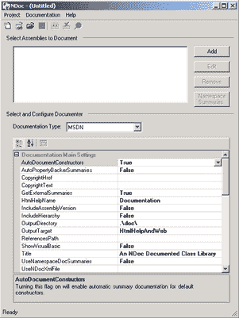
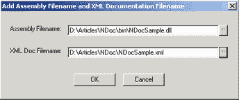
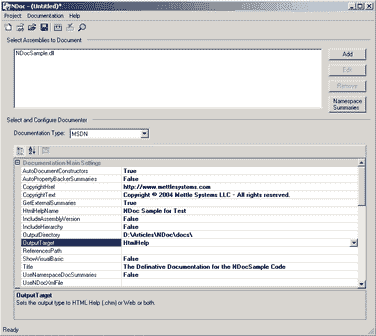
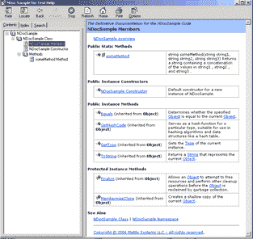

# 生成。使用 NDoc 的. NET XML 文档

> 原文：<https://www.sitepoint.com/dot-net-xml-documentation-ndoc/>

系统文档是项目完成过程中经常遇到的任务之一。它经常被推到开发周期的末尾，如果它出现的话，是为了最小化多余的工作。

然而，有了 C#和 VB.NET 对 XML 文档的支持，以及 NDoc 的发展，我们完全没有理由不能以比过去更好的方式记录我们的系统。工作不再在于生成文档文件；只是在记录过程本身。

我在这里的目的是向您展示如何安装 NDoc，并演示如何使用它。本文不会教你如何记录你的代码。相反，它解释了如何将您的文档转换成任何人都可以使用的可用形式。

##### NDoc 安装

根据您是否使用 Microsoft Visual Studio.NET，NDoc 有几种不同的安装方案。大多数现有文档都假设您使用 Visual Studio，但是，由于许多人不使用 Visual Studio，我将在这里为 Visual Studio 和非 Visual Studio 用户提供安装说明。

如果使用 Visual Studio。网络:

1.  验证您是否拥有以下目录:`C:Program FilesHTML Help Workshop`

3.  如果没有，您将不得不下载并安装`HTML Help Workshop`。确保在`C:Program FilesHTML Help Workshop`安装。你可以在 [HTML 帮助工作室](http://msdn.microsoft.com/library/default.asp?url=/library/en-us/htmlhelp/html/hwMicrosoftHTMLHelpDownloads.asp)找到代码下载。

5.  确保`HTML Help Workshop`安装后，从 [NDoc 下载](http://ndoc.sourceforge.net/)下载并安装 NDoc。我推荐使用 Web 安装程序版本，因为它包含最新的稳定版本。如果您决定不使用 Web 安装程序，则必须在 Visual Studio.NET 中构建项目。安装完成后，您就可以开始工作了。

如果不用 Visual Studio。网络:

1.  确保您拥有。已安装. NET Framework。

3.  您必须在`C:Program FilesHTML Help Workshop`处安装`HTML Help Workshop`。你会在这里找到代码下载:
    [HTML 帮助工作坊](http://msdn.microsoft.com/library/default.asp?url=/library/en-us/htmlhelp/html/hwMicrosoftHTMLHelpDownloads.asp)

5.  正确安装`HTML Help Workshop`后，从 [NDoc 下载](http://ndoc.sourceforge.net/)下载并安装 Ndoc。我推荐使用 Web 安装程序版本，因为它包含最新的稳定版本。如果您决定不使用 Web 安装程序，请参阅下面的注释。一旦安装了 NDoc，您就可以开始了。

注意:如果您决定使用“最新版本”或“稳定版本”安装，而不使用 Web 安装程序，并且您不使用 Visual Studio.NET，您将不得不下载并安装 NAnt，一个. NET 构建工具，可从 [NAnt 下载](http://nant.sourceforge.net)获得。有关更多信息，请参考 NDoc ReadMe.txt。

##### 使用

现在您已经安装了 NDoc，让我们使用它来生成一些文档，以确保一切正常工作。首先，我们将生成一些带有 XML 文档标记的基本代码。有关 XML 文档标签的详细信息，请参考本页。

下面是示例代码，以及一些注释:

```
// NDocSampleFile.cs 

// 

namespace NDocSample { 

    using System; 

   /** 

        <summary> 

            The NDocSample encapsulates some very rich functionality. 

        </summary> 

    */ 

    public class NDocSample { 

        /** 

            <summary> 

                Default constructor for a new instance of NDocSample. 

            </summary> 

        */ 

        public NDocSample() { 

        } 

            /** 

                <summary> 

                    string someMethod(string string1, string string2, string string3) 

                    Returns a string containing a concatenation of the values in string1 

                    <param ref="string1" />, string2 <param ref="string2" />, and string3 

                    <param ref="string3" />. 

                </summary> 

                <param name="string1">The first string.</param> 

                <param name="string2">The second string.</param> 

                <param name="string3">The third string.</param> 

           */ 

            public static string someMethod(string string1, string string2, string string3) { 

                // Perform some stuff here. 

                return "somestuff"; 

            } 

    } 

}
```

这应该足够我们测试，确保我们的安装是成功的，并检查一切工作。

NDoc 需要一个已编译的库，以及使用 XML 文档时生成的 XML 文件，以便处理系统文档的构建。因此，我们现在必须编译代码并生成一个 XML 文档。因为这里只有一个小文件，所以我将简单地从命令行编译它。为了生成 XML 文档，您必须使用`/doc:filename.xml`开关。我们的命令行语法如下所示:

```
Dir>csc /debug /t:library /out:bin/NDocSample.dll NDocSample.cs /doc:NDocSample.xml
```

这将在 bin 目录中生成一个`NDocSample.dll`，在根目录中生成一个`NDocSample.xml`。正如我提到的，为了使用 NDoc，您需要这两个文件。

##### NDoc 正在运行

现在我们有了这两个文件，我们可以启动 NDoc 了。您可以从命令行使用 NDoc 然而，为了说明 NDoc 的特性，我们将在本例中使用 GUI。



要获取您的文档，请单击“添加”按钮。这将打开“添加程序集文件名和 XML 文档文件名”对话框。点击每个省略号按钮，分别导航到 bin 目录选择`NDocSample.dll`，导航到根目录选择`NDocSample.xml`文件。



一旦你点击“确定”，`NDocSample.dll`将被列在标题“所选装配到文件”下。

接下来，我们现在可以看一下“选择和配置 Documenter”部分，这是您的大部分工作发生的地方。在文档类型下，您可以选择创建以下类型的文档:MSDN、JavaDoc、XML、LaTeX (Alpha)、线性 HTML (Alpha)。我会选择 MSDN，因为这是我工作环境中被广泛接受的形式。有关其他选项的信息，请参考 [NDoc 网站](http://NDoc.sourceforge.net)。

对于“选择和配置文档管理器”一节的其余部分，您可以选择一系列您可能希望或不希望分配的属性。特别值得注意的是`OutputDirectory`和`OutputTarget`。您应该将`OutputDirectory`设置为“docs”目录，该目录应该创建在项目的根目录下。当您选择`OutputTarget`时，您有三个选择:

1.  **html help**–生成一个`.chm file`，以及支持的 html 文件

3.  **Web**–生成一系列 html 文件，index.html 是起始文件

5.  **HtmlHelpAndWeb** 生成上面列出的两组文档

下面，你可以看到我们已经填写了我们的一些属性。现在，我们准备建造。



只需点击“构建”按钮或 Ctrl+Shift+B。您可以查看 NDocGui 的底部，了解正在进行的工作的反馈。当它完成时，你会在左下角看到“准备好”。

现在，进入 docs 目录，查看生成的文件。因为我选择了 HtmlHelp 版本，所以我将找到。chm 文件并启动它。



几秒钟内完成专业系统文档！

##### 结论

现在你已经准备好尝试记录一些现有的项目了。我将把所有的属性留给您来研究，因为有几个属性，并且为每个属性提供一个处理方法已经超出了本文的范围。

系统文档从未如此简单！这是为你的客户以及其他内部开发人员提供专业解决方案的工具之一。

快乐记录！

## 分享这篇文章