# 戏剧化你的肖像摄影

> 原文：<https://www.sitepoint.com/dramatize-portrait-photography/>

众所周知，大多数摄影师都会增强他们的照片，无论是基本的灯光变化，色彩校正还是彻底的彻底检查，几乎是解构图像以重新创建一个新的图像。简单地说，摄影师非常依赖 Photoshop 和 Lightroom 之类的程序。虽然关于过度使用 Photoshop 的争论不时出现，但不可否认的是，Photoshop 是一种有益的资产。

Photoshop 有过多的效果、滤镜和工具，当它们结合在一起时，可以产生你在相机中无法创建的美丽效果。它允许你修改需要修改的地方，允许你按照你自己想象的最终结果来创建你的图像。Photoshop 的另一个伟大之处是它可以带出沉重、丰富的色调，给你的照片增添戏剧性。许多面向动作的摄影和广告经常戏剧化他们的作品，使其流行，今天你也将能够做到这一点。

您将使用 Photoshop 中的基本应用程序，包括使用钢笔工具创建路径，使用图像调整，如曲线和级别，以及添加滤镜，如高通和高斯模糊。现在我们已经解决了这个问题，让我们打开 Photoshop，开始戏剧化。

**所需资源:**
义和团股票形象

**步骤 1 打开图像**

你要做的第一件事是打开你的图像。如果你想在本教程中使用你自己的图像，你仍然可以根据你的照片的灯光和背景设置进行细微的变化。

[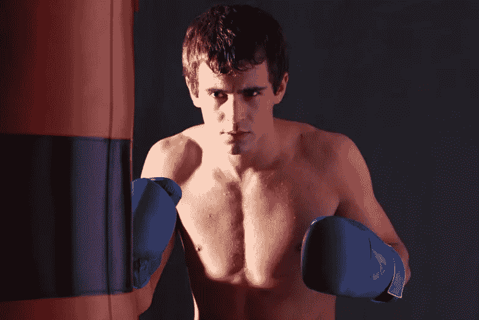](https://www.sitepoint.com/wp-content/uploads/2013/09/step1dra.png)

**步骤 2 自动校正**

为了防止直接对原始图像进行更改，以便您能够有一个比较参考，您需要复制您的图像。接下来进入图像>自动颜色，然后进入图像>自动色调。你的照片现在应该有不同的颜色和色调。

[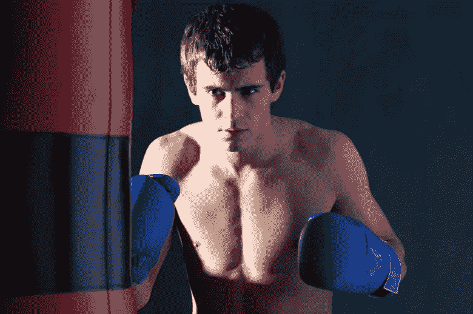](https://www.sitepoint.com/wp-content/uploads/2013/09/step2dra.png)

**第三步曲线**

复制你的自动校正图像，进入曲线对话框，方法是进入图像>曲线或点击 Ctrl+M。复制曲线设置，如下所示。

[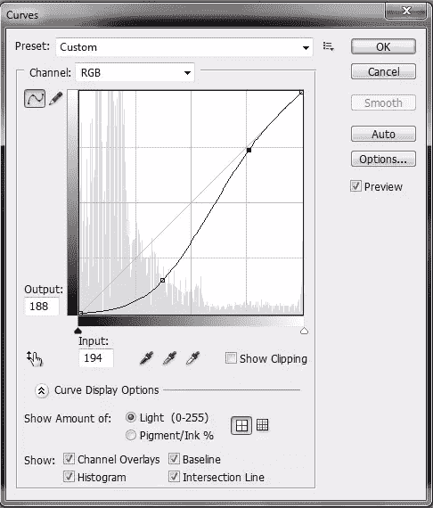](https://www.sitepoint.com/wp-content/uploads/2013/09/step3dra.png)

当曲线修改已经应用下降层的不透明度为 20%。

**第四步填充背景**

创建一个新层，并选择你的前景色为黑色#000000。使用钢笔工具选择你的拳击手周围，这样你只选择背景。不要担心让你的选择变得完美。

[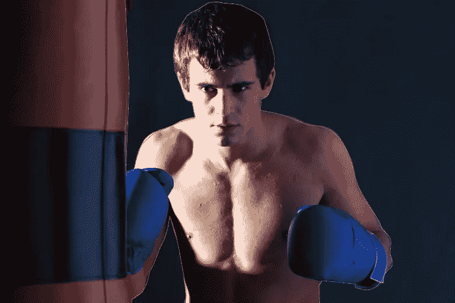](https://www.sitepoint.com/wp-content/uploads/2013/09/step4dra.png)

用黑色填充背景，然后在 5px 和
10px 之间应用高斯模糊。将图层模式改为柔光，不透明度降至 50%。

[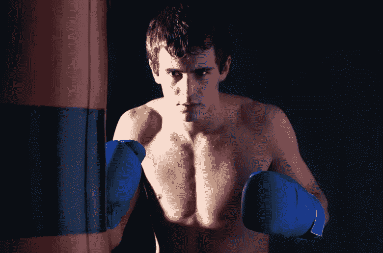](https://www.sitepoint.com/wp-content/uploads/2013/09/step4-1dra.png)

**第五步出气筒**

将前景色改为#711924，背景色改为#000000。现在在一个新的层上用两种颜色油漆沙袋，确保用#711924 油漆红色，用#000000 油漆黑色。改变你的图层模式为柔光。

[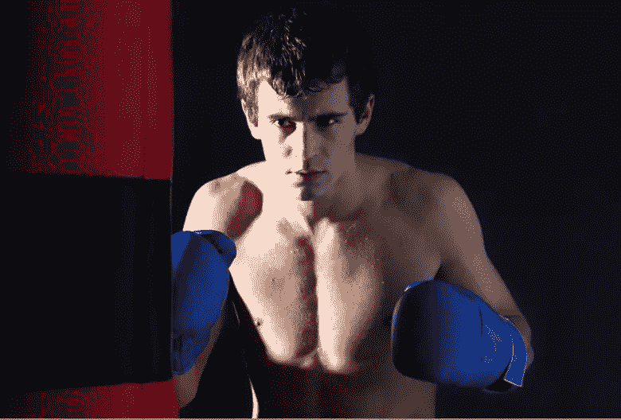](https://www.sitepoint.com/wp-content/uploads/2013/09/step5dra.png)

**第六步阴影和高光**

现在是时候合并你的层了。合并你所有的图层，这样你就只剩下一张图片了。接下来进入图像>调整>阴影/高光。改变阴影的比例为 10%,高光比例为 100%。完成后按“确定”。

[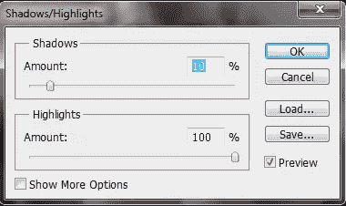](https://www.sitepoint.com/wp-content/uploads/2013/09/step6dra.png)

你会注意到面部和整体形象的显著变化。

[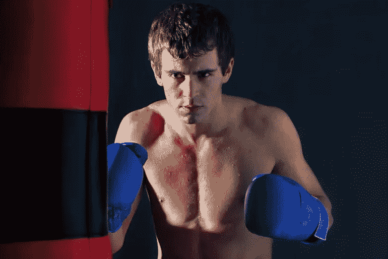](https://www.sitepoint.com/wp-content/uploads/2013/09/step6-1dra.png)

**第七步高通**

复制你的图像，进入滤镜>其他>高通。将半径设置为 55px 左右，然后点击“确定”,让更改生效。

[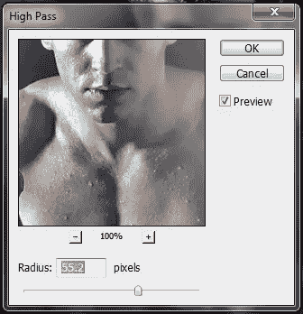](https://www.sitepoint.com/wp-content/uploads/2013/09/step7dra.png)

使你的层模式柔光，并将不透明度降低到 30%。

[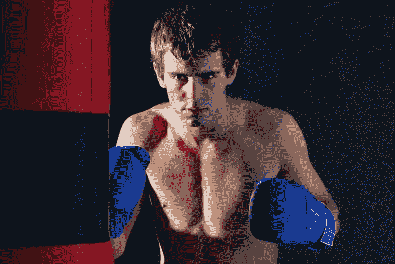](https://www.sitepoint.com/wp-content/uploads/2013/09/step7-1dra.png)

**第八步影子**

 ****我们想利用图像中的光线，用它来创造一个戏剧性的对比。正如你可能已经注意到的，由于照明设备的位置，拳击手的右侧光线很强。我们将进一步加深拳击手的那一侧，而不是为左侧创建一个人造补光灯。为此，你需要创建一个新的层。用钢笔工具在身体的左半部分和背景周围画一条路径，就像这样。

[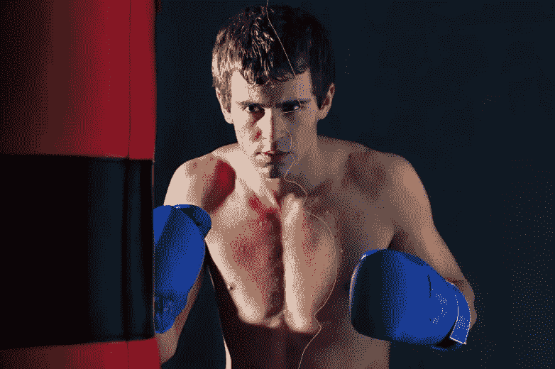](https://www.sitepoint.com/wp-content/uploads/2013/09/step8dra.png)

接下来用黑色填充路径，图层模式改为柔光，不透明度降低到 66%。

[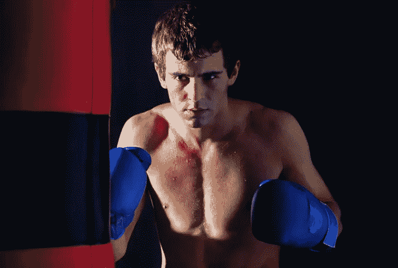](https://www.sitepoint.com/wp-content/uploads/2013/09/step8-1dra.png)** 

****第九步脸部阴影和高光****

 **新建一个图层，将图层模式设置为柔光，不透明度设置为 50%。用一个柔软的圆形刷子开始用黑色(#000000)涂抹面部的深色区域，用白色(#ffffff)涂抹面部的浅色区域。

[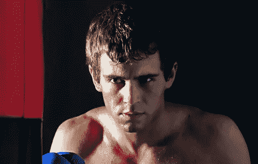](https://www.sitepoint.com/wp-content/uploads/2013/09/step9dra.png)

**步骤 10 合并和高通**

再次合并你的层，直到你有一个图像。复制您的层，并前往过滤器>其他>高通。这次将半径设置在 7px 和 8px 之间。按确定。

[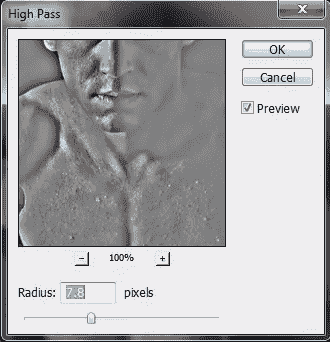](https://www.sitepoint.com/wp-content/uploads/2013/09/step10dra.png)

设置图层模式为柔光，不透明度为 50%。

[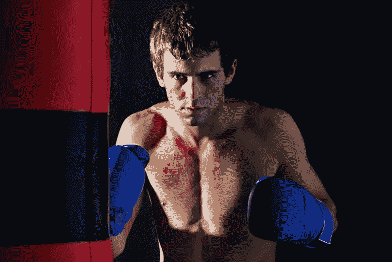](https://www.sitepoint.com/wp-content/uploads/2013/09/step10-1dra.png)

**第十一步手套**

使用# 193c8c 给拳击手套上色。改变图层模式为叠加，不透明度为 50%。

[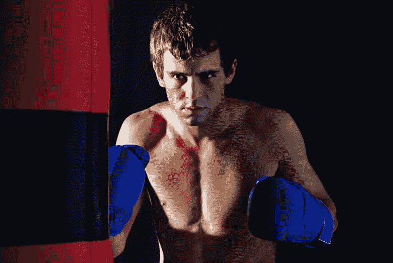](https://www.sitepoint.com/wp-content/uploads/2013/09/step11dra.png)

**第 12 步右阴影**

我们想使前景变暗一些，但我们只想做一个特定的部分，所以我们将使用钢笔工具。新建一个层，创建一个弯曲的路径来包围部分沙袋和图像的下半部分。你的路径应该是这样的。

高斯模糊路径 20px。将图层模式设置为柔光，不透明度设置为 70%。

[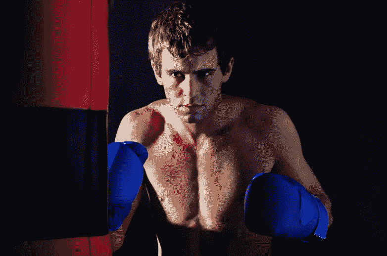](https://www.sitepoint.com/wp-content/uploads/2013/09/step-12-1dra.png)

**步骤 13 合并和阴影**

再次合并你的层，并创建一个新的层。图层模式叠加，不透明度 50%。用柔软的圆形笔刷，前景色设置为#000000，开始给拳击手身体和脸部的暗部和阴影上色。10px 的高斯模糊。

[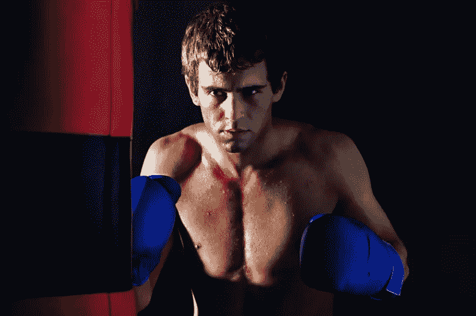](https://www.sitepoint.com/wp-content/uploads/2013/09/Step13dra.png)

**步骤 14 高亮显示**

为你的高光再做一层。改变图层模式为叠加，设置不透明度为 20%。把你的前景色#ffffff，然后检查身体和脸部的明亮部分。10px 的高斯模糊。

[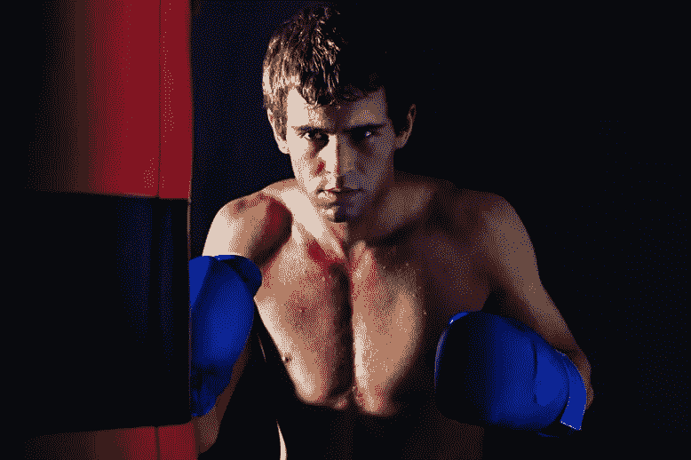](https://www.sitepoint.com/wp-content/uploads/2013/09/step14dra.png)

**第 15 步合并和关卡**

合并你的层最后一次，然后复制它。进入图像>调整>色阶或按 Ctrl + L。设置三个输出色阶，分别为 14、0.84 和 226。

[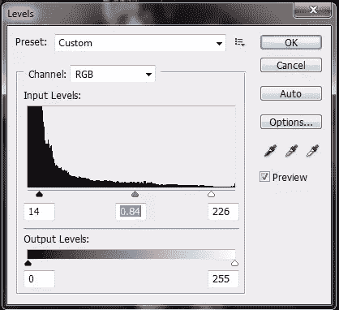](https://www.sitepoint.com/wp-content/uploads/2013/09/step15dra.png)

改变图层模式为正片，不透明度降低到 30%。

[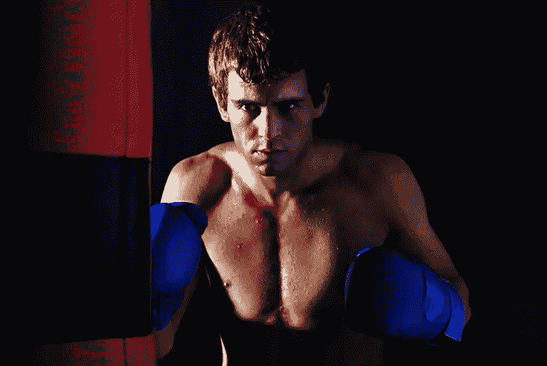](https://www.sitepoint.com/wp-content/uploads/2013/09/step15-1dra.png)

**第 16 步渐变**

创建一个新层来完成你的图像。通过按键盘上的(D)键和(X)键切换前景色和背景色，将前景色和背景色设置为默认值(上为白色，下为黑色)。选择渐变工具，确保设置为径向渐变。将渐变从图像的中心拉到底部。改变图层模式为柔光，不透明度为 30%。

[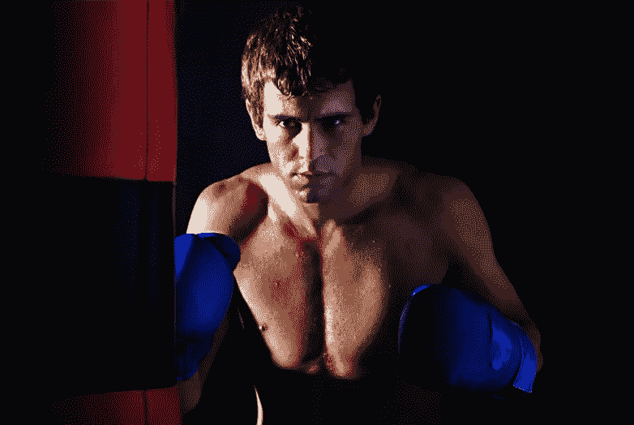](https://www.sitepoint.com/wp-content/uploads/2013/09/step16finished.png)

[下载 PSD 文件](https://uploads.sitepoint.com/wp-content/uploads/2013/11/Dramatize-Portrait.zip)(压缩，8.3 Mb)

**结论**

有很多方法可以给你的照片创造更多的气氛和戏剧性，让它们脱颖而出。今天你看到的只是众多技巧中的一种。我建议尝试各种图像和各种设置，直到你得到一个最适合你和你喜欢的样子。希望你已经掌握了一些技巧，然后你可以根据自己的审美偏好进行调整，创作出令人惊叹的作品。**** 

## ****分享这篇文章****