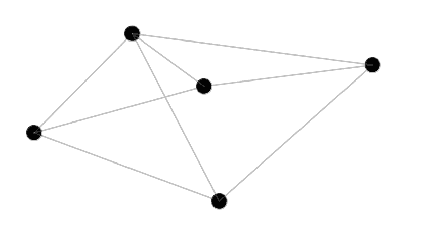

# 用 Processing 和 Ruby 绘图

> 原文：<https://www.sitepoint.com/drawing-processing-ruby/>


Processing 是一种环境/编程语言，旨在使可视化、交互式应用程序*非常容易编写*。它可以用于从教孩子如何编码到可视化科学数据的任何事情。

幸运的是，所有这些优点不再局限于处理内部；你可以在 Ruby 上使用它！在本文中，我们将介绍`ruby-processing` gem 和 Ruby/Processing 的实际例子。

## 设置它

为了让`ruby-processing`正常工作，你需要 jRuby 和 Processing 的副本。

根据您使用的 Ruby 环境管理器(例如 rbenv、rvm)、您的操作系统和 Java 版本的不同，关于如何让您的设置工作的说明也有所不同。

首先，你会想要一份 jRuby 的拷贝。如果您使用的是 RVM:

```
rvm install jruby
rvm use jruby
```

如果你在 rbenv 上，

```
rbenv install jruby-*version number*
```

接下来，你需要一份处理的拷贝，这很容易，因为他们有一个很好的下载页面。

我们可以得到红宝石加工宝石:

```
gem install ruby-processing
```

在开始之前，我们需要告诉 ruby-processing 我们的处理副本在哪里。在`~/.rp5rc` YAML 配置文件中，设置`PROCESSING_ROOT`变量。幸运的是，有一个[处理文件](https://gist.github.com/monkstone/7438749)为您设置这个变量。如果你在 Mac OS X 上，它应该是这样的:

```
PROCESSING_ROOT: "/Applications/Processing.app/Contents/Java"
```

配置足够。让我们进入代码。

## 婴儿学步

下面是一些 Ruby/处理代码的峰值:

```
def setup
  size 200, 200
  background 0
  smooth
end

def draw
  fill 255, 102, 18
  ellipse 56, 46, 55, 55
end
```

您可能注意到的第一件事是，这个代码片段没有可立即执行的代码！因此，如果我们用标准的`ruby`解释器运行它，将不会有输出。相反，我们必须用特殊的`rp5`命令来运行它:

```
rp5 run first.rb
```

运行它，等一会儿 JVM 启动，您会看到一个彩色的圆圈在盯着您。代码非常简单。所有的 Ruby/Processing 程序都有一个`setup`方法，在建立一个“场景”的时候，这个方法只被调用一次。然后，我们有一个`draw`方法，这个方法被反复调用，用来更新屏幕。在我们的`setup`中，我们设置屏幕的大小，背景颜色(`0`表示黑色)。然后，在`draw`中，使用 RGB 值设置填充颜色，并在坐标(56，46)处画一个圆。

Processing 有一个奇妙的[引用](http://processing.org/reference/)，几乎所有的引用都可以直接(即一字不差地)转移到 Ruby/Processing。然而，需要注意的是，处理过程使用 camelCase 作为方法名，而 Ruby 中的对应方法使用下划线。

现在，让我们来看一些稍微复杂一点的东西。

## 微粒

让我们建立一个简单的，交互式的粒子显示。单击时，粒子应该向鼠标位置移动，然后在放开鼠标按钮时散开。

```
class Particle
  attr_accessor :to_x, :to_y, :x, :y, :velocity

  def initialize(x, y, width, height)
    @x = x
    @y = y
    @velocity = 2

    @to_x = rand(width)
    @to_y = rand(height)
    @alpha = rand(255)
  end

  def draw
    stroke 255, 255, 255
    fill 150, 150, 150, 200
    ellipse @x, @y, 8, 8
  end

  def move
    mag = Math.sqrt(@x ** 2 + @y ** 2)
    @x = @x + @velocity * (@to_x - @x)/mag
    @y = @y + @velocity * (@to_y - @y)/mag
  end
end

def setup
  @bgcolor = "#2f2f2f"

  size displayWidth, displayHeight
  background color(@bgcolor)
  smooth

  @particles = []
  1000.times do
    @particles << Particle.new(rand(width), rand(height), width, height)
  end
end

def mouse_pressed
  @particles.each do |particle|
    particle.velocity = 6
    particle.to_x = mouse_x
    particle.to_y = mouse_y
  end
end

def mouse_released
  @particles.each do |particle|
    particle.to_x = rand(width)
    particle.to_y = rand(height)
    particle.velocity = 10
  end
end

def draw
  background color(@bgcolor)

  @particles.each do |particle|
    particle.draw
    particle.move
  end

end
```

哇，这看起来像一吨的代码！然而，当分解成一口大小的块时，它变得非常简单。让我们来看看`Particle`类:

```
class Particle
  attr_accessor :to_x, :to_y, :x, :y, :velocity

  def initialize(x, y, width, height)
    @x = x
    @y = y
    @velocity = 2

    @to_x = rand(width)
    @to_y = rand(height)
    @alpha = rand(255)
  end

  def draw
    stroke 255, 255, 255
    fill 150, 150, 150, 200
    ellipse @x, @y, 8, 8
  end

  def move
    mag = Math.sqrt(@x ** 2 + @y ** 2)
    @x = @x + @velocity * (@to_x - @x)/mag
    @y = @y + @velocity * (@to_y - @y)/mag
  end
end
```

方法或多或少是样板。神奇的事情发生在`draw`中，我们使用`stroke`、`fill`、`ellipse`的 Ruby/处理方法在给定点将粒子画成一个圆。每个粒子都有`to_x`和`to_y`属性，这告诉它应该去哪里。在`move`方法中，我们只是使用距离公式来将粒子向正确的方向移动。

```
def setup
  size displayWidth, displayHeight
  background color(@bgcolor)
  smooth

  @particles = []
  1000.times do
    @particles << Particle.new(rand(width), rand(height), width, height)
  end
end
```

将大小设置为`displayWidth`和`displayHeight`，这允许我们在大多数平台上创建半全屏体验。然后，用`background`结合`color`设置背景色(我喜欢这些直观的名字)。通过创建一个要绘制的 1000 个粒子的列表来完成设置。

```
def draw
  background color(@bgcolor)

  @particles.each do |particle|
    particle.draw
    particle.move
  end
end
```

我们使用一个非常普通的处理思想:在大多数帧的开始，你将通过调用`background`清除所有东西。然后，在屏幕上绘制每个粒子，接着调用
`move`，使其更接近其`to_x`和`to_y`值。但是，这些值实际是在哪里设置的呢？

```
def mouse_pressed
  @particles.each do |particle|
    particle.velocity = 6
    particle.to_x = mouse_x
    particle.to_y = mouse_y
  end
end

def mouse_released
  @particles.each do |particle|
    particle.to_x = rand(width)
    particle.to_y = rand(height)
    particle.velocity = 10
  end
end
```

处理使得处理事件*真的*容易。这里，我们使用的是`mouse_pressed`和`mouse_released`，它们分别在鼠标点击按钮被按下和释放时被调用。当按下鼠标时，将每个粒子的“到”值设置为指向鼠标位置(使它们都向鼠标移动)。然后释放鼠标，随机化粒子的“到”值，使它们散开。

这样产生的效果实际上很酷，很悦目。这有点简单，但它给了我们可以用来构建更棒的东西的构件。

## 图表编辑器

当想到图形时，我们通常会想到两个轴和一些绘制在它们平面上的数据。原来图是由*节点*和*边*组成的数学对象。它们本质上是由线连接的点。通常，线之间的角度和线的长度是不相关的。相反，“连接”的概念更重要。这些图表有各种有趣的特性。让我们看看是否可以用 Ruby/Processing 制作一个工具来创建像这样的图形(严格来说，是无向图):



我们需要:

*   一种创建节点的方法
*   一种创建边的方法
*   一种在节点周围移动的方式，同时确保边保持连接

让我们运行一个`Point`类(它代表一个节点):

```
class Point
  attr_accessor :x, :y, :segment_color, :to_points, :fill_color
  def initialize(x, y)
    @x = x
    @y = y
    @segment_color = color(100, 100, 100, 100)
    @radius = 30
    @fill_color = color(0)

    #points to draw segments to
    @to_points = []
  end

  def draw
    fill @fill_color
    ellipse @x, @y, @radius, @radius
  end

  def segment_to(other_point)
    stroke @segment_color
    line @x, @y, other_point.x, other_point.y
  end

  def in_thresh(x, y)
    thresh = @radius
    return (abs(@x - x) < thresh and abs(@y - y) < thresh)
  end
end
```

与之前创建的`Particle`类相比，我们添加了两个重要的方法。`segment_to`创建边缘间线条的概念。`line`处理方法绘制线条，提供起点和终点的坐标作为参数。最后，`in_thresh`方法允许我们确定一对坐标是否“足够接近”我们的点；它将用于检查点击是否与节点一致。

设置场景非常简单:

```
def setup
  size displayWidth, displayHeight
  stroke_weight 3
  background(255)
  smooth

  @points = []
  7.times do
    @points << Point.new(rand(width), rand(height))
  end
end
```

首先，设置标准的`size`和`background`，以及对`stroke_weight`的调用，它告诉 Processing 线条的粗细。另外，初始化`@points`并添加 7 个随机节点，只是为了好玩。

```
def draw
  background(255)

  @points.each do |point|
    point.draw
    point.to_points.each do |tp|
      point.segment_to tp
    end
  end
end
```

绘制方法也一样简单。只需画出给定点及其相关的边。但是，这些边缘最初是如何形成的呢？

```
def mouse_clicked
  clicked_points = @points.select do |p|
    p.in_thresh mouse_x, mouse_y
  end

  if clicked_points.length == 0
    @points << Point.new(mouse_x, mouse_y)
  elsif @from_node
    @from_node.to_points << clicked_points[0]
    @from_node.fill_color = color(0)
    @from_node = nil
  else
    @from_node = clicked_points[0]
    @from_node.fill_color = color(255, 0, 0)
  end
end
```

添加节点的方式应该很简单:只需点击某个地方。为了添加边，单击一个节点，然后单击另一个节点，在两个节点之间绘制一条边。

因为我们使用点击的方式，在`mouse_clicked`事件下有一些复杂的东西。首先，将`clicked_points`设置为点击范围内的点的数组。然后，如果单击与现有的点没有任何关系，则创建一个新的节点。随后，使用`@from_node`变量确定这是第一次还是第二次点击创建一条边。如果是第一个，用一种颜色“突出显示”节点，向用户显示他/她将要创建一个边。如果是第二个节点，添加边。

注意，`mouse_clicked`里面没有任何绘图代码。所有这些都在`Point`类和`draw`方法中处理。通常，您的绘图代码应该与实际逻辑保持分离(有点像函数式语言中分离副作用的思想)。

如果我们想移动节点呢？

```
def mouse_pressed
  @points.each do |p|
    if p.in_thresh(mouse_x, mouse_y)
      @node = p
    end
  end
end

def mouse_dragged
  if @node
    @node.x = mouse_x
    @node.y = mouse_y
  end
end
```

使用`mouse_pressed`和`mouse_dragged`事件。第一个在按下鼠标按钮时被调用，第二个在拖动鼠标时被调用*。在前者中，将`@node`设置为用户“按下”鼠标的点。然后，在`mouse_dragged`中，如果用户按下了某个点，则将该点移动到鼠标所在的任何位置。注意，只要用户拖动，就会重复调用`mouse_dragged`，所以在拖动过程中，节点会随着鼠标移动。*

让我们看看这段代码的辉煌之处:

```
class Point
  attr_accessor :x, :y, :segment_color, :to_points, :fill_color
  def initialize(x, y)
    @x = x
    @y = y
    @segment_color = color(100, 100, 100, 100)
    @radius = 30
    @fill_color = color(0)
    #points to draw segments to
    @to_points = []
  end

  def draw
    fill @fill_color
    ellipse @x, @y, @radius, @radius
  end

  def segment_to(other_point)
    stroke @segment_color
    line @x, @y, other_point.x, other_point.y
  end

  def in_thresh(x, y)
    thresh = @radius
    return (abs(@x - x) < thresh and abs(@y - y) < thresh)
  end
end

def setup
  size displayWidth, displayHeight-160
  stroke_weight 3
  background(255)
  smooth

  @points = []
  7.times do
    @points << Point.new(rand(width), rand(height))
  end
end

def mouse_pressed
  @points.each do |p|
    if p.in_thresh(mouse_x, mouse_y)
      @node = p
    end
  end
end

def mouse_dragged
  if @node
    @node.x = mouse_x
    @node.y = mouse_y
  end
end

def mouse_clicked
  clicked_points = @points.select do |p|
    p.in_thresh mouse_x, mouse_y
  end

  if clicked_points.length == 0
    @points << Point.new(mouse_x, mouse_y)
  elsif @from_node
    @from_node.to_points << clicked_points[0]
    @from_node.fill_color = color(0)
    @from_node = nil
  else
    @from_node = clicked_points[0]
    @from_node.fill_color = color(255, 0, 0)
  end
end

def key_pressed
  if key == ' '
    @points = []
  end
end

def draw
  background(255)

  @points.each do |point|
    point.draw
    point.to_points.each do |tp|
      point.segment_to tp
    end
  end
end
```

玩了一会儿之后，它看起来非常流畅和友好。虽然，我们可以添加许多功能(例如，保存到一个文件，边数计数器，等等。)，这是一个不错的基础。注意，我们使用了一组非常简单的调用，如`line`、`ellipse`、`background`等。处理通过在内部使用状态机为我们提供了这种简单性。由于处理保持状态，您进行的调用可能会影响后续调用的结果。这允许非常简单的代码，但是调试可能变得困难，因为只要你处理你的代码，你必须记住这个状态。

## 包装它

我希望你喜欢通过红宝石透镜的处理之旅。我们只涉及了[处理 API](http://processing.org/reference/) 的一小部分，但是我们已经展示了它在用 Ruby 创建视觉效果方面的能力。

## 分享这篇文章