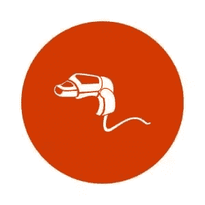

# 用 ActiveSupport::关注点擦干你的 Rails 代码

> 原文：<https://www.sitepoint.com/dry-off-your-rails-code-with-activesupportconcerns/>



如果您构建 Rails 应用程序已经有一段时间了，您可能会注意到一个名为`concerns`的文件夹。每当您生成一个新的 Rails 应用程序时，这个文件夹就会被创建在`app/controllers`和`app/models`目录中。我认为它是无用的，直到最近我们不得不在工作中使用它。

在这个简短的教程中，我想向你展示如何驾驭`concerns`的力量。

我们将在 Rails 中构建一个迷你 tweeting 应用程序，我将其命名为`Twik`。在应用程序中，我们将有两个`TwitsController`。一个控制器将命名为 admin 下的名称空间(因此它的操作只对管理员可用)，另一个将命名为传统的 Rails 名称空间。我们将使用`ActiveSuppourt::Concern`共享功能，以确保我们遵守 DRY 原则。

在了解了控制器的工作原理后，我将向您展示如何在模型中使用`ActiveSupport::Concern`。

让我们开始吧。

### 应用程序设置

生成您的 Rails 应用程序:

```
rails new twik -T 
```

将以下`gems`添加到您的`Gemfile`中:

```
...
gem 'devise'
gem 'bootstrap-sass' 
```

现在是你的宝石。

运行命令安装设备:

```
rails g devise:install 
```

现在让我们生成我们的`Admin`模型:

```
rails g devise Admin 
```

将**app/assets/样式表/application.css** 重命名为**app/assets/样式表/application.scss** ，并粘贴以下内容:

```
#app/assets/stylesheets/application.scss

@import "bootstrap-sprockets";
@import "bootstrap"; 
```

导航到**app/assets/JavaScript s/application . js**，并在最后一个`require`上方添加一行:

```
...
//= require bootstrap-sprockets (ADD THIS)
//= require_tree . 
```

创建文件**app/views/layouts/_ navigation . html . erb**，并粘贴以下内容:

```
#app/views/layouts/_navigation.html.erb

<nav class="navbar navbar-default">
  <div class="container-fluid">
    <!-- Brand and toggle get grouped for better mobile display -->
    <div class="navbar-header">
      <button type="button" class="navbar-toggle collapsed" data-toggle="collapse" data-target="#navbar-collapse" aria-expanded="false">
        <span class="sr-only">Toggle navigation</span>
        <span class="icon-bar"></span>
        <span class="icon-bar"></span>
        <span class="icon-bar"></span>
      </button>
      <% if admin_signed_in? %>
        <%= link_to "Twik", admin_twits_path, class: "navbar-brand" %>
      <% else %>
        <%= link_to "Twik", root_path, class: "navbar-brand" %>
      <% end %>
    </div>
    <div class="collapse navbar-collapse" id="navbar-collapse">
      <ul class="nav navbar-nav navbar-right">
        <li><%= link_to 'Home', root_path %></li>
        <% if admin_signed_in? %>
          <li><%= link_to 'My Account', edit_admin_registration_path  %></li>
          <li><%= link_to 'Logout', destroy_admin_session_path, :method => :delete %></li>
        <% else %>
          <li><%= link_to 'Login', new_admin_session_path  %></li>
        <% end %>
      </ul>
    </div>
  </div>
</nav> 
```

现在编辑**app/views/layouts/application . html . erb**如下所示:

```
#app/views/layouts/application.html.erb

<!DOCTYPE html>
<html>
  <head>
    <title>Twik</title>
    <%= csrf_meta_tags %>

    <%= stylesheet_link_tag    'application', media: 'all', 'data-turbolinks-track': 'reload' %>
    <%= javascript_include_tag 'application', 'data-turbolinks-track': 'reload' %>
  </head>

  <body>
    <%= render "layouts/navigation" %>
    <div class="container-fluid">
      <%= yield %>
    </div>
  </body>
</html> 
```

### Twits 控制器和关注点。

我们希望编写尽可能少的代码，确保不会重复。为了实现这一点，我们将使用关注点来共享两个控制器中的动作。迷茫？请执行以下操作:

*   生成你的 Twit 模型:`rails g model Twit tweet:text`。
*   生成您的 TwitsController: `rails g controller TwitsController`。
*   导航到 **app/controllers/concerns** 并创建文件 **twitable.rb** ，粘贴如下:

```
 #app/controllers/concerns/twitable.rb

  module Twitable
    extend ActiveSupport::Concern

    included do
      before_action :set_twit, only: [:show, :edit, :destroy, :update]
    end

    def index
      @twits = Twit.all
    end

    def new
      @twit = Twit.new
    end

    def show
    end

    def create
      @twit = Twit.new(twit_params)
      if @twit.save
        flash[:notice] = "Successfully created twit."
        redirect_to @twit
      else
        flash[:alert] = "Error creating twit."
        render :new
      end
    end

    private

    def twit_params
      params.require(:twit).permit(:tweet)
    end

    def set_twit
      @twit = Twit.find(params[:id])
    end
  end 
```

现在，让我们检查上面的代码。

使用`extend ActiveSupport::Concern`告诉 Rails 我们正在创建一个关注点。`included`块中的代码将在包含该模块的任何地方执行。这最适合包含第三方功能。在这种情况下，如果在`included`块之外写`before_action`，我们将得到一个错误。此时，我们可以将我们的`Twitable`模块包含到需要这个行为的控制器中。

完成后，我们的`TwitsController`非常简洁:

```
#app/controllers/twits_controllers.rb

class TwitsController < ApplicationController
  include Twitable
end 
```

我们需要一个 **admin** 目录来存放管理员的控制器:

```
mkdir app/controllers/admin
touch app/controllers/admin/twits_controllers.rb 
```

现在将这段代码粘贴到您刚刚创建的文件中:

```
#app/controllers/admin/twits_controllers.rb

class Admin::TwitsController < ApplicationController
  include Twitable

  def edit
  end

  def update
    if @twit.update_attributes(twit_params)
      flash[:notice] = "Successfully updated twit."
      redirect_to admin_twit_path
    else
      flash[:alert] = "Error creating twit."
      render :edit
    end
  end

  def destroy
    if @twit.destroy
      flash[:notice] = "Successfully deleted twit."
      redirect_to twits_path
    else
      flash[:alert] = "Error deleting twit."
    end
  end
end 
```

这不酷吗？我们不必重复我们的代码。现在，让我们创建视图，这样我们就可以测试所有这些是否真的有效:

```
mkdir -p app/views/admin/twits
touch app/views/admin/twits/index.html.erb
touch app/views/admin/twits/new.html.erb
touch app/views/admin/twits/show.html.erb
touch app/views/admin/twits/edit.html.erb
touch app/views/twits/new.html.erb
touch app/views/twits/show.html.erb
touch app/views/twits/index.html.erb 
```

将下面的代码粘贴到各自的文件中。
**管理员推特编辑页面**

```
#app/views/admin/twits/edit.html.erb

<div class="container-fluid">
  <div class="row">
    <div class="col-sm-offset-4 col-sm-4 col-xs-12">
      <%= form_for @twit, :url => {:controller => "twits", :action => "update" } do |f| %>
        <div class="form-group">
          <%= f.label :tweet %>
          <%= f.text_field :tweet, class: "form-control" %>
        </div>
        <div class="form-group">
          <%= f.submit "Update", class: "btn btn-primary" %>
          <%= link_to "Cancel", :back, class: "btn btn-default" %>
        </div>
      <% end %>
    </div>
  </div>
</div> 
```

**管理推特索引页面**

```
#app/views/admin/twits/index.html.erb

<div class="container-fluid">
  <p id="notice"><%= notice %></p>

  <h1>Listing Twits</h1>

  <div class="row">
  <div class="col-sm-12 col-xs-12">
    <%= link_to "New Tweet", new_admin_twit_path, class: "btn btn-primary pull-right" %>
  </div>
  </div>
  <div class="row">
    <div class="col-sm-12 col-xs-12">
      <div class="table-responsive">
        <table class="table table-striped table-bordered table-hover">
          <tbody>
            <% @twits.each do |twit| %>
              <tr>
                <td class="col-sm-8 col-xs-8"><%= twit.tweet %></td>
                <td class="col-sm-4 col-xs-4"><%= link_to 'Show', admin_twit_path(twit), class: "btn btn-primary" %>
                    <%= link_to 'Edit', edit_admin_twit_path(twit), class: "btn btn-default" %>
                    <%= link_to "Delete", admin_twit_path(twit), class: "btn btn-danger", data: {:confirm => "Are you sure?"}, method: :delete %>
                </td>
              </tr>
            <% end %>
          </tbody>
        </table>
      </div>
    </div>
  </div>
</div> 
```

**管理新推特页面**

```
#app/views/admin/twits/new.html.erb

<div class="container-fluid">
  <div class="row">
    <div class="col-sm-offset-4 col-sm-4 col-xs-12">
      <%= form_for @twit do |f| %>
        <div class="form-group">
          <%= f.label :tweet %>
          <%= f.text_field :tweet, class: "form-control" %>
        </div>
        <div class="form-group">
          <%= f.submit "Submit", class: "btn btn-primary" %>
          <%= link_to "Cancel", :back, class: "btn btn-default" %>
        </div>
      <% end %>
    </div>
  </div>
</div> 
```

**管理推特显示页面**

```
#app/views/admin/twits/show.html.erb

<div>
  <h2><%= @twit.tweet %></h2>
</div> 
```

**Twit 索引页面**

```
#app/views/twits/index.html.erb

<div class="container-fluid">
  <p id="notice"><%= notice %></p>

  <h1>Listing Twits</h1>

  <div class="row">
  <div class="col-sm-12 col-xs-12">
    <%= link_to "New Tweet", new_twit_path, class: "btn btn-primary pull-right" %>
  </div>
  </div>
  <div class="row">
    <div class="col-sm-12 col-xs-12">
      <div class="table-responsive">
        <table class="table table-striped table-bordered table-hover">
          <tbody>
            <% @twits.each do |twit| %>
              <tr>
                <td><%= twit.tweet %></td>
                <td><%= link_to 'Show', twit, class: "btn btn-primary" %></td>
              </tr>
            <% end %>
          </tbody>
        </table>
      </div>
    </div>
  </div>
</div> 
```

**新推特页面**

```
#app/views/twits/new.html.erb

<div class="container-fluid">
  <div class="row">
    <div class="col-sm-offset-4 col-sm-4 col-xs-12">
      <%= form_for @twit do |f| %>
        <div class="form-group">
          <%= f.label :tweet %>
          <%= f.text_field :tweet, class: "form-control" %>
        </div>
        <div class="form-group">
          <%= f.submit "Submit", class: "btn btn-primary" %>
          <%= link_to "Cancel", :back, class: "btn btn-default" %>
        </div>
      <% end %>
    </div>
  </div>
</div> 
```

**Twit 显示页面**

```
#app/views/twits/show.html.erb

<div>
  <h2><%= @twit.tweet %></h2>
</div> 
```

现在通过运行`rails server`启动 Rails 服务器。浏览你的网站，你会发现一切正常。多亏了`concern`，你的代码库很整洁，你的控制器很瘦。

### 模型中的关注点

在 Rails 模型中工作，就像我们在控制器中看到的一样。如果你理解了我们上面所做的，你将能够在你的模型中实现它。假设我们的应用程序中有一个`reply`特性。有了这个功能，用户可以回复 twits(咄)。除了回复功能，我们还有一个投票功能，允许用户对推特和回复进行投票。所以，现在我们有三种模式:`Twit`、`Reply`和`Vote`。

`Twit`和`Reply`有很多`votes`，所以他们的模型看起来是这样的:

```
class Twit < ActiveRecord::Base
  has_many :votes, as: :votable
  has_many :replies

  def vote!
    votes.create
  end
end

class Reply < ActiveRecord::Base
  has_many :votes, as: :votable
  belongs_to :twits

  def vote!
    votes.create
  end
end

class Vote < ActiveRecord::Base
 belongs_to :votable, polymorphic: true
end 
```

使用关注点，你可以让事情看起来漂亮整洁。下面是你可能想要做的:

```
module Votable
  extend ActiveSupport::Concern

 included do
  has_many :votes, as: :votable
 end

 def vote!
  votes.create
 end
end

class Twit < ActiveRecord::Base
  include Votable
  has_many :replies
end

class Reply < ActiveRecord::Base
  include Votable
  belongs_to :twit
end 
```

我相信你会同意我的看法，这条路要好得多。

## 结论

本教程的目标很简单。我只是想用`ActiveSupport::Concern`向你展示一种遵守 DRY 原则的方法。我希望这是值得的时间:)

## 分享这篇文章