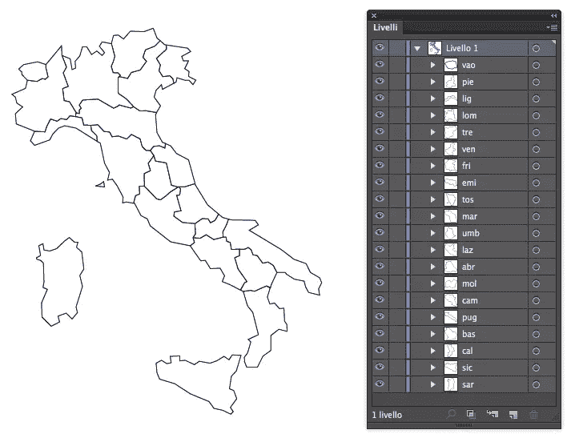
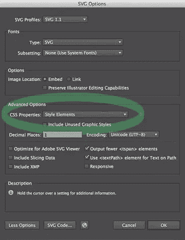
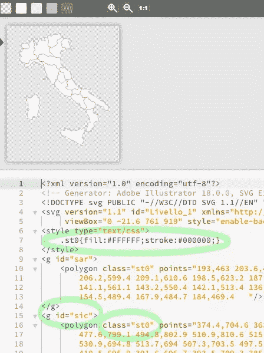
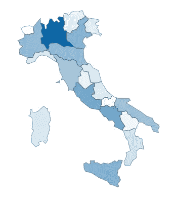

# 使用 SVG 和 jQuery 的动态地理地图

> 原文：<https://www.sitepoint.com/dynamic-geo-maps-svg-jquery/>

当我需要创建图表时，我的首选是 [Google Charts](https://developers.google.com/chart/) 或另一个专用库。不过，有时我需要一些我在那里找不到的特定功能。在这些情况下，SVG 图像被证明是非常有价值的。

最近，我不得不构建一个能够显示意大利地图的报告页面，根据从数据库中检索到的一些值，每个地区都有不同的色调。多亏了 SVG，这个任务变得非常容易。

## 在 Illustrator 中创建 SVG 地图

首先，我用 Illustrator 画了一张意大利地图:



每个区域都被绘制为单个对象，每个区域都有自己的级别，其名称与数据库中用于标识其相关数据的代码相匹配(例如:“tos”代表 Tuscany)。

最后，地图必须保存为 SVG 文件。你要注意在 Illustrator 中将“CSS 属性”选项设置为“样式元素”，如下图所示:



打开刚刚创建的文件，您会看到它包含一组`g`标签，它们的 id 与 Illustrator 级别的名称相匹配。

## 构建我们的 HTML 文件

包含在`g`标签中的每一项都有一个`st0`类，因此可以将`stroke`和`fill` CSS 属性分配给它们:



如果您尝试更改这些值，地图将立即更改:


现在，我们可以使用这些代码来构建带有内联 SVG 的 html 文件，如下所示(为了方便起见，代码被缩短了):

```
<!doctype html>
<html>
<head>
    <meta charset="UTF-8">
    <title>Map Sample</title>
    <style type="text/css" media="all"> .map svg {
            height: auto;
            width: 350px;
        }
        .map g {
            fill: #ccc;
            stroke: #333;
            stroke-width: 1;
        } </style>
</head>
<body>
    <div class="map">
        <svg version="1.1" id="Livello_1" xmlns="https://www.w3.org/2000/svg" xmlns:xlink="https://www.w3.org/1999/xlink" x="0px" y="0px" viewBox="0 -21.6 761 919" style="enable-background:new 0 -21.6 761 919;" xml:space="preserve">
            <g id="sar">
                <polygon class="st0" points="193,463 ...    "/>
            </g>

            <!-- etc ... -->

        </svg>
    </div>
</body>
</html>
```

您可以看到`svg`标签中的`style`属性已经被删除，并被位于文档`head`中的新属性所取代；所有的`g`元素最初都用浅灰色填充。

不再使用`st0`类(您可以从 SVG 代码中删除它),它已经被`.map g`选择器所取代。无论如何，这不是强制性的，你可以使用你喜欢的 CSS 选择器。

第二步是将地图绑定到从数据库中检索的一些数据。在这个例子中，我们的目标是根据每个地区的人口绘制地图。

## 添加 JSON 数据和 JavaScript

数据以 JSON 格式检索，并直接粘贴到我们的 HTML 文件中(当然，在现实世界中，数据将使用 Ajax 或类似方式检索)。

现在，我们的页面将在 JavaScript 文件中包含 JSON，如下所示(同样，缩写):

```
var regions=[
    {
        "region_name": "Lombardia",
        "region_code": "lom",
        "population": 9794525
    },
    {
        "region_name": "Campania",
        "region_code": "cam",
        "population": 5769750
    },

    // etc ...

];
```

之后，选择一种颜色(在本例中为`#0b68aa`)，并将其分配给具有最高人口值的区域。其他地区将按照人口比例用主色调着色。

接下来我们可以添加一些 JavaScript。

首先，我们要确定人口值最大的区域。这可以通过几行代码来完成。

一旦构建了包含人口值的临时数组，我们就可以对它使用`Math.max`方法:

```
var temp_array= regions.map( function( item ) {
    return item.population;
});

var highest_value = Math.max.apply( Math, temp_array );
```

然后，我们可以循环遍历所有的`regions`项，并根据计算结果*人口/最大值*(在 jQuery 的帮助下)对它们应用透明度百分比:

```
$(function() {
  for(i=0; i < regions.length; i++) {
    $('#'+ regions[i].region_code).css({'fill': 'rgba(11, 104, 170,' 
     + regions[i].population/highest_value 
     + ')'});
    }
});
```

这是结果:



## 使用 CSS 和 jQuery 增加交互性

可以通过增加一些交互性来改进地图。我们希望它在鼠标放在区域上时显示人口值。

首先，我们为`g:hover`添加一个 CSS 规则，并添加一个新的`info_panel`类来设计信息框的样式:

```
.map g:hover {
  fill: #fc0 !important;
  cursor: help;
}

.info_panel {
  background-color: rgba(255,255,255, .7);
  padding: .3em;
  font-size: .8em;
  font-family: Helvetica, Arial, sans-serif;
  position: absolute;
}

.info_panel::first-line {
   font-weight: bold;   
}
```

需要`.map g:hover`中的`!important`修饰符来提高`fill`规则的*特异性*，否则它将被注入的内联 CSS 绕过。

然后，我们必须修改之前的`for`周期，添加`.data()`来存储将在悬停时显示的信息:

```
for (i = 0; i < regions.length; i++) {
    $('#'+ regions[i].region_code)
    .css({'fill': 'rgba(11, 104, 170,' 
         + regions[i].population/highest_value 
         +')'}).data('region', regions[i]);
}
```

最后，我们可以通过添加一些鼠标悬停效果来完成我们的脚本:

```
$('.map g').mouseover(function (e) {
  var region_data=$(this).data('region');
  $('<div class="info_panel">' 
    + region_data.region_name 
    + '<br>' 
    + 'Population: ' 
    + region_data.population.toLocaleString("en-UK")
    + '</div>').appendTo('body');
}).mouseleave(function () {
  $('.info_panel').remove();
}).mousemove(function(e) {
    var mouseX = e.pageX, // X coordinates of mouse
        mouseY = e.pageY; // Y coordinates of mouse

    $('.info_panel').css({
      top: mouseY-50,
      left: mouseX - ($('.info_panel').width() / 2)
    });
});
```

工作原理:

*   首先，使用`mouseover`，我们构建一个包含要显示的信息的`div`(地区名称和人口)。每当鼠标悬停在一个`g`元素上时，就会构建 div，并将其追加到文档`body`中；
*   当光标在悬停区域之外时，移除 div
*   最后一个方法`mousemove`，检索鼠标坐标并将其分配给生成的 div。

以下是 CodePen 上的最终结果:

在 [CodePen](http://codepen.io) 上通过 SitePoint ( [@SitePoint](http://codepen.io/SitePoint) )看笔 [KDHfh](http://codepen.io/SitePoint/pen/KDHfh/) 。