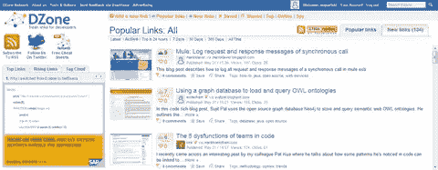
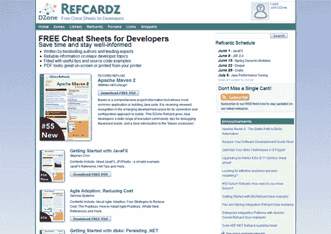

# DZone:新闻聚合器和面向开发者的免费备忘单

> 原文：<https://www.sitepoint.com/dzone-news-refcardz/>

有时候，好网站没有得到应有的关注。媒体报道更多的是 digg，reddit，delicious，StumbleUpon，Twitter，脸书等等，因为这些已经是神圣的品牌，因为“每个人都在那里”。当 case 的社交网络没有公关团队做后盾的时候，事情就更糟糕了。

在我看来，一个没有得到足够关注的社交网络是[DZone](http://www.dzone.com)——开发者的完美信息中心。我加入这个网络还不到一周，因为我在一个网站上发现了一个“分享到 DZone”的按钮，我…只是好奇。

关于 DZone 我今天要强调两个方面:相对于 Digg、SU、reddit 的社交网络优势；还有一个更重要的:DZone 的 Refcardz——面向开发者的免费备忘单。

##### DZone——踢爆德里耶的社交网络！

我一直在测试社交网络和新闻聚合器，出于各种原因:看看它们可能带来什么营销效益；看看他们提供了什么真正的搜索引擎优化优势；跟上某些领域的最新消息；看看什么是热门，什么不是；识别行业趋势；诸如此类。像 DZone 这样的小众网络比 digg 更有用。当然，让一个故事出现在 digg 的头版是任何出版商的梦想，但是我总是会用这个来换取 100 个真正感兴趣的读者！

在 digg 上，用户为了投票而投票，有时基于“挠我的背，我也会挠你的背”的原则，并不总是真正理解他们投票的目的，甚至不关心阅读他们“挖掘”的故事。

我发现 DZone 在这方面与众不同。

DZone 是一个真正的专业开发者网络，对垃圾邮件零容忍。

我有一个来自我的一个网站的与微软相关的故事提交到 DZone，看到它发送的流量我真的很惊讶，但更惊讶的是看到来自这个推荐人的那篇文章的跳出率不到 50% —更确切地说是 49.42%的跳出率！这与 digg (83%)、StumbleUpon (92%)和 reddit (77%)相比是惊人的。对于那些知道什么是跳出率的人来说，这不需要其他解释，但对于那些不知道的人来说:“跳出率代表了一个网站的初始访问者“跳”到不同网站，而不是继续进入同一网站的其他页面的百分比。”

因为我为 SitePoint 写作，所以我知道我的读者是一群非常聪明的人——所以我确信你会立刻理解像 DZone 这样的网络的价值；既然你们大多数人都是开发者，如果社交网络优势不是你的目标，那么看看这个:

##### DZone Refcardz:面向开发者的免费备忘单

这可能是 DZone 最受欢迎的产品，可能比 DZone Snippets(提供数千个免费共享的源代码示例)更受欢迎。我联系了 DZone 总裁 Rick Ross 以了解 DZone 何时推出以及推出的原因，他告诉了我关于 DZone Refcardz 的情况:

> 我们委托最畅销的技术作者和顶级专家为开发人员和设计人员创建 5-6 页的快速参考指南，介绍所有最重要的主题。它们经过专业编辑和设计，订户可以免费下载 Adobe PDF 格式的文件。一年多来，我们每周都发布新的版本。现在有超过 50 个主题，如果 DZone Refcardz 成为世界上最大的专业小抄收藏，我不会感到惊讶。Refcardz 背后的势头真的开始建立，我们很快就要达到第一百万次下载了。对于那些没有时间和金钱购买整本书的开发者来说，DZone Refcardz 是一个很好的选择。

##### DZone 上最受欢迎的网站

Rick Ross 还告诉我, [SitePoint](https://www.sitepoint.com) 是 DZone 上第八大最受欢迎的网站——这一点我毫不怀疑。SitePoint 是开发者的天堂，在大多数方面超过了 DZone 但是这两个实体同样重要，因为它们在许多领域相互补充。有人曾经告诉我，在网上没有竞争对手，只有同事——看看 SitePoint 和 DZone，我完全相信这一点。

## 分享这篇文章