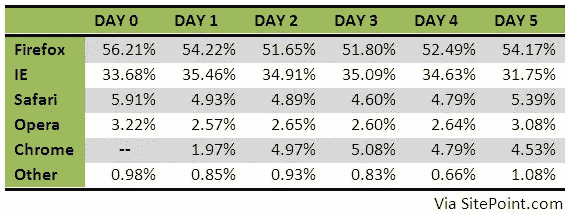

# 早期统计:谷歌 Chrome 伤害了 Firefox，而不是 IE

> 原文：<https://www.sitepoint.com/early-stats-google-chrome-hurts-firefox-not-ie/>

上周，谷歌宣布大胆进入网络浏览器市场，推出了完全开源的 Chrome(T2)项目。人们普遍认为谷歌的浏览器是微软的一次尝试——要么瞄准 ie 浏览器，要么瞄准 Windows。但是早期的证据表明，从一开始，它对 Firefox 的伤害就比任何人都大。

StatCounter 博客上的一篇博客文章调查了 Chrome 发布后的最初几天，揭示了这款浏览器仅在 24 小时内就获得了令人印象深刻的 1%的全球市场份额。然而，统计数据也表明，Firefox 和 Safari 是 Chrome 流失用户的浏览器，而不是 IE。

StatCounter 报道称，Chrome 发布后，Firefox 和 Safari 的市场份额都有所下降(而 IE 莫名其妙地增长了几个百分点)。不过，两天的数据并不多，所以我想我也应该看看 SitePoint 的浏览器统计数据，记住 SitePoint 是一个非典型的网站，超过 50%的用户使用 Firefox 访问我们。下图显示了 Chrome 发布前五天和前一天在 SitePoint 上的浏览器份额。

我们在 SitePoint 本地看到了与 StatCounter 在全球看到的类似趋势。到了第三天，Chrome 达到了 5.08%的峰值，Firefox 下降了 4.5%。Safari 也下降了一个多百分点。

我在我的论坛网站上看到了类似的情况，Firefox 从周一的 71.59%(这是一个非常以技术为中心的人群)下降到周六的 65.74%，而 Chrome 飙升至 4.68%。

## 外卖食品

从这些数字中不可能得出任何真正的结论，因为还没有足够的数据来这样做。浏览器份额每天有几个百分点的波动是正常的。此外，Firefox 的用户下降幅度最大是有道理的，因为早期用户更有可能使用 Firefox 而不是 IE，他们最有可能试用 Chrome。

鉴于 Chrome 还不能在 Mac 上运行，Safari 使用量的下降有点奇怪(这在 SitePoint 和我自己的网站上都可以看到，在 StatCounter 的全球范围内也可以看到)。这意味着份额变化可能是正常的波动，并进一步说明我们需要更多的数据才能得出任何结论。

在我们观察的两个网站上，Chrome 从上周中期的峰值有所下降，尽管它在两个非常以技术为中心的网站上的浏览器市场份额仍超过 4%。这是令人印象深刻的刚推出一周。在接下来的几个月里，看看这件事如何发展将会很有趣。Chrome 会继续从 Firefox 吸引用户还是会在 Chrome 更加成熟之前让用户转回 Firefox？谷歌能让它进入主流 IE 用户的桌面吗？Mac 版 Chrome 到来，会对 Safari 的数字产生怎样的影响？这些都是有趣的问题，我们有望在接下来的几个月里开始回答。

## 分享这篇文章