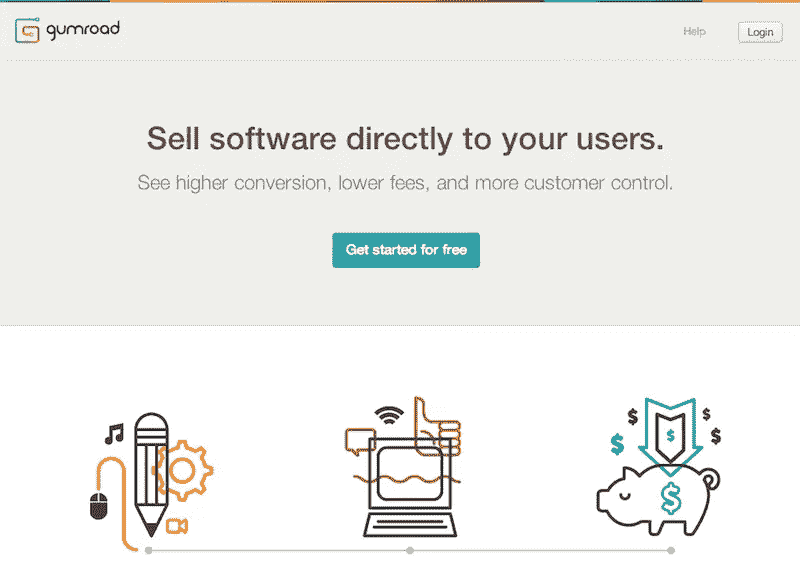
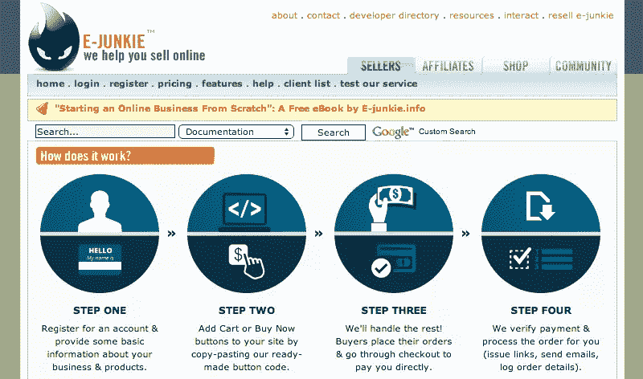
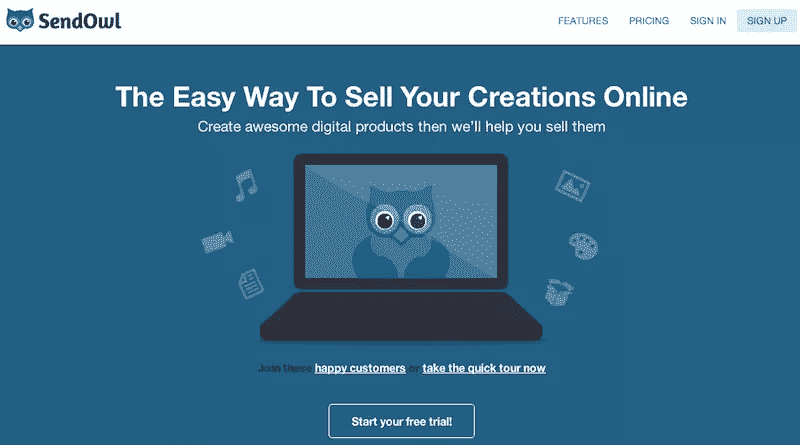

# 如何通过创造数字信息产品获得被动收入

> 原文：<https://www.sitepoint.com/earn-money-sleep-digital-info-products/>

本文由 [99designs](https://99designs.com.au/) 为您带来。[他们推出了一项新的书籍封面设计服务](https://99designs.com.au/book-cover-design)。作者和出版商现在可以举办比赛来寻找他们的读者会喜欢的书的封面！本文更新于 1 月 20 日。

有一种不用一周工作 60 小时就能赚更多钱的方法不是很好吗？或者为那些预算太低而无法享受你的服务，但又真正喜欢你的风格的人提供一些东西？

如果你愿意提前付出一点额外的努力，信息产品可以在这两个问题上提供巨大的帮助—*和*当涉及到平衡自由职业者收入的起伏时，它们可以发挥很大的作用。

## 为什么要创建信息产品？

首先，就本文而言，*信息产品*意味着类似指导性电子书或“操作”视频的东西——与软件产品相对。显然，构建软件比创建用户指南需要更多的工作。一个信息产品需要更少的时间来创造，但仍然为您的客户提供价值。

### 也就是说，这些类型的产品有两个重要的用途

**1。与时间无关的收入，也就是传说中的“被动收入”**如果你经营的是服务型企业，并且乐在其中，你就不需要试图用信息产品来取代你的服务收入。但是，购买信息产品可以带来足够的额外收入来平衡不景气的几个月，或者在你生病无法工作的一两周内提供一个缓冲。
2**。你可以把潜在客户推荐给他们。**我们都有这样的客户，他们非常想和我们合作，但是不一定有预算。如果你能给他们一个预算内的解决方案，并帮助他们自己解决问题，他们会很喜欢你。这通常意味着当他们有更大的预算时，他们会回来找你，同时推荐其他人给你。所以你不仅建立了另一个收入来源，你也创造了未来的推荐和客户。

## 如何创建你的第一个信息产品

确信它值得你花时间去创造一个信息产品？这里有一些方法来开始你的内容。

### 1.想想你得到的常见问题

很可能在你的工作中，你会一遍又一遍地被问到一些问题。不要通过冗长重复的电子邮件来回答这些问题，而是创建一个涵盖这些常见问题的资源。

### 2.想想你提供的最初级的服务

随着你的自由职业业务的增长，你很可能会发现一些服务已经不能满足你的需求了。如果你发现编写主题比安装 WordPress 有趣得多，你可以制作一个简单的视频展示如何安装 WordPress，上传一个插件并设置你的第一个主题。当预算不多的人想雇用你为他们做这项工作时，你可以向他们提供你的视频作为更便宜的选择。

有大量的“如何安装 WordPress”或“如何做基本的技术任务 XYZ”指南，我并不是建议你试图在搜索引擎中击败他们或超越他们(这需要一个成熟的营销策略，这本身就是一个项目)。这是为了给那些想和你一起工作的人提供一个选择，而不是雇佣你来提供服务。当然，在你通过社交媒体、博客帖子和其他渠道创造出信息产品后，你可以在你通常的客户群之外营销你的信息产品，但你不*有*让它仍然是一个值得的冒险。

### 3.想想你让客户做的准备工作

如果你是一名设计师，人们向你寻求帮助为他们的品牌或网站设计配色方案或字体可能是很常见的。如果你已经创建了一个过程作为你的客户工作的一部分，帮助其他工作进行得更快，创建一个引导客户完成这个过程的指南。关于如何为你的品牌选择配色方案、字体和风格的指南，无论是在你开始与设计师合作之前，还是在你能雇佣到设计师之前，都会对很多人有所帮助。这样，即使它是一个替身，而客户为设计包省钱，他们可以有一个网站，看起来不像是由一个五岁的孩子用太多的蜡笔设计的。

## 现在是实际创建内容的时候了:

一些选项包括:

**录制视频**(对 DIY 指导特别有用)，可以使用 [Screencast-O-Matic](http://www.screencast-o-matic.com/) 这样的廉价工具(Mac 和 Windows 都适用，每年 15 美元)。然后上传到有密码保护的 Vimeo 视频或未列出的 Youtube 视频，或者只是将视频导出为文件。

**录制音频，**可以使用 Garageband 或者 [Audacity](http://audacity.sourceforge.net/) 。不要太担心有一个漂亮的麦克风。[这款麦克风在亚马逊](http://www.amazon.com/Sony-ECMCS3-Omnidirectional-Stereo-Microphone/dp/B0058MJX4O/ref=sr_1_2?ie=UTF8&qid=1407865128&sr=8-2&keywords=lavalier+mic)售价不到 25 美元，对于这样一款入门级麦克风来说，它的评价很高——应该足够让你入门了。录音时一定要设法消除背景噪音。

**对于创作书面产品，**你可能已经知道该怎么做了。把它写下来，格式化，这样看起来就不会太普通了，别忘了让朋友帮你校对一下，找出错别字。

考虑以多种形式提供你的产品。虽然有些人是视觉学习者，但其他人更喜欢阅读。创建多种格式意味着你要做更多的工作，但也为潜在客户增加了价值。这也意味着你可以对最终版本收取更多费用。一旦你创建了所有的文件，将它们放在一个`.zip`文件中，然后决定如何出售。

## 一旦你成功了，如何去销售它

恭喜你。你已经完成了你的第一个信息产品。接下来，你需要用一种别人会想买的方式来描述它。你还需要提供一种方式让他们付钱给你并下载文件。

### 撰写有效销售文案的快速入门

*   使其可扫描。同样的规则也适用于撰写一篇可读的博客文章:使用标题、粗体和项目符号，并用图片分割文本。
*   关注好处，而不是特性。一个功能的例子是:“两个小时的多种格式的视频。”这里有一个好处:“视频回答你所有的问题，给你完成工作所需的一切，你可以在任何设备上观看它们。”
*   只在需要的时候使用。长篇销售文案非常适合向不认识你的人推销，但如果你发送给对你和主题有一定熟悉程度的热情潜在客户，他们不需要阅读 4000 字来决定是否愿意花 10 到 50 美元来解决他们的问题。

### 可以帮助您销售产品的工具:

#### [Gumroad](https://gumroad.com/)

**价格:**与 [Gumroad](https://gumroad.com/) 相比，你不用支付月费，而是支付 5%的费用，外加每笔交易 0.25 美元。

**注意:** Gumroad 可以让你把人们带到一个页面，或者在你自己的登陆页面上嵌入一个指向你的产品的链接。您可以接受通过主要信用卡付款，包括国际信用卡。每两周通过直接存款或 PayPal 支付一次。对于那些不确定每月能卖出多少本，又不想支付订阅费的人来说，这是个不错的选择。它也非常灵活，尤其是如果你有开发技能来调整按钮或覆盖选项。

#### [电子迷](http://www.e-junkie.com/)

价格:每月 5 美元起。

**备注:** [E-junkie](http://www.e-junkie.com/) 是第一批销售数码产品的平台之一，而且它仍然是一个不错的选择。用户界面在视觉上肯定会更有吸引力，但它很好用，能与 PayPal 很好地集成，并且有一个负担得起的入门级计划来帮助您入门。

#### [发送猫头鹰](https://www.sendowl.com/)

价格:每月 9 美元起。

**备注:** [Sendowl 的](https://www.sendowl.com/)两大优势是其漂亮、易学的用户界面，以及与多个支付处理器的集成，包括 PayPal、Stripe 和 Authorize.net。如果你不介意支付订阅费，并希望能够为客户提供通过 PayPal 或信用卡支付的选择，Sendowl 是一个不错的选择。

## 准备好开始了吗？

以下是您需要做的事情的快速回顾:

*   开始记录你从客户和潜在客户那里得到的问题，并思考你可以从其他途径获得产品灵感(你提供的入门级服务或你与客户一起做的准备工作)。
*   思考回答这些问题(视频、音频或书面)有什么意义，并将答案打包。
*   选择如何销售你的产品。
*   看看效果如何！

一旦你有了一些东西，你可以根据你得到的反馈改进你的销售文案或产品供应(或两者都有),但最重要的是你只需要把产品推出去。

不要被完美所麻痹——以后总会有时间进行迭代和改进。Info 产品是活文档，只有尽快发布测试版，你才能从中受益。

## 分享这篇文章