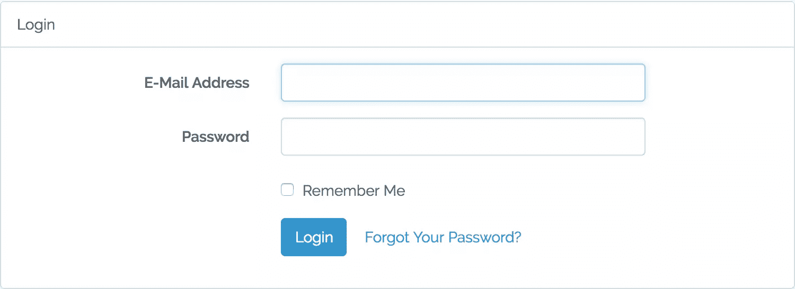
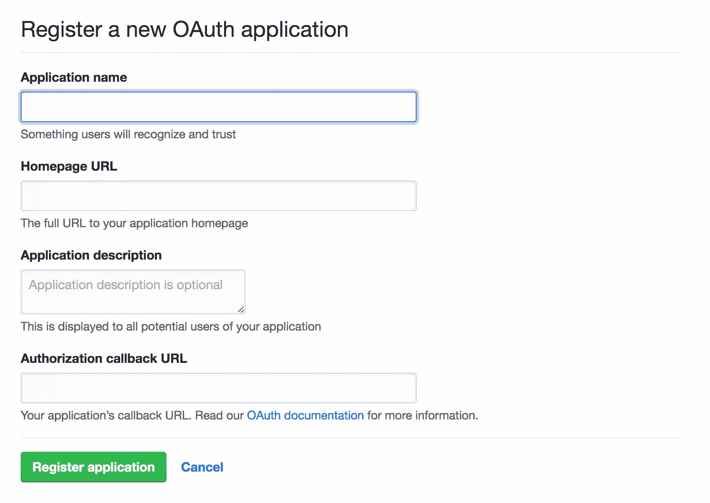
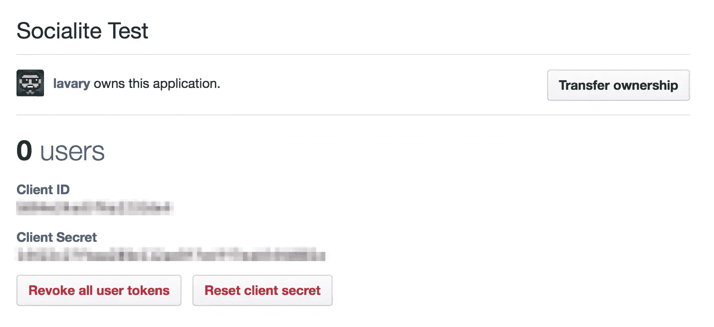
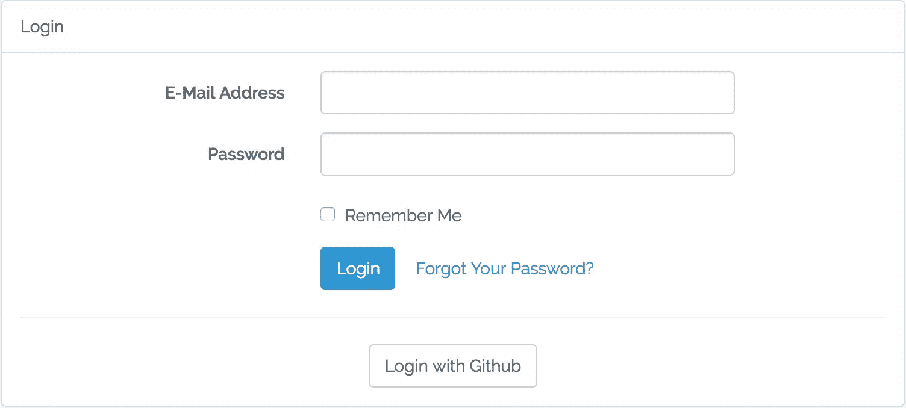
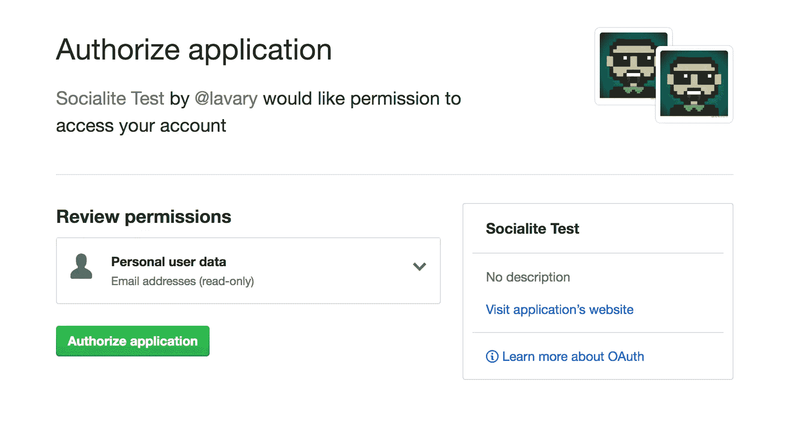
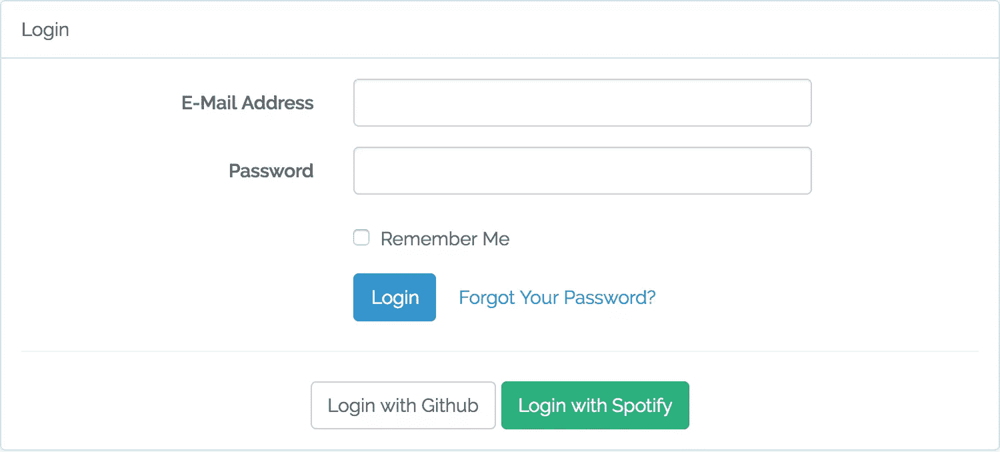
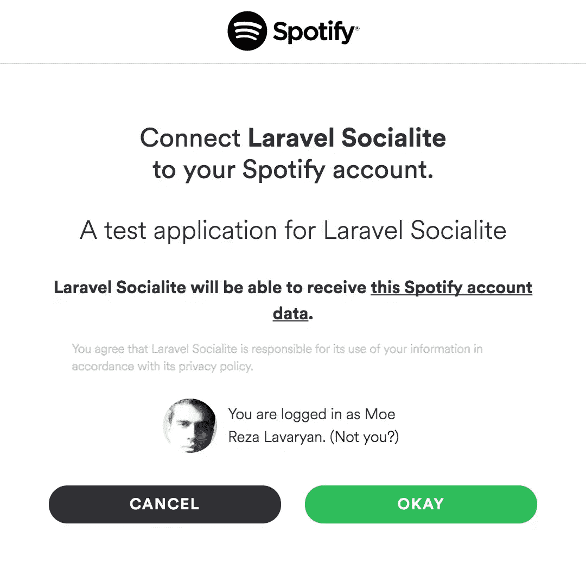

# 使用 Socialite 轻松将社交登录添加到您的应用程序中

> 原文：<https://www.sitepoint.com/easily-add-social-logins-to-your-app-with-socialite/>

*这篇文章由[沃恩·安切塔](https://www.sitepoint.com/author/wancheta/)进行了同行评审。感谢 SitePoint 的所有同行评审员使 SitePoint 的内容尽可能做到最好！*

* * *

Laravel Socialite 是一个软件包，用于将任何复杂的社交认证和样板代码抽象成一个流畅而富于表现力的界面。


Socialite 只支持 Google、脸书、Twitter、LinkedIn、Github 和 Bitbucket 作为 OAuth 提供者。他们不会将任何其他人添加到列表中，但是，有一个名为[社交名媛提供者](https://github.com/laravel/socialite)的社区驱动集合，其中包含大量社交名媛的非官方提供者。下一节将详细介绍这一点。

我假设您已经有一个新的 [Laravel](https://laravel.com/docs/5.4/installation) 应用程序实例在您的机器上启动并运行，因此您可以在运行过程中看到代码。如果你需要一个良好的发展环境，你可以免费使用[宅基地改良版](https://www.sitepoint.com/quick-tip-get-homestead-vagrant-vm-running/)。

## 基于表单的认证

在开始 OAuth 认证之前，让我们先设置 Laravel 的基于表单的标准认证。为此，我们运行`make:auth` artisan 命令，该命令安装所有必需的视图以及所需的认证端点。

```
php artisan make:auth 
```

> **注意**我们还需要运行`php artisan migrate`来确保`users`表被创建。

现在，如果我们转向`/login`，我们应该会看到一个很好的引导风格的登录页面。



## 添加社交认证

为了开始使用社交网站，我们将它与 Composer 一起安装:

```
composer require laravel/socialite 
```

一旦安装完毕，Socialite 的服务提供者和门面应该在`config/app.php`中注册——就像任何其他 Laravel 包一样。

> `config/app.php`

```
<?php

// ...

'providers' => [

        // ...

        /*
         * Package Service Providers...
         */      
        Laravel\Socialite\SocialiteServiceProvider::class,

    ],

// ... 
```

这是门面别名:

```
<?php

// ...
'aliases' => [

        // ...

        'Socialite' => Laravel\Socialite\Facades\Socialite::class,

    ],
// ... 
```

社交名媛在服务容器中注册为一个惰性加载的单例服务。

## 配置

要使用任何提供者，我们需要在该提供者平台上注册一个 OAuth 应用程序。作为回报，我们将得到一对**客户端 ID** 和**客户端秘密**密钥，作为我们与提供者 API 交互的凭证。

我们需要在`config/services.php`中为每个提供者添加凭证:

```
// ...

'facebook' => [
        'client_id'     => env('FB_CLIENT_ID'),
        'client_secret' => env('FB_CLIENT_SECRET'),
        'redirect'      => env('FB_URL'),
],

'twitter' => [
        'client_id'     => env('TWITTER_CLIENT_ID'),
        'client_secret' => env('TWITTER_CLIENT_SECRET'),
        'redirect'      => env('TWITTER_URL'),
],

'github' => [
        'client_id'     => env('GITHUB_CLIENT_ID'),
        'client_secret' => env('GITHUB_CLIENT_SECRET'),
        'redirect'      => env('GITHUB_URL'),
],

// ... 
```

实际的键值放在项目根目录下的`.env`文件中。

## 数据库注意事项

由于`users`表结构没有被设计成集成社会认证，我们首先需要在那里做一些调整。

通常，当用户采用社交认证方法时，他们不必选择密码，除非我们要求他们这样做(OAuth 授权后，请[不要这样做](https://twitter.com/bitfalls/status/841991710095859712))。除此之外，用户可能没有与相应的 OAuth 提供者相关联的电子邮件地址。因此，我们需要制作`email`和`password`字段`nullable`。

为了修改模式，我们使用 Laravel 的模式构建器。在修改现有表格中的字段之前，我们需要安装`doctrine/dbal`包。

```
composer require doctrine/dbal 
```

先说`users`:

```
php artisan make:migration prepare_users_table_for_social_authentication --table users 
```

现在，我们制作`email`和`password`字段`nullable`:

> **文件:** `database/migrations/xxxxxx_prepare_users_table_for_social_authentication.php`

```
<?php

// ...

/**
     * Run the migrations.
     *
     * @return void
     */
    public function up()
    {
        Schema::table('users', function (Blueprint $table) {

        // Making email and password nullable
            $table->string('email')->nullable()->change();
            $table->string('password')->nullable()->change();

        });
    }

    /**
     * Reverse the migrations.
     *
     * @return void
     */
    public function down()
    {
        Schema::table('users', function (Blueprint $table) {

            $table->string('email')->nullable(false)->change();
            $table->string('password')->nullable(false)->change();

        });
    }

// ... 
```

为了存储用户的关联社交账户，我们一起创建模型及其迁移文件:

```
php artisan make:model LinkedSocialAccount --migration 
```

> **文件:** `database/migrations/xxxxxx_create_linked_social_accounts_table.php`

```
<?php

// ...

public function up()
    {
        Schema::create('linked_social_accounts', function (Blueprint $table) {

            $table->increments('id');
            $table->bigInteger('user_id');           
            $table->string('provider_name')->nullable();
            $table->string('provider_id')->unique()->nullable();          
            $table->timestamps();

        });
    }

    /**
     * Reverse the migrations.
     *
     * @return void
     */
    public function down()
    {
        Schema::dropIfExists('linked_social_accounts');
    }

// ... 
```

`provider_name`是提供商的名称，而`provider_id`是提供商平台上的用户 ID。

为了应用更改，我们运行`migrate`:

```
php artisan migrate 
```

## 模特们

每个用户可以有许多关联的社交账户，这意味着`User`和`LinkedSocialAccounts`之间是一对多的关系。为了定义这种关系，我们将以下方法添加到`User`模型中:

> **文件** : `app/User.php`

```
 // ...

public function accounts(){
    return $this->hasMany('App\LinkedSocialAccount');
}

 // ... 
```

让我们也在`LinkedSocialAccount`模型中加入这种关系的逆关系:

**文件** : `app/LinkedSocialAccounts.php`

```
<?php
// ...

public function user()
{
    return $this->belongsTo('App\User');
}

// ... 
```

此外，我们通过将`provider_name`和`provider_id` [添加到`LinkedSocialAccounts`中的`$fillable`数组中，使`provider_name`和](https://laravel.com/docs/5.4/eloquent#mass-assignment)可批量赋值。

> **文件** : `app/LinkedSocialAccounts.php`

```
<?php

// ...

protected $fillable = ['provider_name', 'provider_id' ];

public function user()
{
    return $this->belongsTo('App\User');
} 
```

这允许我们在将社交账户与用户相关联时使用`create()`方法。

## 控制器

现在，我们在`Auth`名称空间下创建控制器。我们的控制器类中需要两个动作，一个用于将用户重定向到 OAuth 提供者，另一个用于接收来自提供者的回调。

```
php artisan make:controller 'Auth\SocialAccountController' 
```

我们编辑控制器类，最终得到如下结果:

> **文件** : `app/Http/Controllers/Auth/SocialAccountController.php`

```
<?php

    /**
     * Redirect the user to the GitHub authentication page.
     *
     * @return Response
     */
    public function redirectToProvider($provider)
    {
        return \Socialite::driver($provider)->redirect();
    }

    /**
     * Obtain the user information
     *
     * @return Response
     */
    public function handleProviderCallback(\App\SocialAccountsService $accountService, $provider)
    {

        try {
            $user = \Socialite::with($provider)->user();
        } catch (\Exception $e) {
            return redirect('/login');
        }

        $authUser = $accountService->findOrCreate(
            $user,
            $provider
        );

        auth()->login($authUser, true);

        return redirect()->to('/home');
    }
} 
```

在前面的代码中，`redirectToProvider()`通过调用提供者的`redirect()`方法，将用户重定向到相应的授权端点。

```
<?php
// ...
 return Socialite::driver($provider)->redirect();
// ... 
```

在调用`redirect()`之前，我们还可以使用`scopes()`更改默认范围:

```
<?php
// ...
 return Socialite::driver($provider)->scopes(['users:email'])->redirect();
// ... 
```

因为 OAuth 提供者的行为并不总是可预测的，所以我们使用一个`try/catch`块来处理意外情况。如果一切正常，没有异常，那么从提供者那里检索用户对象(一个`Laravel\Socialite\Contracts\User`的实例)。该对象公开了一些用于检索用户信息的 *getter* 方法——包括姓名、电子邮件、访问令牌等。您可以在[文档](https://github.com/laravel/socialite#retrieving-user-details)中找到可用的方法。

接下来，我们检索本地用户对象(驻留在我们的`users`表中),如果它还不存在，就创建一个。为此，我们从名为`SocialAccountsService`的助手类中调用`findOrCreate()`(该类作为参数注入到`handleProviderCallback()`方法中)。

检索用户对象后，我们让用户登录，将他们重定向到仪表板页面。

现在，让我们创建我们的助手类`SocialAccountService.php`。

在`App`名称空间下，用以下代码创建一个文件:

> **文件** : `app/SocialAccountService.php`

```
<?php

namespace App;

use Laravel\Socialite\Contracts\User as ProviderUser;

class SocialAccountService
{
    public function findOrCreate(ProviderUser $providerUser, $provider)
    {
        $account = LinkedSocialAccount::where('provider_name', $provider)
                   ->where('provider_id', $providerUser->getId())
                   ->first();

        if ($account) {
            return $account->user;
        } else {

        $user = User::where('email', $providerUser->getEmail())->first();

        if (! $user) {
            $user = User::create([  
                'email' => $providerUser->getEmail(),
                'name'  => $providerUser->getName(),
            ]);
        }

        $user->accounts()->create([
            'provider_id'   => $providerUser->getId(),
            'provider_name' => $provider,
        ]);

        return $user;

        }
    }
} 
```

这个类只有一个作业和一个方法来创建或获取一个本地用户，并将一个社会帐户与其相关联。

在`findOrCreate`中，我们首先查询`linked_social_accounts`表，看看是否有任何社交账户注册了当前的提供商 ID。如果是，我们返回该社交帐户所属的本地用户对象:

```
<?php
// ...

if ($account) {
   return $account->user;
}

// ... 
```

如果没有找到社交账户，要么用户不存在，要么用户还没有链接任何社交账户。考虑到这一点，我们通过电子邮件搜索`users`表，因为用户可能已经通过注册表单注册到我们的系统中。如果找不到用户，我们将创建一个新的用户条目，并将当前的社交帐户与其相关联。

## 路线

我们的社交认证功能需要两条途径:

> **文件** : `routes/web.php`

```
<?php

// ...

Route::get('login/{provider}',          'Auth\SocialAccountController@redirectToProvider');
Route::get('login/{provider}/callback', 'Auth\SocialAccountController@handleProviderCallback'); 
```

在上述路线中，`provider`被指定为一个*路线参数*。这允许我们为其他提供者重用这两条路线。

## 示例:通过 Github 进行身份验证

为了测试我们构建的东西，让我们添加 [Github](http://github.com) 作为我们的社交认证(登录)选项。

首先，我们需要[在 Github 上注册一个新的 OAuth 应用程序](https://github.com/settings/applications/new)。



在应用程序创建页面上，我们需要填写几个字段:

*   **应用程序名称**应该是我们的应用程序的描述性名称。这是用户在重定向到 Github 来授权我们的应用程序时将会看到的。

*   **首页网址**是我们网站的网址。它可以是`http://localhost:8000`或任何其他有效的域。

*   **授权回调 URL** 是我们网站上的一个端点，授权完成后用户将被重定向到该端点。

创建应用程序后，我们被重定向到编辑页面，在那里我们可以找到(并复制)我们的密钥。



### 配置

在这一步中，我们将 Github 凭证添加到`config/services.php`:

> **文件** : `config/services.php`

```
<?php

// ...

'github' => [
        'client_id'     => env('GITHUB_CLIENT_ID'),
        'client_secret' => env('GITHUB_CLIENT_SECRET'),
        'redirect'      => env('GITHUB_URL'),
],

// ... 
```

虽然我们可以直接将凭证和回调 URL 放在`config/services.php`中，但是我们将它们保存在应用程序的`.env`文件中(并使用`getenv()`从`services.php`文件中自动加载它们)。当我们想在不接触代码的情况下改变生产环境中的值时，这是很有用的。

> **文件** : `.env`

```
GITHUB_CLIENT_ID=API Key
GITHUB_CLIENT_SECRET=API secret
GITHUB_URL=callbackurl 
```

## 将 Github 链接添加到登录页面

拼图的最后一块是将 Github 链接添加到登录页面。打开`resources/views/auth/login.blade.php`，将以下代码放在适当的位置。

> **文件** : `resources/views/auth/login.blade.php`

```
<!-- Login page HTML code  -->

<a href="/login/github"  class="btn btn-default btn-md">Log in with Github</a>

<!-- Login page HTML code  --> 
```

它应该是这样的:



如果我们点击*登录 Github* ，我们将被转到 Github 的授权页面:



## 社会名流提供者项目

社交名媛提供者是一个社区驱动的项目，为社交名媛提供大量非官方的提供者。每个提供程序都作为独立的包安装(通过 Composer)。

提供者使用作为社交提供者项目的一部分开发的[管理器包](https://github.com/SocialiteProviders/Manager)，并作为依赖项与每个提供者一起安装，以将他们自己注册为社交提供者。

管理器包附带了一个 Laravel 服务提供者，它扩展了 Socialite 的默认服务提供者。要使用 SP 集合中的提供者，我们需要将此服务提供者替换为 Socialite 的:

**文件** : `config/app.php`

```
 // ...

        SocialiteProviders\Manager\ServiceProvider:class,

        // ... 
```

***注:**服务提供者和社交名媛提供者是两个不同的概念，名称相近，不应混淆。服务提供者是用于在 Laravel 的服务容器内注册服务的类，而社交提供者(或简称为提供者)是用于与不同 OAuth 提供者交互的类。*

集合中的每个提供者都带有一个*事件监听器*，它需要被添加到`app/Provider/EventServiceProvider`类中，以监听`SocialiteWasCalled`事件。

每当访问社交名媛时，就会触发`SocialiteWasCalled`事件。因此，所有监听该事件的提供者将向 Socialite 注册自己(实现[观察者模式](https://www.sitepoint.com/understanding-the-observer-pattern/))。

> **文件** : `app/Providers/EventServiceProvider.php`

```
<?php

// ...

protected $listen = [
    \SocialiteProviders\Manager\SocialiteWasCalled::class => [
        'SocialiteProviders\Deezer\DeezerExtendSocialite@handle',
    ],
]; 
```

上面的例子通过 Deezer 注册了一个认证提供者。

注意:标准的社交名媛提供者仍然可以使用，除非我们用同名的提供者覆盖它们。

## 示例:通过 Spotify 进行认证

举个例子，让我们将 Spotify 添加为登录选项。

首先，我们前往[社交网站提供商](https://socialiteproviders.github.io/)找到 Spotify 的提供商——在左边栏。

每个供应商都有自己的安装和使用手册。为了安装 Spotify 的提供程序，我们使用 Composer:

```
composer install socialproviders/spotify 
```

### 配置

同样，我们需要在 [Spotify 的](https://developer.spotify.com/my-applications/#!/applications/create)开发者平台上注册一个应用来获得我们的凭证。一旦我们得到了密钥，我们就将它们添加到我们的设置中。

管理器包使得为新的提供者配置设置变得非常容易。与标准提供者不同，我们不必为每个提供者在`config/services.php`中添加一个条目。相反，我们只将设置添加到应用程序的`.env`文件中——这要感谢管理器的*配置检索器*助手类。

这些设置应该被称为`CLIENT_ID`、`CLIENT_SECRET`和`REDIRECT_URL`、**，在**前面加上它们的提供商名称:

> **文件:** `.env`

```
SPOTIFY_CLIENT_ID = YOUR_CLIENT_ID_ON_SPOTIFY
SPOTIFY_CLIENT_SECRET = YOUR_CLIENT_SECRET_ON_SPOTIFY
SPOTIFY_REDIRECT_URL = YOUR_CALL_BACK_URL 
```

### 景色

接下来，我们将**使用 Spotify 登录**链接添加到登录页面:

> **文件:** `resources/views/auth/login.blade.php`

```
<!-- Login page HTML code  -->

<a href="/login/spotify"  class="btn btn-default btn-md">Log in with Spotify</a>

<!-- Login page HTML code  --> 
```

登录页面现在应该如下所示:



我们可以重用我们在上一个例子中定义的路由(通过 Github 进行身份验证),或者用新的控制器和逻辑创建新的路由。

点击`Login with Spotify`，我们将被重定向到 Spotify 的授权页面:



这意味着它起作用了！

## 创建自定义提供程序

如果我们在 Socialite Providers 集合中找不到某个提供者，我们可以很容易地创建自己的提供者。

每个提供程序由两个组件组成:

*   提供者类
*   事件侦听器

### 提供者类别

provider 类包含处理 OAuth 相关操作的所有逻辑。

> 如果您也想支持 OAuth 1.0，您需要为它实现一个单独的 provider 类。

为了快速入门，让我们看看来自 SP 集合的 Deezer 的 provider 类:

> **文件:** `vendor/socialiteproviders/deezer/Provider.php`

```
<?php

namespace SocialiteProviders\Deezer;

use SocialiteProviders\Manager\OAuth2\User;
use Laravel\Socialite\Two\ProviderInterface;
use SocialiteProviders\Manager\OAuth2\AbstractProvider;

class Provider extends AbstractProvider implements ProviderInterface
{
    /**
     * Unique Provider Identifier.
     */
    const IDENTIFIER = 'DEEZER';

    /**
     * {@inheritdoc}
     */
    protected $scopes = ['basic_access', 'email'];

    /**
     * {@inheritdoc}
     */
    protected function getAuthUrl($state)
    {
        return $this->buildAuthUrlFromBase(
            'https://connect.deezer.com/oauth/auth.php', $state
        );
    }

    /**
     * {@inheritdoc}
     */
    protected function getTokenUrl()
    {
        return 'https://connect.deezer.com/oauth/access_token.php';
    }

    /**
     * {@inheritdoc}
     */
    protected function getUserByToken($token)
    {
        $response = $this->getHttpClient()->get(
            'https://api.deezer.com/user/me?access_token='.$token
        );

        return json_decode($response->getBody()->getContents(), true);
    }

    /**
     * {@inheritdoc}
     */
    protected function mapUserToObject(array $user)
    {
        return (new User())->setRaw($user)->map([
            'id' => $user['id'], 'nickname' => $user['name'],
            'name' => $user['firstname'].' '.$user['lastname'],
            'email' => $user['email'], 'avatar' => $user['picture'],
        ]);
    }

    /**
     * {@inheritdoc}
     */
    protected function getCodeFields($state = null)
    {
        return [
            'app_id' => $this->clientId, 'redirect_uri' => $this->redirectUrl,
            'scope' => $this->formatScopes($this->scopes, $this->scopeSeparator),
            'state' => $state, 'response_type' => 'code',
        ];
    }

    /**
     * {@inheritdoc}
     */
    public function getAccessToken($code)
    {
        $url = $this->getTokenUrl().'?'.http_build_query(
            $this->getTokenFields($code), '', '&', $this->encodingType
        );

        $response = file_get_contents($url);

        $this->credentialsResponseBody = json_decode($response->getBody(), true);

        return $this->parseAccessToken($response->getBody());
    }

    /**
     * {@inheritdoc}
     */
    protected function getTokenFields($code)
    {
        return [
            'app_id' => $this->clientId,
            'secret' => $this->clientSecret,
            'code' => $code,
        ];
    }

    /**
     * {@inheritdoc}
     */
    protected function parseAccessToken($body)
    {
        parse_str($body, $result);

        return $result['access_token'];
    }
} 
```

每个提供者类都扩展了抽象类`Laravel\Socialite\Two\AbstractProvider`。这个抽象类包含一些处理通用 OAuth 2.0 操作的具体方法——从格式化范围到获取和处理访问令牌。我们只需要扩展这个抽象类并实现它的抽象方法。

此外，我们需要实现`ProviderInterface`，它指定了两个要实现的方法，`redirect()`和`user()`。

您可能还记得上一节中的内容，`redirect()`将用户重定向到 OAuth 提供者的授权页面，而`user()`返回一个`Laravel\Socialite\Contracts\User`的实例——包含来自提供者平台的用户信息。

### 提供者的事件监听器

提供者的事件监听器是一个类，每当`SocialiteWasCalled`事件被触发时，它将提供者注册为社交提供者。

让我们来看看 Deezer 的事件监听器:

**文件:** `vendor/socialiteproviders/deezer/DeezerExtendSocialite.php`

```
<?php

namespace SocialiteProviders\Deezer;

use SocialiteProviders\Manager\SocialiteWasCalled;

class DeezerExtendSocialite
{
    /**
     * Register the provider.
     *
     * @param \SocialiteProviders\Manager\SocialiteWasCalled $socialiteWasCalled
     */
    public function handle(SocialiteWasCalled $socialiteWasCalled)
    {
        $socialiteWasCalled->extendSocialite(
            'deezer', __NAMESPACE__.'\Provider'
        );
    }
} 
```

事件`SocialiteWasCalled`有一个方法`extendSocialite()`，它接受提供者的类作为参数，并将其注册到 Socialite。

## 包扎

使用 Laravel 时，社交认证从未如此简单。我们学习了如何使用各种 OAuth 提供者来认证我们的用户。我们还学习了如何创建我们自己的提供者。

除了提供者的名称和提供者 ID，您还可以在`users`表中存储额外的社交信息，包括头像、访问令牌、刷新令牌(如果有的话)等等。您还可以与提供商的 API 进行交互，甚至代表用户采取一些行动。当然，前提是用户已经给了你这样做的权限。

本教程的完整代码可以在 Github 上找到，如果你想自己尝试的话。

如果你对这个话题有任何疑问，或者我们错过了什么，请在下面的评论中告诉我们！

## 分享这篇文章