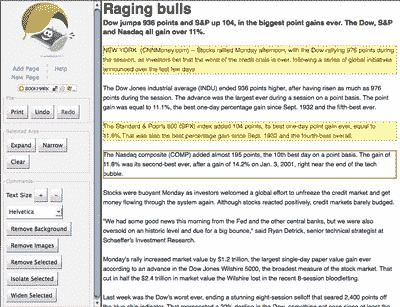

# 使用 PrintWhatYouLike.com 轻松创建可打印页面

> 原文：<https://www.sitepoint.com/easily-create-printable-pages-with-printwhatyoulikecom/>

任何大学生都很清楚打印网页的坏处。许多网站不提供其内容的可打印版本，或者当他们提供时，可打印的页面仍然有广告、全彩色图片或其他墨水浪费。或者，它们的格式太差，以至于占用了过多的纸张。

最糟糕的是，网页内容的可打印版本通常是自动创建的，没有考虑内容实际上如何打印。我无法告诉你这些年来，当一个网站的可打印版本只在整张纸上打印一个网页的页脚文本，或者只打印一个页脚广告时，我无意中把多少张白纸变成了废纸。

当然，有些内容根本没有提供可打印的页面选项。在这种情况下，人们通常不得不将内容复制并粘贴到一个空白的 Word 文档中，然后从那里进行打印，这是一个笨拙的过程，通常会浪费时间来格式化复制的文本，以便在打印后可读。

进入[PrintWhatYouLike.com](http://www.printwhatyoulike.com/)，这是一个谷歌应用引擎托管的服务，让用户从任何网页中只剥离他们想要打印的文本或图形内容，做一些简单的格式化，最终节省墨水和纸张。

用户在 PrintWhatYouLike.com 主页上输入他们想要打印的页面(或者通过书签工具)，网站加载页面，同时在边上的一个框架中有一个工具栏。然后，用户选择并删除他们不想要的文本(或隔离他们想要的文本)，删除图像或背景图像，甚至可以更改字体、字体大小或更改内容的列宽。这个想法是，用户可以只打印他们喜欢的文章部分，并格式化任何页面进行打印，而不管是否提供了打印机就绪选项。这个网站在这个概念上执行得很好，并且与我们测试的每个页面都很好。

PrintWhatYouLike.com 是一个非常简单，但是非常有用的服务。我们希望看到他们在此基础上进行构建，并添加一些额外的功能，例如将多个不同网页中的零碎内容保存到剪贴板以便在单个页面上打印的能力。或者将您打印的任何页面的信息(标题、URL、作者)保存到用户帐户区域以供参考的能力。我们打赌，这将是一项有人愿意付费的服务。

据[博客文章](http://printwhatyoulike.wordpress.com/2008/09/12/and-were-live/)称，该网站的创建者已经在计划几个很酷的附加功能，包括保存打印设置的能力，这样如果你从一个特定的网站打印大量文章，你就可以将保存的规则应用到每篇新文章(该功能是活跃的，但在最初实施时占用了太多资源，导致网站在谷歌应用引擎上超过配额后被关闭；目前正在返工)。还有一个“里程表”,可以测量你使用这项服务节省了多少纸张。

## 分享这篇文章