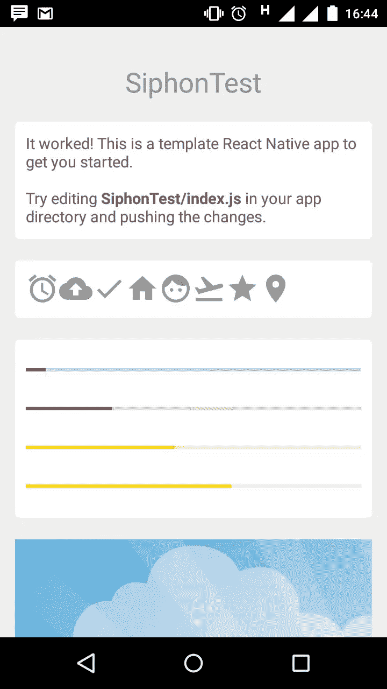
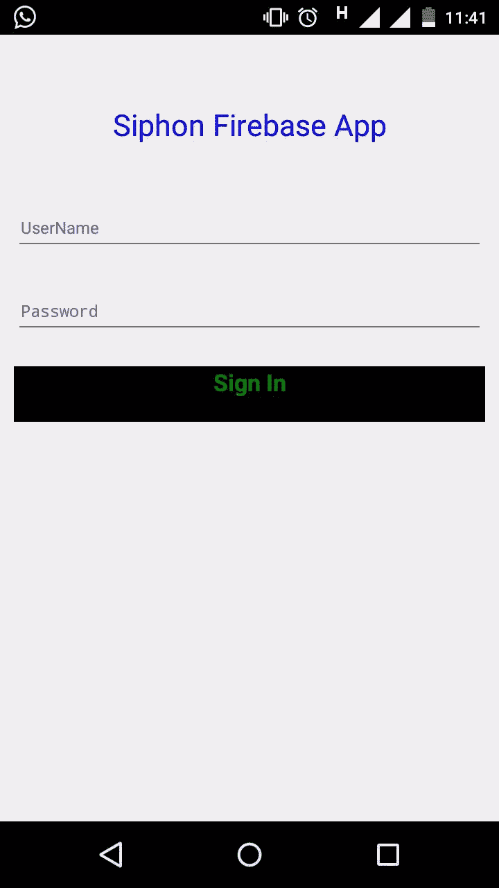

# 使用 React Native 和虹吸管轻松发布应用

> 原文：<https://www.sitepoint.com/easy-app-publishing-with-react-native-and-siphon/>

虹吸是一个沙盒环境，让你无需安装 Xcode 或 Android Studio 就能创建 React 原生应用。虹吸使得向生产应用推送和发布即时更新成为可能。

虹吸管提供了一个命令行工具，使它更容易创建和测试一些命令的应用程序。

在本教程中，我将展示如何使用虹吸管来创建反应原生移动应用程序。我将使用虹吸沙盒环境创建并测试该应用程序。

本教程的源代码可以在 [GitHub](https://github.com/sitepoint-editors/SiphonFirebaseApp) 获得。

## 入门指南

要开始使用虹吸管，下载虹吸管命令行工具。

```
curl https://getsiphon.com/install.sh | sh 
```

通过在 Android 设备上打开*[【https://getsiphon.com/a】](https://getsiphon.com/a)*，或者在 iOS 设备上打开*[【https://getsiphon.com/i】](https://getsiphon.com/i)*，在你的测试手机上安装虹吸沙盒应用。

安装完成后，[注册一个免费账户](https://getsiphon.com/accounts/register)并登录。

## 创建虹吸应用程序界面

使用虹吸命令创建移动应用程序结构。

```
siphon create SiphonFireBaseApp 
```

这将要求您的虹吸帐户凭证，输入它们来创建应用程序结构。从你的手机打开虹吸沙盒来查看`SiphonFirebaseApp`应用。



打开项目目录以查看应用程序结构。里面是一个名为 *index.js* 的文件，其中包含移动应用程序的 react 代码。

删除 *index.js* 中的所有代码，因为您将从头开始创建自己的应用程序界面。

您将创建一个简单的登录屏幕，其中有两个电子邮件地址、密码和登录按钮的输入文本。要创建按钮和输入文本，您需要 react，所以从要求`react-native`开始。

```
var React = require('react-native'); 
```

定义输入文本框和按钮:

```
var {
  AppRegistry,
  View,
  Text,
  TextInput
} = React; 
```

需要`AppRegistry`来注册组件。应用程序中使用了 [react 原生按钮](https://github.com/ide/react-native-button)库，所以使用 npm 安装它。使用 npm 初始化应用程序。

```
npm init 
```

出现提示时输入详细信息，在应用程序文件夹中应该有一个 *package.json* 文件。使用 npm 安装 react native 按钮。

```
npm install react-native-button --save 
```

`--save`选项将 react 本机按钮依赖项保存在 *package.json* 文件中。初始化 *index.js* 中的 react native 按钮。

```
var Button = require('./node_modules/react-native-button'); 
```

在 *index.js* 中定义一个名为`SiphonApp`的 react 类。

```
var SiphonApp = React.createClass({
    // code will be here !!
}); 
```

添加一个 render 函数以在 SiphonApp 中显示视图。

```
var SiphonApp = React.createClass({
    render: function() {
        return(
          <View>
              <Text>
                  Siphon App Home
              </Text>
          </View>
        )
    }
}); 
```

使用`AppRegistry`注册`SiphonApp`类。

```
AppRegistry.registerComponent('App', () => SiphonApp); 
```

使用虹吸命令行工具推动更改。

```
siphon push 
```

刷新手机上虹吸 SDK 中的应用程序，以查看移动应用程序。


给`SiphonApp`渲染函数添加一个标题，显示在应用程序的顶部，替换当前的`Text`元素。

```
<Text
  style={{
    padding: 5,
    margin: 10,
    marginTop: 50,
    fontSize : 25,
    color : 'rgb(0,0,255)',
    textAlign: "center"
  }}>
  Siphon Firebase App
</Text> 
```

向`SiphonApp`渲染函数添加两个文本视图，以显示用户名和密码的文本框。

```
<TextInput
  style={{
    height: 40,
    borderColor: 'gray',
    padding: 5,
    margin: 10,
    marginTop: 20,
    borderWidth: 1}} placeholder="UserName" />

<TextInput
  secureTextEntry={true}
  style={{
   height: 40,
   borderColor: 'gray',
   padding: 5,
   margin: 10,
   borderWidth: 1}} placeholder="Password" /> 
```

添加一个按钮供用户登录到应用程序。

```
<Button
  style={{
   fontSize: 20,
   height: 40,
   padding: 5,
   margin: 10,
   backgroundColor: 'black',
   color: 'green'
  }}
  styleDisabled={{color: 'red'}}>
  Sign In
</Button> 
```

下面是完整的`SiphonApp`类:

```
var SiphonApp = React.createClass({
  render: function() {
    return(
      <View>
        <Text
          style={{
            padding: 5,
            margin: 10,
            marginTop: 50,
            fontSize : 25,
            color : 'rgb(0,0,255)',
            textAlign: "center"
          }}>
          Siphon Firebase App
        </Text>

        <TextInput
          style={{
            height: 40,
            borderColor: 'gray',
            padding: 5,
            margin: 10,
            marginTop: 20,
            borderWidth: 1}}
          placeholder="UserName" />

        <TextInput
          secureTextEntry={true}
          style={{
            height: 40,
            borderColor: 'gray',
            padding: 5,
            margin: 10,
            borderWidth: 1}}
          placeholder="Password" />

        <Button
          style={{
            fontSize: 20,
            height: 40,
            padding: 5,
            margin: 10,
            backgroundColor: 'black',
            color: 'green'}}
          styleDisabled={{color: 'red'}}>
          Sign In
        </Button>
      </View>
    );
  }
}); 
```

保存更改，并通过虹吸命令行工具进行推送。从虹吸 SDK 打开应用程序，查看登录屏幕。



## 绑定事件以触发登录

向用户名和密码文本输入添加一个`onChange`事件，将文本绑定到一个变量:

```
...
onChangeText={(text) => this.setState({username: text})}
...
onChangeText={(text) => this.setState({password: text})}
... 
```

在登录按钮上添加一个`onPress`事件来处理按钮点击。

```
onPress={this._handlePress} 
```

在 SiphonApp react 类中，定义由`onPress`事件触发的`_handlePress`函数:

```
_handlePress:function(event){
  var username=this.state.username;
  var password=this.state.password;
  console.log('Username is ',username);
  console.log('Password is ',password);
}, 
```

下面是修改后的 SiphonApp react 类:

```
var SiphonApp = React.createClass({

  _handlePress:function(event){
    var username=this.state.username;
    var password=this.state.password;
    console.log('Username is ',username);
    console.log('Password is ',password);

  },
  render: function() {
    return(
      <View>
        <Text
          style={{
            padding: 5,
            margin: 10,
            marginTop: 50,
            fontSize : 25,
            color : 'rgb(0,0,255)',
            textAlign: "center"
          }}>
          Siphon Firebase App
        </Text>

        <TextInput
           onChangeText={(text) => this.setState({username: text})}
          style={{
            height: 40,
            borderColor: 'gray',
            padding: 5,
            margin: 10,
            marginTop: 20,
            borderWidth: 1}}
          placeholder="UserName" />

        <TextInput
          onChangeText={(text) => this.setState({password: text})}
          secureTextEntry={true}
          style={{
            height: 40,
            borderColor: 'gray',
            padding: 5,
            margin: 10,
            borderWidth: 1}}
          placeholder="Password" />

        <Button
          onPress={this._handlePress}
          style={{
            fontSize: 20,
            height: 40,
            padding: 5,
            margin: 10,
            backgroundColor: 'black',
            color: 'green'}}
          styleDisabled={{color: 'red'}}>
          Sign In
        </Button>

      </View>
    );
  }
}); 
```

保存更改并推送它们:

```
siphon push 
```

虹吸管提供了一个命令，以监测日志时，应用程序正在运行。从项目目录中键入以下命令来监控日志:

```
siphon logs 
```

输入用户名和密码，然后点按“登录”按钮，在“终端”窗口中查看生成的日志。

## 使用 Firebase 验证用户名&Amp;密码

接下来，您将添加功能来验证针对 Firebase 数据库输入的用户名和密码。要开始使用 [Firebase](https://www.firebase.com) , [创建一个账户](https://www.firebase.com/login/)，并登录 Firebase。点击左侧菜单中的*登录&认证*选项卡，在*电子邮件和密码*选项卡下，点击启用电子邮件和密码登录。

如果您向下滚动页面，您应该会看到一个将用户添加到列表中的选项。点击*添加用户*按钮，输入邮箱地址和密码，点击*添加*。该用户将验证移动应用程序。请注意浏览器中唯一的 Firebase URL，在我的例子中，它是 https://burning-fire-1723.firebaseio.com 的

接下来，在手机 app 内部安装 Firebase 客户端来调用 API。

```
npm install firebase --save 
```

需要 *index.js* 文件中的 firebase 库。

```
var Firebase = require('firebase'); 
```

在`_handlePress`函数中，将代码替换为对 Firebase URL 的引用，例如:

```
var ref = new Firebase("https://burning-fire-1723.firebaseio.com"); 
```

使用 [authWithPassword](https://www.firebase.com/docs/web/guide/login/password.html) API 针对 Firebase 验证用户名和密码。

```
ref.authWithPassword({
    email: username,
    password: password
}, function(error, authData) {
    if (error) {
        console.log("Login Failed!", error);
    } else {
        console.log("Authenticated successfully");
    }
}); 
```

一旦用户名和密码通过验证，上面的代码就会记录消息`Authenticated successfully`或错误消息。保存更改并使用`siphon push`推送。

尝试使用之前添加的电子邮件地址和密码登录应用程序，您应该会在终端日志控制台中看到一条成功消息。

## 接下来呢？如何在生产中使用？

应用程序完成后，您可以使用以下命令为您选择的平台创建一个生产就绪的应用程序:

```
siphon publish --platform ios
siphon publish --platform android 
```

该命令将提示您输入一些关于您的应用程序的信息，然后虹吸管将代表您构建、打包并提交应用程序到商店。

使用虹吸管发布需要付费订阅。有关使用虹吸管发布的更多详细信息，请阅读官方文档。

## 包装它

在本教程中，您了解了[虹吸](https://getsiphon.com)如何在不安装 Android Studio 或 Xcode 的情况下帮助创建 react 原生应用。使用虹吸管的一个优势是能够推送更新到您的应用程序，而不需要每次发布新的应用程序商店版本。

你会使用虹吸管吗？有什么意见和问题，请在下面告诉我。

## 分享这篇文章