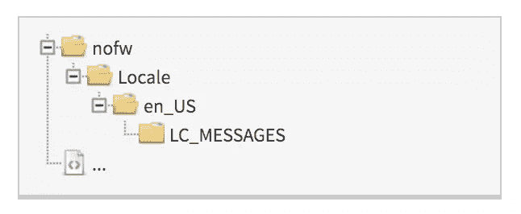
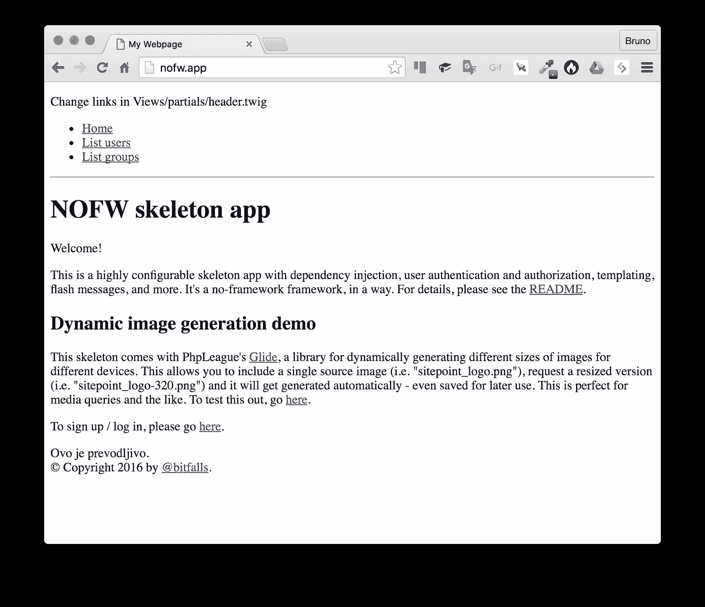

# 使用 Gettext 的简单多语言树枝应用程序

> 原文：<https://www.sitepoint.com/easy-multi-language-twig-apps-with-gettext/>

有许多方法可以将新语言添加到应用程序的 UI 中。尽管有些用户域解决方案，比如 symfony/translation T1，使用起来可能更简单，但是它们比优秀的老本地软件 T2 gettext T3 慢了几个数量级。

在本教程中，我们将修改一个纯英文的应用程序来使用 gettext。通过这个，我们将证明在一个已经存在的应用中实现国际化不仅是可能的，而且相对容易。

这个应用将是我们自己的[nofw](https://github.com/swader/nofw)——一个现成的[框架应用](https://www.sitepoint.com/community/t/is-this-no-framework-skeleton-app-good-enough-for-tutorials/218945?u=swader)。


## 引导和基础知识

我们将一如既往地使用我们值得信赖的[家园改良版](https://www.sitepoint.com/quick-tip-get-homestead-vagrant-vm-running/),作为一个环境——如果你想跟进，请启动它。我们的机器已经安装并激活了 gettext。在本教程的最后，我们将看到如何手动安装它以进行部署。

由于 [nofw](https://github.com/swader/nofw) 使用[树枝](http://twig.sensiolabs.org)，我们将需要 [i18n 扩展](http://twig.sensiolabs.org/doc/extensions/i18n.html)。为了让项目顺利开始，下面是整个过程:

```
git clone https://github.com/swader/nofw
cd nofw
git checkout tags/2.93 -b 2.93
composer require twig/extensions 
```

*注意:上面的命令克隆了 nofw 的一个[旧版本](https://github.com/Swader/nofw/releases/tag/2.93)——一个没有内置国际化特性的版本——以便读者可以跟随教程。*

这将安装 Twig 的扩展，以及项目的所有依赖项。按照[自述文件](https://github.com/Swader/nofw/blob/a903a85b15b9276f18137b49cf37627b1d9faa85/README.md#installation)中的步骤设置 nofw 应用程序的其余部分(数据库端)，然后返回本文。

应用程序现在应该已经启动并运行了。


获取可翻译字符串的语法是`gettext("string")`或它的别名:`_("string")`——也就是说，`_()`是我们调用的函数，`"string"`是我们正在翻译的字符串。如果没有找到`"string"`的翻译，那么返回原始值(被认为是占位符)。占位符通常是站点受众最常用语言的完整字符串，因此如果由于某种原因翻译失败，可读文本仍会呈现。

让我们试着在一个伪造的 PHP 文件上运行这个程序，这个文件不是由 Twig 驱动的，只是为了确保一切正常。我们将使用旧的 [gettext](https://www.sitepoint.com/localizing-php-applications-1/) post 系列中的例子。在项目的根目录中，我们将创建一个名为`i18n.php`的文件，并为其提供内容:

```
<?php

$language = "en_US.UTF-8";
putenv("LANGUAGE=" . $language); 
setlocale(LC_ALL, $language);

$domain = "messages"; // which language file to use
bindtextdomain($domain, "Locale"); 
bind_textdomain_codeset($domain, 'UTF-8');

textdomain($domain);

echo _("HELLO_WORLD"); 
```

在同一个文件夹中，让我们创建一个如下所示的文件夹结构:



描述上面的代码，我们首先将操作系统环境的语言设置为美国英语，然后将其保存为环境变量。PHP 的 [setlocale](http://php.net/manual/en/function.setlocale.php) 函数使用`LC_ALL`常量将*的所有上下文*切换到给定的语言环境——因此 PHP 会尝试将日期、数字格式甚至货币转换成我们给定的语言环境。当然，`LC_ALL`也包括我们自定义翻译的消息。

`$domain`字段告诉 PHP 使用哪种语言文件——该语言文件以其原始的、可编辑的形式被称为`messages.po`,以其编译的、机器可读的形式被称为`messages.mo`。 [bindtextdomain](http://php.net/manual/en/function.bindtextdomain.php) 只是设置语言文件的路径，我们知道这个文件在`Locale`文件夹里面，`bind_textdomain_codeset`会设置语言字符集。UTF-8 在这里是一个相当普遍的安全赌注。

最后， [textdomain](http://php.net/manual/en/function.textdomain.php) 设置要使用的活动域。

在命令行中运行这个测试脚本将回显占位符:`HELLO_WORLD`。显然，它缺少实际的语言文件。是时候创造它了。

### 提取，血统

Gettext 附带了一个从文件中提取占位符字符串的便利工具。在项目的根中，我们将执行:

```
xgettext --from-code=UTF-8 -o Locale/messages.pot public/i18n.php 
```

上面，`xgettext`将使用 UTF-8 编码将从`public/i18n.php`中收获的字符串输出到给定的文件中。检查产生的`messages.pot`文件现在给出:

```
# SOME DESCRIPTIVE TITLE.
# Copyright (C) YEAR THE PACKAGE'S COPYRIGHT HOLDER
# This file is distributed under the same license as the PACKAGE package.
# FIRST AUTHOR <EMAIL@ADDRESS>, YEAR.
#
#, fuzzy
msgid ""
msgstr ""
"Project-Id-Version: PACKAGE VERSION\n"
"Report-Msgid-Bugs-To: \n"
"POT-Creation-Date: 2016-04-10 10:44+0000\n"
"PO-Revision-Date: YEAR-MO-DA HO:MI+ZONE\n"
"Last-Translator: FULL NAME <EMAIL@ADDRESS>\n"
"Language-Team: LANGUAGE <LL@li.org>\n"
"Language: \n"
"MIME-Version: 1.0\n"
"Content-Type: text/plain; charset=CHARSET\n"
"Content-Transfer-Encoding: 8bit\n"

#: public/i18n.php:13
msgid "HELLO_WORLD"
msgstr "" 
```

`.pot`代表`portable object template`。这些模板文件用于构建其他语言文件。如果我们以后决定在我们的应用程序中添加日语，那么这个`.pot`文件将被用来生成一个`Locale/ja_JP/LC_MESSAGES/messages.po`，而这个`Locale/ja_JP/LC_MESSAGES/messages.po`将被用来生成相应的`messages.mo`文件。现在让我们使用这种方法来生成`en_US`消息文件:

```
msginit --locale=en_US --output-file=Locale/en_US/LC_MESSAGES/messages.po --input=Locale/messages.pot 
```

对于我们想要添加到应用程序中的每一种新语言，都需要重复这个过程。

`.po`文件与之前的`.pot`文件非常相似，只是它包含了我们可以编辑的实际翻译字符串:

```
# English translations for PACKAGE package.
# Copyright (C) 2016 THE PACKAGE'S COPYRIGHT HOLDER
# This file is distributed under the same license as the PACKAGE package.
# vagrant <vagrant@homestead>, 2016.
#
msgid ""
msgstr ""
"Project-Id-Version: PACKAGE VERSION\n"
"Report-Msgid-Bugs-To: \n"
"POT-Creation-Date: 2016-04-10 10:44+0000\n"
"PO-Revision-Date: 2016-04-10 10:58+0000\n"
"Last-Translator: vagrant <vagrant@homestead>\n"
"Language-Team: English\n"
"Language: en_US\n"
"MIME-Version: 1.0\n"
"Content-Type: text/plain; charset=ASCII\n"
"Content-Transfer-Encoding: 8bit\n"
"Plural-Forms: nplurals=2; plural=(n != 1);\n"

#: public/i18n.php:13
msgid "HELLO_WORLD"
msgstr "HELLO_WORLD" 
```

用`Howdy`替换`HELLO_WORLD`的`msgstr`值后，我们要把`.po`文件编译成 Gettext 可以读取的`.mo`文件:

```
msgfmt -c -o Locale/en_US/LC_MESSAGES/messages.mo Locale/en_US/LC_MESSAGES/messages.po 
```

### 添加新语言

为了确保工作正常，让我们添加一种新的语言——HR _ HR(克罗地亚语)。

1.  首先，我们通过以下方式将新的语言环境安装到操作系统上:

    ```
    sudo locale-gen hr_HR hr_HR.UTF-8
    sudo update-locale
    sudo dpkg-reconfigure locales 
    ```

2.  然后我们从`.pot`文件生成新的`.po`文件:

    ```
    mkdir -p Locale/hr_HR/LC_MESSAGES
    msginit --locale=hr_HR --output-file=Locale/hr_HR/LC_MESSAGES/messages.po --input=Locale/messages.pot 
    ```

3.  接下来，我们将`HELLO_WORLD`值改为`Zdravo`，然后生成`.mo`文件:

    ```
    msgfmt -c -o Locale/hr_HR/LC_MESSAGES/messages.mo Locale/hr_HR/LC_MESSAGES/messages.po 
    ```

4.  最后，我们将 PHP 文件中的区域设置更改为`hr_HR.UTF-8`并进行测试。

一切都应该很好。

注意:可能需要重启网络服务器和/或 PHP-FPM 来清除 gettext 缓存。

## 嫩枝

现在我们知道 gettext 工作正常，我们能够随心所欲地添加新语言，让我们看看它如何与 Twig 一起工作。首先，让我们将以下内容添加到`app/config/config_web.php`的顶部:

```
$language = "hr_HR.UTF-8";
putenv("LANGUAGE=" . $language);
setlocale(LC_ALL, $language);

$domain = "messages"; // which language file to use
bindtextdomain($domain, __DIR__."/../../Locale");
bind_textdomain_codeset($domain, 'UTF-8');

textdomain($domain); 
```

为了让 Twig 能够处理可翻译的字符串，它需要我们在自举部分安装的 i18n 扩展。然后，在模板中，我们使用`trans`块:

```

    Hello {{ name }}!
 
```

当然，gettext 不知道`{{name}}`应该是什么意思，所以 Twig 的扩展自动将它编译成 gettext 友好的`Hello %name%!`。一个警告是，xgettext 不具备提取细枝字符串的能力，所以我们需要一个符合[文档](http://twig.sensiolabs.org/doc/extensions/i18n.html#extracting-template-strings)的替代品。

我们将把我们的视图模板编译到系统的临时文件夹中，然后 xgettext 那些，就像普通的 PHP 文件一样！

首先，让我们向其中一个文件添加一条可翻译的消息。例如，在进入`Standard/Views/home.twig`的某个地方，我们可以放入:

```
 
        This is translatable
     
```

然后，在`app/bin`中，我们将创建一个新文件:`twigcache.php`:

```
<?php

require __DIR__.'/../../vendor/autoload.php';
$shared = require __DIR__.'/../config/shared/root.php';

$tplDir = dirname(__FILE__) . '/templates';
$tmpDir = '/tmp/cache/';
$loader = new Twig_Loader_Filesystem($shared['site']['viewsFolders']);

// force auto-reload to always have the latest version of the template
$twig = new Twig_Environment(
    $loader, [
    'cache' => $tmpDir,
    'auto_reload' => true,
]
);
$twig->addExtension(new Twig_Extensions_Extension_I18n());
// configure Twig the way you want

// iterate over all your templates
foreach ($shared['site']['viewsFolders'] as $tplDir) {
    foreach (new RecursiveIteratorIterator(
                 new RecursiveDirectoryIterator($tplDir),
                 RecursiveIteratorIterator::LEAVES_ONLY
             ) as $file) {
        // force compilation
        if ($file->isFile()) {
            $twig->loadTemplate(str_replace($tplDir . '/', '', $file));
        }
    }
} 
```

该文件引入了定义视图文件夹的通用`root.php`配置文件，因此我们只需要在一个地方更新它们。使用`php app/bin/twigcache.php`执行脚本现在会生成一个包含 PHP 缓存文件的目录树:

```
/tmp/cache
├── 1a
│   └── 1ad38dfd106734cda72279c3bbd83dd4c64d93ff9c713afb1e74904144018347.php
├── 1c
│   └── 1ca70331199383cea2ce308ab09447cebd7e5e81f2a7f5caa319d577f3a66682.php
...
├── df
│   └── df75e14ad2cb55315ab205872c8b8590ffde333912ec5c89e44c365479bfe457.php
└── f4
    └── f444ff725954cd5a9ec29ceb56a9cbf7eda8a273cea96c542c35a271e0f57c7e.php 
```

我们现在可以在这个集合上释放 xgettext 了:

```
xgettext -o Locale/messages.pot --from-code=UTF-8 -n --omit-header /tmp/cache/*/*.ph 
```

检查`Locale/message.pot`现在揭示了全新的内容:

```
#: /tmp/cache/d0/d006e63c5a4c4e6a700d9273d4523dd0cf419105fa4b00cf6b89918c67df4b2b.php:56
msgid "This is translatable"
msgstr "" 
```

和以前一样，我们现在可以为两种预安装的语言创建`.po`文件。

```
msgmerge -U Locale/en_US/LC_MESSAGES/messages.po Locale/messages.pot
msgmerge -U Locale/hr_HR/LC_MESSAGES/messages.po Locale/messages.pot 
```

`msgmerge`命令将来自`messages.pot`的更改合并到已定义的`messages.po`文件中。为了方便起见，我们在这里使用`msgmerge`而不是`msginit`，但是我们也可以使用`msginit`来开始一个新的语言文件。不过，Merge 还有一个额外的好处:从上面的例子中可以看出，`xgettext`不再在`i18n.php`中寻找可翻译的字符串，新更新的`.po`文件实际上已经将以前使用的字符串-值对注释掉了:

```
#: /tmp/cache/d0/d006e63c5a4c4e6a700d9273d4523dd0cf419105fa4b00cf6b89918c67df4b2b.php:56
msgid "This is translatable"
msgstr "Yes, this is totally translatable"

#~ msgid "HELLO_WORLD"
#~ msgstr "Howdy" 
```

这使得跟踪被否决的翻译变得容易，而不会实际上失去做出它们所付出的努力。

假设我们更改了一些翻译值，现在让我们编译到`.mo`并测试:

```
msgfmt -c -o Locale/hr_HR/LC_MESSAGES/messages.mo Locale/hr_HR/LC_MESSAGES/messages.po
msgfmt -c -o Locale/en_US/LC_MESSAGES/messages.mo Locale/en_US/LC_MESSAGES/messages.po 
```



注意底部我们翻译的字符串——一切都像预期的那样工作！

当然，我们粘贴到`config_web.php`顶部的配置可能需要做一些工作——比如通过路由等检测所需的语言，但是为了简洁起见，这样做很好。

现在剩下的就是搜寻所有视图中的所有字符串，并将它们转换成``块！

## 额外奖励:剧本！

虽然上面的过程并不复杂，但更简单的是不必为每一件小事都键入那些长命令。随着语言越来越多，事情变得越来越复杂和混乱，并且在输入 shell 命令时更容易出现输入错误。这就是为什么我们可以把一些快捷的 bash 脚本放在一起帮助我们。

*注意:如果你没有使用 nofw，也不打算使用，请随意跳过这一部分和/或只从中收获你认为有用的东西。同样，请注意，所有这些脚本都应该从项目的根文件夹中运行。*

* * *

我们将把所有这些脚本放到`app/bin/i18n/`中，并使它们在命令行上可执行:

```
touch app/bin/i18n/{addlang.sh,update-pot.sh,update-mo.sh,config.sh}
chmod +x app/bin/i18n/*.sh 
```

### 配置

```
LOCALE_FOLDER="Locale"
REGULAR_USER="forge"

[[ -f app/bin/i18n/config_local.sh ]] && source app/bin/i18n/config_local.sh 
```

该脚本将包含在其他脚本中，这允许用户为区域设置更改所需的文件夹。同样，它包含非 sudo 用户的名称。由于在一个 bash 脚本中包含许多 sudo 命令通常不是一个好主意，而且我们肯定需要使用 root 权限来执行其中的许多命令，所以我们将选择使用`sudo`来执行整个脚本，然后将那些不需要`sudo`的命令的权限授予普通用户。用户默认为“forge ”,因为这是 [Laravel Forge 设置的用户](https://www.sitepoint.com/setting-up-php-7-servers-with-laravel-forge-and-digitalocean/)。

这个脚本还包括另一个配置脚本*，如果它存在*(因为它在`.gitignore`中，不会存在于实时服务器上)，在这个脚本中用户名可以被覆盖。这对地方发展是有用的。例如，当使用[家园改进版](https://www.sitepoint.com/quick-tip-get-homestead-vagrant-vm-running/)时，一切都将从`vagrant`用户的角度运行，而`forge`用户不存在。

### 新语言/刷新语言脚本

```
#!/usr/bin/env bash

# addlang.sh

source app/bin/i18n/config.sh

if [[ $EUID -ne 0 ]]; then
   echo "This script must be run as root" 1>&2
   exit 1
fi

if [ -z "$1" ]; then
for folder in $(find ${LOCALE_FOLDER} -maxdepth 1 -type d | awk -F/ '{print $NF}')
do
    if [ "${folder}" != ${LOCALE_FOLDER} ]; then
        echo "Executing locale-gen ${folder} ${folder}.UTF-8"
        locale-gen ${folder} ${folder}.UTF-8
    fi
done
echo "Executing updates..."
update-locale
dpkg-reconfigure locales
fi

if [ -n "$1" ]; then
echo "Executing locale-gen $1 $1.UTF-8"
locale-gen $1 $1.UTF-8

echo "Executing updates..."
update-locale
dpkg-reconfigure locales

echo "Creating folder: ${LOCALE_FOLDER}/$1/LC_MESSAGES"
sudo -u ${REGULAR_USER} mkdir -p ${LOCALE_FOLDER}/$1/LC_MESSAGES
fi 
```

这将立即安装作为第一个参数传入的任何语言环境，如下所示:

```
sudo app/bin/i18n/addlang.sh ja_JP 
```

它还会在`Locale`文件夹中创建适当的语言文件夹。

如果没有传入参数，那么这个脚本将通过遍历`Locale`文件夹来寻找*期望的语言环境*，并根据子文件夹名称自动安装每个语言环境。

也就是说，如果有文件夹`Locale/en_US`和`Locale/hr_HR`，就好像我们运行了`sudo app/bin/i18n/addlang.sh en_US`和`sudo app/bin/i18n/addlang.sh hr_HR`。这有助于在部署过程中自动安装语言环境。

该脚本需要以 root 用户身份运行，因为与区域设置相关的命令需要提升权限。

### 刷新 pot 脚本

```
#!/usr/bin/env bash

# update-potpo.sh

source app/bin/i18n/config.sh

echo "Regenerating cache"
php app/bin/twigcache.php

echo "Running xgettext on the cached files"
xgettext -o ${LOCALE_FOLDER}/messages.pot --from-code=UTF-8 -n --omit-header /tmp/cache/*/*.php

for folder in $(find ${LOCALE_FOLDER} -maxdepth 1 -type d | awk -F/ '{print $NF}')
do
    if [ "${folder}" != ${LOCALE_FOLDER} ]; then
        if [[ -f ${LOCALE_FOLDER}/${folder}/LC_MESSAGES/messages.po ]]; then
            echo "Merging for ${folder}"
            msgmerge -U Locale/${folder}/LC_MESSAGES/messages.po ${LOCALE_FOLDER}/messages.pot
        else
            echo "Initializing for ${folder}"
            msginit --locale=${folder} --output-file=${LOCALE_FOLDER}/${folder}/LC_MESSAGES/messages.po --input=${LOCALE_FOLDER}/messages.pot
        fi
    fi
done 
```

这将重新生成视图缓存，释放其上的`xgettext`，并将结果与当前的`.pot`文件合并，如果有的话。然后，它使用刷新的`.pot`文件来更新`.po`文件。注意，如果语言还没有初始化，它使用`msginit`，否则使用`msgmerge`。

### 重新编译脚本

```
#!/usr/bin/env bash

# update-mo.sh

source app/bin/i18n/config.sh

for folder in $(find ${LOCALE_FOLDER} -maxdepth 1 -type d | awk -F/ '{print $NF}')
do
    if [ "${folder}" != ${LOCALE_FOLDER} ]; then
        echo "Compiling .mo for ${folder}"
        msgfmt -c -o Locale/${folder}/LC_MESSAGES/messages.mo ${LOCALE_FOLDER}/${folder}/LC_MESSAGES/messages.po
    fi
done 
```

重新编译脚本应该在对`.po`文件进行编辑后运行。它使编辑随时可用，并允许翻译出现在网站上。

## 部署

这些特定语言升级的部署将取决于应用于应用程序的部署方法。我们可以使用[部署者](https://www.sitepoint.com/deploying-php-applications-with-deployer/)，我们可以使用[伪造](https://www.sitepoint.com/setting-up-php-7-servers-with-laravel-forge-and-digitalocean/)，或者其他完全不同的东西。无论如何，在我们试用上面的脚本之前，我们需要确保:

1.  gettext 已安装并激活
2.  已经在操作系统上生成了必要的语言环境

在 Ubuntu 上，通过确保在部署过程结束时运行以下命令，可以轻松跳过这一步:

```
sudo apt-get install gettext
sudo app/bin/i18n/addlang.sh 
```

其余的都是自动的，因为`.pot`、`.po`和`.mo`文件应该和应用程序的源代码一起提交。

*注意，如果你使用的不是 Ubuntu* ,你需要修改上面的安装命令和 shell 脚本

## 结论

在本教程中，我们研究了如何向 Twig 支持的现有应用程序添加国际化特性。我们在一个模拟的无 Twig 文件上演示了 gettext 的使用，确保一切正常，然后一步一步地与 Twig 集成。最后，我们编写了一些快捷脚本，在共享项目或将其部署到生产环境中时，这些脚本会有很大的帮助。

你用 gettext 吗？还是你的应用程序采用了不同的方法？请在评论中告诉我们！

## 分享这篇文章