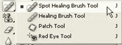
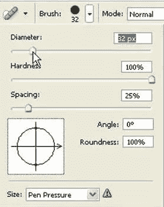

# 使用 Photoshop 中的斑点修复笔刷轻松修饰

> 原文：<https://www.sitepoint.com/easy-retouching-with-the-spot-healing-brush-in-photoshop/>

斑点修复笔刷工具(J)最早出现在 Photoshop CS2 中。虽然这是一种快速轻松地去除照片上的瑕疵和其他瑕疵的好方法，但它往往会被 Photoshop 用户忽略或遗忘。它的工作原理是使用图像或图案中的采样像素进行绘画，并将采样像素的纹理、光照和透明度与“修复”的像素进行匹配。与克隆工具不同，污点修复笔刷不需要您首先指定样本污点。它会自动从周围的*开始对修图区域进行采样。每次我使用这个工具时，它仍然让我感到惊讶，因为它使用起来如此简单，如此快速，效果非常好。*

斑点修复笔刷非常适合修饰肖像中的瑕疵(或青春痘),但在这个例子中，我用它来去除蝴蝶翅膀上的斑点。你可以在任何需要去除小瑕疵的地方使用它。

1.我用的是一只翅膀上有 4 个橙色斑点的黄色蝴蝶的图片。

1.在工具箱中，选择斑点修复笔刷工具()。

NaN.  On the tool options bar, click the Brush pop-up menu and make the brush slightly larger than the spot you want to remove. In this case I set the brush to be about 32 pixels and set the hardness to 25%.

    

NaN.  Using the Spot Healing Brush, click just once over the spot you want to remove.

    

当你用鼠标按下时，画笔的形状会呈现黑色或深灰色。然而，一旦你释放鼠标按钮，该区域将被“治愈”,斑点将消失。

修复画笔的神奇之处在于它保留了纹理和颜色，但去除了污点。

要移除蝴蝶上的所有斑点，只需调整每个斑点的笔刷大小，使其仅比*稍大，然后单击一次。如果你让笔刷在每个点都保持相同的大小，你不会得到好的效果。这是一种比使用克隆工具更快的处理瑕疵的方法。*

 *
哒哒！* 

## *分享这篇文章*