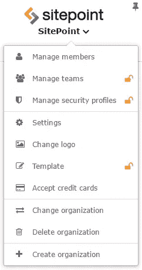
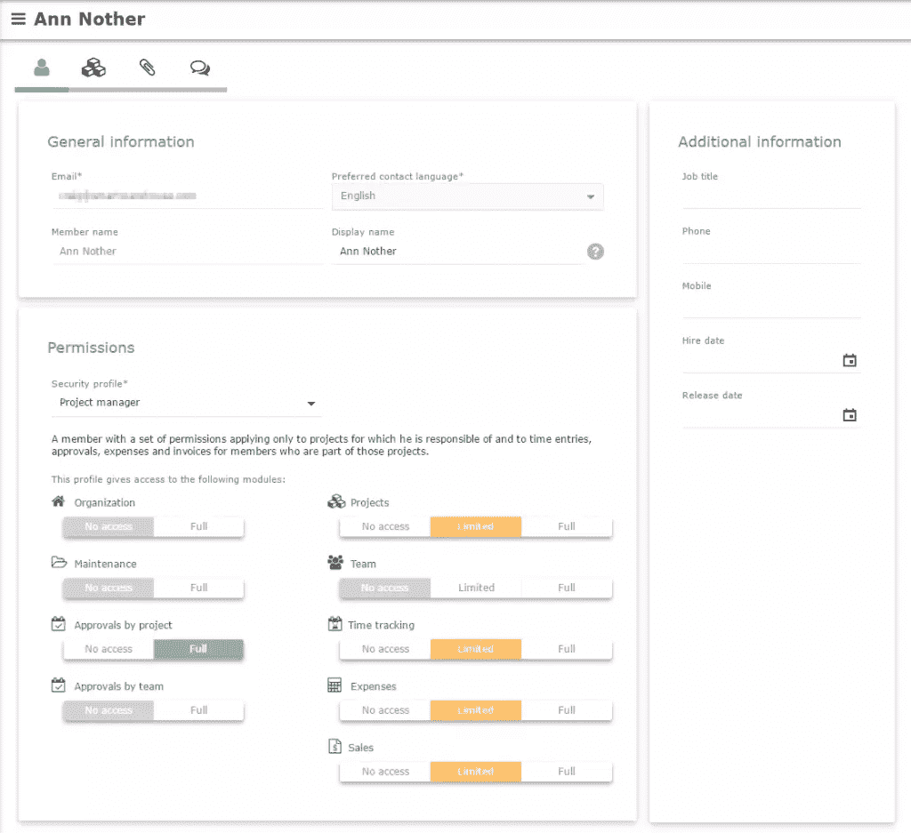
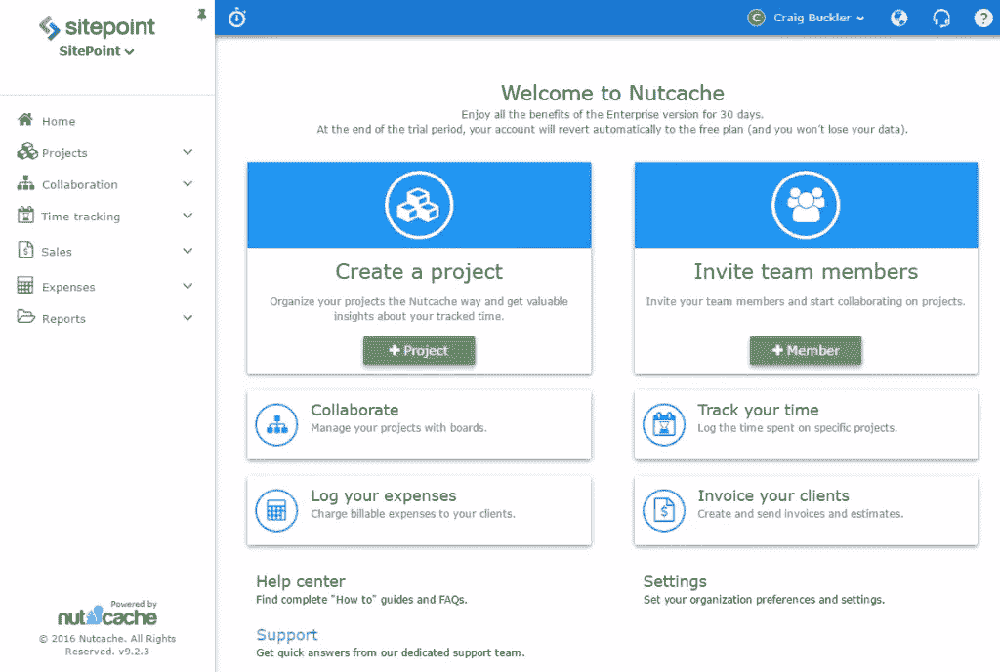
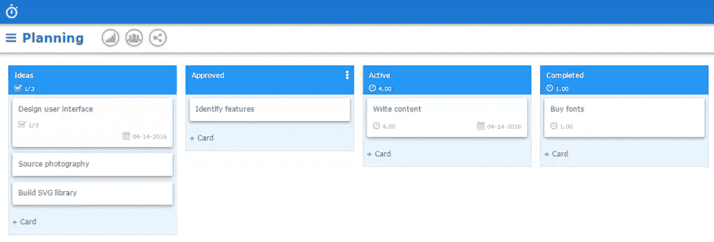
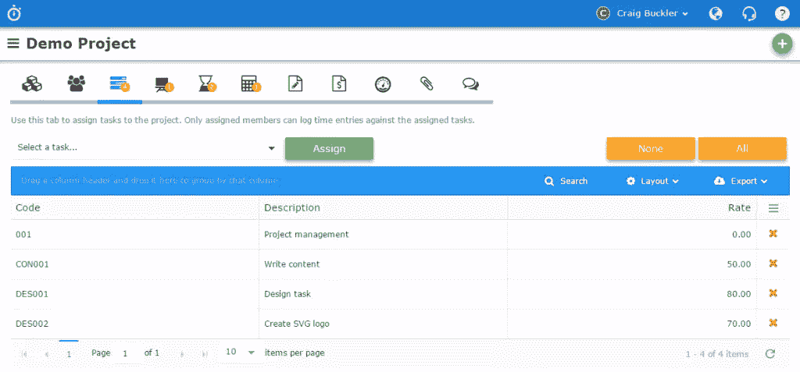
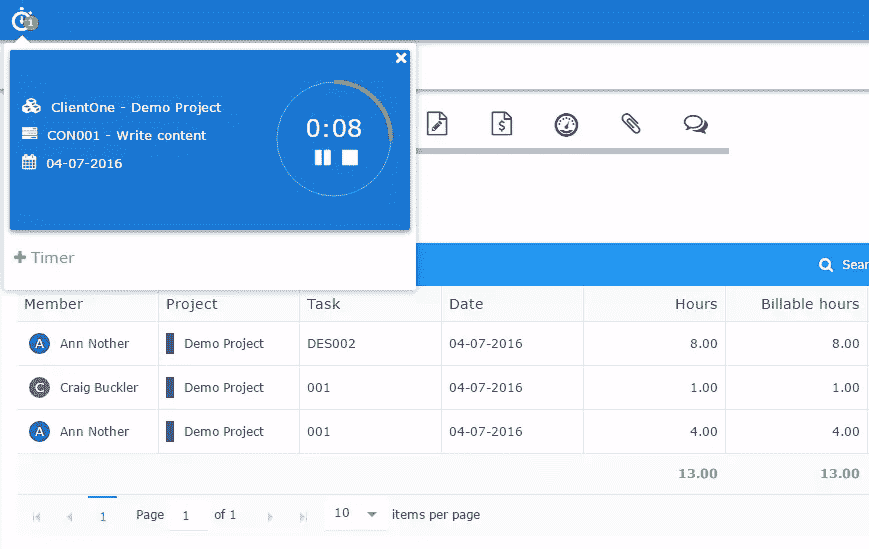
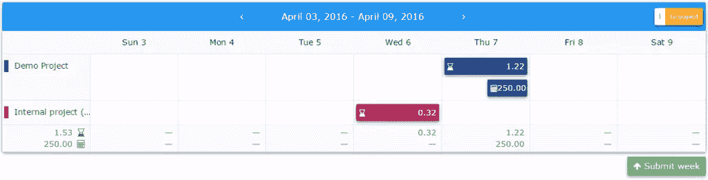
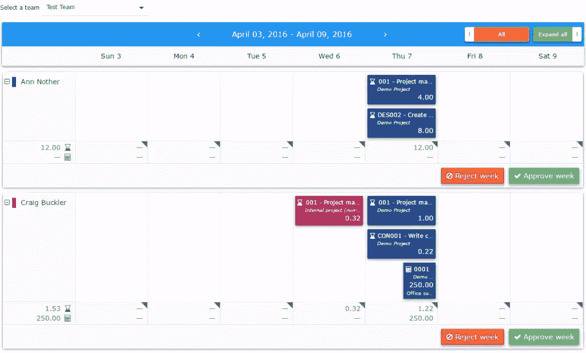
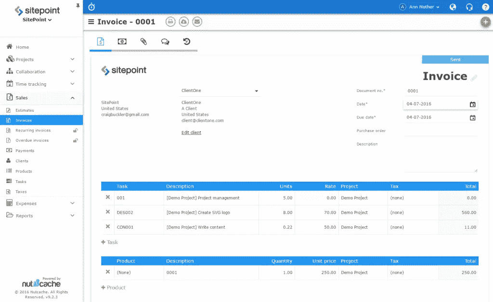
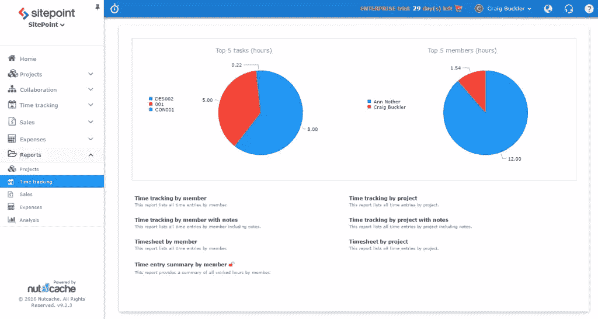

# 使用 Nutcache 轻松管理团队和项目

> 原文：<https://www.sitepoint.com/easy-team-and-project-management-with-nutcache/>

*本文由[坚果缓存](http://www.nutcache.com/?utm_source=Sitepoint)赞助。感谢您对使 SitePoint 成为可能的赞助商的支持。*

从一个单独的开发人员或小团队扩展到一个大型项目是令人生畏的。项目本身可以分成更容易管理的部分，但是处理业务任务和流程变得越来越复杂。协作、评估、任务安排、SCRUM 管理、文件收集、时间跟踪、费用、批准、发票和报告影响着每个人，消耗着项目开发时间。当团队成员:

*   拥有不同水平的项目管理经验
*   物理上分离和/或在不同的时区或语言中工作
*   随着时间的推移，员工和自由职业者被引入到项目中。

每个经理都有自己喜欢的管理工具，比如 email、Google Drive、Zoho、Keep、Trello、Slack、Basecamp、PivotalTracker、Toggl、Freshbooks、Intuit 等等。所有这些选项都有好处，但是:

*   复杂性增加了。每个人都必须学会如何使用每个系统和管理多个登录。
*   团队成员会有自己的工作流程选择，这会造成混乱。有些人可能通过电子邮件发送任务。其他人可能更喜欢特雷罗。还有人在你桌上拍一张便利贴！
*   在应用程序之间传输数据可能很困难，例如从任务调度器到时间跟踪器再到发票系统。
*   经理们可能很难在不同的系统中跟踪进度和成本。
*   虽然单个应用程序可能并不昂贵，但每月的总成本可能会急剧上升。

幸运的是， [Nutcache](http://www.nutcache.com/?utm_source=Sitepoint) 用一个单一的、集中的在线工具解决了这些问题，帮助团队更聪明、更快速地工作。可以替换多个应用程序；所有项目成员都有一个接口和参考点。

## 注册 Nutcache

点击[免费开始！](https://apps.nutcache.com/en-US/Account/Register/?utm_source=Sitepoint)任何 Nutcache 页面上的按钮，可免费试用企业版 30 天，包括所有功能，项目和团队成员不限。

## 配置您的组织

登录后，单击组织菜单:

您可以更改设置，如徽标地址、日期、时间格式、货币默认值和发票模板。

选择**管理成员**邀请您组织中的其他人:

**安全配置文件**下拉菜单突出显示个人可以访问的功能。例如，销售人员可能只需要客户详细信息和销售报告，而不需要任务和时间管理工具。

如果需要，你可以**管理团队**。一个团队成员可以处理几个不同的项目，他们的时间表和费用由团队或项目负责人批准。

## 开始一个新项目

从**主页**或**项目**屏幕，点击 **+项目**开始一个新项目:

输入项目名称、所有者、客户、联系人和预计时间等详细信息。 **Members** 选项卡允许您为项目分配一个团队或将其标记为“开放”,以便您组织的所有成员都可以访问它。

## 项目协作

从项目或**协作**菜单可以访问**组织委员会**。这些可以让你以一种非常灵活的方式组织你的项目，与其他团队成员交流。你甚至可以使用看板或 SCRUM 方法，而不是非结构化的电子邮件。

卡片可以有描述、清单、任务、截止日期、工作时间、费用、文件附件和对话或评论。

任何人做出更改时，公告板都会自动更新。它们也可以被公开，这样即使客户没有 Nutcache 帐户，他们也可以获得一个 URL 来查看进度。

## 定义任务和跟踪时间

可以从项目的**任务**选项卡为单个或所有项目创建任务:

然后可以从项目的**时间条目**选项卡中记录任务的时间。您可以手动输入任务的小时和分钟，也可以在开始工作时启动新的计时器。可以定义、启动、暂停和停止任意数量的定时器，它们在整个系统中保持可见:

记录的时间可以按项目、团队成员显示，或者作为**时间跟踪**菜单中的单个项目显示:

## 时间表和费用

团队成员可以从**时间跟踪**菜单中的**时间表**选项提交他们的时间表和费用以供审批。在大多数情况下，这可以通过定位特定时间段并点击**提交周**来实现:

可以通过**时间跟踪**菜单以团队或个人项目为基础批准提交:

## 货品计价

Nutcache 记录了所有批准的时间、每小时的成本和费用。开具发票只是选择一个适当的日期范围，以及您是否希望任务被逐项列出或分组:

发票可以在通过电子邮件直接发送给客户之前进行定制，或者导出到 Excel 或 PDF 进行进一步修改。您还可以:

*   设置经常性发票，可能是每月的托管或支持费用
*   查看过期发票
*   允许客户通过信用卡、PayPal、Stripe 等支付
*   查看以前付款的摘要。

## 报告

我告诉你一个秘密:如果项目经理能够用漂亮的图表证明原因，他们通常会原谅延迟交付。Nutcache 提供了大量有吸引力的数据可视化和报告，包括:

*   项目和任务分析
*   项目或团队成员的时间跟踪
*   费用和支付
*   销售发票、付款、估算和税收汇总
*   按客户、任务或产品划分的收入
*   财务损益账户

## 更多信息

Nutcache 提供了一系列惊人的特性——太多了，无法在这里描述。欲了解更多信息，请参考[管理项目:坚果缓存之旅](http://www.nutcache.com/managing-projects/?utm_source=Sitepoint)和列出所有设施的[价格比较页面](http://www.nutcache.com/compare-plans/?utm_source=Sitepoint)。

## Nutcache 定价

顶级的 [Nutcache 企业计划](http://www.nutcache.com/compare-plans/?utm_source=Sitepoint)包括所有功能、无限项目、无限成员、100GB 文件存储和保证一天的电子邮件响应时间。成本:*每个用户每月仅 12 美元*。这极具竞争力，而且比购买单独的项目管理、规划、沟通、报告和会计工具要便宜得多。

你的前 30 天是免费的，所以你不会有任何损失。[立即注册一个 Nutcache 帐户……](https://apps.nutcache.com/en-US/Account/Register/?utm_source=Sitepoint)

## 分享这篇文章