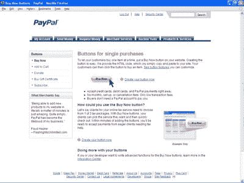
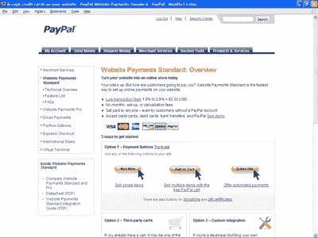
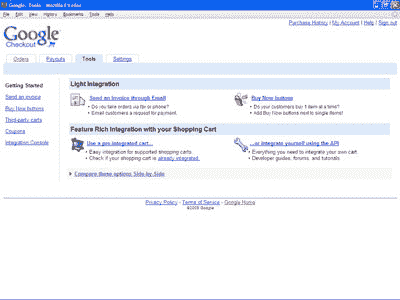
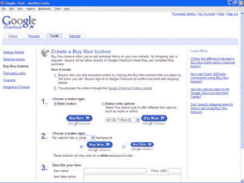
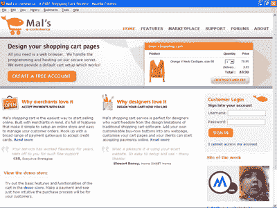
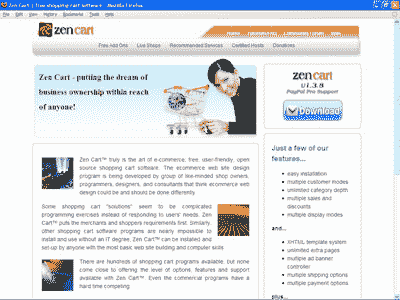
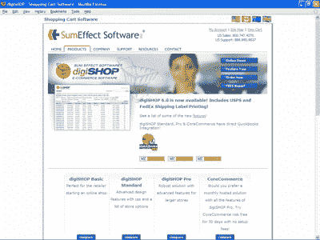
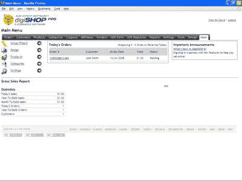
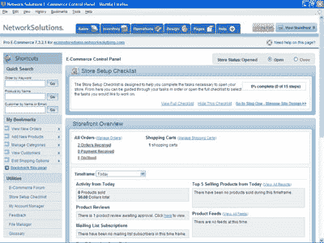
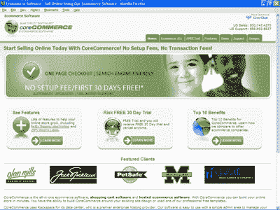

# 如何挑选购物车:7 辆购物车回顾

> 原文：<https://www.sitepoint.com/ecommerce-seven-carts-reviewed/>

网上销售是拓展现有业务或开创新业务的好方法。像[易贝](http://www.ebay.com)和 [Etsy](http://www.etsy.com) 这样的网站让你在他们的网站内销售并使用他们的购物车。你从他们的流量和营销中获益，但他们控制着网站的外观和功能。

另一种选择是通过你自己的网站销售。为此，您需要

*   购物车
*   支付处理网关，以及
*   履行订单的过程。

在本文中，我们将主要关注购物车，但是我们也将触及如何处理付款和其他与购物车相关的问题。我们不会讨论如何找到产品并交付给客户——我假设您已经讨论了这一部分。

为了这篇文章，我测试了七个购物车:三个简单的网站插件( **PayPal** 、 **Google Checkout** 和 **Mal 的电子商务**；两个常规购物车( **Zen Cart** 和 **digiSHOP** ，以及两个第三方托管购物车(**Network Solutions Ecommerce**和 **CoreCommerce** )。尽管有所有这些选择，在一天结束时，你可能需要一个定制的购物车，所以我也将涵盖一些方面来考虑建立自己的电子商务系统。

这里提到的购物车并不是唯一可用的购物车——例如，[雅虎小企业](http://smallbusiness.yahoo.com/ecommerce/)和 [Squirrelcart](http://squirrelcart.com/) (里面有我最喜欢的吉祥物)和 [X-Cart](http://www.x-cart.com/) 是你可以找到的更多选项。然而，我用来评估这些购物车的方法可以用来评估任何购物车——最终，它是你的在线业务。

##### 从哪里开始？

当客户让我帮他们找购物车时，我通常会从不同购物车供应商的功能列表开始。我将所有的特性复制到电子表格的一列中，并为我的客户添加一列来分配优先级: **1 =必须有**， **2 =应该有**，或者 **3 =最好有**。然后，我们按优先级对特性进行排序，并为我们考虑的每个购物车添加列。这种面向功能的流程帮助我的客户专注于他们需要的东西。使用功能列表有助于确定他们是需要基本的购物车还是更复杂的购物车。

当我们浏览特性列表时，我和他们一起工作，确切地了解他们想要完成什么。在线业务是他们的全部业务，还是只是其中的一部分？购物车是否需要与他们的会计系统集成，例如 QuickBooks？他们的产品是什么？产品有多复杂？例如，他们会提供数量折扣吗？

还有其他重要的购物车功能需要测试。客户可以在线查看他们的订单状态吗？您能轻松编辑所有用于确认销售、产品发货时通知客户等的出站电子邮件吗？如果你的在线业务有几个员工，你能限制报告给某些用户吗？给产品添加选项有多难？

另一个很好的问题是，信用卡数据是如何存储在数据库中的？信用卡处理公司对存储卡数据有严格的规定。我的建议是:避免存储任何重要的客户数据。让支付处理服务来处理这种风险。

一旦你评估了所有你需要的特性。并将它们分为“必须拥有”、“应该拥有”和“最好拥有”三个特性，下一步是评估实际的购物车，以确定什么最适合您的业务。

##### 简单的手推车

如果你只有几个产品要卖，或者你想试水，那么你有两个在线销售的选择。一种是使用现有的网站，如 Half.com 易贝，Etsy，或类似的网站。例如，我妻子卖掉了我们所有关于 Half.com 的备用书籍，因为为任何更复杂的东西费心是没有意义的。

当你只有少量商品出售时，你的第二个选择是使用其他在线服务的支付处理功能，例如 PayPal、Google Checkout 或 Mal 的电子商务。如果你有一个已经存在的网站，这些“附加”购物车会特别好用。他们让你使用他们的网站来配置你的产品，他们生成支付按钮代码，你可以复制并粘贴到你的网页上。该代码在您的网页上创建一个按钮，当单击该按钮时，网站访问者将通过他们的服务付费。

让我们看看三种流行的附加解决方案:

***支付宝***

[**http://www.paypal.com/**](http://www.paypal.com/)

 **

PayPal 是一家在线支付处理器，目前由易贝所有，处理信用卡以及会员在其私人网络中进行的交易。大多数人都知道私人网络支付，但没有意识到贝宝也通过主要的信用卡和电子支票处理支付。

要将 PayPal 用作购物车，您需要向他们注册一个帐户。这包括建立一个 PayPal 帐户，然后将一个银行帐户与您的 PayPal 帐户关联。为了验证您的银行账户，PayPal 会向您的账户中存入少量金额，比如 11 美分，然后您登录并告诉他们他们存入的金额。

要在您的 PayPal 帐户中创建产品，请在您的主帐户页面上选择产品和服务选项卡，然后在产品和服务页面上选择网站支付标准链接。这会将您带到“立即购买”按钮页面。选择您想要的支付按钮类型，然后按照指示使用他们的按钮工厂。在这个过程的最后，你会看到一段代码，你可以把它粘贴到你的网站上。为你销售的产品创建一个按钮或电子邮件链接是一个相当简单的三页流程。

PayPal 目前对每笔交易收取交易成本的 1.9%至 2.9%，外加 30 美分(美元)。没有月费和安装费用。他们使用“立即购买”按钮提供所有售出商品的详细账目。

对 PayPal 的支持是通过他们的在线帮助页面、电子邮件或电话。他们是一个很大的组织，得到适当的回应需要时间。但回应通常是彻底的。

我唯一的批评是，贝宝支付页面让我很难弄清楚如何用主要的信用卡支付。支付页面最明显的部分是 PayPal 登录框。只有当你注意到一个信用卡的小图片和一个*继续*链接时，用户才会意识到你不必登录就可以用信用卡支付。

***谷歌结账***

**http://www.google.com/checkout/**

在过去的几年里，谷歌凭借其服务 Google Checkout 跃入在线支付市场。这项服务使用 *Buy Now* 按钮通过任何网站处理付款。

要使用 Google Checkout，您需要一个 Google 帐户，然后使用他们的服务来验证您的银行帐户详细信息。验证过程类似于 PayPal:谷歌向你的账户存入少量资金，然后你告诉谷歌他们存入了多少。

要创建“立即购买”按钮，请登录 Google Checkout 并选择顶部的“工具”选项卡，然后选择页面左侧或中间的“立即购买”按钮链接。从这里，很容易生成按钮代码，您可以复制并粘贴到您的网页。

当你的网站访问者点击你的 Google Checkout Buy Now 按钮时，他们将被带到一个简单的 Google 网页，让他们输入支付细节。这比 PayPal 最初的支付屏幕要直接和明显得多。

Google Checkout 目前收取每笔销售额的 2%外加 20 美分(美元)。如果您使用 Google AdWords 并将其与您的 Google Checkout 帐户链接，在某些情况下，您可以获得免费的交易处理。如果谷歌认为你的数量过多，他们会保留一定的储备来处理退款。买家也有机会提供客户评论。如果评论是负面的，你可以回复，但谷歌只会删除带有仇恨言论或没有建设性的评论。

对 Google Checkout 的支持主要是通过帮助页面和论坛来实现的，这些页面和论坛非常广泛，非常全面。然而，我花了一段时间才找到 Google Checkout 的联系支持页面，因为它没有明确链接到他们的商家帮助中心。似乎也没有电话支持。考虑到大多数在线支付处理商都有清晰可见的电话号码和支持表格，这些都是非常重要的问题。

Google Checkout 也可以用作你自己的购物车中的支付处理器。当通过全功能购物车用作支付处理器时，买家可以将他们的支付细节存储在谷歌上，而不必在你的网站上输入他们的数据。

***马尔的电子商务***

[**http://www.mals-e.com/**](http://www.mals-e.com/)

 **

另一个可以让你创建按钮和远程处理的购物车是 Mal 的电子商务，这是一家成立 10 年的西班牙公司。Mal 在一个简单易用的服务中提供了许多功能。他们提供免费和付费的高级推车，这取决于你需要什么功能。你还可以下载软件，通过他们的服务在你的桌面上管理你的订单。

要使用 Mal，您需要设置一个帐户。在他们的主帐户页面上，您会看到一个购物车设置选项卡。单击该选项卡打开一个页面，其中提供了定义您的产品、付款方式和购物车行为的链接。例如，您可以在客户将使用的支付页面上添加您的徽标。像 PayPal 和 Google Checkout 一样，设置不同的选项相当容易。

Mal 为一个简单的购物车提供了一套相当强大的功能。您可以实现折扣、电子邮件通知、运输方式和费用、可下载产品、礼券和其他功能。他们在世界各地也有广泛的支付流程。

马尔的费用？免费。他们的服务依赖于为优质服务付费的重度用户，这些用户反过来为免费购物车提供资金。因此，没有每笔交易的成本，每月费用或安装费用。

对 Mal 电子商务的支持主要是通过一套内容丰富的文档来实现的，这些文档编写得很好，并且面向任务。你可以给他们发电子邮件，但是他们要求你首先使用帮助文本和论坛，因为大多数问题都在那里得到了回答。

##### 普通购物车

如果你的网上业务是一个新的或现有业务的延伸，很可能需要一个常规的购物车。您可能希望让第三方来管理产品数量、折扣、库存销售、订单、运输以及所有其他事项。

除了可以选择普通购物车或更复杂的购物车之外，您还可以自己安装和托管购物车，或者使用第三方服务。在你自己的服务器上安装给了你最终的控制权，但是你也要负责保护数据库，升级软件，以及所有其他的维护任务。

第三方服务解决了这些问题，但也带来了其他问题。例如，我的一个客户使用网络解决方案，但是费用太高，界面古怪，页面加载有时非常慢。然而，我的客户准备忍受这一点，以避免在他们的服务器上安装和维护购物车的麻烦和责任。

***在自己的服务器上托管购物车***

我们要看的两个常规购物车是 Zen Cart 和 digiShop。Zen Cart 是免费开源的，而 digiSHOP 来自一家私人软件公司。它们提供相似的功能，但在实际使用中可能会大不相同。

**禅车**

[**http://www.ZenCart.com/**](http://www.ZenCart.com/)

 **

你可能会看到的第一个自己安装的购物车是 Zen Cart，这是一个开源的购物车，是 osCommerce 的分支，这是一个 PHP 驱动的购物车，曾经很受欢迎，但后来受到了影响，部分原因是它复杂的代码库。根据我的经验，Zen Cart(和 osCommerce)受益于相同的优势，例如，强大的在线社区和许多扩展购物车功能的模块。然而，它们也有相同的弱点，即修改模板需要耗费太多的代码。

安装 Zen Cart 相当容易。您将他们的文件上传到您的服务器，建立一个数据库，并在 web 浏览器中访问安装页面。

一旦安装了 Zen Cart，管理区域就可以很容易地创建产品和类别。安装过程还允许您用示例数据加载数据库，以便您在加载自己的产品时能够轻松使用购物车。

创建模板稍微复杂一些。有一些模板可以改变，以反映您的网页设计。然而，编辑模板需要仔细维护 PHP 代码。如果你不确定自己在做什么，那就很容易崩溃。而且，像大多数购物车一样，有几十个模板控制着购物车的中心内容区域——组成产品列表或详细信息的元素。

对 Zen Cart 的支持可以在他们的论坛、wiki 和教程中找到。当我使用这些支持工具时，我取得了很好的效果。
Zen Cart 软件价格免费。然而，就像你自己安装的任何软件一样，你需要付费——或者是为你的设置和配置时间付费，或者是向 HTML、CSS 和 PHP 专家付费。

**数码商店**

[**http://digishop.sumeffect.com/**](http://digishop.sumeffect.com/)

 **

digiSHOP cart 是我发现的最好的不到一千美元的软件。虽然在这个价格范围内还有其他购物车(以及更贵的购物车)，但 digiSHOP 非常容易使用，因此是一个很好的购物车，可以与其他购物车进行讨论和比较。

和 Zen Cart 一样，安装 digiSHOP 相对容易。您上传您的文件，并用数据库用户名和密码建立一个数据库。然后你打开你的浏览器，调出他们的安装网页，并按照指示。你甚至可以以 45 美元的价格雇佣他们在你的服务器上为你安装，从而避免安装的麻烦。

一旦安装完毕，digiSHOP 使用起来相当简单。创建产品很简单:单击产品选项卡，然后单击*添加产品*按钮。您可以轻松地为您的产品添加变体或多种类型的描述，例如，简短的简介和完整的描述。

digiSHOP 还集成了许多支付处理器和附属程序。还可以与 QuickBooks、Stone Edge、Google Analytics 和易贝集成。digiSHOP 还与该公司的其他产品集成，例如，用于实时聊天的 chatFUSE 和用于电子邮件营销的 fireBLAST。

将您的页面设计添加到 digiSHOP 应该没有问题。有两组页眉和页脚模板，一组用于安全页面，另一组用于没有 SSL 证书的页面。使用您的页面设计，复制并粘贴 digiSHOP 提供的一些 PHP 代码，然后将这四个文件上传到 templates 文件夹。如果您需要修改购物车功能区域的设计，它们的模板文件名就足够明显了。digiSHOP 还提供了一个在线小工具，可以将你的页面设计转换成他们的模板。

我最欣赏 digiSHOP 的一点是，它的文件结构和代码非常干净，很容易理解。这使得维护更加易于管理，例如，查找和调整模板。

对 digiSHOP 的支持是相对快速的，并且是在正确的细节层次上。他们有一个有用的在线知识库。但是最好的支持是通过电子邮件。

digiSHOP 的费用取决于您购买的软件版本。如果你不需要很多功能，他们的标准版 299 美元就可以了。拥有更多功能的两个版本价格分别为 349 美元和 799 美元。

##### 使用托管的第三方购物车

如果您想避免在 web 服务器上安装和维护购物车的麻烦或风险，另一个选择是使用托管服务。使用托管购物车，您可以使用自己的页面设计和 URL。网络解决方案

***网络解决方案***

 [网络解决方案电子商务提供了广泛的购物车功能，例如，处理变量和将数量映射到每种类型变量的能力。如果你出售三种尺码的衬衫，你可以为每种尺码的衬衫定价，并在售出时跟踪数量。

要在网络解决方案电子商务中设置您的页面设计，请单击控制面板中的设计选项卡，您可以在其中添加页眉和页脚。布局选项主要是您为购物车整体定义的设置，例如，配色方案。

网络解决方案电子商务购物车带有各种按钮，用于结帐过程。如果您注册了他们的专业套装，您可以添加自己的套装。

添加产品是通过*库存*环节完成的。Products 选项使添加每个产品的细节变得相当容易，包括变体、图像和其他细节。在*库存*选项中，还可以跟踪库存、价格折扣、礼券和其他与产品相关的详细信息。

有很多在线教程可以帮助你在网络解决方案电子商务中设置购物车。他们的电话支持也非常出色，尤其是在周末和公共假日这样的非正常时间。

网络解决方案电子商务的价格为每月 49.99 美元和每月 99.99 美元。更高的价格让你可以使用自己的界面设计。

***【韩国贸易】***](http://ecommerce.networksolutions.com/ 
“><strong>http://ecommerce.networksolutions.com/</strong></a>

<img loading=) 

[【http://www.corecommerce.com/】T2](http://www.corecommerce.com/)

如果你喜欢数码商店购物车，但不想托管购物车，CoreCommerce.com 是数码商店的托管版本，具有额外的功能。它也是网络解决方案电子商务的一个很好的选择。因为 CoreCommerce 是作为托管服务提供的 digiSHOP Pro 版本，所以设置产品和执行其他任务与 digiSHOP 相同。

将您的网站设计添加到 CoreCommerce 就像将其添加到独立的 digiSHOP 软件一样简单。从页面设计中创建页眉和页脚，粘贴一些代码，然后将模板复制到服务器上。对于购物车的内容区域，您只能使用 CSS 来样式化结帐表单和购物车页面中出现的其他部分。与独立的购物车不同，您不能修改注册表单或其他页面元素的代码。

对于常规购物车，测试将网站设计添加到购物车页面的难易程度是非常重要的。用 digiSHOP 软件来完成相当容易。模板通常分为两组——一组用于购物车网页的布局，另一组用于购物车页面的单个元素，例如登录屏幕或付款详细信息表单。

CoreCommerce 的价格从每月 39.95 美元到每月 99.95 美元不等。更高的价格增加了更多的带宽和服务器存储空间。

##### 定制开发的购物车

常规购物车之外是定制开发的购物车。这些购物车要么是由程序员从头开始创建的，然后将他们的购物车销售给他们的客户群，要么是定制的，基于现有的购物车，如 [Magento](http://www.magentocommerce.com/) 。

我的建议是，在处理定制开发的购物车之前，仔细研究功能列表，并仔细研究和分析您的需求。您需要的功能可能已经存在于购物车中。当心你的一个小小的妥协会让你付出巨大的代价。

然后，如果你仍然不能从货架上找到你需要的东西，请谨慎行事。为将创建您的购物车的程序员或代理寻求可靠的参考。当你和推荐人交谈时，一定要问程序员是如何处理变更的:他们是变得暴躁和粗鲁，还是坚持让客户清楚地描述需要什么？

此外，您应该要求您的购物车的代码被完整地记录下来。如果你需要的话，这将使你更容易把你的购物车带到另一个程序员或代理处。

最后，对于定制购物车，软件开发以结构化的方式进行是很重要的。例如，你的要求应该写下来，所有的问题和测试都应该参考这些。程序员应该建立一个测试平台，可以在不影响任何实际生产的情况下构建和测试购物车。您还应该确认程序员或代理使用工具来存储代码，跟踪代码的任何更改，并帮助维护代码。

这些都是基本的软件编程实践，但你还是要问。对这些问题中的任何一个回答*否*，或者*我不需要公共测试平台*，或者*我们没有记录我们的代码*都是你应该去别处的迹象。

##### 搜索优化和购物车

无论你选择什么样的购物车，为搜索引擎优化你的在线商店是至关重要的。使用简单的购物车，比如 PayPal、Google Checkout 和 Mal's，你必须优化你网站上的页面:它们只处理支付处理。然而，对于普通的购物车，您至少应该能够:

*   监督 HTML 页面标题，以及出现在页面内容中的页面标题。
*   至少要控制每个产品目录和详细页面的 URL 文件名，最好是该文件名的文件夹路径。
*   修改元标签，图像标题和 alt 属性，以及链接中使用的单词。

我认为，将你的购物网站输出为网站地图，然后通过谷歌的网站管理员工具提交和上传的能力，也是搜索优化的关键。有些购物车可以让你将你的产品作为购物比较网站的列表导出。

我用于搜索优化的一种方法是将产品目录和详细信息页面发布为静态网页。这让我的客户 100%控制每一页上的内容。他们让购物车管理订单和付款。其他客户让购物车做所有事情。两个组都做得很好，所以我认为什么有效取决于你的个人偏好。

##### 关于购物车的一些最终想法

希望这篇文章避免了一场关于谁创造了最好的购物车的激烈争论。这真的取决于你的需求和喜好。当你挑选购物车时，这里有一些快速的问题需要考虑:

*   如果你使用的是自己安装的购物车，检查你的主机公司使用的是哪种控制面板。一些网络主机的控制面板，如 [Plesk](http://www.parallels.com/plesk/) ，分别处理安全和非安全页面，因此安装和配置您的购物车可能需要一些额外的步骤。
*   为您的订单、客户名单、模板和设置制定备份计划。备份从来都不是一个坏主意！
*   查找在线网站监控服务，这些服务会定期检查您的在线商店，并在您的网站关闭时向您发送电子邮件或短信。
*   避免将信用卡数据存储在购物车数据库中，以提高安全性。
*   如果您使用 Mal、Google Checkout 或 PayPal，请确保您研究了退款政策和成本。

最后，一些托管购物车提供 [McAfee Secure](http://www.mcafeesecure.com/us/) 或类似服务来确保在线商店的安全。这显然是一个偏好问题。我的观点是，如果它能帮助你的客户感到足够舒适地购买，那就很好。这些服务还能在您发现任何安全问题之前准确定位它们。

## 分享这篇文章********