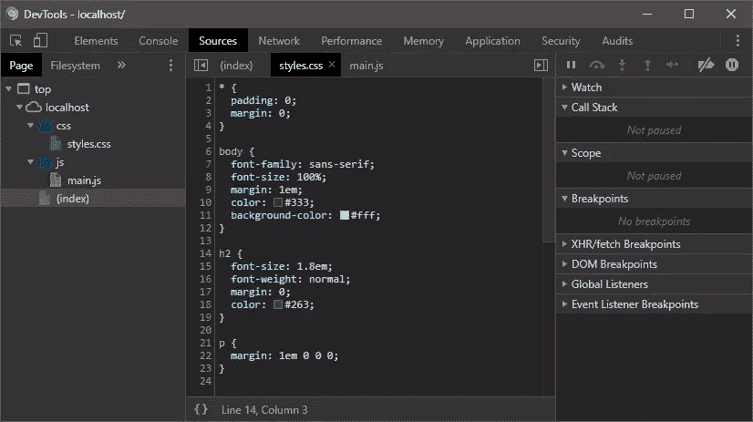
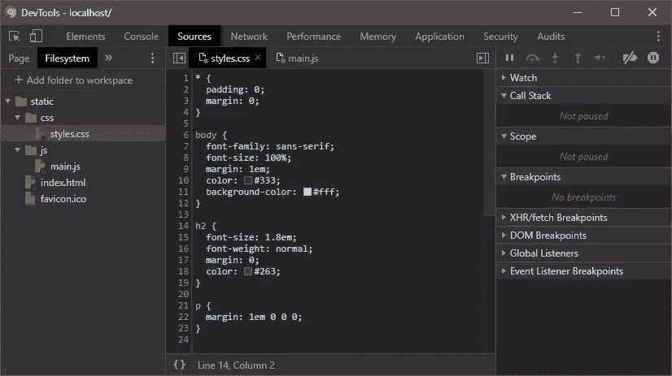
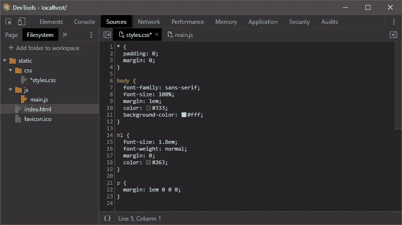
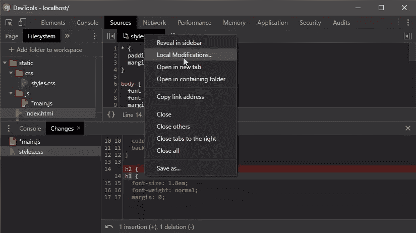

# 如何在 Chrome 中直接编辑源文件

> 原文：<https://www.sitepoint.com/edit-source-files-in-chrome/>

*这篇热门文章更新于 2020 年。有关使用工具改进开发工作流程的更多信息，请阅读 SitePoint Premium 上的[开发者基础:工具](https://www.sitepoint.com/premium/books/developer-essentials-tools)。*

web 开发人员的日常工作包括在他们最喜欢的编辑器中创建带有相关 CSS 和 JavaScript 的 HTML 网页。工作流程:

1.  在浏览器中打开本地托管的页面。
2.  发誓。
3.  打开 DevTools 调查布局和功能问题。
4.  调整 HTML 元素、CSS 属性和 JavaScript 代码来解决问题。
5.  将这些更改复制回编辑器，并返回到步骤#1。

虽然诸如 live reloading 之类的工具使这个过程变得更加容易，但是许多开发人员继续在 DevTools 和它们的编辑器中调整代码。

然而，可以直接在 Chrome 中打开和编辑源文件。您所做的任何更改都会保存到文件系统中，并在编辑器中进行更新(*假设当文件发生更改时编辑器会刷新*)。

## 步骤 1:启动开发人员工具

打开 Chrome，从你的本地文件系统/服务器加载一个页面，从**更多工具**菜单打开**开发者工具**，或者根据你的系统按`F12`或`Ctrl/Cmd` + `Shift` + `I`。导航到**源**选项卡，检查文件浏览器:

您可以在此视图中打开和编辑 CSS 和 JavaScript 文件，但是一旦刷新页面，任何更改都将丢失。

## 步骤 2:将文件夹与工作区相关联

点击**文件系统**选项卡，然后点击 **+将文件夹添加到工作区**。你会被提示找到你的工作文件夹，Chrome 会要求你确认你**允许**访问。资源管理器显示您系统上的文件，单击即可打开:

## 步骤 3:编辑并保存代码

现在，您可以开始编辑代码了。未保存的编辑在文件选项卡上用星号标记。

CSS 的变化会立即更新，但是在 HTML 和 JavaScript 的情况下，你通常需要按下`Ctrl/Cmd` + `S`将文件保存到文件系统，然后刷新浏览器。

请注意，您也可以右键单击文件选项卡并选择**另存为…** 在其他地方保存文件的副本。

## 步骤 4:检查并撤消更改

要查看更改，右键单击文件选项卡并从上下文菜单中选择**本地修改…** :

显示了一个类似 diff 的视图。窗格左下角的箭头图标将撤消所有更改，并将文件恢复到原始状态。

Chrome 的开发者工具永远不会完全取代你最喜欢的编辑器，但当你进行快速更改或在另一台可能没有安装编辑器的电脑上工作时，它会很有用。

## 分享这篇文章