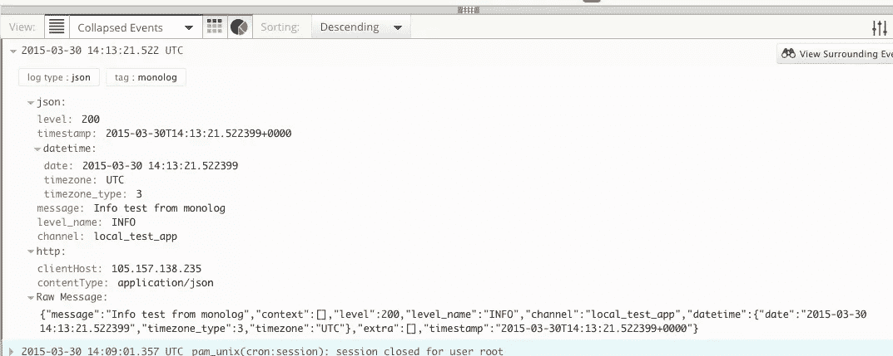
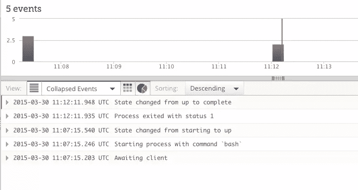
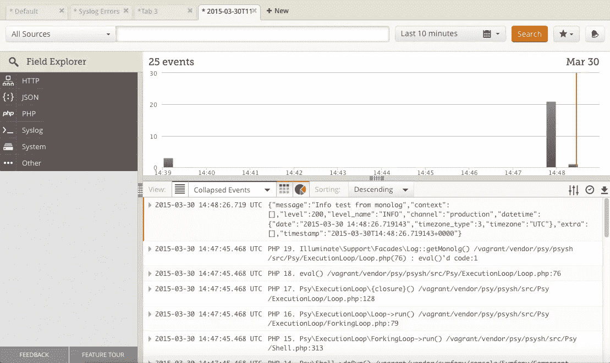
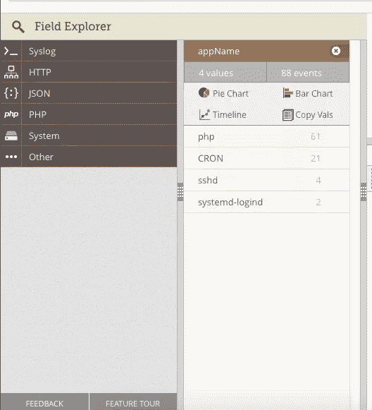
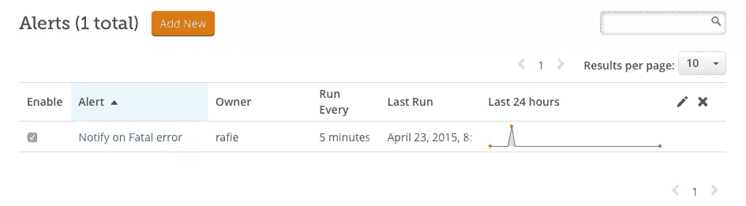
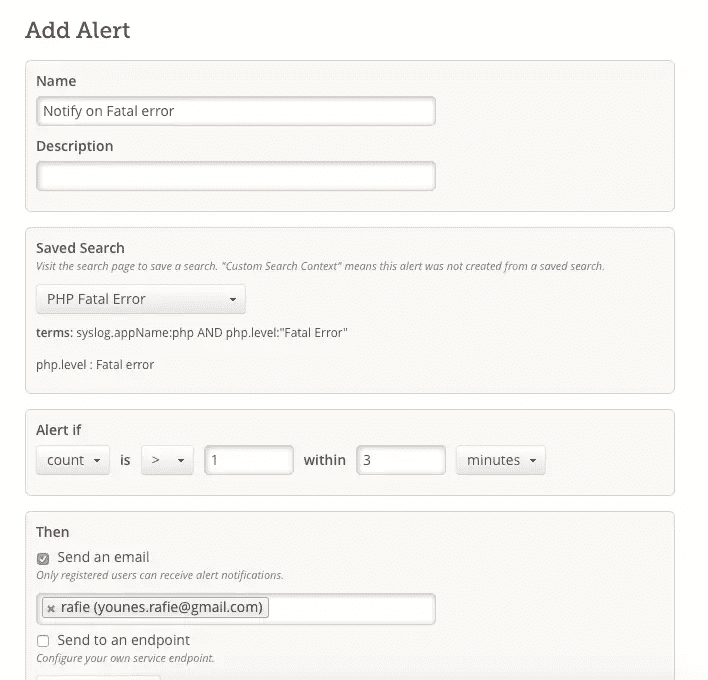
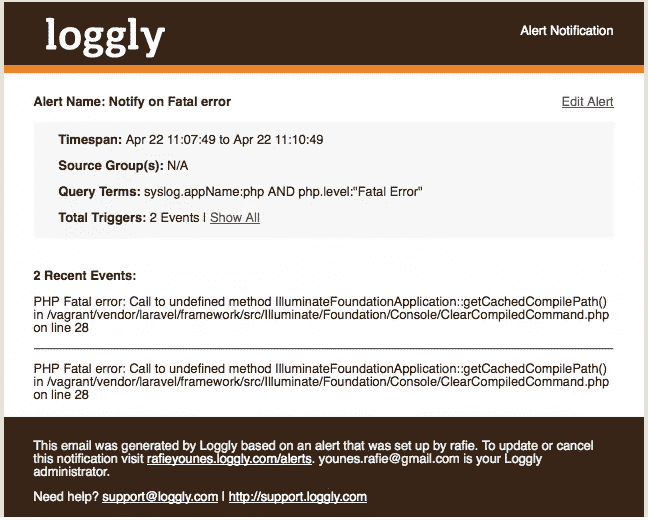

# 用 Loggly 实现更有效的 PHP 日志记录

> 原文：<https://www.sitepoint.com/effective-php-logging-loggly/>

本文由 Loggly 赞助。感谢您对使 SitePoint 成为可能的赞助商的支持。

服务器过载，库抛出异常，发送电子邮件时出错:不幸的是，这些错误是每个系统的一部分。如果你负责让一个系统运行良好，那仍然是一个冰冷的安慰。此外，我敢打赌，您的日志文件中已经有了解决这些问题所需的所有数据。

但是，除非你有办法存储、处理和分析这些数据，否则访问这些数据并没有真正的帮助。在本文中，我将解释如何通过使用 PHP 日志库和适当的日志管理解决方案(在本例中是 Loggly)来更有效地使用这些数据。我还将展示一个例子，说明如何使用日志管理服务来更容易地存储和分析它们。

## PHP 日志记录

当使用 PHP 进行日志记录时，我们倾向于使用 [error_log](http://php.net/manual/en/function.error-log.php) 和 [trigger_error](http://php.net/manual/en/function.trigger-error.php) 函数，或者我们可以使用[错误处理程序](http://php.net/manual/en/function.set-error-handler.php)来使日志记录过程更加通用。如果您选择这样做，您将需要将您的函数包装在某种对象中，以使事情更加整洁和灵活。您还可以使用 [syslog](http://php.net/manual/en/function.syslog.php) 功能将日志直接转发到您的系统进行处理。

```
openlog('php', LOG\_CONS | LOG\_NDELAY | LOG\_PID, LOG\_USER | LOG\_PERROR); syslog(LOG\_ERR, 'Error!'); syslog(LOG\_INFO, 'Hello World!'); closelog(); 
```

但是，如果您必须同时记录到多个位置，或者根据错误级别将日志发送到给定的服务，您会怎么做呢？使用日志库通常比使用内置工具更容易。

### 为什么我使用独白

虽然有些人推荐像 [log4php](http://logging.apache.org/log4php/) 、 [KLogger](https://github.com/katzgrau/KLogger) 和 [Monolog](https://github.com/Seldaek/monolog) 这样的库试图解决这些常见问题，但它们有一些局限性，Monolog 比它们有很多优势。

*   这是符合 PSR-3 标准的
*   包括各种服务的处理程序，包括 Loggly。
*   支持[格式化器](https://github.com/Seldaek/monolog#formatters)来定制你的日志输出。
*   用于[开发日志](https://github.com/Seldaek/monolog#logging-in-development)的助手，比如用于登录浏览器控制台的 BrowserConsoleHandler。

请务必查看[文档](https://github.com/Seldaek/monolog/blob/master/doc/usage.md)以了解关于该包的更多详细信息。大多数流行的框架都包括开箱即用的 Monolog，所以请查看[文档](https://github.com/Seldaek/monolog#frameworks-integration)上的完整列表。如果您没有安装 Monolog，您可以使用 Composer 将其添加到项目中。

```
composer require monolog/monolog
```

### 大规模采伐的问题

由于日志记录需要写入磁盘、备份和搜索文件，一些公司创建了一个单独的服务来处理这项工作(通常是一组脚本或应用程序，用于在发生某种错误时搜索文件信息)。随着您的公司或服务规模的扩大，这可能很快成为您的开发人员和分析师的噩梦。另一个更好的替代方案是基于云的日志存储和分析服务，这有很多好处，我们将在本文中进一步讨论。

## 什么是 Loggly？

有几个日志管理服务将使存储和分析您的日志更容易。Loggly 是最流行的一个，它有几种方法可以与 PHP 集成。一旦 Loggly 收到您的日志，您将能够以一种令人印象深刻的方式搜索、分组和可视化您的数据。你可以免费试用一下。只有当你的网站有相当大的流量时，你才需要付费。让我们首先看看如何在您的服务器上安装它来跟踪您的系统日志。

### 将 Loggly 与独白一起使用

如果您决定使用 [Monolog 包](https://github.com/Seldaek/monolog)库来实现您的日志记录过程，那么很容易将它与任何日志管理服务集成在一起，包括 Loggly。

默认情况下，它为 Loggly 提供了一个 LogglyHandler。

```
$logger = new \Monolog\Logger('local_test_app'); $logger->pushHandler(new \Monolog\Handler\LogglyHandler('YOUR_TOKEN/tag/monolog'));
```

在创建了一个 Monolog 实例之后，我们将把我们的处理程序推送到已注册的处理程序列表中，并且您将需要像前面提到的那样提供您的令牌。标记部分是可选的，但是通过相应地标记来分隔日志条目总是一个好主意。现在我们准备开始使用 Monolog 登录我们的服务。

```
$logger->addInfo("Info test from monolog"); //$logger->addWarning("Warning test from monolog");
```



### 与拉勒维尔一起

由于 Laravel 使用 Monolog 进行日志记录，我们可以很容易地将我们的处理程序绑定到它。

```
$handler = new \Monolog\Handler\LogglyHandler('YOUR_TOKEN/tag/monolog'); $logger = Log::getMonolog(); $logger->pushHandler($handler); // using the Log facade Log::info("Test from Laravel"); Log::warning("Test from Laravel");
```

### 在 Heroku 上配置日志

当您将应用程序投入生产时，您希望确保您的日志跟踪正常工作。在本节中，我们将把 Loggly 附加到我们的 Heroku 应用程序上。Heroku 使用 [Log Drains](https://devcenter.heroku.com/articles/log-drains) 来帮助您将日志转发到外部日志服务。你可以查看[文档](https://www.loggly.com/docs/send-logs-heroku/)了解更多关于安装过程的细节。

```
heroku drains:add https://logs-01.loggly.com/bulk/TOKEN/tag/heroku --app HEROKU_APP_NAME
```

您需要用您在源设置>客户令牌页面上找到的实际令牌更新`TOKEN`。如果您已经登录到 Heroku 实例，可以省略`HEROKU_APP_NAME`,否则您需要指定 Heroku 应用程序名称。

drain URL 以`tag/heroku`结尾，这将帮助我们使用已定义的标签过滤日志，我们稍后将对此进行更多讨论。



Loggly 可以很容易地与 Heroku 之类的任何外部服务集成。查看 Loggly 文档，了解关于日志传输方法和可用脚本或[库](https://www.loggly.com/docs/loggly-libraries-catalog/)的[概述。](https://www.loggly.com/docs/basics-of-sending-data/)

## 使用 Loggly 分析日志

现在我们已经讨论了如何将您的日志发送到 Loggly，我们可以开始分析和处理我们的数据。搜索页面提供了一套工具来过滤、分析和可视化我们的日志。



仪表板显示了事件的时间线，底部还有一个日志列表。页面顶部包含一个搜索框和一个日期范围来过滤事件，例如，您可以选择过去 30 分钟或指定一个自定义日期范围，然后单击搜索进行验证。

## 过滤日志

您可以使用搜索输入来过滤使用特定术语(如“电子邮件”或“事件 _*”)的数据。Loggly 将在你的日志条目中搜索，并在页面底部显示结果。您还可以使用字段进行搜索，如“tag:monolog”来过滤以前从 monolog 发送的事件。左侧菜单称为动态字段浏览器，它可以帮助您识别可用的字段过滤器。



让我们以下面的例子来更好地理解如何分析日志。

### 内部服务器错误

当您的服务器无法处理来自用户的有效请求时，将引发内部服务器错误。在 PHP 中，关于这个错误的细节可以在你的 Apache 日志中找到，如果你用 PHP 注册了一个错误处理程序，你可以把你自己的日志文件分组，这样你就可以根据日志信息分析它们并修复错误。

您可以使用页面左侧的 Field Explorer 小部件来过滤使用`apache 5XX`状态代码的日志。搜索可以是特定的，如“apache.status:500”，也可以是更一般的，如“apache.status:[500 到 599]”。


### 致命错误

在 PHP 中，当抛出致命错误时，程序将停止执行并将错误记录到您的系统中。因为致命错误不应该在生产中发生，Loggly 提供了一种简单的方法来跟踪不同来源的错误的严重性。术语“syslog.appName:php”将只显示 php 日志，现在我们需要使用 syslog.severity:Error 术语显示特定严重性的错误，我们还可以指定一个范围，如“syslog . severity:[错误警告]”。您可以在[文档](https://www.loggly.com/docs/search-query-language/#field_names)上阅读更多关于可用字段列表的信息。

```
syslog.appName:php AND syslog.severity:Error
```

大多数情况下，我们以列表形式显示结果，但是您可能希望使用页面底部图表列表中的另一个图表。


### 警报

Loggly 上我最喜欢的功能之一是提醒工具。您可以配置 Loggly，以便在应用程序上发生操作时向您的电子邮件或其他服务发送通知。让我们详细介绍一下这个过程。

首先，您需要创建一个新的搜索并保存它。让我们以这个搜索为例:“syslog.appName:php 和 php.level:“致命错误”

这将显示我们系统中 PHP 致命错误的列表。接下来，我们需要保存这个搜索标准。单击仪表板页面右上角的小星星，选择“将此搜索另存为”项，并为搜索命名。





现在，我们可以转到警报列表，单击“Add new”创建一个新的警报。为警报提供名称和描述后，您可以从列表和条件中选择保存的搜索(如果计数在 5 分钟内> = 1，则发出警报)。在我的例子中，我将发送一个电子邮件通知，但是如果您有一个自动将错误传递给您的团队进行验证的服务，您可以将其配置为发布到您的端点。您可以在[文档](https://www.loggly.com/docs/alerts-overview/)中阅读更多关于警报的信息。



## 结论

Loggly 可以改变你处理日志的方式，从正则表达式搜索到存档。该服务还有很好的 UX，文档非常简单，涵盖了大多数可能性。您可以从免费试用开始，测试所有功能。如果你有任何问题，请在下面随意发表，我会尽力回答。

如何让 PHP 日志更容易？

## 分享这篇文章