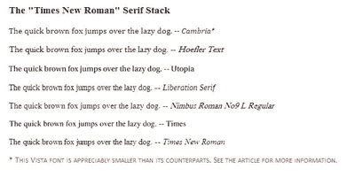
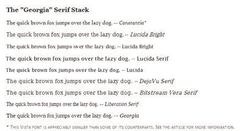

# 8 权威网络字体堆栈文章

> 原文：<https://www.sitepoint.com/eight-definitive-font-stacks/>

***“网页设计 95%是排版。”*–[奥立弗·雷琴斯坦](http://informationarchitects.jp/the-web-is-all-about-typography-period/)**

***“排版不是‘挑一个酷字体’。”"*–[杰夫·克罗夫特](http://files.jeffcroft.com/presentations/fowd_april_2007/JeffCroft_FOWD_Workshop_Elegant_Web_Typography.pdf)**

***“排版是……塑造文本以获得最佳阅读体验。”*–[奥立弗·雷琴斯坦](http://informationarchitects.jp/webdesign-is-95-typography-partii/)**

在过去的几个月里，我花了比我预想的更多的时间来探索网页字体和排版的整体概念。(我的朋友，印刷术专家西蒙·帕斯卡·克莱恩写道，“前者是一套风格化的字符符号，”而“另一个是创造字体并将其融入书面文字的全部艺术。”更多澄清和说明，请咨询[乔恩·谭](http://jontangerine.com/log/2008/08/typeface--font)和[马克·西蒙森](http://www.typophile.com/node/14701#comment-84393)。)

在这个过程中，我一直在考虑使用**字体堆栈**的想法——使用众所周知的`font-family` CSS 属性——列出尽可能多的不同字体，以便为最大数量的用户优化网站体验。

##### 用户偏好呢？

有一个强有力的论据支持不去管它，简单地指定衬线或无衬线字体，从而让用户自己的设置决定字体显示。我可以理解这种哲学，但就个人而言，我更喜欢对我的网站的显示施加更多的控制。

字体比我们可能意识到的更重要；在决定网页的视觉效果和信息流时，它们和配色方案或导航布局一样重要。作为一名设计师(即使是公认的业余爱好者)，我不能把这些关键元素留给用户可能有的任何设置。

##### 不同类别的字体

当然，字体之间的区别不仅仅是衬线的存在。传统类别，尤其是用于网络的，有:**衬线字体**、**无衬线字体**、**等宽字体**、**草书/手写体**和**装饰字体**或“幻想”字体，它们主要用于时髦的图形创作。

Daniel Mall 为他的字体集列出了一个有用的类别列表，包括 *pixel* (真正的小人物) *symbol* (Wingdings)，以及 *blackletter* (用于中世纪手稿和重金属乐队)。我列出这些是因为很多非常有能力的网页设计师根本不知道除了衬线字体、无衬线字体和等宽字体之外还有什么。

事实上，多年来我也是这样看待字体设计的，直到我开始明白，作为一名设计师，你对字体设计了解得越多，你能做出的选择就越明智，你的网站就会越好。在你设计的任何网站中，你的排版决定应该在你的设计、导航和结构选择的最前面，而不是事后的想法。好的版面设计给网站带来的影响往往是微妙的，但同样深刻。

##### 扩展您的排版选项

创建推荐字体堆栈背后的想法很简单:由于大多数网页设计师对网页字体选择和排版知之甚少，而且他们有太多的事情要做，没有时间去学习，他们需要一个一站式的字体堆栈商店，为所有平台提供各种各样的字体，包括 Windows、Mac 和 Linux。

此外，那些对排版有足够了解的设计师可能会觉得他们的创造力受到了标准“网页安全”字体集的限制。使用字体堆栈是增加设计师选择的一种可能方式。

此处列出的字体堆栈按构成堆栈基础的*通用*字体分组。因此，设计师可以决定他们网站的印刷外观，选择合适的字体堆栈，并根据需要进行调整。

我希望读者将此作为他们自己的印刷研究和实验的跳板，开发他们自己的书库来适应他们自己和他们网站用户的需要。

##### 介绍堆栈

列出了八种字体堆栈，将 Windows、Mac、Linux 和 Adobe 字体组合成彼此相对相似的组。每个堆栈采用以下格式:

`exact font, nearest alternative, platform-wide alternative(s), universal (cross-platform) choice(s), generic`

还列出了第二种结构，这种结构通常与第一种结构相冲突:

`Windows fonts, Mac fonts, Linux fonts, universal, generic`

在这篇文章中，我列出了三个衬线堆栈、四个无衬线堆栈和一个等宽堆栈。当然，不管这篇文章的标题是什么，认为这些可能是决定性的想法是可笑的。它们仅仅是实验的起点。如果有足够强的理由，我很乐意更新这篇文章，并欢迎你在评论中反馈。

以下是当前的字体堆栈。随心所欲地复制粘贴。

**基于 Times New Roman 的衬线堆栈:**

`font-family: Cambria, "Hoefler Text", Utopia, "Liberation Serif", "Nimbus Roman No9 L Regular", Times, "Times New Roman", serif;`

**一个现代的基于乔治亚州的衬线堆栈:**

`font-family: Constantia, "Lucida Bright", Lucidabright, "Lucida Serif", Lucida, "DejaVu Serif", "Bitstream Vera Serif", "Liberation Serif", Georgia, serif;`

**Go to page:** [1](https://sitepoint.com/eight-definitive-font-stacks) | [2](https://sitepoint.com/eight-definitive-font-stacks-2/) | [3](https://sitepoint.com/eight-definitive-font-stacks-3/)

## 分享这篇文章