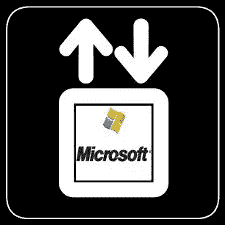
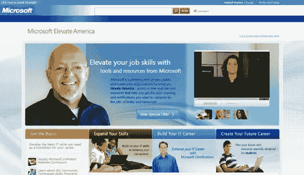
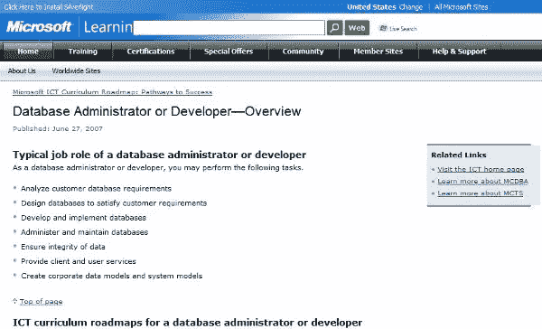
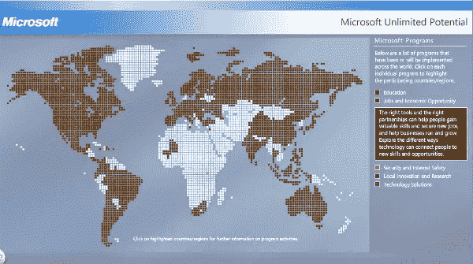

# 微软提升美国和 IT 界的一种方式

> 原文：<https://www.sitepoint.com/elevate-america/>

微软刚刚[宣布](http://www.reuters.com/article/internetNews/idUSTRE51L1PJ20090222) Elevate America，一个旨在帮助求职者磨练技术技能的项目和[新网站](http://www.microsoft.com/about/corporatecitizenship/us/communityinvestment/elevateamerica.aspx)。该网站允许用户访问微软的几个初学者培训计划，如“如何使用互联网”，以及更高级的计划，导致微软认证。作为一项更广泛的举措，Elevate America 与州和地方政府合作，帮助对失业工人进行 IT 技能再培训。自经济衰退开始以来，已有近 400 万人失业。让 It 培训和认证更容易获得是微软和其他公司至少可以提高希望的一种方式。

这一消息与在华盛顿举行的全国州长协会会议相吻合。根据微软网站上的[新闻](http://www.microsoft.com/presspass/press/2009/feb09/02-22ElevateAmericaPR.mspx?rss_fdn=Press%20Releases)，第一个向他们的居民提供 Elevate America 的州将会是；佛罗里达、纽约和华盛顿。鉴于微软自己在[的裁员](http://news.cnet.com/8301-13860_3-10148360-56.html)，人们不禁要问，Elevate America 与其说是一个真正的倡议，不如说是一次公关行动。不管其预期的公关价值，但是，帮助范围提供给训练不足的个人是非常需要的。

提升美国

##### 提升技术

据微软自己的[媒体](http://www.microsoft.com/presspass/press/2009/feb09/02-22ElevateAmericaPR.mspx?rss_fdn=Press%20Releases)报道，该公司将提供超过 100 万张代金券，用于访问他们的电子学习课程和一些微软认证测试。还揭示了其他中期目标:

*   扩大获得基本技术知识和技能培训的机会
*   通过微软无限潜能提供基础 IT 培训
*   中级技术培训课程，在线讲师指导，认证考试
*   微软提供的电子学习课程代金券
*   Microsoft business certification 认证考试的优惠券
*   向社区合作伙伴提供赠款和软件，以提高课堂培训能力
*   机构会员折扣率

##### 前进的资源

Elevate America 网站是一个丰富的信息资源。从基本的 It 技能到认证，如果没有别的，新网站提供了一个起点，让新的 IT 专业人员参与中级培训和测试。该网站直接链接到微软的学习数据库，同时提供扩展的发现能力和关于提升美国当前和未来战略的信息。

MS 学习数据库

微软已经在全球范围内实施了许多计划。不管 Elevate America 是不是一个直接针对美国问题的仓促产物，与各州和其他公司的互动只会对处于过渡期的人有所帮助。该公司的[无限潜力](http://www.microsoft.com/about/corporatecitizenship/citizenship/giving/map/map.htm)外展，虽然明显以市场为中心，但现在也被 Elevate America 项目所采用。Elevate America 站点的最大优势在于它能够为人们集中所有微软资源，它是一个很好的中心。

一次无限的潜在拓展

##### 不管是否利他，人们需要培训

正如其他人建议的那样，培训未来的微软认证员工无论如何都符合公司的最大利益。但是，最终，动机并不重要，不是吗？在提供大量资源、所需的 MS 认证激励、更好地访问大量知识库以及潜在的更广泛参与方面，微软再次处于领先地位。在美国大公司没有更雄心勃勃的计划的情况下，微软至少提升了 IT 培训生。

## 分享这篇文章