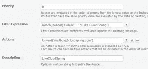
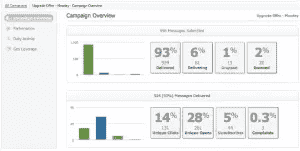
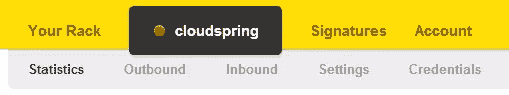
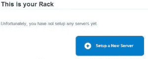

# 电子邮件即服务第 2 部分:发送网格、邮件枪和邮戳

> 原文：<https://www.sitepoint.com/email-as-a-service-part-2-sendgrid-mailgun-and-postmark/>

## **简介**

在本文的第 1 部分中，我们讨论了电子邮件即服务的概念，以及它可以带来的好处。在这一部分中，我们将更多地讨论这个市场中三个领先的和即将出现的提供商——send grid、Mailgun 和邮戳。这些公司都有自己的一套独特的功能，我将审查这些，以及定价和内部看看。选择这些提供商是因为他们都涵盖了 SMTP 托管、入站邮件、可扩展性和分析等重要部分，以及将他们的服务集成到您的应用程序(可以是移动应用程序或网站应用程序)的许多方式。

## [发送网格](http://www.sendgrid.com)

我们将从 Sendgrid 开始，它可以被认为是这个市场上最大的玩家。他们有一些令人印象深刻的客户，比如 Pinterest、Spotify 和 FourSquare。SMTP 托管似乎是他们的核心业务，尽管他们也提供入站邮件。他们的定价方案给你很多选择，而其他公司提供更简单的定价。

### **SMTP 托管**

Sendgrid 庞大的基础设施确保他们能够始终处理您的电子邮件量，无论您想要发送多少邮件。让它们与众不同的是，通过相对较低的价格承诺，您可以获得高级的东西，如专用或多个 IP 地址，甚至 IP 白标。在功能上，他们接近 Mailgun，他们的规模和客户群必须让你相信他们是一个很好的选择。

### **入站邮件**

Sendgrid 提供了处理入站邮件的能力，可用于处理应用程序内的回复。您可以为您的入站邮件域指定一个主机名，然后您可以将其与他们的 API 集成到您的应用程序中。您可以使用 JSON 或 XML 来添加、编辑或删除条目。您可以在解析收到的邮件之前对其进行垃圾邮件检查。没有您的入站邮件的统计数据。

### **分析**

Sendgrid 为您提供了集成 Google Analytics 的选项，并在其界面中提供了一组广泛的报告。他们有一个仪表板来显示电子邮件指标，如发送的邮件，以及打开和点击率。你可以打开报告，找出更多关于你的垃圾邮件报告，退订，反弹等。有一个选项可以组合所有这些参数，并深入到一个特定的时间框架，看看它是如何一起工作的。这是相当广泛的，它应该给你一个良好的感觉，你的电子邮件处理。

### **设置**

Sendgrid 提供了一个干净的界面，所有的东西都被整齐地划分到感兴趣的区域。它们可以让你很容易地选择你想要的电子邮件服务，分离为应用程序，你可以添加到你的服务。如果你想发送简讯，这也是你应该看的地方，因为这也是一个应用程序。总的来说，他们的界面很容易使用。

### **定价**

Sendgrid 的定价与 Mailgun 非常相似，如果您想要所有的专业产品，您会看到每月 80 美元以上的承诺。每 1000 封邮件的价格从 0.85 美元到 0.45 美元不等，如果你每月发送超过 170 万封邮件，价格甚至会更低。

## **神枪**

Mailgun 最近被 Rackspace.com 收购，正在成为电子邮件即服务市场的有力竞争者。它们具有广泛的功能和有竞争力的价格。他们的客户群不像 Sendgrid 那样令人印象深刻，但有一些好听的名字，如 Uservoice 和《金融时报》。他们的定价大多基于发送量，而不是功能，除了专业功能，如专用 IP。

### **SMTP 托管**

你马上就能得到所有的功能，即使是他们的免费计划。与他们的高薪计划的唯一区别是 IP 地址(共享)和 DKIM 签名(Mailgun 的)。但是，如果你刚刚起步，并希望保持较低的开销，这不是问题。Mailgun 提供了第 1 部分中描述的所有特性，并且在更昂贵的计划上与 Sendgrid 不相上下。这也是他们的主要卖点，从一开始就给你专业的功能。

### **入站邮件**

Mailgun 为您提供了两种接收入站邮件的方式。您可以在 Mailgun 中设置一个邮箱，它的工作方式类似于普通的电子邮件地址。您可以将它用于特定的功能，例如从您的应用程序中添加日历事件或订购商品。这将向您指定的电子邮件地址发送一封电子邮件，可以用 POP 和 IMAP 获取该邮件，之后您的后端可以处理它。您也可以使用“邮件发送路线”，在这里您可以定义一个排序路线列表来处理您的邮件。您可以将邮件从签名和回复中剥离出来，并通过 HTTP 或不同的电子邮件地址转发到 URL。这可用于在基于一个或多个表达式过滤消息后触发特定操作。这让您在处理入站邮件时更加灵活。

### **分析**

所有的基础都在这里，但没有 Sendgrid 的那么花哨。有一个所有重要指标的概述，如打开率和点击率，反弹和退订。实际上就是这样，这是正常的邮件处理。秘密就在他们的活动模块中，该模块有一些不错的功能，如接收者收件箱中发生的每日活动图表，甚至报告地理覆盖范围。

### **设置**

Mailgun 展示了你登录后它的主要功能。这可能有点让人不知所措，但是可以省去你的搜索。一旦你掌握了窍门，你可能会喜欢这种方法。因为它们真正详细的特性是在你建立了邮件列表或邮箱之后才被发现的。所以一开始只给你看你需要的东西。

### **定价**

如上所述，Mailgun 的定价非常简单，基于每月的承诺，提高承诺可以降低每封邮件的价格，并提供更多专业功能，如(最多)专用 IP 子网和自定义 DKIM 签名。价格从 1 美元到 10 美元不等，每 1000 封邮件收费 10 美元。

## **[邮戳](http://postmarkapp.com/)**

《街区邮戳上的新小子》试图以一个价格适合所有人的态度与竞争进行斗争，这种销售实际上并没有说他们的任何特点。他们试图向你保证他们的经验和技术技能是你所需要的，用外行的术语来描述他们所提供的。他们的客户群有一些有趣的名字，如招标应用程序和可读性。

### **SMTP 托管**

邮戳有一些很好的功能，比如每周摘要报告你的重要指标，但也有一个 WordPress 插件，便于集成。它们还提供了垃圾邮件评分 API(基于 SpamAssassin)，您可以使用它来检查出站和入站邮件流量中的垃圾邮件。在邮件发送之前将其用于您的出站邮件，可以很好地防止被标记为垃圾邮件。没有发送简讯的选项。

### 入站邮件

接收入站邮件的能力在邮戳中是相当新的，他们正在积极扩展它的功能。每封邮件都被解析成一个 JSON 对象供您处理(对于出站邮件，您可以首先通过其垃圾邮件评分 API 运行它)。您还可以设置 MX 记录，使用您自己的域名接收邮件。

### **分析**

邮戳提供了一些好看的图表，让您可以快速查看您发送和接收的邮件。它还包括你的跳出率和垃圾邮件投诉的数量。您还可以通过使用它们的 API 来跟踪您的统计数据。

### **设置**

说到一个干净的界面，除了启动一个服务器的能力之外，邮戳什么都没有，一个为你的每个应用程序专用的邮件处理器。之后，您可以通过 HTTP 请求(使用 JSON)或 SMTP 发送带有他们 API 的电子邮件。在这个界面中，你可以设置钩子在邮件退回时发出信号，或者从入站邮件中发送解析后的 JSON 数据，在你的后端进行处理。然而，大多数设置都是使用 API 完成的。

### **定价**

如上所述，邮戳只提供一个价格，即每 1000 封电子邮件 1.50 美元，最多 50 万封。他们所有的功能都包括在这个价格里了。

### **结论**

在功能和每封邮件的价格方面，Sendgrid 和 Mailgun 不相上下，但提供了不同的定价策略。它们的界面非常不同，但都提供了一个免费的计划，让你看看你更喜欢什么。邮戳有一套基本的功能开始，但肯定是赶上了它的竞争对手。根据你的经历，让我知道你的想法和观点。

## 分享这篇文章