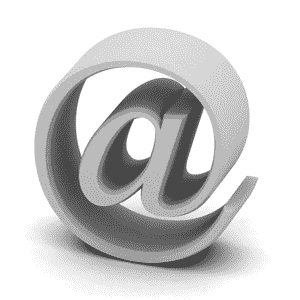

# 5 个重要的电子邮件营销技巧

> 原文：<https://www.sitepoint.com/email-marketing-tips/>

昨天，我写了关于[建立一个电子邮件营销列表](https://www.sitepoint.com/how-to-build-an-email-marketing-list)，以及确保你正在创建一个想要接收你的更新并且最有可能采取行动的人的数据库是多么重要。制定这种清单并获得你想要的回应可能需要时间，但无论你的清单是 50 份还是 5000 份，你都可以立即应用一些电子邮件营销技巧。

## 专注于一个信息

如果你要发送非时事邮件，那么每封邮件都要坚持一条主要信息。你在电子邮件中塞进的信息越多，收件人的目光变得呆滞无神、想要删除的可能性就越大。把它放在一个焦点上，放在主题和信息的第一行，让那些只是略读的人更容易理解你的信息。

电子邮件时事通讯应该提供一些零碎的信息，所以这个建议并不适用于时事通讯。但是你仍然应该保持你的简讯简介简短扼要，使信息易于掌握。

## 自定义您的消息

尽可能在邮件中使用收件人的姓名。像用这种方式定制邮件这样简单的事情可以让收件人更有可能通读你的邮件并采取行动。

## 包括行动呼吁

你发送的每封邮件都应该清楚地说明你希望收件人做什么。使链接变得明显，并引起对你提供的任何特殊方向的注意。谈到行动号召时，重复也没关系——将它放在信息的顶部，并在结尾再次提及。

## 使用模板

与其发送一封普通的电子邮件，不如花点时间定制你的模板，以反映你企业的颜色、字体和其他品牌元素。使用相同的邮件模板将有助于收件人认识你的公司并产生信任感。

您还需要提供一个纯文本版本，其中包含相同的邮件，但去掉了所有特殊格式，以便收件人使用无法查看 HTML 格式邮件的电子邮件客户端。不要忘了在多个电子邮件客户端测试你的最终模板，以确保它看起来像你想要的那样。

## 注意你的数据

大多数电子邮件营销服务提供活动统计数据，因此您可以监控打开、点击、退回和退订的数量。当你开始电子邮件营销，尝试一些不同的格式和链接位置，然后比较统计数据来衡量你的成功。

不要急于退订被退回的地址。一封电子邮件可能会因为很多原因而被退回，最好等一等，看看该地址是否不止退回一次，然后再从你的列表中删除。

你从自己的经历中学到了哪些电子邮件营销技巧，你会把它们添加到这个列表中吗？

**相关帖子:**

*   [如何建立电子邮件营销列表](https://www.sitepoint.com/how-to-build-an-email-marketing-list)
*   电子邮件营销:值得你花费时间吗？
*   [电子邮件营销:帮助你联系的 13 种服务](https://www.sitepoint.com/e-mail-marketing-services/)

*图片来源:[伊万·彼得罗夫](http://www.sxc.hu/photo/981724)*

## 分享这篇文章