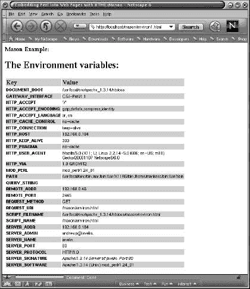
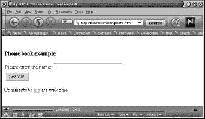
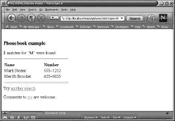
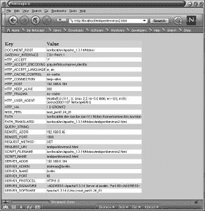
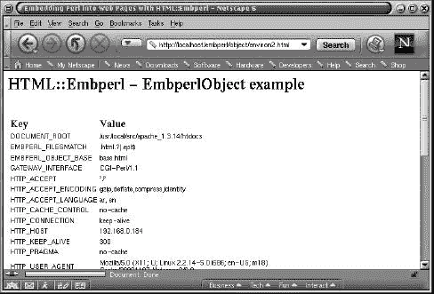
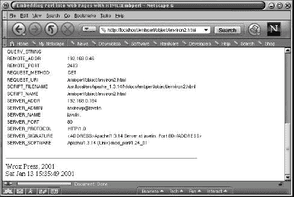
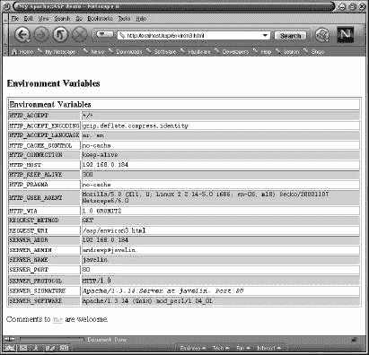

# 将 Perl 嵌入 Web 页面

> 原文：<https://www.sitepoint.com/embedding-perl-web-pages/>

** *本文节选自 WROX 出版社出版的《专业 Perl 开发 *一书。见 Kevin Yank 的评论* [此处](http://www.webmasterbase.com/article.php/435) *。****

近年来，web 的指数级增长已经导致了对站点开发团队的许多相互冲突的需求。一方面，用户期望的不仅仅是简单的静态内容——他们需要通过表单、搜索工具、页面定制等实现交互性。然而，与此同时，用户期望诸如美观的布局、简单的导航以及相关页面之间相似的外观和感觉。这些需求事实上强调了网络发展的一个基本方向——内容与表现的分离。这种分离原则上可以使网站的开发更容易；首先处理动态内容的生成，然后处理如何呈现结果。然而，最终必须在两者之间建立一个接口——如何将动态数据输入到 HTML 页面中。

在许多情况下，比如一个搜索工具在某个数据库中查找一个查询，这个接口可以通过 CGI 脚本来处理。当然，Perl，尤其是 CGI.pm 模块(见第 1 章)，有理由为此而出名。以至于许多书店、网站和新闻组的海报都认为 Perl 和 CGI 编程是同义词(这让 comp.lang.perl.misc 的普通海报非常懊恼)。然而，对于更复杂的应用程序和/或大量的页面，基于 CGI 脚本的方法并不总是令人满意的，原因如下:

*   它并不总是能够很好地扩展。
*   它会对服务器提出很高的要求。
*   对于大型站点来说，这可能很难管理。

这些缺点的主要原因是 CGI 脚本中内容和表现的分离并不总是那么清晰。事实上，通常只有一个脚本同时生成内容和 HTML 标签，这使得很难单独更改表示或内容。然而，Perl 中有许多不同种类的解决方案可以用来解决这个问题:

*   HTML::模板
*   模板
*   HTML::Mason
*   HTML::Embperl
*   Apache::ASP

这些方法将是本章的主题。所有这些模块在 CPAN 上都可用，对于 UNIX 可以按通常的方式安装。在 Win32 环境中，我们可能需要一个昂贵的 C 编译器来构建和安装它们(特别是 Visual C++，如果我们还想在第 2 章中描述的 mod_perl 中使用它们的话)。如果我们没有 VC++，这些模块的预构建二进制文件可以通过 http://perl.apache.org/,上列出的链接获得，包括 Win32 ActivePerl 的 ppm (Perl 包管理器)文件。

当然，构建网页可以完全通过 CGI/mod_perl 方法来处理，而不需要使用模块，比如这里将要描述的在网页中嵌入 perl 的模块。使用这些模块的优点是它们是专门为 web 环境设计的，因此内置了许多优化结构和快捷方式，在这种情况下非常有用。此外，许多用户已经在这个环境中广泛测试了这些模块。一旦我们学会了特定模块的语法，我们就能够编写易于维护、可重用和可伸缩的组件，这具有明显的优势。

##### 模板

一个**模板文件**的原理是创建一个描述我们想要使用的基本 HTML 布局的模板。在这个文件中有一些特殊的指示符，它们将由一些脚本动态填充。有许多 Perl 模块可用于此目的，就像“我应该使用哪个编辑器？”这样的问题，决定哪个是最好的往往是个人口味的问题。在这里，我们描述两个基本模块来说明它们的用法。如需更多详细信息和更多此类模块的列表，我们应该浏览 CPAN—一种便捷的方式是通过 CPAN 搜索引擎，例如:

*   http://search.cpan.org
*   http://www.perldoc.com
*   http://theoryx5.uwinnipeg.ca/mod_perl/cpan-search

##### ' HTML::Template '

该模块的基本模板具有以下形式:

```
<HTML>   

<HEAD><TITLE>Test Template</TITLE></HEAD>   

<BODY>      

  <TMPL_INCLUDE NAME="header.tmpl">     

   Please contact the person listed below: <BR>  

  <A HREF="mailto:<TMPL_VAR NAME=email>">  

  <TMPL_VAR NAME=person>  </A>    <TMPL_INCLUDE NAME="footer.tmpl">
```

可以使用<tmpl_include name="file">语法插入常见的页眉和页脚，如下所示。如果我们将这个模板称为 greeting1.tmpl，那么我们可以使用它生成一个动态页面，如下面的脚本所示:</tmpl_include>

```
#!/usr/bin/perl   

# htmltemplate.pl   

use warnings;   

use strict;   

use HTML::Template;   

my $template = HTML::Template->new(filename => 'greeting1.tmpl');   

$template->param('email', 'bill@nowhere.com');   

$template->param('person', 'William');   

print "Content-Type: text/htmlnn";   

print $template->output; 
```

然后使用 output 方法生成填充的模板页面。

##### '模板'

在模板模块(Template-Toolkit 包的一部分)中，基本 HTML 模板具有由`[% ... %]`语法指示的变量占位符，如下例所示:

```
[% INCLUDE header %]  

    Please contact the person listed below: <BR>  

    <a href="mailto:[% email %]">[% person %]</a>   

[% INCLUDE footer %]
```

注意使用 INCLUDE 来包含常见的页眉和页脚。如果我们将这个模板称为 greeting2.html，那么我们可以使用这个模板生成一个动态页面，如下面的脚本所示:

```
#!/usr/bin/perl   

# template.pl   

use warnings;   

use strict;   

use Template;   

$| = 1;   

print "Content-type: text/htmlnn";   

my $file = 'greeting2.html';   

my $vars = {  

    'email' => 'bill@nowhere.com',  

    'person' => 'William',   

};   

my $template = Template->new({  

    INCLUDE_PATH => '/home/me/templates:/home/me/lib',   

});   

$template->process($file, $vars) || die $template->error();
```

注意在创建模板对象时使用 INCLUDE_PATH 来指定在哪些目录中搜索模板文件。处理方法是模块的基本工作——它采用由`$file`指定的模板，并在由`$vars`指定的文件中应用变量替换。

这些模块以及其他模块不仅仅支持简单的变量替换。例如，在模板模块中，可以加入简单的循环结构和条件。如果在脚本中我们设置了以下内容:

```
$vars = {  

    'people' => [ 'Tom', 'Dick', 'Larry', 'Mary' ],   

}; 
```

在模板文件中:

```
[% FOREACH person = people %]   

Hello [% person %]   

[% END %] 
```

该脚本将迭代 people 数组引用的成员，并打印出相应的值(可以在模板中以[% people.1 %]的形式访问单个成员，这将对应于上面示例中的 Dick)。除了插入、替换、循环和条件之外，模板模块还具有动态调用其他模板文件的指令、宏功能、异常引发和处理以及一些 Perl 代码调用。例如，可以通过 CGI.pm 模块在模板模块中处理表单数据，只需在模板文件中包含以下内容:

```
[% USE CGI %] 
```

然后可以通过语法访问 CGI.pm 模块的方法，例如:

```
[% CGI.header %]   

[% CGI.param('parameter') %] 
```

这些模板模块可以在支持 mod_perl 的服务器中使用，以加速页面的生成。这些方法的优点之一是获得了内容和显示之间相对清晰的分离。由于模板指示器相对简单，例如，让网页设计者处理模板文件，让程序员处理数据生成是合理的。然而，对于更复杂的情况，可能需要更大程度的编程结构，这些将在下一节中描述。

##### HTML::Mason

这个模块在 http://www.masonhq.com/,有更详细的描述，它使用了组件的概念，是 HTML、Perl 代码和 Mason 命令的混合。顶级组件代表整个页面，而较小的组件可用于生成 HTML 片段，以便在较大的组件中使用。这种设计可以极大地简化站点管理，因为更改共享的子组件可以立即更改大量使用该组件的页面。

将 Perl 嵌入 Web 页面 355 安装模块后，类似以下示例中的指令被放在 Apache 的 httpd.conf 文件中:

```
PerlRequire /path/to/Mason/handler.pl   # bring in the handler.pl file   

 Alias /mason/ "/home/www/mason/"   # create a special directory for    

                                                 # Mason files   

 <Location /mason>   

    SetHandler perl-script    

   PerlHandler HTML::Mason    

</Location> 
```

这假设我们有一个支持`mod_perl`的 Web 服务器。`handler.pl`文件用于启动 Mason，并定义一个例程来处理 Location 指令下传递给它的请求。以下是一个样本`handler.pl`文件:

```
#!/usr/bin/perl    

# handler.pl    

package HTML::Mason;    

use HTML::Mason;    

use HTML::Mason::ApacheHandler;    

use strict;    

use warnings;    

# list of modules that we want to use from components (see Admin    

# manual for details)    

{    

    package HTML::Mason::Commands;   

    use DBI;   

    use CGI qw(:all);   

    use CGI::Cookie;   

    use Fcntl;   

    use MLDBM;   

    use LWP;    

}    

# create Mason objects    

my $parser = new HTML::Mason::Parser;    

my $interp = new HTML::Mason::Interp (parser=>$parser,   

    comp_root => '/home/www/mason',   

    data_dir => '/usr/local/apache/mason');    

my $ah = new HTML::Mason::ApacheHandler (interp => $interp);    

chown (scalar(getpwnam "nobody"), scalar(getgrnam "nobody"),   

    $interp->files_written);    

sub handler    

{   

    my ($r) = @_;   

    my $status = $ah->handle_request($r);   

    return $status;    

}    

1; 
```

handler.pl 文件通常创建三个对象:

*   **解析器**将组件转换成 Perl 子例程
*   一个**解释器**执行这些子程序
*   一个**处理程序**将 mod_perl 路由到 Mason

comp_root 目录是 Mason 组件文件系统的虚拟根目录，就像服务器的 DocumentRoot 指令一样(它们可能是相同的)。Mason 将使用 data_dir 目录来生成各种数据文件。请注意，这个文件可以方便地加载要在其他组件中使用的模块。

我们用一个简单的例子来说明 Mason 的使用，它打印出环境变量的值:

```
<%perl>   

    my $col1 = "Key";   

    my $col2 = "Value";    

</%perl>    

<h2><% $headline %></h2>    

<table width=450>    

<tr <& .bgcolor &>>   

    <th align=left><% $col1 %></th>   

    <th align=left><% $col2 %></th>    

</tr>    

% foreach my $key (sort keys %ENV){   

<tr <& .bgcolor &>>   

    <td valign=top><b><& .font, val=>$key &></b></td>   

    <td><& .font, val=>$ENV{$key} &></td>    

</tr> % }    

</table>    

<%init>   

    my $headline = "The Environment variables:";    

</%init>    

<%def .font>    

<font size=1 face='Verdana, sans-serif'> <% $val %> </font>    

<%args>    

$val=>""    

</%args>    

</%def>    

<%def .bgcolor>    

% my $color= $x++%2?$colors[0]:$colors[1];   

    bgcolor="#<% $color %>"    

</%def>    

<%once>   

    my $x = 0;   

    my @colors = ('FFFFFF', 'CCCCCC');    

</%once>
```

如果我们把这个文件，比如说 environ1.html，放在 httpd.conf 中/mason 位置指定的目录中，并用 http://localhost/mason/environment 1 . html 调用它，就会得到下面的结果:



文件的各个部分描述如下:

*   `<%perl>...</%perl>`部分用于 Perl 代码块。在这里我们声明了变量 `$col1` 和`$col2`。
*   在此之后，我们使用变量$headline 给出第二级标题，该变量在`<%init>...</%init>`块中初始化(组件加载后立即执行)。请注意使用`<%...%>`在一行 HTML 代码中回显$headline 的值。
*   接下来，我们设置用于打印环境变量的值的表。该表的标题使用组件`.bgcolor`(注意在定义组件名称时使用前导句点的惯例)。用语法`<& component_name, [variables] &>`调用组件；这个特殊的组件在`<%def>...</%def>`一节中定义。请注意，使用前导%来表示一行 Perl 代码。
*   接下来，我们设置一个循环来打印所有可用的环境变量。以及。之前使用的 bgcolor 组件，此块使用。字体组件。这个特定的组件还使用一个`<%perl>...</%perl>`部分来处理来自`<& component_name, [variables] &>` 调用的参数传递。
*   最后，我们使用一个`<%once>...</%once>`部分来设置用于确定表格行背景颜色的变量。

如果我们仔细看截图，我们会注意到页面有一个标题和一行，这不是我们明确设置的。实际情况是，我们还定义了一个名为 autohandler 的特殊组件文件，每次调用顶级组件时都会调用该文件，并且在解释被调用的组件之前会解释该文件。该特定示例中使用的组件也应放在由`httpd.conf`中的 `/mason` 位置指定的目录中，如下所示:

```
<HTML>     

<HEAD> <TITLE>Embedding Perl into Web Pages with HTML::Mason</TITLE>     

</HEAD>     

<BODY BGCOLOR="#FFFFFF">     

<B>Mason Example:</B>     

<% $m->call_next %>     

</BODY>     

</HTML> 
```

`<% $m->call_next %>`行将控制权传递给下一个组件(在本例中，是调用的原始页面)。这些处理程序是基于目录的，这意味着只需更改这个特定的组件，就可以非常容易地更改大量页面的布局。

##### 更长的例子

作为一个使用 HTML::Mason 的更复杂的例子，我们演示了电话簿查找表单的使用。在本例中，假设数据位于文件/usr/local/data/phone.txt 中，每行一个条目，包含一个人的姓名和电话号码，用#符号分隔。这是它应该看起来像什么的一个例子:

```
Andrew Logan#377-0971 
```

```
Matt Jones#598-6788 
```

我们将该应用程序分为四个文件—一个主文件(称为`phone.html`)、一个用户输入查询的表单(称为`form`)、一个从数据库收集数据的查找脚本(称为`lookup.html`)以及一个打印结果的脚本(称为`print_it`)。我们还将有一个头文件 header 和一个页脚文件 footer，通过 autohandler 模板文件调用。同样在这个例子中，我们说明了在脚本调用中使用 cookies 保存会话数据。所有文件都要放在`httpd.conf`中`/mason`位置指定的目录下。

使用与前面相同的 Apache 配置，我们首先给出 autohandler 模板文件:

```
% my $title = 'My HTML::Mason demo';     

<& header, title => $title &>      

<H3>Phone book example</H3>      

<% $m->call_next %>      

<& footer &> 
```

通过语法`<& header, title => $title &>`用参数标题调用的头文件是:

```
<HTML>      

<HEAD><TITLE><% $title %></ TITLE ></HEAD>      

<body bgcolor="#ffffff" link="#ff5599" vlink="#993399">      

<BR>      

<%ARGS>      

$title => undef      

</%ARGS> 
```

页脚文件是:

```
<P>      

Comments to      

<A HREF="mailto:me@my.address.com">me</A>      

are welcome.      

</BODY>      

</HTML> 
```

注意`<%ARGS>...</%ARGS>` 结构的使用，它用于定义要传递到文件中的参数。调用脚本的主文件`phone.html`包含:

```
% my $name = param('name');      

% if (! $name) {     

    <& form &>      

% }      

% else {     

    % $r->header_out('Set-Cookie', "name = $name");      

<& lookup.html, name => $name &>      

% } 
```

我们从这里开始，通过`CGI.pm`模块的`param` 方法(通过`handler.pl`获取)检查是否已经为 name 参数输入了一个值。如果没有，我们打印出包含在文件表单中的表单。如果输入了一个值，我们通过`mod_perl-specific call $r->header_out('Set-Cookie', "name = $name")`设置一个 cookie 来跨会话保存这个值，然后调用 lookup，它将查询数据库并打印出结果。注意，我们将变量`$name`传递给这个文件。

用于打印用户输入查询的表单的文件表单包含:

```
% my $val = cookie(-name => 'name');     

<FORM>      

<TABLE><TR>      

<TD>Please enter the name:</TD>      

<TD>      

<INPUT TYPE="text" NAME="name" SIZE=30 VALUE="<% $val %>">      

</TD>      

</TR><TR>      

<TD COLSPAN=2>      

<INPUT TYPE="submit" VALUE="Search!"> </TD></TR></TABLE>      

</FORM> 
```

这使用了`CGI.pm`模块的 cookie 方法来检索与 name 参数相关联的 cookie 的值，如果它存在的话。该值用作用户在其中输入查询的文本框的默认值。

当用户输入一个值并提交数据时，文件`lookup.html` 将被调用。该文件由以下人员提供:

```
<%perl>      

my %match;       

open (PHONE, "/usr/local/data/phone.txt") or      

    die "Cannot open phone.txt: $!";       

while (<PHONE>) {      

    my @a = split /#/, $_;      

    next unless $a[0] =~ /$name/;      

    $match{$a[0]} = $a[1];       

}       

close (PHONE);       

</%perl>       

<& print_it, match => %match, name => $name &>       

<%ARGS>       

$name => undef       

</%ARGS> 
```

在这个文件中，我们首先打开文件并遍历条目，将那些匹配搜索标准的条目保存在 hash `%match`中。注意，与任何 CGI 脚本一样，应该对任何用户提供的输入进行某种形式的污点检查——参见`perldoc perlsec`进行讨论。获得结果后，文件被关闭，并调用`print_it`，这将打印出结果(注意，对`%match`散列的引用和原始查询术语`$name`被传递给该文件)。`print_it`文件如下:

```
<%perl>       

my @names = sort keys %$match;      

my $num = @names;       

if ($num > 0) {      

    my $string = sprintf(      

       "<B>%d</B> match%s for &quot;<B>%s</B>&quot; %s found:",       

       $num, ($num > 1 ? 'es' : ''), $name,      

          ($num == 1 ? 'was' : 'were') );       

</%perl>      

    <% $string %>      

    <TABLE WIDTH="40%">      

    <TR><TD COLSPAN=2><HR></TD></TR>      

    <TR><TH ALIGN="LEFT">Name</TH>      

    <TH ALIGN="LEFT">Number<TH></TR> %  foreach (@names) {      

       <TR>      

       <TD ALIGN="LEFT"><% $_ %></TD>      

       <TD ALIGN="LEFT"><% $match->{$_} %></TD>      

       </TR>       

% }       

<TR><TD COLSPAN=2><HR></TD></TR>      

   </TABLE>       

% }       

% else {      

    Sorry  nothing matched &quot;<B><% $name %></B>&quot;.       

% }       

% my $url = url;      

    Try <A HREF="<% $url %>">another search</A>.       

<%ARGS>       

$match => undef       

$name => undef       

</%ARGS> 
```

在这个文件中，我们首先从传递的`%match`散列引用中构造一个数组`@names`，它包含成功匹配的名称。我们还设置了一个变量$num，它等于获得的成功匹配的数量。如果有的话，我们把结果打印在一个表格里。如果没有匹配，我们就这样报告。最后，在这个页面的底部，我们通过`CGI.pm` 模块的 url 函数提供了一个返回到原始脚本的链接。

下面是这个应用程序的一些截图。当第一次请求 http://localhost/mason/phone . html 地址时，将显示基本表单，用户通过该表单输入查询:



输入一个查询(比如 M)并提交表单后，结果就会显示出来:



如果用户选择另一个搜索链接，将显示原始的查询表单，但是通过 cookie 填充了文本字段，并使用原始查询的默认值。


这些例子只是展示了梅森的基本结构。对于更复杂的例子，我们可以参考 http://www.masonhq.com/的 Mason 网站以及源代码发行版中包含的例子。

##### ' HTML::Embperl '

Embperl 是另一种能够在 HTML 页面中嵌入 perl 代码的方法。有关此处未提供的更多详细信息，请参见 http://perl.apache.org/embperl/.的文档。安装模块后，将把如下示例这样的指令放入 Apache 的 httpd.conf 文件中:

```
PerlModule HTML::Embperl       

Alias /embperl/ "/home/www/embperl/"        

<Location /embperl>       

    SetHandler perl-script       

    PerlHandler HTML::Embperl       

    Options ExecCGI FollowSymLinks        

</Location>        

PerlModule HTML::EmbperlObject        

<Location /embperl/object>       

    PerlSetEnv EMBPERL_OBJECT_BASE base.html       

    PerlSetEnv EMBPERL_FILESMATCH ".htm.?|.epl$"       

    PerlSetEnv EMBPERL_OPTIONS 16       

    SetHandler perl-script       

    PerlHandler HTML::EmbperlObject       

    Options ExecCGI        

</Location> 
```

这里假设有一个启用了`mod_perl`的服务器。放置在`/embperl` 目录中的任何文件都将首先被`HTML::Embperl` Apache 处理程序解析。任何符合由`EMBPERL_FILESMATCH`环境变量规定的规则并放在`/embperl/object` 目录中的文件都将通过`HTML::EmbperlObject` Apache 处理程序交付。

为了说明如何使用 Embperl，我们给出了一个打印各种环境变量的值的简单示例:

```
[!        

$x = 0;        

@colors = ("#FFFFFF", "#CCCCCC");        

sub _color{       

    return $x++ % 2 ? $colors[0] : $colors[1];        

}        

!]        

<br>        

<TABLE width=450>        

[-       

    @k = sort keys %ENV;       

    @headlines = ('Key', 'Value');        

-]        

<tr bgcolor="[+ &_color() +]">       

    <th align=left>[+ $headlines[$col] +]</th>        

</tr>        

<TR bgcolor="[+ &_color() +]">       

    <TD><font size=1 face="Verdana, sans-serif">       

    [+ $k[$row] +] </font></TD>       

    <TD><font size=1 face="Verdana, sans-serif">       

    [+ $ENV{$k[$row]} +] </font></TD>       

  </TR>        

</TABLE> 
```

如果这个文件，比如说`environ2.html`，放在`httpd.conf`中`/embperl`位置指定的目录下，调用 http://localhost/emb perl/environ 2 . html 的结果是:



Embperl 页面各行的含义描述如下:

*   第一次遇到的语法`[!...!]`用于编译(一次)Perl 代码块。第一个这样的块用于设置表行中使用的颜色，并定义一个 Perl 子例程来确定要使用的特定颜色。
*   接下来是`[-...-]` 语法，它用于编译 Perl 代码块。这个特定的函数建立了用于设置表格标题和各种环境变量的值的数组。
*   颜色子程序通过`&_color`语法调用。这包含在一个`[+...+]` 块中，它将打印出返回值。
*   本例中展示的`Embperl` 的一个非常强大的特性是在表上下文中自动循环变量。在第一个设置表格标题的图中，根据来自`@headlines`数组的输入，将根据需要生成尽可能多的`<TH>`标记。迭代是用特殊的全局变量$col 作为迭代器来完成的，它保存与当前列相关联的数字。
*   同样的自动循环特性也在表行中进行了说明，在这种情况下，所需的行数是从%ENV 散列的输入中自动生成的。这里，特殊的全局变量`$row`被用作迭代器，它保存与当前行相关联的数字。

Embperl 的模板功能基于对`HTML::EmbperlObject` Apache 处理程序的使用，其功能类似于`HTML::Mason`的 autohandler。为了说明这一点，我们将上面的文件，比如说`environ2.html`，放在`httpd.conf`中指定的`/embperl/object`目录中。然后，我们在同一个目录中构造一个文件，由`EMBPERL_OBJECT_BASE`(在我们的例子中为`base.html`)指定，它将保存将应用于任何请求页面的主模板。示例`base.html` 如下所示:

```
<HTML>         

<HEAD>         

<title>Embedding Perl into Web Pages with HTML::Embperl</title>         

</HEAD>         

<BODY BGCOLOR="#FFFFFF">         

[- Execute ('header.html') -]         

[- Execute ('*') -]         

[- Execute ('footer.html') -]         

</BODY>         

</HTML> 
```

这里我们包含了另外两个文件，`header.html` 和`footer.html`，定义了包含的页眉和页脚。这些将被放置在与`base.html`相同的目录中。`header.html`的一个例子是:

```
<H2>HTML::Embperl - EmbperlObject example</H2> 
```

footer.html 的一个例子是:

```
<BR>         

<HR size=1 noshade width=450 align=left>         

Wrox Press, 2000<BR>         

[+ localtime +]
```

将 Perl 嵌入网页 365 最后，请求 http://localhost/emb Perl/object/environment 2 . html 将生成以下结果。屏幕截图显示了实现的页眉和页脚文件:





##### 重温一个更长的例子

作为使用 HTML::Embperl 的一个更复杂的例子，我们说明了电话簿查找表单的使用。和以前一样，数据被假定在文件/usr/local/data/phone.txt 中，每行一个条目，包含一个人的姓名和电话号码，用#符号分隔。我们将此应用程序拆分为四个文件—主文件 phone.html、查询表单 form.html、从数据库收集数据的查找脚本 lookup.html，以及打印结果的脚本 print_it.html。在此示例中，我们还说明了如何使用 cookies 跨脚本调用保存会话数据。

在指定/ `embperl/object`的`<Location>`指令中，我们还添加了:

```
 PerlSetEnv EMBPERL_OPTIONS 16 
```

这指示 Embperl 不要预处理 perl 表达式的源代码，如果我们使用文本编辑器编写代码，这是很有用的。如果我们使用 WYSIWYG 编辑器，我们不应该设置这个，它会插入不需要的 HTML 标签并自动转义特殊字符(例如，> to >)。有关此选项和其他选项的更多详细信息，请参见 HTML::Embperl 文档。

使用以前的 Apache 配置的所有文件都将放在由`/embperl/object` 位置指定的目录中。基本文件 base.html 由下式给出:

```
[- Execute 'header.html' -]          

<H3>Phone book example</H3>          

[- Execute ('*') -]          

[- Execute 'footer.html' -]
```

header.html 是:

```
[-         

    $title = 'My HTML::Embperl demo';         

 -]          

<HTML>          

<HEAD><TITLE>[+ $title +]</TITLE></HEAD>         

<body bgcolor="#ffffff" link="#ff5599" vlink="#993399">          

<BR> 
```

而且，footer.html 是:

```
<P>         

Comments to          

<A HREF="mailto:me@my.address.com">me</a>          

are welcome.          

</BODY>          

</HTML> 
```

调用脚本的主文件 phone.html 包括:

```
[$if ! $fdat{name} $]          

[-  Execute 'form.html' -]          

[$else$]          

[-         

    $http_headers_out{'Set-Cookie'} = "name=$fdat{name}";         

    Execute({inputfile => 'lookup.html', param => [$fdat{name}]});          

-]          

[$endif$]
```

我们从检查特殊的`%fdat`散列(包含表单数据，由 Embperl 自动提供)开始，检查为 name 参数输入的值。如果没有，我们打印出包含在包含文件 form.html 中的表单。如果输入了一个值，我们通过`$http_headers_out{'Set-Cookie'}= "name=$fdat{name}"`设置一个 cookie 来跨会话保存这个值，并包含一个文件 lookup.html，它将查询数据库并打印出结果。注意我们是如何通过 Execute( `{inputfile => 'lookup.html', param => [$fdat{name}]}`)调用将变量$name 传递给这个文件的。这个例子还说明了如何通过`[$if$]...[$else$]...[$endif$]` 语法在 Embperl 中设置`if...else`块(while 循环也有类似的语法)。

用于打印出用户输入查询的表单的文件 form.html 由下式给出:

```
[- use CGI qw(cookie);         

    $val = cookie(-name => 'name');         

    -]         

    <FORM>         

    <TABLE><TR>         

    <TD>Please enter the name:</TD>         

    <TD>         

    <INPUT TYPE="text" NAME="name" SIZE=30 VALUE="[+$val+]">         

    </TD>             

    </TR><TR>             

    <TD COLSPAN=2>             

    <INPUT TYPE="submit" VALUE="Search!">         

    </TD></TR></TABLE>         

    </FORM> 
```

这使用了`CGI.pm`模块的 cookie 方法来检索与 name 参数相关联的 cookie 的值，如果它存在的话。该值用作用户在其中输入查询的文本框的默认值。

当用户输入一个值并提交数据时，文件 lookup.html 将被调用。该文件如下所示:

```
[-         

    $name = $param[0];         

    open (PHONE, "/use/local/data/phone.txt")          

      or die "Cannot open phone.txt: $!";         

    while (<PHONE>) {         

       my @a = split /#/, $_;         

       next unless $a[0] =~ /$name/;         

       $match{$a[0]} = $a[1];         

    }          

close (PHONE);          

Execute({inputfile => "print_it.html", param => [%match, $name]});          

-] 
```

首先，它在主文件中通过`@param`数组捕获传递给它的$name 变量。然后，它打开数据库文件并遍历条目，将那些符合搜索条件的条目保存在 hash %match 中。获得结果后，关闭文件并包含一个文件`print_it.html`，该文件将打印出结果(注意，包含结果的`%match` 散列的引用和原始查询术语`$name`通过 Execute 调用传递给该文件)。print_it.html 文件如下:

```
[-         

    $match = $param[0];         

    $name = $param[1];         

    @names = sort keys %$match;         

    @nums = map {$match->{$_}} @names;         

    $num = @names;          

-]          

[$if ($num > 0) $]          

[-         

    $string = sprintf(          

      "\<B\>%d\</B\> match%s for \&quot;\<B\>%s\</B\         

       >\&quot; %s found:",         

       $num, ($num > 1 ? 'es' : ''), $name, ($num == 1 ? 'was'         

       : 'were') );          

-]          

[+ $string +]         

    <HR>         

    <TABLE WIDTH="40%">         

    <TR><TH ALIGN="LEFT">Name</TH>         

    <TH ALIGN="LEFT">Number<TH></TR>         

    <TR>         

    <TD ALIGN="LEFT">[+ $names[$row] +]</TD>         

    <TD ALIGN="LEFT">[+ $nums[$row] +]</TD>         

    </TR>         

    </TABLE>         

    <HR>          

[$else$]         

    Sorry - nothing matched &quot;<B>[+ $name +]</B>&quot;.          

[$endif$]          

[- use CGI qw(url);         

    $url = url;          

-]         

    Try <A HREF="[+ $url +]">another search</A>. 
```

在这个文件中，我们首先捕获从 lookup.html 通过`@param`数组传递给它的变量。为了以后的使用，我们从传递的`%match`散列引用中构造了两个数组`@names`和`@nums`。这些数组分别包含成功匹配的名称和号码。我们还设置了一个变量$num，它等于获得的成功匹配的数量。如果有，我们使用 Embperl 的自动行生成特性并通过使用$row 全局变量将结果打印在一个表中。如果没有匹配，我们就这样报告。最后，在这个页面的底部，我们通过`CGI.pm`模块的 url 函数提供了一个返回到原始脚本的链接。

本例中演示的 Embperl 的一个方面是，当通过`[+ $string +]` 语法打印出某个变量`$string`中的原始 HTML 标签时，标签本身必须被转义。在本例中，这是显式完成的，尽管在设置了某些选项时，Embperl 能够自动完成这项工作。

这个应用程序运行时的屏幕截图(称为 http://localhost/emb perl/object/phone . html)与相应的 Mason 示例中的屏幕截图相似，因此这里不再重复。

正如 Mason 所做的那样，这些例子只是为了展示 Embperl 的基本结构。对于更复杂的例子，同样包括一些与数据库交互和处理表单数据和会话的例子(这需要`Apache::Session`模块)，我们可以参考 http://perl.apache.org/embperl/的网站以及源代码分发中包含的例子。此外，如果大量工作要用数据库来完成，我们可能想看看`DBIx::RecordSet`模块，它给出了一个查询各种类型数据库的公共接口，特别适合 web 环境。`DBIx::RecordSet`与 Embperl 由同一作者编写，因此两个模块可以很好地协同工作。

##### Apache::ASP '

```
Apache::ASP is an implementation of Active Server Pages (see Chapter 9 for more on ASP) for the Apache web server using Perl as the scripting engine – for more details, see the web site at http://www.apache-asp.org/. After installation of the module, directives such as the following samples are inserted into Apache's httpd.conf file: 

```
PerlModule Apache::ASP           

Alias /asp/ "/home/www/asp/"           

<Location /asp>          

    SetHandler perl-script          

    PerlHandler Apache::ASP          

    PerSetVar Global /tmp          

    PerlSetVar CookiePath /           

</Location> 
```

这里假设有一个启用了`mod_perl`的服务器。任何放在/asp 目录中的文件都将被 Apache 处理程序解析。

与 Mason 和 Embperl 一样，我们给出了打印各种环境变量的值的简单示例:

```
<!--#include file=header.inc-->           

<H3>Environment Variables</H3>           

           

<TABLE BORDER=1>           

<TR><TH COLSPAN=2 ALIGN="left">Environment Variables</th></tr>           

<% @colors   = ("#FFFFFF", "#CCCCCC");          

    $x = 0;          

    sub _color{          

       return $x++ % 2 ? $colors[0] : colors[1];          

    }%>           

<% for(sort keys %{$Request->ServerVariables()}) {          

    next unless /HTTP|SERVER|REQUEST/; %>          

    <TR BGCOLOR=<%=_color()%>>          

    <TD><TT><%=$_%></TT> </TD>              

    <TD><TT><%=$Request->ServerVariables($_)%></TT></TD>          

    </TR>           

<% } %>           

</TABLE>< /CENTER>           

<!--#include file=footer.inc--> 
```

被调用的文件`header.inc`是:

```
<%          

    $title = 'My Apache::ASP demo'; %> <HTML>           

<HEAD>          

<TITLE><%=$title%></TITLE><          

/HEAD>           

<BODY BGCOLOR="#ffffff" link="#ff5599" vlink="#993399">           

<BR />
```

`footer.inc`文件由下式给出:

```
<P>           

Comments to           

<A HREF="mailto:me@my.address.com">me</a>           

are welcome.           

</BODY>           

</HTML> 
```

在`Apache::ASP`中，Perl 代码包含在`<%...%>`块中。要打印的变量使用`<%=$variable_name %>`语法。环境变量本身包含在`$Request->ServerVariables`中—请注意，我们将变量限制为匹配正则表达式`/HTTP|SERVER|REQUEST/`。如果上面的文件被调用`environ3.html`，调用`http://localhost/asp/environ3.html` 的结果截图如下:



在上面的例子中，`$Request->ServerVariables`被用来访问服务器环境变量。如语法所示，`$Request` 是一个对象，`ServerVariables`是一个可用于该对象的方法。`Apache::ASP`支持多个这样的(全局)对象；目前可用的有:

*   `$Session`用户会话状态

*   `$Response`输出到浏览器

*   `$Request`从浏览器输入

*   `$Application`应用程序状态

*   `$Server`一般支持方法

这些对象中的每一个都有许多可用的方法，请参考文档以获得完整的描述。

##### 第三个更长的例子

作为使用`Apache::ASP`的另一个例子，我们再次说明电话簿查找表的使用。和以前一样，数据被假定在`/usr/local/data/phone.txt`中，每行一个条目，包含一个人的姓名和电话号码，用#符号分隔。我们将把这个应用程序分成四个文件—一个主文件，`phone.html`，表单本身，`form.html`，一个收集数据的查找脚本，`lookup.html`，以及一个打印结果的脚本，`print_it.html`。所有文件都要放在`httpd.conf`中`/asp`位置指定的目录下。我们还将在这个例子中说明如何使用 cookies 来保存脚本调用之间的会话数据。

主文件`phone.html`包括:

```
#!/usr/bin/perl asp            

<!--#include file=header.inc-->            

<H3>Phone book example</H3>            

<% use CGI qw(:all);            

my $name = $Request->Form('name') || '';            

if (! $name ) {           

    $Response->Include("form.html");            

}            

else {           

    $Response->Cookies('name' => $name);           

    $Response->Include("lookup.html", $name);            

}            

%>            

<!--#include file=footer.inc--> 
```

我们从包含 header.inc 文件开始(和前面的例子一样)，然后引入 CGI.pm 模块。然后，我们通过使用`$Request->Form('name')`检查是否为 name 参数输入了值。如果没有，我们打印出包含在包含文件`form.html`中的表单。如果输入了一个值，我们通过`$Response->Cookies('name' => $name)`设置一个 cookie 来跨会话保存这个值，并包含文件`lookup.html`，它将查询数据库并打印出结果。注意我们是如何通过`$Response->Include("lookup.html", $name)`调用将变量`$name`传递给这个文件的。最后，我们包括页脚`footer.inc`。用于打印用户输入查询的表格的文件`form.html`由以下给出:

```
<%=start_form %>            

<TABLE><TR>            

<TD>Please enter the name:</TD>            

<TD>            

<%           

    print textfield(-name => 'name', size => 30,           

       -value => $Request->Cookies('name'));            

%>            

</TD>            

</TR><TR>            

<TD COLSPAN=2><%=submit(-value => 'Search!') %> </TD>            

</TR></TABLE>            

<%=end_form %> 
```

这个文件以及后来的文件使用了`CGI.pm`模块的方法来打印出各种 HTML 标签。注意使用`$Request->Cookies('name')`来检索 cookie 中 name 的值(如果已经设置了的话)，并使用这个值作为用户输入查询的文本框的默认值。

当用户输入一个值并提交数据时，文件 lookup.html 将被调用:

```
<%           

    my $name = shift;           

    my %match;           

    open (PHONE, "/usr/local/data/phone.txt")           

       or die "Cannot open phone.txt: $!";           

    while (<PHONE>) {           

       my @a = split /#/, $_;           

       next unless $a[0] =~ /$name/;           

       $match{$a[0]} = $a[1];           

    }           

    close (PHONE);           

    $Response->Include("print_it.html", (%match, $name));            

%> 
```

该脚本首先在主文件中捕获传递给它的$name 变量。然后，它打开数据库文件并遍历条目，将符合搜索条件的条目保存在 hash %match 中。获得结果后，关闭数据库文件，并包含一个文件 print_it.html，该文件将打印出结果(注意，对%match 散列的引用和原始查询词$name 通过$ Response-> Include(" print _ it . html " ,( % match，$name))调用传递给该文件)。print_it.html 文件如下:

```
<%           

    my ($match, $name) = @_;           

    my @names = sort keys %$match;           

    my $num = @names;           

    if ($num > 0) {           

       printf("<B>%d</B> match%s for &quot;<B>%s</B>&quot;            

       %s found:",           

          $num, ($num > 1 ? 'es' : ''), $name, ($num == 1 ? 'was'           

          : 'were') );            

%>           

    <TABLE WIDTH="40%">           

    <TR><TH ALIGN="LEFT">Name</TH>           

    <TH ALIGN="LEFT">Number<TH></TR>           

    <TR><TD COLSPAN=2><HR></TR>            

<%           

    foreach (@names) {            

%>           

       <TR>           

       <TD ALIGN="LEFT"><%=$_%></TD>           

       <TD ALIGN="LEFT"><%=$match->{$_}%></TD>           

       </TR>            

<%  } %>           

    <TR><TD COLSPAN=2><HR></TR>           

    </TABLE>            

<% }           

    else {           

%>           

    Sorry – nothing matched &quot;<B><%=$name%></B>&quot;.            

<% }           

%>           

    Try <A HREF="<%=url%>">another search</A>. 
```

在这个文件中，我们首先捕获从`lookup.html`传入的变量。然后，我们将$num 设置为获得的成功匹配数。如果有，我们在一个表中打印出结果，否则我们报告没有获得成功的匹配。最后，在这个页面的底部，我们通过`CGI.pm`模块的 url 函数提供了一个返回原始脚本的链接。

这个应用的截图，通过 http://localhost/ASP/phone . html 调用，和前面的差不多，这里就不赘述了。

正如 Mason 和 Embperl 所做的那样，这些例子只是为了展示`Apache::ASP`的基本用法。对于更复杂的例子，同样包括一些与数据库的交互以及处理表单数据和会话，请参考 http://www.apache-asp.org/的网站以及源代码发行版中包含的例子。此外，在下一章中，我们将研究如何在基于 NT 的机器上将 Perlscript 嵌入到动态服务器页面中。那里应用的许多方法也将与`Apache::ASP`相关。

##### 摘要

尽管本章中使用的例子相对较短，但是它们的模块化说明了这种构建网页的方法的一些基本优点。例如，对于电话簿查找程序，为了改变打印结果的外观，只需要修改`print_it.html` 文件。或者，如果以后有人希望使用数据库而不是文本文件(例如 MySQL)，那么只需要修改文件`lookup.html`来查询数据库并返回结果。

作为简短的总结，我们已经介绍了将 Perl 嵌入 web 页面的各种方法。我们已经了解了模板，并将其用作

 ** *本文节选自 WROX 出版社出版的《专业 Perl 开发 *一书。见 Kevin Yank 的评论* [此处](http://www.webmasterbase.com/article.php/435) *。****

近年来，web 的指数级增长已经导致了对站点开发团队的许多相互冲突的需求。一方面，用户期望的不仅仅是简单的静态内容——他们需要通过表单、搜索工具、页面定制等实现交互性。然而，与此同时，用户期望诸如美观的布局、简单的导航以及相关页面之间相似的外观和感觉。这些需求事实上强调了网络发展的一个基本方向——内容与表现的分离。这种分离原则上可以使网站的开发更容易；首先处理动态内容的生成，然后处理如何呈现结果。然而，最终必须在两者之间建立一个接口——如何将动态数据输入到 HTML 页面中。

在许多情况下，比如一个搜索工具在某个数据库中查找一个查询，这个接口可以通过 CGI 脚本来处理。当然，Perl，尤其是 CGI.pm 模块(见第 1 章)，有理由为此而出名。以至于许多书店、网站和新闻组的海报都认为 Perl 和 CGI 编程是同义词(这让 comp.lang.perl.misc 的普通海报非常懊恼)。然而，对于更复杂的应用程序和/或大量的页面，基于 CGI 脚本的方法并不总是令人满意的，原因如下:

*   它并不总是能够很好地扩展。

*   它会对服务器提出很高的要求。

*   对于大型站点来说，这可能很难管理。

这些缺点的主要原因是 CGI 脚本中内容和表现的分离并不总是那么清晰。事实上，通常只有一个脚本同时生成内容和 HTML 标签，这使得很难单独更改表示或内容。然而，Perl 中有许多不同种类的解决方案可以用来解决这个问题:

*   HTML::模板

*   模板

*   HTML::Mason

*   HTML::Embperl

*   Apache::ASP

这些方法将是本章的主题。所有这些模块在 CPAN 上都可用，对于 UNIX 可以按通常的方式安装。在 Win32 环境中，我们可能需要一个昂贵的 C 编译器来构建和安装它们(特别是 Visual C++，如果我们还想在第 2 章中描述的 mod_perl 中使用它们的话)。如果我们没有 VC++，这些模块的预构建二进制文件可以通过 http://perl.apache.org/,上列出的链接获得，包括 Win32 ActivePerl 的 ppm (Perl 包管理器)文件。

当然，构建网页可以完全通过 CGI/mod_perl 方法来处理，而不需要使用模块，比如这里将要描述的在网页中嵌入 perl 的模块。使用这些模块的优点是它们是专门为 web 环境设计的，因此内置了许多优化结构和快捷方式，在这种情况下非常有用。此外，许多用户已经在这个环境中广泛测试了这些模块。一旦我们学会了特定模块的语法，我们就能够编写易于维护、可重用和可伸缩的组件，这具有明显的优势。

##### 模板

一个**模板文件**的原理是创建一个描述我们想要使用的基本 HTML 布局的模板。在这个文件中有一些特殊的指示符，它们将由一些脚本动态填充。有许多 Perl 模块可用于此目的，就像“我应该使用哪个编辑器？”这样的问题，决定哪个是最好的往往是个人口味的问题。在这里，我们描述两个基本模块来说明它们的用法。如需更多详细信息和更多此类模块的列表，我们应该浏览 CPAN—一种便捷的方式是通过 CPAN 搜索引擎，例如:

*   http://search.cpan.org

*   http://www.perldoc.com

*   http://theoryx5.uwinnipeg.ca/mod_perl/cpan-search

##### ' HTML::Template '

该模块的基本模板具有以下形式:

```
<HTML>   

<HEAD><TITLE>Test Template</TITLE></HEAD>   

<BODY>      

  <TMPL_INCLUDE NAME="header.tmpl">     

   Please contact the person listed below: <BR>  

  <A HREF="mailto:<TMPL_VAR NAME=email>">  

  <TMPL_VAR NAME=person>  </A>    <TMPL_INCLUDE NAME="footer.tmpl">
```

可以使用<tmpl_include name="file">语法插入常见的页眉和页脚，如下所示。如果我们将这个模板称为 greeting1.tmpl，那么我们可以使用它生成一个动态页面，如下面的脚本所示:</tmpl_include>

```
#!/usr/bin/perl   

# htmltemplate.pl   

use warnings;   

use strict;   

use HTML::Template;   

my $template = HTML::Template->new(filename => 'greeting1.tmpl');   

$template->param('email', 'bill@nowhere.com');   

$template->param('person', 'William');   

print "Content-Type: text/htmlnn";   

print $template->output; 
```

然后使用 output 方法生成填充的模板页面。

##### '模板'

在模板模块(Template-Toolkit 包的一部分)中，基本 HTML 模板具有由`[% ... %]`语法指示的变量占位符，如下例所示:

```
[% INCLUDE header %]  

    Please contact the person listed below: <BR>  

    <a href="mailto:[% email %]">[% person %]</a>   

[% INCLUDE footer %]
```

注意使用 INCLUDE 来包含常见的页眉和页脚。如果我们将这个模板称为 greeting2.html，那么我们可以使用这个模板生成一个动态页面，如下面的脚本所示:

```
#!/usr/bin/perl   

# template.pl   

use warnings;   

use strict;   

use Template;   

$| = 1;   

print "Content-type: text/htmlnn";   

my $file = 'greeting2.html';   

my $vars = {  

    'email' => 'bill@nowhere.com',  

    'person' => 'William',   

};   

my $template = Template->new({  

    INCLUDE_PATH => '/home/me/templates:/home/me/lib',   

});   

$template->process($file, $vars) || die $template->error();
```

注意在创建模板对象时使用 INCLUDE_PATH 来指定在哪些目录中搜索模板文件。处理方法是模块的基本工作——它采用由`$file`指定的模板，并在由`$vars`指定的文件中应用变量替换。

这些模块以及其他模块不仅仅支持简单的变量替换。例如，在模板模块中，可以加入简单的循环结构和条件。如果在脚本中我们设置了以下内容:

```
$vars = {  

    'people' => [ 'Tom', 'Dick', 'Larry', 'Mary' ],   

}; 
```

在模板文件中:

```
[% FOREACH person = people %]   

Hello [% person %]   

[% END %] 
```

该脚本将迭代 people 数组引用的成员，并打印出相应的值(可以在模板中以[% people.1 %]的形式访问单个成员，这将对应于上面示例中的 Dick)。除了插入、替换、循环和条件之外，模板模块还具有动态调用其他模板文件的指令、宏功能、异常引发和处理以及一些 Perl 代码调用。例如，可以通过 CGI.pm 模块在模板模块中处理表单数据，只需在模板文件中包含以下内容:

```
[% USE CGI %] 
```

然后可以通过语法访问 CGI.pm 模块的方法，例如:

```
[% CGI.header %]   

[% CGI.param('parameter') %] 
```

这些模板模块可以在支持 mod_perl 的服务器中使用，以加速页面的生成。这些方法的优点之一是获得了内容和显示之间相对清晰的分离。由于模板指示器相对简单，例如，让网页设计者处理模板文件，让程序员处理数据生成是合理的。然而，对于更复杂的情况，可能需要更大程度的编程结构，这些将在下一节中描述。

##### HTML::Mason

这个模块在 http://www.masonhq.com/,有更详细的描述，它使用了组件的概念，是 HTML、Perl 代码和 Mason 命令的混合。顶级组件代表整个页面，而较小的组件可用于生成 HTML 片段，以便在较大的组件中使用。这种设计可以极大地简化站点管理，因为更改共享的子组件可以立即更改大量使用该组件的页面。

将 Perl 嵌入 Web 页面 355 安装模块后，类似以下示例中的指令被放在 Apache 的 httpd.conf 文件中:

```
PerlRequire /path/to/Mason/handler.pl   # bring in the handler.pl file   

 Alias /mason/ "/home/www/mason/"   # create a special directory for    

                                                 # Mason files   

 <Location /mason>   

    SetHandler perl-script    

   PerlHandler HTML::Mason    

</Location> 
```

这假设我们有一个支持`mod_perl`的 Web 服务器。`handler.pl`文件用于启动 Mason，并定义一个例程来处理 Location 指令下传递给它的请求。以下是一个样本`handler.pl`文件:

```
#!/usr/bin/perl    

# handler.pl    

package HTML::Mason;    

use HTML::Mason;    

use HTML::Mason::ApacheHandler;    

use strict;    

use warnings;    

# list of modules that we want to use from components (see Admin    

# manual for details)    

{    

    package HTML::Mason::Commands;   

    use DBI;   

    use CGI qw(:all);   

    use CGI::Cookie;   

    use Fcntl;   

    use MLDBM;   

    use LWP;    

}    

# create Mason objects    

my $parser = new HTML::Mason::Parser;    

my $interp = new HTML::Mason::Interp (parser=>$parser,   

    comp_root => '/home/www/mason',   

    data_dir => '/usr/local/apache/mason');    

my $ah = new HTML::Mason::ApacheHandler (interp => $interp);    

chown (scalar(getpwnam "nobody"), scalar(getgrnam "nobody"),   

    $interp->files_written);    

sub handler    

{   

    my ($r) = @_;   

    my $status = $ah->handle_request($r);   

    return $status;    

}    

1; 
```

handler.pl 文件通常创建三个对象:

*   **解析器**将组件转换成 Perl 子例程

*   一个**解释器**执行这些子程序

*   一个**处理程序**将 mod_perl 路由到 Mason

comp_root 目录是 Mason 的组件文件系统的虚拟根目录，就像服务器的 DocumentRoot 指令一样(它们可能是相同的)。Mason 将使用 data_dir 目录来生成各种数据文件。请注意，这个文件可以方便地加载要在其他组件中使用的模块。

我们用一个简单的例子来说明 Mason 的使用，它打印出环境变量的值:

```
<%perl>   

    my $col1 = "Key";   

    my $col2 = "Value";    

</%perl>    

<h2><% $headline %></h2>    

<table width=450>    

<tr <& .bgcolor &>>   

    <th align=left><% $col1 %></th>   

    <th align=left><% $col2 %></th>    

</tr>    

% foreach my $key (sort keys %ENV){   

<tr <& .bgcolor &>>   

    <td valign=top><b><& .font, val=>$key &></b></td>   

    <td><& .font, val=>$ENV{$key} &></td>    

</tr> % }    

</table>    

<%init>   

    my $headline = "The Environment variables:";    

</%init>    

<%def .font>    

<font size=1 face='Verdana, sans-serif'> <% $val %> </font>    

<%args>    

$val=>""    

</%args>    

</%def>    

<%def .bgcolor>    

% my $color= $x++%2?$colors[0]:$colors[1];   

    bgcolor="#<% $color %>"    

</%def>    

<%once>   

    my $x = 0;   

    my @colors = ('FFFFFF', 'CCCCCC');    

</%once>
```

如果我们把这个文件，比如说 environ1.html，放在 httpd.conf 中/mason 位置指定的目录中，并用 http://localhost/mason/environment 1 . html 调用它，就会得到下面的结果:


文件的各个部分描述如下:

*   `<%perl>...</%perl>`部分用于 Perl 代码块。在这里我们声明了变量 `$col1` 和`$col2`。

*   在此之后，我们使用变量$headline 给出第二级标题，该变量在`<%init>...</%init>`块中初始化(组件加载后立即执行)。请注意使用`<%...%>`在一行 HTML 代码中回显$headline 的值。

*   接下来，我们设置用于打印环境变量的值的表。该表的标题使用组件`.bgcolor`(注意在定义组件名称时使用前导句点的惯例)。用语法`<& component_name, [variables] &>`调用组件；这个特殊的组件在`<%def>...</%def>`一节中定义。请注意，使用前导%来表示一行 Perl 代码。

*   接下来，我们设置一个循环来打印所有可用的环境变量。以及。之前使用的 bgcolor 组件，此块使用。字体组件。这个特定的组件还使用一个`<%perl>...</%perl>`部分来处理来自`<& component_name, [variables] &>` 调用的参数传递。

*   最后，我们使用一个`<%once>...</%once>`部分来设置用于确定表格行背景颜色的变量。

如果我们仔细看截图，我们会注意到页面有一个标题和一行，这不是我们明确设置的。实际情况是，我们还定义了一个名为 autohandler 的特殊组件文件，每次调用顶级组件时都会调用该文件，并且在解释被调用的组件之前会解释该文件。该特定示例中使用的组件也应放在由`httpd.conf`中的 `/mason` 位置指定的目录中，如下所示:

```
<HTML>     

<HEAD> <TITLE>Embedding Perl into Web Pages with HTML::Mason</TITLE>     

</HEAD>     

<BODY BGCOLOR="#FFFFFF">     

<B>Mason Example:</B>     

<% $m->call_next %>     

</BODY>     

</HTML> 
```

`<% $m->call_next %>`行将控制权传递给下一个组件(在本例中，是调用的原始页面)。这些处理程序是基于目录的，这意味着只需更改这个特定的组件，就可以非常容易地更改大量页面的布局。

##### 更长的例子

作为一个使用 HTML::Mason 的更复杂的例子，我们演示了电话簿查找表单的使用。在本例中，假设数据位于文件/usr/local/data/phone.txt 中，每行一个条目，包含一个人的姓名和电话号码，用#符号分隔。这是它应该看起来像什么的一个例子:

```
Andrew Logan#377-0971 
```

```
Matt Jones#598-6788 
```

我们将该应用程序分为四个文件—一个主文件(称为`phone.html`)、一个用户输入查询的表单(称为`form`)、一个从数据库收集数据的查找脚本(称为`lookup.html`)以及一个打印结果的脚本(称为`print_it`)。我们还将有一个头文件 header 和一个页脚文件 footer，通过 autohandler 模板文件调用。同样在这个例子中，我们说明了在脚本调用中使用 cookies 保存会话数据。所有文件都要放在`httpd.conf`中`/mason`位置指定的目录下。

使用与前面相同的 Apache 配置，我们首先给出 autohandler 模板文件:

```
% my $title = 'My HTML::Mason demo';     

<& header, title => $title &>      

<H3>Phone book example</H3>      

<% $m->call_next %>      

<& footer &> 
```

通过语法`<& header, title => $title &>`用参数标题调用的头文件是:

```
<HTML>      

<HEAD><TITLE><% $title %></ TITLE ></HEAD>      

<body bgcolor="#ffffff" link="#ff5599" vlink="#993399">      

<BR>      

<%ARGS>      

$title => undef      

</%ARGS> 
```

页脚文件是:

```
<P>      

Comments to      

<A HREF="mailto:me@my.address.com">me</A>      

are welcome.      

</BODY>      

</HTML> 
```

注意`<%ARGS>...</%ARGS>` 结构的使用，它用于定义要传递到文件中的参数。调用脚本的主文件`phone.html`包含:

```
% my $name = param('name');      

% if (! $name) {     

    <& form &>      

% }      

% else {     

    % $r->header_out('Set-Cookie', "name = $name");      

<& lookup.html, name => $name &>      

% } 
```

我们从这里开始，通过`CGI.pm`模块的`param` 方法(通过`handler.pl`获取)检查是否已经为 name 参数输入了一个值。如果没有，我们打印出包含在文件表单中的表单。如果输入了一个值，我们通过`mod_perl-specific call $r->header_out('Set-Cookie', "name = $name")`设置一个 cookie 来跨会话保存这个值，然后调用 lookup，它将查询数据库并打印出结果。注意，我们将变量`$name`传递给这个文件。

用于打印用户输入查询的表单的文件表单包含:

```
% my $val = cookie(-name => 'name');     

<FORM>      

<TABLE><TR>      

<TD>Please enter the name:</TD>      

<TD>      

<INPUT TYPE="text" NAME="name" SIZE=30 VALUE="<% $val %>">      

</TD>      

</TR><TR>      

<TD COLSPAN=2>      

<INPUT TYPE="submit" VALUE="Search!"> </TD></TR></TABLE>      

</FORM> 
```

这使用了`CGI.pm`模块的 cookie 方法来检索与 name 参数相关联的 cookie 的值，如果它存在的话。该值用作用户在其中输入查询的文本框的默认值。

当用户输入一个值并提交数据时，文件`lookup.html` 将被调用。该文件由以下人员提供:

```
<%perl>      

my %match;       

open (PHONE, "/usr/local/data/phone.txt") or      

    die "Cannot open phone.txt: $!";       

while (<PHONE>) {      

    my @a = split /#/, $_;      

    next unless $a[0] =~ /$name/;      

    $match{$a[0]} = $a[1];       

}       

close (PHONE);       

</%perl>       

<& print_it, match => %match, name => $name &>       

<%ARGS>       

$name => undef       

</%ARGS> 
```

在这个文件中，我们首先打开文件并遍历条目，将那些匹配搜索标准的条目保存在 hash `%match`中。注意，与任何 CGI 脚本一样，应该对任何用户提供的输入进行某种形式的污点检查——参见`perldoc perlsec`进行讨论。获得结果后，文件被关闭，并调用`print_it`，这将打印出结果(注意，对`%match`散列的引用和原始查询术语`$name`被传递给该文件)。`print_it`文件如下:

```
<%perl>       

my @names = sort keys %$match;      

my $num = @names;       

if ($num > 0) {      

    my $string = sprintf(      

       "<B>%d</B> match%s for &quot;<B>%s</B>&quot; %s found:",       

       $num, ($num > 1 ? 'es' : ''), $name,      

          ($num == 1 ? 'was' : 'were') );       

</%perl>      

    <% $string %>      

    <TABLE WIDTH="40%">      

    <TR><TD COLSPAN=2><HR></TD></TR>      

    <TR><TH ALIGN="LEFT">Name</TH>      

    <TH ALIGN="LEFT">Number<TH></TR> %  foreach (@names) {      

       <TR>      

       <TD ALIGN="LEFT"><% $_ %></TD>      

       <TD ALIGN="LEFT"><% $match->{$_} %></TD>      

       </TR>       

% }       

<TR><TD COLSPAN=2><HR></TD></TR>      

   </TABLE>       

% }       

% else {      

    Sorry  nothing matched &quot;<B><% $name %></B>&quot;.       

% }       

% my $url = url;      

    Try <A HREF="<% $url %>">another search</A>.       

<%ARGS>       

$match => undef       

$name => undef       

</%ARGS> 
```

在这个文件中，我们首先从传递的`%match`散列引用中构造一个数组`@names`，它包含成功匹配的名称。我们还设置了一个变量$num，它等于获得的成功匹配的数量。如果有的话，我们把结果打印在一个表格里。如果没有匹配，我们就这样报告。最后，在这个页面的底部，我们通过`CGI.pm` 模块的 url 函数提供了一个返回到原始脚本的链接。

下面是这个应用程序的一些截图。当第一次请求 http://localhost/mason/phone . html 地址时，将显示基本表单，用户通过该表单输入查询:


输入一个查询(比如 M)并提交表单后，结果就会显示出来:


如果用户选择另一个搜索链接，将显示原始的查询表单，但是通过 cookie 填充了文本字段，并使用原始查询的默认值。


这些例子只是展示了梅森的基本结构。对于更复杂的例子，我们可以参考 http://www.masonhq.com/的 Mason 网站以及源代码发行版中包含的例子。

##### ' HTML::Embperl '

Embperl 是另一种能够在 HTML 页面中嵌入 perl 代码的方法。有关此处未提供的更多详细信息，请参见 http://perl.apache.org/embperl/.的文档。安装模块后，将把如下示例这样的指令放入 Apache 的 httpd.conf 文件中:

```
PerlModule HTML::Embperl       

Alias /embperl/ "/home/www/embperl/"        

<Location /embperl>       

    SetHandler perl-script       

    PerlHandler HTML::Embperl       

    Options ExecCGI FollowSymLinks        

</Location>        

PerlModule HTML::EmbperlObject        

<Location /embperl/object>       

    PerlSetEnv EMBPERL_OBJECT_BASE base.html       

    PerlSetEnv EMBPERL_FILESMATCH ".htm.?|.epl$"       

    PerlSetEnv EMBPERL_OPTIONS 16       

    SetHandler perl-script       

    PerlHandler HTML::EmbperlObject       

    Options ExecCGI        

</Location> 
```

这里假设有一个启用了`mod_perl`的服务器。放置在`/embperl` 目录中的任何文件都将首先被`HTML::Embperl` Apache 处理程序解析。任何符合由`EMBPERL_FILESMATCH`环境变量规定的规则并放在`/embperl/object` 目录中的文件都将通过`HTML::EmbperlObject` Apache 处理程序交付。

为了说明如何使用 Embperl，我们给出了一个打印各种环境变量的值的简单示例:

```
[!        

$x = 0;        

@colors = ("#FFFFFF", "#CCCCCC");        

sub _color{       

    return $x++ % 2 ? $colors[0] : $colors[1];        

}        

!]        

<br>        

<TABLE width=450>        

[-       

    @k = sort keys %ENV;       

    @headlines = ('Key', 'Value');        

-]        

<tr bgcolor="[+ &_color() +]">       

    <th align=left>[+ $headlines[$col] +]</th>        

</tr>        

<TR bgcolor="[+ &_color() +]">       

    <TD><font size=1 face="Verdana, sans-serif">       

    [+ $k[$row] +] </font></TD>       

    <TD><font size=1 face="Verdana, sans-serif">       

    [+ $ENV{$k[$row]} +] </font></TD>       

  </TR>        

</TABLE> 
```

如果这个文件，比如说`environ2.html`，放在`httpd.conf`中`/embperl`位置指定的目录下，调用 http://localhost/emb perl/environ 2 . html 的结果是:


Embperl 页面各行的含义描述如下:

*   第一次遇到的语法`[!...!]`用于编译(一次)Perl 代码块。第一个这样的块用于设置表行中使用的颜色，并定义一个 Perl 子例程来确定要使用的特定颜色。

*   接下来是`[-...-]` 语法，它用于编译 Perl 代码块。这个特定的函数建立了用于设置表格标题和各种环境变量的值的数组。

*   颜色子程序通过`&_color`语法调用。这包含在一个`[+...+]` 块中，它将打印出返回值。

*   本例中展示的`Embperl` 的一个非常强大的特性是在表上下文中自动循环变量。在第一个设置表格标题的图中，根据来自`@headlines`数组的输入，将根据需要生成尽可能多的`<TH>`标记。迭代是用特殊的全局变量$col 作为迭代器来完成的，它保存与当前列相关联的数字。

*   同样的自动循环特性也在表行中进行了说明，在这种情况下，所需的行数是从%ENV 散列的输入中自动生成的。这里，特殊的全局变量`$row`被用作迭代器，它保存与当前行相关联的数字。

Embperl 的模板功能基于对`HTML::EmbperlObject` Apache 处理程序的使用，其功能类似于`HTML::Mason`的 autohandler。为了说明这一点，我们将上面的文件，比如说`environ2.html`，放在`httpd.conf`中指定的`/embperl/object`目录中。然后，我们在同一个目录中构造一个文件，由`EMBPERL_OBJECT_BASE`(在我们的例子中为`base.html`)指定，它将保存将应用于任何请求页面的主模板。示例`base.html` 如下所示:

```
<HTML>         

<HEAD>         

<title>Embedding Perl into Web Pages with HTML::Embperl</title>         

</HEAD>         

<BODY BGCOLOR="#FFFFFF">         

[- Execute ('header.html') -]         

[- Execute ('*') -]         

[- Execute ('footer.html') -]         

</BODY>         

</HTML> 
```

这里我们包含了另外两个文件，`header.html` 和`footer.html`，定义了包含的页眉和页脚。这些将被放置在与`base.html`相同的目录中。`header.html`的一个例子是:

```
<H2>HTML::Embperl - EmbperlObject example</H2> 
```

footer.html 的一个例子是:

```
<BR>         

<HR size=1 noshade width=450 align=left>         

Wrox Press, 2000<BR>         

[+ localtime +]
```

将 Perl 嵌入网页 365 最后，请求 http://localhost/emb Perl/object/environment 2 . html 将生成以下结果。屏幕截图显示了实现的页眉和页脚文件:


##### 重温一个更长的例子

作为使用 HTML::Embperl 的一个更复杂的例子，我们说明了电话簿查找表单的使用。和以前一样，数据被假定在文件/usr/local/data/phone.txt 中，每行一个条目，包含一个人的姓名和电话号码，用#符号分隔。我们将此应用程序拆分为四个文件—主文件 phone.html、查询表单 form.html、从数据库收集数据的查找脚本 lookup.html，以及打印结果的脚本 print_it.html。在此示例中，我们还说明了如何使用 cookies 跨脚本调用保存会话数据。

在指定/ `embperl/object`的`<Location>`指令中，我们还添加了:

```
 PerlSetEnv EMBPERL_OPTIONS 16 
```

这指示 Embperl 不要预处理 perl 表达式的源代码，如果我们使用文本编辑器编写代码，这是很有用的。如果我们使用 WYSIWYG 编辑器，我们不应该设置这个，它会插入不需要的 HTML 标签并自动转义特殊字符(例如，> to >)。有关此选项和其他选项的更多详细信息，请参见 HTML::Embperl 文档。

使用以前的 Apache 配置的所有文件都将放在由`/embperl/object` 位置指定的目录中。基本文件 base.html 由下式给出:

```
[- Execute 'header.html' -]          

<H3>Phone book example</H3>          

[- Execute ('*') -]          

[- Execute 'footer.html' -]
```

header.html 是:

```
[-         

    $title = 'My HTML::Embperl demo';         

 -]          

<HTML>          

<HEAD><TITLE>[+ $title +]</TITLE></HEAD>         

<body bgcolor="#ffffff" link="#ff5599" vlink="#993399">          

<BR> 
```

而且，footer.html 是:

```
<P>         

Comments to          

<A HREF="mailto:me@my.address.com">me</a>          

are welcome.          

</BODY>          

</HTML> 
```

调用脚本的主文件 phone.html 包括:

```
[$if ! $fdat{name} $]          

[-  Execute 'form.html' -]          

[$else$]          

[-         

    $http_headers_out{'Set-Cookie'} = "name=$fdat{name}";         

    Execute({inputfile => 'lookup.html', param => [$fdat{name}]});          

-]          

[$endif$]
```

我们从检查特殊的`%fdat`散列(包含表单数据，由 Embperl 自动提供)开始，检查为 name 参数输入的值。如果没有，我们打印出包含在包含文件 form.html 中的表单。如果输入了一个值，我们通过`$http_headers_out{'Set-Cookie'}= "name=$fdat{name}"`设置一个 cookie 来跨会话保存这个值，并包含一个文件 lookup.html，它将查询数据库并打印出结果。注意我们是如何通过 Execute( `{inputfile => 'lookup.html', param => [$fdat{name}]}`)调用将变量$name 传递给这个文件的。这个例子还说明了如何通过`[$if$]...[$else$]...[$endif$]` 语法在 Embperl 中设置`if...else`块(while 循环也有类似的语法)。

用于打印出用户输入查询的表单的文件 form.html 由下式给出:

```
[- use CGI qw(cookie);         

    $val = cookie(-name => 'name');         

    -]         

    <FORM>         

    <TABLE><TR>         

    <TD>Please enter the name:</TD>         

    <TD>         

    <INPUT TYPE="text" NAME="name" SIZE=30 VALUE="[+$val+]">         

    </TD>             

    </TR><TR>             

    <TD COLSPAN=2>             

    <INPUT TYPE="submit" VALUE="Search!">         

    </TD></TR></TABLE>         

    </FORM> 
```

这使用了`CGI.pm`模块的 cookie 方法来检索与 name 参数相关联的 cookie 的值，如果它存在的话。该值用作用户在其中输入查询的文本框的默认值。

当用户输入一个值并提交数据时，文件 lookup.html 将被调用。该文件如下所示:

```
[-         

    $name = $param[0];         

    open (PHONE, "/use/local/data/phone.txt")          

      or die "Cannot open phone.txt: $!";         

    while (<PHONE>) {         

       my @a = split /#/, $_;         

       next unless $a[0] =~ /$name/;         

       $match{$a[0]} = $a[1];         

    }          

close (PHONE);          

Execute({inputfile => "print_it.html", param => [%match, $name]});          

-] 
```

首先，它在主文件中通过`@param`数组捕获传递给它的$name 变量。然后，它打开数据库文件并遍历条目，将那些符合搜索条件的条目保存在 hash %match 中。获得结果后，关闭文件并包含一个文件`print_it.html`，该文件将打印出结果(注意，包含结果的`%match` 散列的引用和原始查询术语`$name`通过 Execute 调用传递给该文件)。print_it.html 文件如下:

```
[-         

    $match = $param[0];         

    $name = $param[1];         

    @names = sort keys %$match;         

    @nums = map {$match->{$_}} @names;         

    $num = @names;          

-]          

[$if ($num > 0) $]          

[-         

    $string = sprintf(          

      "\<B\>%d\</B\> match%s for \&quot;\<B\>%s\</B\         

       >\&quot; %s found:",         

       $num, ($num > 1 ? 'es' : ''), $name, ($num == 1 ? 'was'         

       : 'were') );          

-]          

[+ $string +]         

    <HR>         

    <TABLE WIDTH="40%">         

    <TR><TH ALIGN="LEFT">Name</TH>         

    <TH ALIGN="LEFT">Number<TH></TR>         

    <TR>         

    <TD ALIGN="LEFT">[+ $names[$row] +]</TD>         

    <TD ALIGN="LEFT">[+ $nums[$row] +]</TD>         

    </TR>         

    </TABLE>         

    <HR>          

[$else$]         

    Sorry - nothing matched &quot;<B>[+ $name +]</B>&quot;.          

[$endif$]          

[- use CGI qw(url);         

    $url = url;          

-]         

    Try <A HREF="[+ $url +]">another search</A>. 
```

在这个文件中，我们首先捕获从 lookup.html 通过`@param`数组传递给它的变量。为了以后的使用，我们从传递的`%match`散列引用中构造了两个数组`@names`和`@nums`。这些数组分别包含成功匹配的名称和号码。我们还设置了一个变量$num，它等于获得的成功匹配的数量。如果有，我们使用 Embperl 的自动行生成特性并通过使用$row 全局变量将结果打印在一个表中。如果没有匹配，我们就这样报告。最后，在这个页面的底部，我们通过`CGI.pm`模块的 url 函数提供了一个返回到原始脚本的链接。

本例中演示的 Embperl 的一个方面是，当通过`[+ $string +]` 语法打印出某个变量`$string`中的原始 HTML 标签时，标签本身必须被转义。在本例中，这是显式完成的，尽管在设置了某些选项时，Embperl 能够自动完成这项工作。

这个应用程序运行时的屏幕截图(称为 http://localhost/emb perl/object/phone . html)与相应的 Mason 示例中的屏幕截图相似，因此这里不再重复。

正如 Mason 所做的那样，这些例子只是为了展示 Embperl 的基本结构。对于更复杂的例子，同样包括一些与数据库交互和处理表单数据和会话的例子(这需要`Apache::Session`模块)，我们可以参考 http://perl.apache.org/embperl/的网站以及源代码分发中包含的例子。此外，如果大量工作要用数据库来完成，我们可能想看看`DBIx::RecordSet`模块，它给出了一个查询各种类型数据库的公共接口，特别适合 web 环境。`DBIx::RecordSet`与 Embperl 由同一作者编写，因此两个模块可以很好地协同工作。

##### Apache::ASP '

```
Apache::ASP is an implementation of Active Server Pages (see Chapter 9 for more on ASP) for the Apache web server using Perl as the scripting engine – for more details, see the web site at http://www.apache-asp.org/. After installation of the module, directives such as the following samples are inserted into Apache's httpd.conf file: 

```
PerlModule Apache::ASP           

Alias /asp/ "/home/www/asp/"           

<Location /asp>          

    SetHandler perl-script          

    PerlHandler Apache::ASP          

    PerSetVar Global /tmp          

    PerlSetVar CookiePath /           

</Location> 
```

这里假设有一个启用了`mod_perl`的服务器。任何放在/asp 目录中的文件都将被 Apache 处理程序解析。

与 Mason 和 Embperl 一样，我们给出了打印各种环境变量的值的简单示例:

```
<!--#include file=header.inc-->           

<H3>Environment Variables</H3>           

           

<TABLE BORDER=1>           

<TR><TH COLSPAN=2 ALIGN="left">Environment Variables</th></tr>           

<% @colors   = ("#FFFFFF", "#CCCCCC");          

    $x = 0;          

    sub _color{          

       return $x++ % 2 ? $colors[0] : colors[1];          

    }%>           

<% for(sort keys %{$Request->ServerVariables()}) {          

    next unless /HTTP|SERVER|REQUEST/; %>          

    <TR BGCOLOR=<%=_color()%>>          

    <TD><TT><%=$_%></TT> </TD>              

    <TD><TT><%=$Request->ServerVariables($_)%></TT></TD>          

    </TR>           

<% } %>           

</TABLE>< /CENTER>           

<!--#include file=footer.inc--> 
```

被调用的文件`header.inc`是:

```
<%          

    $title = 'My Apache::ASP demo'; %> <HTML>           

<HEAD>          

<TITLE><%=$title%></TITLE><          

/HEAD>           

<BODY BGCOLOR="#ffffff" link="#ff5599" vlink="#993399">           

<BR />
```

`footer.inc`文件由下式给出:

```
<P>           

Comments to           

<A HREF="mailto:me@my.address.com">me</a>           

are welcome.           

</BODY>           

</HTML> 
```

在`Apache::ASP`中，Perl 代码包含在`<%...%>`块中。要打印的变量使用`<%=$variable_name %>`语法。环境变量本身包含在`$Request->ServerVariables`中—请注意，我们将变量限制为匹配正则表达式`/HTTP|SERVER|REQUEST/`。如果上面的文件被调用`environ3.html`，调用`http://localhost/asp/environ3.html` 的结果截图如下:


在上面的例子中，`$Request->ServerVariables`被用来访问服务器环境变量。如语法所示，`$Request` 是一个对象，`ServerVariables`是一个可用于该对象的方法。`Apache::ASP`支持多个这样的(全局)对象；目前可用的有:

*   `$Session`用户会话状态

*   `$Response`输出到浏览器

*   `$Request`从浏览器输入

*   `$Application`应用程序状态

*   `$Server`一般支持方法

这些对象中的每一个都有许多可用的方法，请参考文档以获得完整的描述。

##### 第三个更长的例子

作为使用`Apache::ASP`的另一个例子，我们再次说明电话簿查找表的使用。和以前一样，数据被假定在`/usr/local/data/phone.txt`中，每行一个条目，包含一个人的姓名和电话号码，用#符号分隔。我们将把这个应用程序分成四个文件—一个主文件，`phone.html`，表单本身，`form.html`，一个收集数据的查找脚本，`lookup.html`，以及一个打印结果的脚本，`print_it.html`。所有文件都要放在`httpd.conf`中`/asp`位置指定的目录下。我们还将在这个例子中说明如何使用 cookies 来保存脚本调用之间的会话数据。

主文件`phone.html`包括:

```
#!/usr/bin/perl asp            

<!--#include file=header.inc-->            

<H3>Phone book example</H3>            

<% use CGI qw(:all);            

my $name = $Request->Form('name') || '';            

if (! $name ) {           

    $Response->Include("form.html");            

}            

else {           

    $Response->Cookies('name' => $name);           

    $Response->Include("lookup.html", $name);            

}            

%>            

<!--#include file=footer.inc--> 
```

我们从包含 header.inc 文件开始(和前面的例子一样)，然后引入 CGI.pm 模块。然后，我们通过使用`$Request->Form('name')`检查是否为 name 参数输入了值。如果没有，我们打印出包含在包含文件`form.html`中的表单。如果输入了一个值，我们通过`$Response->Cookies('name' => $name)`设置一个 cookie 来跨会话保存这个值，并包含文件`lookup.html`，它将查询数据库并打印出结果。注意我们是如何通过`$Response->Include("lookup.html", $name)`调用将变量`$name`传递给这个文件的。最后，我们包括页脚`footer.inc`。用于打印用户输入查询的表格的文件`form.html`由以下给出:

```
<%=start_form %>            

<TABLE><TR>            

<TD>Please enter the name:</TD>            

<TD>            

<%           

    print textfield(-name => 'name', size => 30,           

       -value => $Request->Cookies('name'));            

%>            

</TD>            

</TR><TR>            

<TD COLSPAN=2><%=submit(-value => 'Search!') %> </TD>            

</TR></TABLE>            

<%=end_form %> 
```

这个文件以及后来的文件使用了`CGI.pm`模块的方法来打印出各种 HTML 标签。注意使用`$Request->Cookies('name')`来检索 cookie 中 name 的值(如果已经设置了的话)，并使用这个值作为用户输入查询的文本框的默认值。

当用户输入一个值并提交数据时，文件 lookup.html 将被调用:

```
<%           

    my $name = shift;           

    my %match;           

    open (PHONE, "/usr/local/data/phone.txt")           

       or die "Cannot open phone.txt: $!";           

    while (<PHONE>) {           

       my @a = split /#/, $_;           

       next unless $a[0] =~ /$name/;           

       $match{$a[0]} = $a[1];           

    }           

    close (PHONE);           

    $Response->Include("print_it.html", (%match, $name));            

%> 
```

该脚本首先在主文件中捕获传递给它的$name 变量。然后，它打开数据库文件并遍历条目，将符合搜索条件的条目保存在 hash %match 中。获得结果后，关闭数据库文件，并包含一个文件 print_it.html，该文件将打印出结果(注意，对%match 散列的引用和原始查询词$name 通过$ Response-> Include(" print _ it . html " ,( % match，$name))调用传递给该文件)。print_it.html 文件如下:

```
<%           

    my ($match, $name) = @_;           

    my @names = sort keys %$match;           

    my $num = @names;           

    if ($num > 0) {           

       printf("<B>%d</B> match%s for &quot;<B>%s</B>&quot;            

       %s found:",           

          $num, ($num > 1 ? 'es' : ''), $name, ($num == 1 ? 'was'           

          : 'were') );            

%>           

    <TABLE WIDTH="40%">           

    <TR><TH ALIGN="LEFT">Name</TH>           

    <TH ALIGN="LEFT">Number<TH></TR>           

    <TR><TD COLSPAN=2><HR></TR>            

<%           

    foreach (@names) {            

%>           

       <TR>           

       <TD ALIGN="LEFT"><%=$_%></TD>           

       <TD ALIGN="LEFT"><%=$match->{$_}%></TD>           

       </TR>            

<%  } %>           

    <TR><TD COLSPAN=2><HR></TR>           

    </TABLE>            

<% }           

    else {           

%>           

    Sorry – nothing matched &quot;<B><%=$name%></B>&quot;.            

<% }           

%>           

    Try <A HREF="<%=url%>">another search</A>. 
```

在这个文件中，我们首先捕获从`lookup.html`传入的变量。然后，我们将$num 设置为获得的成功匹配数。如果有，我们在一个表中打印出结果，否则我们报告没有获得成功的匹配。最后，在这个页面的底部，我们通过`CGI.pm`模块的 url 函数提供了一个返回原始脚本的链接。

这个应用的截图，通过 http://localhost/ASP/phone . html 调用，和前面的差不多，这里就不赘述了。

正如 Mason 和 Embperl 所做的那样，这些例子只是为了展示`Apache::ASP`的基本用法。对于更复杂的例子，同样包括一些与数据库的交互以及处理表单数据和会话，请参考 http://www.apache-asp.org/的网站以及源代码发行版中包含的例子。此外，在下一章中，我们将研究如何在基于 NT 的机器上将 Perlscript 嵌入到动态服务器页面中。那里应用的许多方法也将与`Apache::ASP`相关。

##### 摘要

尽管本章中使用的例子相对较短，但是它们的模块化说明了这种构建网页的方法的一些基本优点。例如，对于电话簿查找程序，为了改变打印结果的外观，只需要修改`print_it.html` 文件。或者，如果以后有人希望使用数据库而不是文本文件(例如 MySQL)，那么只需要修改文件`lookup.html`来查询数据库并返回结果。

作为简短的总结，我们已经介绍了将 Perl 嵌入 web 页面的各种方法。我们已经查看了模板，并使用了两个模块，`HTML::Template`和`Template`。我们还看了两个简单的例子，涉及环境变量和使用三个模块的电话簿查找程序:`HTML::Mason, HTML::Embperl`和`Apache::ASP`。

就像最佳编辑器的问题一样，事实上这也是 Perl 的一般原则，不同的模块在给定的情况下各有优势，使用哪一个通常取决于个人的品味、偏好和熟悉程度。

m "超级颜料"

1981 年，诞生了 Alto 的设计和概念导致了更精简、更可用的施乐 Star 的开发和生产，这是第一台真正的 GUI 驱动的 PC。据后来为苹果工作的前施乐员工布鲁斯·霍恩说，Smalltalk 和 Star 的软件架构比 Mac 或 Windows 的同类产品复杂得多。虽然苹果机器融合了施乐的许多头脑风暴，但许多最具创新性和尖端的想法从未进入苹果，主要是因为苹果坚持降低成本。该恒星首次推出了“计算两个模块，即`HTML::Template`和`Template`。我们还看了两个简单的例子，涉及环境变量和使用三个模块的电话簿查找程序:`HTML::Mason, HTML::Embperl`和`Apache::ASP`。

就像最佳编辑器的问题一样，事实上这也是 Perl 的一般原则，不同的模块在给定的情况下各有优势，使用哪一个通常取决于个人的品味、偏好和熟悉程度。

## 分享这篇文章

```

```