# 用虚拟现实视图在网络上嵌入虚拟现实

> 原文：<https://www.sitepoint.com/embedding-virtual-reality-across-the-web-with-vr-views/>

可供 web 开发人员构建 web 虚拟现实体验的方法正以令人兴奋的速度快速增长！我之前在去年报道过[如何在网络上构建虚拟现实，从那以后它已经有了很大的进步。2016 年出现了很多为网络构建虚拟现实体验的选择——在过去的两周，我们探索了](https://www.sitepoint.com/how-to-build-vr-on-the-web-today/) [A-Frame，一个开源的可扩展 VR 网络框架](https://www.sitepoint.com/a-frame-the-easiest-way-to-bring-vr-to-the-web-today/)和[使用 Primrose](https://www.sitepoint.com/build-virtual-reality-with-primrose-and-webvr/) 在 VR 中构建 VR。上个月，谷歌自己宣布了另一个令人兴奋的选择，即将为网络带来更多的虚拟现实——嵌入式虚拟现实视图。

## 什么是 VR 视图？

“VR 视图”为开发人员提供了将 360 度虚拟现实图像和视频嵌入桌面和移动网站的能力。VR 视图也可以嵌入到 Android 和 iOS 上的原生应用中。在本文中，我们将探索将 360°全景图像嵌入现有网站有多简单。

## 设备兼容性

谷歌的 VR View 可以在以下桌面和移动浏览器的最新版本上运行:

*   Android、iOS、Windows、Mac OS X 和 Linux 上的 Chrome 浏览器。
*   iOS 和 Mac OS X 上的 Safari。
*   Windows、Mac OS X 和 Linux 上的 Firefox。
*   Windows 上的 IE 11 和 Edge。

对于桌面版本，你的“虚拟现实”体验主要是一种全景体验，你可以用鼠标拖动视图。他们称这个版本的体验为“魔法之窗”——它类似于几年前一些人可能见过的桌面 Quicktime VR 全景图。然而，今天来自谷歌的 VR 视图是使用 JavaScript 而不是第三方插件完成的，并且可以使用谷歌 Cardboard 通过真正的 VR 视图进行增强。

## 拍摄全景照片

谷歌有一个“纸板相机”应用程序，可以在安卓系统上拍摄 360 度全景照片。对于在 iOS 上的人来说，有一个名为 [Optonaut](http://optonaut.co/) 的应用程序也可以拍摄 360 张照片。我不太确定 Optonaut 照片导出并在其他地方使用有多容易，所以如果你有一台 iOS 设备并尝试一下——我很想知道效果如何！

使用谷歌纸板相机，你可以站在一个地方，按照屏幕上的指示转圈，拍摄 360°照片。最有效的场景是在户外拍摄的，有一个开阔的空间，图像的底部或顶部没有太多的细节。如果你正在拍摄一个小房间的照片，你可能需要调整图像，然后它会看起来正确(我们将在下面看看如何做)。

当你用相机拍了一张照片后，你应该会在`/sdcard/DCIM/CardboardCamera`找到手机上的 360°照片。把它复制到你将要进行开发的计算机上。

## 准备图像

如果你的场景中没有大量的天空和地面，你的图像在这些区域的显示可能会有点奇怪。有时候，尤其是室内拍摄，这是无法避免的。我们用了 SitePoint 办公室的照片*(谢谢 Angela！)*，这是一个完美的例子，展示了底部有许多不可避免的细节的图像的底部会是什么样子:

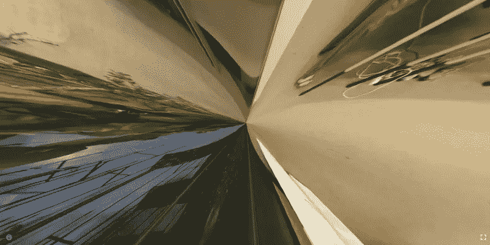

为了避免在图片的顶部和底部有太多的细节，你可以在图片的上方和下方增加空间，让图片看起来更整洁。有很多技巧你可以尝试给一个漂亮的顶部和底部区域，不会太皱，我最喜欢的是在顶部和底部添加一个模糊的反转图像。

要尝试这种方法，在 photoshop 中创建一个 2048 x 1024 的图像，并在其中粘贴三个全景图像:

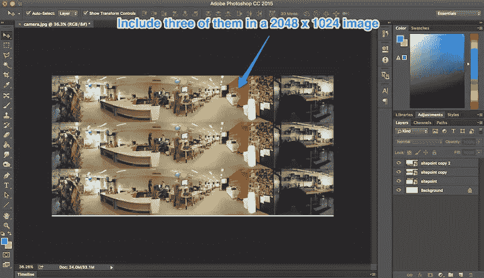

拉伸所有三个，使其充满画布，然后使用*编辑>变换>垂直翻转*翻转顶部和底部的图像:

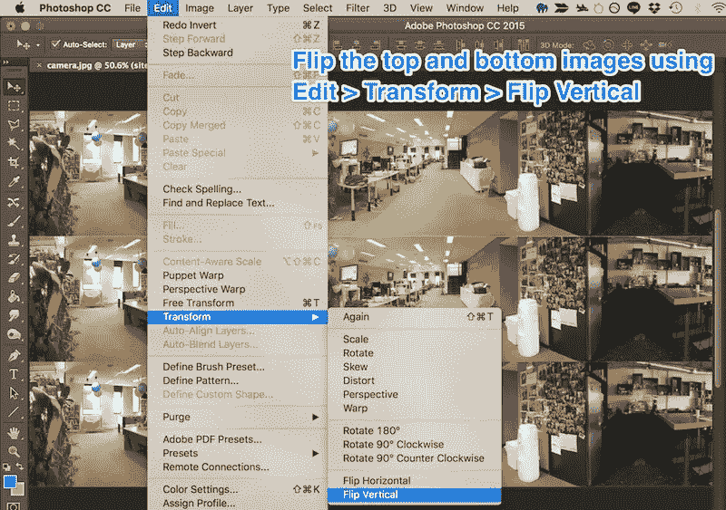

应该是这样的:

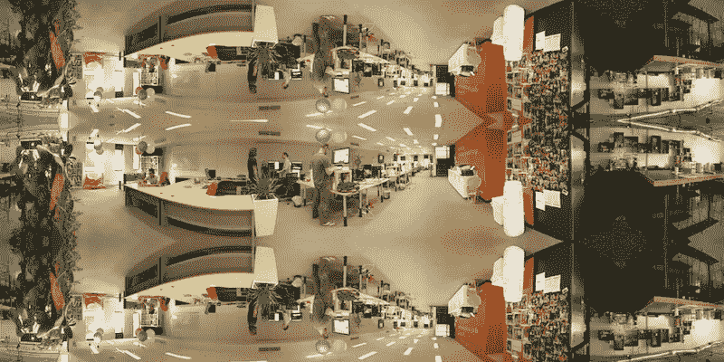

复制顶部和底部的图像，然后使用*滤镜>模糊>高斯模糊*模糊副本:

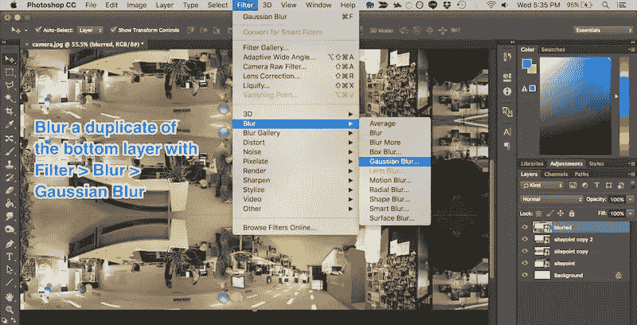

尝试不同的半径值，因为有些场景模糊程度越高效果越好，反之亦然:

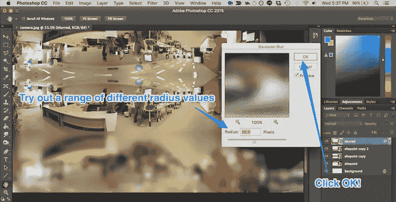

拉伸每个模糊层，使它们延伸到图像之外(因为边缘会淡出，我们不希望它们在画布边缘淡出):

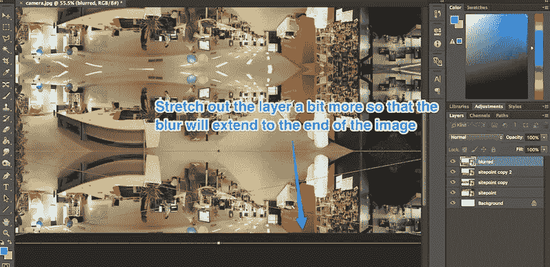

我们图像的最终结果应该是这样的:

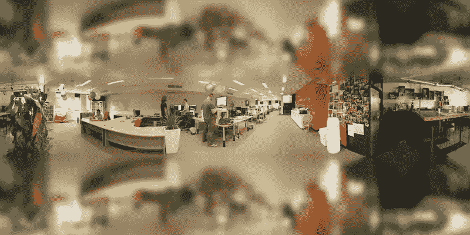

如果你有 photoshop 技巧，你可能会想出其他方法来使图像的底部和顶部看起来不那么奇怪。有些场景会比其他场景更容易，更不明显！

## 嵌入我们的图像

在 VR 视图中嵌入我们的图像有两种选择。我们可以嵌入谷歌托管的 VR 视图，也可以托管我们自己的版本。目前，在同一个服务器上托管我们自己的版本更可靠。当 VR 视图和图像托管在不同的服务器上时，iOS Safari 上的工作不太正常。如果使用谷歌托管的虚拟现实视图，带有图像的服务器还需要能够允许跨源资源共享(CORS)。

### 使用谷歌托管的虚拟现实视图

要快速测试 VR 视图是什么样的，您可以在您的网页中包含以下内容:

```
<iframe width="100%"
	height="300px"
	allowfullscreen
	frameborder="0"
	src="//storage.googleapis.com/vrview/index.html?image=//storage.googleapis.com/vrview/examples/coral.jpg&
	is_stereo=true">
</iframe>
```

Google 的示例代码实际上是这样的:

[//storage.googleapis.com/vrview/index.html?image=//storage.googleapis.com/vrview/examples/coral.jpg&is_stereo=true](//storage.googleapis.com/vrview/index.html?image=//storage.googleapis.com/vrview/examples/coral.jpg&is_stereo=true)

默认情况下，你会看到一个可爱的 360 度珊瑚礁鱼全景！如果您更改 iframe 的 URL 中的`image=`参数，您可以将全景图设置为您自己的图像。只要您用来托管映像的服务器与 CORS 一起工作，这应该就可以了。

*你会在这里看到一个`is_stereo=true`属性——这是在一个图像中使用全景图的副本来设置图像的时候。为了简单起见，在我们的自定义图像示例中，我们没有走这条路！关于这方面的更多信息，[参见谷歌关于虚拟现实视图的文档](https://developers.google.com/cardboard/vrview)。*

### 自己主持虚拟现实视图

谷歌托管的虚拟现实视图非常方便，就像嵌入 YouTube 视频一样简单——非常适合快速嵌入全景内容。但是，如果您希望在许多平台上为大量观众使用此功能，您将希望自己托管 VR 视图。否则，图像在 iOS Safari 上会出现方向错误。希望这个问题很快得到解决，不再需要自托管了！

建立自托管并不太难。从[谷歌的虚拟现实视图 GitHub](https://github.com/google/vrview) 下载代码，并把它放在公共访问的地方。如果您将它保存在服务器上名为“vrview”的文件夹中，那么您将能够在`//yourdomain.com/vrview/?image=examples/coral.jpg&is_stereo=true`访问它。如果你有直接为此设置的主机(或者有直接指向它的域名)，那么你可以避免使用`/vrview`位。

要添加其他图像，请将它们包含在您的服务器中您喜欢的任何位置(例如`images/yourimage.jpg`)，然后更改上面的 URL 以查找这个新图像(例如`//yourdomain.com/vrview/?image=images/yourimage.jpg`)。

如果你只是想用你自己的图片快速测试一下，而你自己还没有准备好托管，一个很好的选择是使用 GitHub 页面。

### 在 GitHub 页面上托管 VR 视图

你可以避免自己下载和托管 VR 视图，转而使用 Google 的存储库，然后使用 GitHub Pages 将其托管在你的 GitHub 帐户上。

首先，进入[谷歌的虚拟现实视图 GitHub repo](https://github.com/google/vrview) 并点击“分叉”:

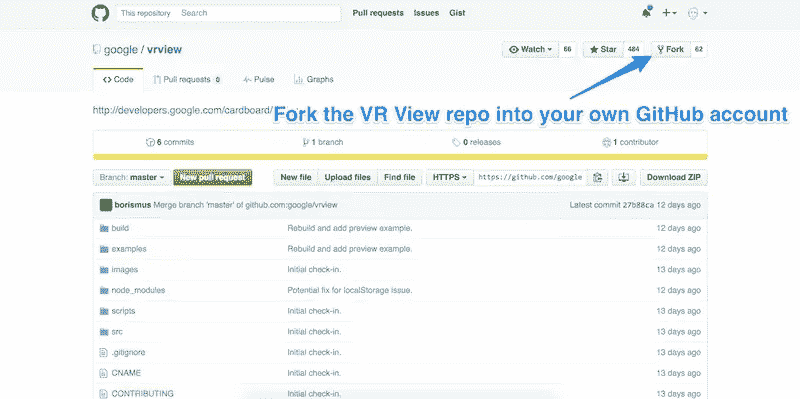

然后，在回购的分支中，找到 CNAME 文件并单击它:

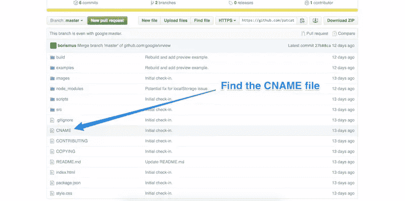

这个文件将为你的 GitHub 页面分配一个域名。如果你有一个可以使用的域名，并且想设置它来使用它，[阅读 GitHub 的指南，使用 GitHub 页面](https://help.github.com/articles/using-a-custom-domain-with-github-pages/)自定义域名。否则，单击右侧的垃圾桶图标，将该文件从您的分叉版本的回购中删除。这将允许您使用典型的`http://you.github.io/`地址。

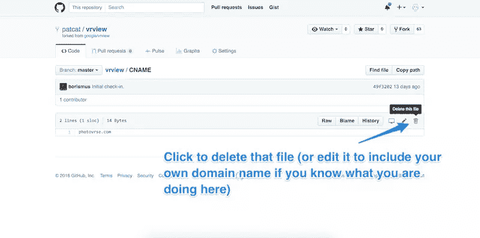

提交变更:

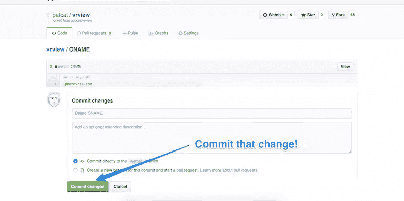

最后，在 VR 视图的分叉版本中创建一个新的分支，并将其命名为*“GH-pages”*。该分支中的所有内容都可以在您的 GitHub 页面上访问到:

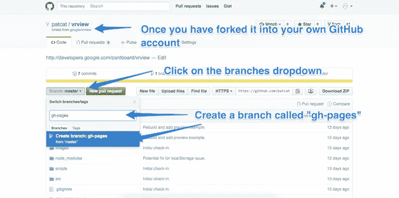

如果你现在访问`http://you.github.io/vrview/?image=examples/coral.jpg`，你应该有自己的 VR 视图工作版本了！

从这里，你可以在任何你喜欢的地方添加你自己的图片，就像你在上面做的自托管一样。在这种情况下，您需要将该图像直接添加到您的 *gh-pages* 分支中，或者添加到 *master* 中，然后从那里将它带到 *gh-pages* 分支中。如果您是 GitHub 的新手，您可以避免命令行的混乱，只需在图像文件夹打开时将图像拖到浏览器窗口中。

一旦你更新了图片，改变 URL 到目标图片(例如`http://you.github.io/vrview/?image=yourimage.jpg`)，你应该可以看到一个 360 度全景图！

## 在行动！

这里有一个在 SitePoint 办公室工作的 360 度预览图——最后，所有的 SitePoint 员工都可以在空闲时间再次访问办公室！点击右下角的全屏图标可以全屏查看。如果你在智能手机上，它旁边也会有一个 VR 图标。如果你有谷歌 Cardboard 耳机，请点击它，尽情享受吧！

[https://patcat.github.io/vrview/?image=examples/sitepoint.jpg](https://patcat.github.io/vrview/?image=examples/sitepoint.jpg)

你可以在[我的 VR 视图 GitHub 页面](http://patcat.github.io/vrview/?image=examples/sitepoint.jpg)上看到 VR 视图本身！

## 结论

谷歌的虚拟现实视图增加了另一个为网络创建 360 度虚拟现实内容的简单选项，并且非常容易组合在一起！

如果你有自己的 360 度视角，我很想看看你创造了什么！请在下面的评论中告诉我，或者在 Twitter 上通过 [@thatpatrickguy](https://www.twitter.com/thatpatrickguy) 与我联系。

## 分享这篇文章