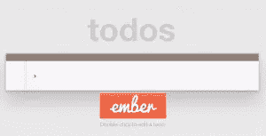
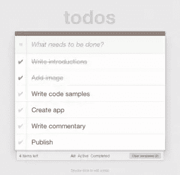

# 轨道上的 Ember 和 TodoMVC

> 原文：<https://www.sitepoint.com/ember-todomvc-rails/>



随着客户端 MVC 框架受到越来越多的关注，我决定是时候真正看看其中的一个了，并自己决定这种宣传是否值得。

我敢肯定，你们中的许多人在观看其他人[做](http://railscasts.com/episodes/408-ember-part-1)[同样做](http://railscasts.com/episodes/405-angularjs)的时候，已经在摆弄这些框架了。这些简短的涉猎告诉你关于构建有用的东西是什么样子的。在这篇文章中，我将探索构建有实际价值的东西是什么感觉。

选择正确的 MVC 框架似乎很困难。还有 Backbone.js，Angular.js，Ember.js 等等。在我的评估中，务实的 Rails 开发人员认为 Ember.js 是最友好的 Rails 框架。它与 Rails 集成得很好，当从后端切换到前端时，它是一个很好的选择。

为了构建一些有趣的东西并且不重复发明轮子，我们将在 [TodoMVC 应用程序](http://todomvc.com/architecture-examples/emberjs/)的基础上构建。这和在[官方 ember 指南](http://emberjs.com/guides/getting-started/)中作为例子使用的是同一个应用。我们的版本将关注如何通过以下方式构建和扩展它:

*   移动到 Rails 项目
*   使用 Rails 作为其后端存储
*   添加身份验证
*   为经过身份验证的用户添加个人分发名单
*   添加列表的受保护共享

有很多内容要涉及，所以这将需要几篇文章。今天，我们将介绍如何将应用程序转移到 Rails 项目中运行，并使用 Rails 进行后端存储。

## 余烬的 TodoMVC

TodoMVC 应用程序被用作比较前端 javascript 框架的通用示例。它有足够的功能来展示这个框架，同时，对任何潜在的开发者来说都是非常熟悉的。让我们简单回顾一下这些特性。

该应用程序显示一个待办事项列表，顶部有一个文本字段。您可以使用文本字段向列表中添加新项目。单个项目也可以通过双击进行编辑，并使用鼠标悬停时显示的移除图标进行移除。所有待办事项都可以使用输入旁边的复选框标记为完成。

列表下方有一个未完成项目的计数器和一个显示所有/活动/已完成任务的过滤器。最后，您可以使用底部的“清除已完成”按钮从列表中删除所有已完成的项目。



这篇文章不会涉及每一个细节，因为在官方 ember 指南上有一篇很好的文章。这里，重点是对各部分如何组合在一起的高层次概述，让我们清楚地看到，在我们将示例移植到 Rails 项目中时，哪些部分应该放在哪里。

基础模板是您熟悉 Ember 应用程序的起点。这个模板是所有东西汇集在一起的地方:你可以(从`script`标签中)看到应用程序的大小和东西的位置。以下摘录来自 TodoMVC 应用程序:

```
<!doctype html>
<html lang="en" data-framework="emberjs">
  <head>
    <meta charset="utf-8">
    <title>ember.js • TodoMVC</title>
    <link rel="stylesheet" href="bower_components/todomvc-common/base.css">
  </head>
  <body>
    <script type="text/x-handlebars" data-template-name="todos">
    <!--handlebars template content omitted-->
    </script>

    <!--library files-->
    <script src="bower_components/todomvc-common/base.js"></script>
    <script src="bower_components/jquery/jquery.js"></script>
    <script src="bower_components/handlebars/handlebars.js"></script>
    <script src="bower_components/ember/ember.js"></script>
    <script src="bower_components/ember-data/ember-data.js"></script>
    <script src="bower_components/ember-localstorage-adapter/localstorage_adapter.js"></script>

    <!--application files-->
    <script src="js/app.js"></script>
    <script src="js/router.js"></script>
    <script src="js/models/todo.js"></script>
    <script src="js/controllers/todos_controller.js"></script>
    <script src="js/controllers/todo_controller.js"></script>
    <script src="js/views/edit_todo_view.js"></script>
    <script src="js/views/todos_view.js"></script>
    <script src="js/helpers/pluralize.js"></script>
  </body>
</html>
```

在很大程度上，它看起来像一个带有大量 javascript 的标准 HTML5 文档。唯一的非标准零件是 **x 形车把**模板。代码在这里被省略了，但是在[官方余烬指南](http://emberjs.com/guides/getting-started/)中有讨论。像这样把它放在 HTML 里面对小应用程序来说没问题，但是我们会把它提取出来作为迁移到 Rails 的一部分。

javascript 导入分为两部分:第一部分是导入 Ember 应用程序运行所需的库文件，另一部分是 Ember 应用程序本身。这两者在指南中都有更详细的讨论，所以请参考它以获得更多信息。

## 设置轨道

Rails 对托管 Ember 应用程序有很好的支持。你所需要做的就是在你的 gem 文件中包含 [ember-rails](https://github.com/emberjs/ember-rails) gem 并生成安装文件。

```
gem 'ember-rails'
gem 'ember-data-source', '>= 1.0.0.beta7'

rails g ember:bootstrap
```

生成器在**app/assets/JavaScript**下创建一个 ember 文件夹结构。当前版本并不完美，需要一些小的调整来完成设置。

首先去掉原来的**app/assets/JavaScript s/application . js**。然后，在加载 Ember 之前，在**app/assets/JavaScript s/application . js . coffee**的最顶端添加下面两行代码来加载 jQuery。

```
#= require jquery
#= require jquery_ujs
```

要打开根页面，将以下内容添加到 **config/routes.rb**

```
Rails.application.routes.draw do
  root to: 'application#index'
end
```

另外，添加一个空的**应用程序/视图/应用程序/索引. html.erb** 。这是一个很好的起点，使用默认的`ApplicationController`来呈现`index`动作，不需要更多的代码。启动 Rails 应用程序(`rails s`)，将浏览器指向 [http://localhost:3000](http://localhost:3000) 以确保一切正常。

## 移动到 doMVC 到 Rails

是时候将 TodoMVC 应用程序复制到我们的 Rails 应用程序中了。如果你想跳到最后，结果代码在 [github](https://github.com/tastejs/todomvc/tree/gh-pages/architecture-examples/emberjs) 上。

首先将前面讨论的车把模板复制到**app/views/application/index . html . haml**。编辑**app/views/layouts/application . html . erb**文件，方法是移除`turbolinks`引用，并将`javascript_include_tag`移动到`body`标签内的`yield`之后。对于可选积分，我们可以从 **Gemfile** 中移除 turbolinks，因为我们不会使用它们。

通过复制以下文件并将其转换为 CoffeeScript 来完成迁移。

**js/routes . js =>app/assets/JavaScript s/routes . js . coffee**

```
TadaEmber.Router.map ->
  @resource 'todos', path: '/', ->
    @route 'active'
    @route 'completed'

TadaEmber.TodosRoute = Ember.Route.extend
  model: -> @store.find('todo')

TadaEmber.TodosIndexRoute = Ember.Route.extend
  setupController: -> @controllerFor('todos').set('filteredTodos', this.modelFor('todos'))

TadaEmber.TodosActiveRoute = Ember.Route.extend
  setupController: ->
    todos = @store.filter 'todo', (todo) ->
      !todo.get('isCompleted')

    @controllerFor('todos').set('filteredTodos', todos)

TadaEmber.TodosCompletedRoute = Ember.Route.extend
  setupController: ->
    todos = @store.filter 'todo', (todo) ->
      todo.get('isCompleted')

    @controllerFor('todos').set('filteredTodos', todos)
```

**js/models/todo . js =>app/assets/JavaScript s/models/todo . js**

```
TadaEmber.Todo = DS.Model.extend
  title: DS.attr('string')
  isCompleted: DS.attr('boolean')
```

**js/controllers/todos*controller . js =>app/assets/JavaScript s/controllers/todos*controller . js . cofee**

```
TadaEmber.TodosController = Ember.ArrayController.extend
  actions:
    createTodo: ->
      title = @get('newTitle').trim()
      return if !title

      todo = @store.createRecord 'todo',
        title: title
        isCompleted: false
      todo.save()

      @set('newTitle', '')

    clearCompleted: ->
      completed = @get('completed')
      completed.invoke('deleteRecord')
      completed.invoke('save')

  remaining: Ember.computed.filterBy('content', 'isCompleted', false)
  completed: Ember.computed.filterBy('content', 'isCompleted', true)

  allAreDone: ((key, value) ->
    if value != undefined
      @setEach('isCompleted', value)
      return value;
    else
      length = @get('length')
      completedLength = @get('completed.length')

      return length > 0 && length == completedLength
  ).property('length', 'completed.length')
```

**js/controllers/todo*controller . js =>app/assets/JavaScript s/controllers/todo*controller . js . coffee**

```
TadaEmber.TodoController = Ember.ObjectController.extend
  isEditing: false

  bufferedTitle: Ember.computed.oneWay('title')

  actions:
    editTodo: -> @set('isEditing', true)
    doneEditing: ->
      bufferedTitle = @get('bufferedTitle').trim()
      if Ember.isEmpty(bufferedTitle)
        Ember.run.debounce(@, 'removeTodo', 0)
      else
        todo = @get('model')
        todo.set('title', bufferedTitle)
        todo.save()

      @set('bufferedTitle', bufferedTitle)
      @set('isEditing', false)

    cancelEditing: ->
      @set('bufferedTitle', @get('title'))
      @set('isEditing', false)

    removeTodo: -> @removeTodo()

  removeTodo: ->
    todo = @get('model')
    todo.deleteRecord()
    todo.save()

  saveWhenCompleted: (->
    @get('model').save()
  ).observes('isCompleted')
```

**js/views/edit*todo*view . js =>app/assets/JavaScript s/views/edit*todo*view . js . coffee**

```
TadaEmber.EditTodoView = Ember.TextField.extend
  focusOnInsert: (->
    @.$().val(@.$().val())
    @.$().focus
  ).on('disInsertElement')

Ember.Handlebars.helper('edit-todo', TadaEmber.EditTodoView)
```

**js/views/todos*view . js =>app/assets/JavaScript s/views/todos*view . js . coffee**

```
TadaEmber.TodosView = Ember.View.extend
  focusInput: (-> @.$('#new-todo').focus() ).on('disInsertElement')
```

**js/helpers/polarize . js =>app/assets/JavaScript s/helpers/polarize . js**

```
Ember.Handlebars.helper 'pluralize', (singular, count) ->
  inflector = Ember.Inflector.inflector;

  count == 1 ? singular : inflector.pluralize(singular)
```

**应用/资产/JavaScript/store . js . coffee**

```
TadaEmber.Store = DS.Store.extend()
  # Override the default adapter with the `DS.ActiveModelAdapter` which
  # is built to work nicely with the ActiveModel::Serializers gem.
  #adapter: '_ams'

TadaEmber.ApplicationAdapter = DS.LSAdapter.extend
  namespace: 'tada-emberjs'
```

快好了。将**bower*components/ember-local storage-adapter/local storage*adapter . js**复制到**app/assets/JavaScript/local storage*adapter . js***中，并将以下行添加到**app/assets/JavaScript/tadaember . js . coffee**的顶部

```
#= require ./localstorage_adapter
```

将**app/views/application/index . html . erb**中`script`标签的内容复制到**app/JavaScript s/templates/todos . HBS**中，完成转换。最后，将 css 和图像从原始代码复制到我们的 **assets** 目录将会增加一些样式。

## 在后端添加导轨

该列表将其数据保存在当前运行该应用程序的浏览器的`localstorage`中。在另一个浏览器中打开应用程序会导致应用程序重置为干净状态，没有任何待办事项。我们将通过使用 Rails 应用程序作为存储提供者来解决这个问题。

首先，生成一个模型并进行迁移

```
rails g model Todo title is_completed:boolean
rake db:migrate
```

添加一个控制器，作为 Ember 应用程序的 API。不要忘记给路由器添加一个资源调用。

**app/controllers/todos _ controller . Rb**

```
class TodosController < ApplicationController
  respond_to :json

  def index
    respond_with Todo.all
  end

  def show
    respond_with Todo.find(params[:id])
  end

  def create
    respond_with Todo.create(todo_params)
  end

  def update
    respond_with Todo.update(params[:id], todo_params)
  end

  def destroy
    respond_with Todo.destroy(params[:id])
  end

  private
    # Never trust parameters from the scary internet, only allow the white list through.
    def todo_params
      params.require(:todo).permit(:title, :is_completed)
    end
end
```

**config/routes.rb**

```
Rails.application.routes.draw do
  resources :todos
  root to: 'application#index'
end
```

最后，为 Rails 添加一个序列化器来正确地序列化模型。Ember 期望每个模型都有一个字符串 ID。`ActiveModelAdapter`将处理来自 JSON 的 snakecase `is_completed`和 Ember 应用中使用的 camelcase `isCompleted`之间的转换。

**app/serializer/todo _ serializer . Rb**

```
class TodoSerializer < ActiveModel::Serializer
  # fix for ember-data deserializer not being able to handle non-string ids
  def id
    object.id.to_s
  end

  attributes :id, :title, :is_completed
end
```

为了摆脱训练并使用新的 Rails 后端，请更新 Ember store 以使用 ember-rails gem 提供的 activemodel store。(详见[本](http://emberjs.com/guides/models/using-the-store/)。)

```
TadaEmber.Store = DS.Store.extend
  # Override the default adapter with the `DS.ActiveModelAdapter` which
  # is built to work nicely with the ActiveModel::Serializers gem.
  adapter: '-active-model'
```

最终产品可在 [github](https://github.com/m1k3/tada-ember) 上获得

## 结论

我们已经成功地将 TodoMVC 应用从一个独立的应用迁移到 Rails 内部运行。我们也不再使用本地存储，而是将数据存储在 Rails 中。在以后的文章中，我们将解决添加认证和通过 url 共享列表的能力。

## 分享这篇文章