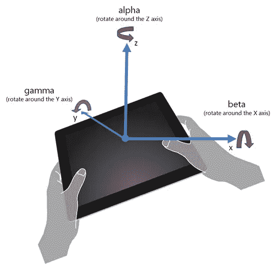
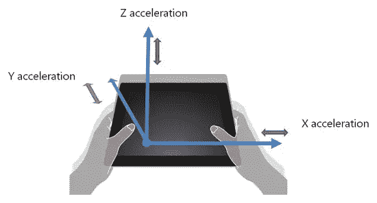

# 新兴规格:探索设备方向和运动

> 原文：<https://www.sitepoint.com/emerging-specs-exploring-device-orientation-and-motion/>

网络标准总是在变化。就像 [WebSockets 一样，](http://blogs.msdn.com/b/ie/archive/2011/09/15/site-ready-websockets.aspx)昨天的原型成为明天的成熟标准。在标准团体中获得动力的最新原型之一是在 HTML5Labs.com 的 W3C [设备定向事件规范草案](http://dev.w3.org/geo/api/spec-source-orientation.html)的实现。该规范定义了新的 DOM 事件，这些事件提供了关于设备的物理方向和运动的信息。这种 API 将让网络开发者利用现代设备的传感器轻松交付高级网络用户体验。

通过设备定向 API，开发人员可以探索游戏的新输入机制，应用的新手势(如“摇动以清除屏幕”或“倾斜以缩放”)甚至增强现实体验。原型的安装包括一个示例游戏，可以帮助您开始理解 API。

## 这是如何工作的

设备方向 API 公开了两种不同类型的传感器数据:方向和运动。

当设备的物理方向改变时(例如，用户倾斜或旋转它)，在窗口触发`deviceorientation`事件，并提供旋转的α、β和γ角度(以度表示):



```
<div id="directions"></div>

<script>

    window.addEventListener("deviceorientation", findNorth);

    function findNorth(evt) {

        var directions = document.getElementById("directions");

        if (evt.alpha < 5 || evt.alpha > 355) {

            directions.innerHTML = "North!";

        } else if (evt.alpha < 180) {

            directions.innerHTML = "Turn Left";

        } else {

            directions.innerHTML = "Turn Right";

        }

    }

</script>
```

当设备移动或旋转(更准确地说，加速)时，`devicemotion`事件在窗口触发，并提供 x、y 和 z 轴上的加速度(有和没有重力加速度对设备的影响，以 m/s <sup>2</sup> 表示)以及α、β和γ旋转角度的变化率(以度/秒表示):



```
<div id="status"></div>

<script>

    window.addEventListener("devicemotion", detectShake);

    function detectShake(evt) {

        var status = document.getElementById("status");

        var accl = evt.acceleration;

        if (accl.x > 1.5 || accl.y > 1.5 || accl.z > 1.5) {

            status.innerHTML = "EARTHQUAKE!!!";

        } else {

            status.innerHTML = "All systems go!";

        }

    }

</script>
```

## 试用原型

你可以在 [HTML5Labs](http://html5labs.interoperabilitybridges.com/prototypes/device-orientation-events/device-orientation-events/download) 下载原型。该原型要求 Internet Explorer 10 在带有 Windows 8 支持的加速度传感器的设备上运行。这个原型是 Internet Explorer 在桌面上的扩展，开发者可以在桌面上直接看到这些 API。

要开始使用原型构建您自己的页面，您需要做的就是安装原型，然后包含对`DeviceOrientation.js`脚本文件的引用(安装原型后复制到桌面):

```
<script type="text/javascript" src="DeviceOrientation.js"></script>
```

## 我们需要您的反馈

我们想听听开发者对 W3C 设备定向事件规范的原型实现的意见，所以请通过评论这篇文章或给我们发消息来告诉我们你的想法。

## 分享这篇文章