# 启用 PhpMyAdmin 的额外特性

> 原文：<https://www.sitepoint.com/enable-phpmyadmins-extra-features/>

PhpMyAdmin 是管理数据库时最常用的工具之一。默认情况下，PhpMyAdmin 做得很好。然而，它附带了许多方便的额外扩展，可以很容易地激活。在本文中，我们将激活这些扩展，看看它们能为我们做些什么。

## 设置

在继续之前，请确保 PhpMyAdmin 已经启动并正在运行。登录后，您可能会在主面板的底部看到以下消息:

```
The phpMyAdmin configuration storage is  not completely configured, some extended features have been deactivated.  To find out why click here.
```

点击`here`会将你带到一个页面，显示你还没有激活所有的扩展。您可以通过更改`config.inc.php`文件并添加以下行来激活它们。

```
$cfg['Servers'][$i]['controluser'] = 'pma';
$cfg['Servers'][$i]['controlpass'] = 'pmapass';
$cfg['Servers'][$i]['pmadb'] = 'phpmyadmin';
$cfg['Servers'][$i]['bookmarktable'] = 'pma__bookmark';
$cfg['Servers'][$i]['relation'] = 'pma__relation';
$cfg['Servers'][$i]['table_info'] = 'pma__table_info';
$cfg['Servers'][$i]['pdf_pages'] = 'pma__pdf_pages';
$cfg['Servers'][$i]['table_coords'] = 'pma__table_coords';
$cfg['Servers'][$i]['column_info'] = 'pma__column_info';
$cfg['Servers'][$i]['history'] = 'pma__history';
$cfg['Servers'][$i]['recent'] = 'pma__recent';
$cfg['Servers'][$i]['table_uiprefs'] = 'pma__table_uiprefs';
$cfg['Servers'][$i]['users'] = 'pma__users';
$cfg['Servers'][$i]['usergroups'] = 'pma__usergroups';
$cfg['Servers'][$i]['navigationhiding'] = 'pma__navigationhiding';
$cfg['Servers'][$i]['tracking'] = 'pma__tracking';
$cfg['Servers'][$i]['userconfig'] = 'pma__userconfig';
$cfg['Servers'][$i]['designer_coords'] = 'pma__designer_coords';
$cfg['Servers'][$i]['favorite'] = ‘pma__favorite’;
$cfg['Servers'][$i]['savedsearches'] = 'pma__savedsearches';
```

根据自己的喜好更改用户名、密码和数据库名称。所有其他配置值都是表名。如果将这些留空，您将禁用这些扩展。然而，如果你想激活任何，我会建议保持与我上面提供的相同的名称。根据您的 PhpMyAdmin 版本，默认情况下并非所有的配置值都可用。在这种情况下，我使用的是 PhpMyAdmin 的 4.2.x 版本。

完成后，就该创建数据库了。使用您在配置文件中定义的名称创建一个数据库。接下来，您可以在您的机器上搜索一个名为`create_tables.sql`的文件，可能在 PhpMyAdmin 的根文件夹或 scripts 子文件夹中。就 Linux 机器而言，你可能会在`/usr/share/phpMyAdmin/examples/`或`/usr/share/doc/phpmyadmin/scripts/`中找到它。对新创建的数据库运行这个 SQL 文件。如果您在上面的配置中更改了任何表名，请确保您也在这里更改了表名。

接下来，我们需要用我们配置的密码创建用户。使用您定义的用户名和密码运行以下查询。

```
GRANT USAGE ON mysql.* TO 'pma'@'localhost' IDENTIFIED BY 'pmapass';
GRANT SELECT (
    Host, User, Select_priv, Insert_priv, Update_priv, Delete_priv,
    Create_priv, Drop_priv, Reload_priv, Shutdown_priv, Process_priv,
    File_priv, Grant_priv, References_priv, Index_priv, Alter_priv,
    Show_db_priv, Super_priv, Create_tmp_table_priv, Lock_tables_priv,
    Execute_priv, Repl_slave_priv, Repl_client_priv
    ) ON mysql.user TO 'pma'@'localhost';
GRANT SELECT ON mysql.db TO 'pma'@'localhost';
GRANT SELECT ON mysql.host TO 'pma'@'localhost';
GRANT SELECT (Host, Db, User, Table_name, Table_priv, Column_priv)
    ON mysql.tables_priv TO 'pma'@'localhost';
```

```
GRANT SELECT, INSERT, UPDATE, DELETE ON phpmyadmin.* TO 'pma'@'localhost';
```

当登录和退出 PhpMyAdmin 时，我们之前看到的消息应该会消失。如果它还在，请点按链接以查看缺少了什么。

让我们深入研究所有这些扩展。

## 书签

通过启用`bookmark`，您可以为您的查询添加书签。当您创建一个查询时，您可以勾选一个框来标记它。此外，当查询已经运行时，您可以通过向下滚动到页面底部并填写书签框来为其添加书签。

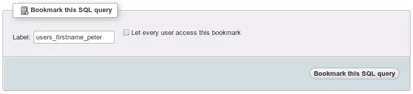

每当您转到 SQL 选项卡时，您都会在底部看到您可以在几个书签查询之间进行选择。选择要使用的选项，并定义是否要提交、查看或删除查询。

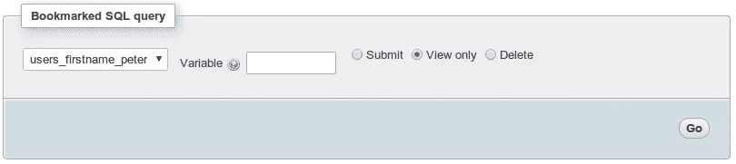

## 关系

选项`relation`可能是我在这个列表中用过的最好的特性之一。如果您使用外键，这些键将变成可点击的。通过单击外键，您将被重定向到另一个表，显示带有该特定键的记录。

此外，在添加或编辑带有外键的记录时，您将得到一个包含所有可能选项的选择列表，而不是文本字段。

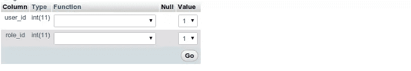

## 表格信息

在外键的情况下，看到包含所有可能值的下拉列表是很好的。然而，如果它显示某一列而不是 ID，那就更好了。为此，确保激活`table_info`。转到主表，单击结构，然后单击关系视图链接。如果您一直向下滚动到页面的底部，您可以定义要显示哪一列。

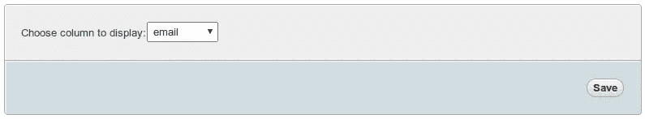

每当我现在创建一个带有外键的新记录时，我选择的列中的值就会显示在主键的旁边。你不再需要记住一把钥匙。

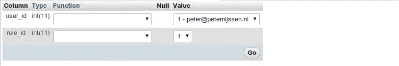

## PDF 页面

可以将您的关系导出为 PDF 格式。要做到这一点，您需要激活配置中的`pdf_pages`、`table_coords`和`relation`。接下来，打开要导出为 PDF 的数据库。点击`operations`选项卡。接下来，点击`Edit or export relational schema`链接并继续。填写所有字段，然后单击提交。如果你完成了表格，一个 PDF 将会出现，显示所有你要求的数据。

## 列信息

使用`column info`，您可以给列名添加注释。当你想让其他人明白你在这个专栏中期待什么或者它包含什么的时候，这可以派上用场。您可以通过更改列数据来做到这一点。您会注意到添加了一个新的注释字段。如果您填写了注释，该注释将出现在列标题的正下方。


除此之外，您还可以对列应用转换，就像添加注释一样。通过转换，您可以将文件名转换为可点击的链接，这将打开实际的文件。

## 历史

如果您启用了`history`，您通过 PhpMyAdmin 运行的所有查询都会保存在您的历史记录中，直到您注销或关闭浏览器。您可以通过打开查询弹出窗口并点击`SQL History`来查看您的查询历史。

## 最近的

在导航面板中，您会注意到有一个“最近”按钮，其中包含一个下拉列表，显示您最近查看的所有表格。默认情况下，已经显示了最近表的列表。然而，如果您想在会话之间保持它的持久性，您可以在您的配置文件中激活`recent`，确保您最近的活动被保存。

## 表格用户界面首选项

查看表格时，您可以通过将列拖到不同的位置来对其重新排序。这些变化对你来说只是可见的变化。对于实际的表，顺序仍然是相同的。除此之外，您还可以对列进行升序和降序排序。在会话期间，您所做的视觉更改将被保存。但是，注销后，这些设置将恢复为默认值。通过启用`table_uiprefs`，设置将保持不变，确保您始终拥有与配置相同的视图。

## 用户和用户组

您可能不想向所有用户显示所有选项。在这种情况下，您可以通过转到 user 选项卡向 PhpMyAdmin 添加用户组。创建一个新群组，并定义他们可以看到的内容。接下来，您可以将用户分配到该组，确保他们只能看到您在创建该组时标记的菜单项。这样，您可以向不同类型的用户显示不同的视图，并确保您看不到任何没有使用的选项。

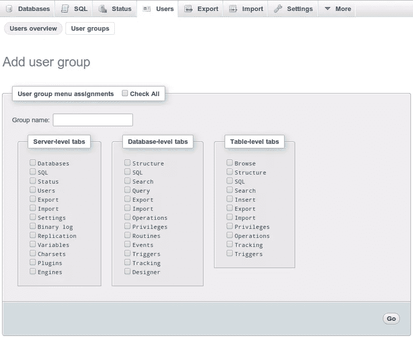

## 导航隐藏

使用`navigationhiding`，您可以在导航面板的概览中隐藏某些表格。点击桌子旁边的灯泡，它就会消失。您可以通过单击表格名称旁边的灯泡使其再次出现。这样，您可以隐藏不经常使用的表格，使视图更加整洁。

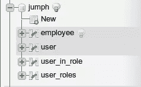

## 跟踪

通过跟踪，您可以跟踪通过 PhpMyAdmin 在特定表上执行的任何更改。通过转到表格，然后打开名为 tracking 的选项卡，您可以创建当前表格的一个版本。通过 PhpMyAdmin 对该表进行的任何更改现在都已保存。这样，您可以很容易地跟踪自该版本创建以来该表中发生了什么变化。

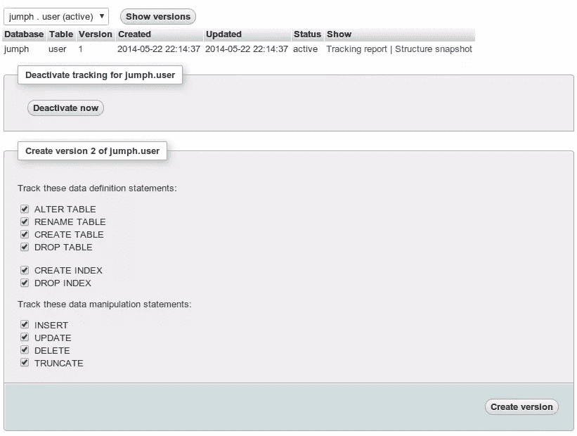

## 用户配置

默认情况下，任何用户配置都保存在您的浏览器中。这意味着每当您使用不同的浏览器或清理浏览器缓存时，您的所有设置都将丢失。通过激活`userconfig`，配置将保存在数据库中，允许您保留相同的设置。

## 设计师坐标

通过启用`designer_coords`，您可以在设计器模式下查看表之间的关系。如果你进入一个数据库，点击 designer，你会看到一个类似的视图，如下所示，显示所有的关系。其次，您可以通过此窗口直观地管理这些关系。

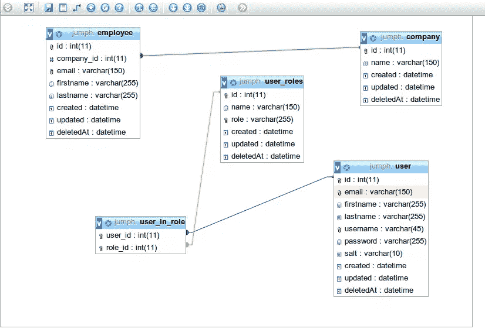

## 收藏夹

查看数据库时，您会注意到当您激活`favorite`时，表名旁边会出现星号。通过点击一个星号，您可以将该表添加到您的收藏夹。在导航面板中，您会看到一个收藏夹下拉列表。您添加到收藏夹中的任何表都将出现在此下拉列表中。

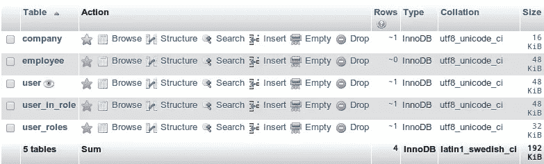

## 保存的搜索

当您打开一个数据库并进入查询选项卡时，您可以在此配置一个广泛的搜索。您可以通过添加书签来保存此搜索。请注意，这是一个与我们之前看到的 SQL 书签不同的书签。但是，这样您可以保存您的搜索并在以后执行它们。

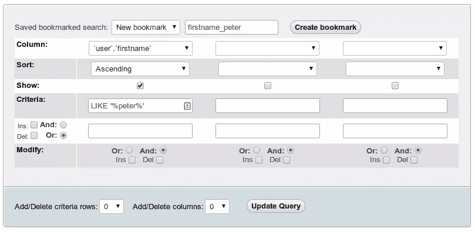

### 结论

激活这些扩展很容易，并且可以真正提高 PhpMyAdmin 的可用性。我特别喜欢这样一个事实，我可以点击外键，这样我就可以看到它连接到哪个记录。你打算在你的 PhpMyAdmin 中激活这些扩展吗？如果是，你打算激活哪个？你一直在使用它们吗？我很乐意在下面的评论中听到你的意见。

## 分享这篇文章