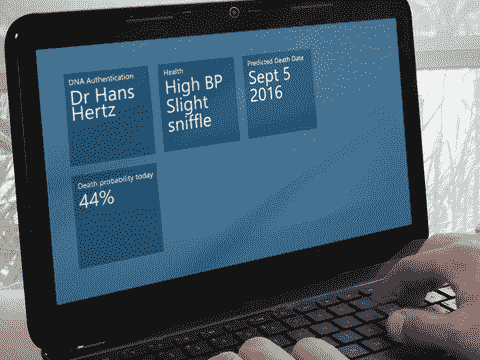

# 密码时代的终结

> 原文：<https://www.sitepoint.com/end-password-age/>

尽管计算技术取得了革命性的进步，我们仍然依赖一串字符来认证用户。密码起源于几百年前，当然是罗马军队使用的。在现代，麻省理工学院的 CTSS 在 1961 年引入了密码。不幸的是，密码问题非常普遍:

*   人是可以预测的。成千上万的人使用流行的密码，如“密码”、“123456”、“qwerty”和“salmonmousse”作为他们的凭证。
*   您的密码越强，就越难记住。
*   你的密码越多，你就越需要在贴在显示器上的便利贴上写下来。

网络加剧了这些问题。我们现在需要记住几十个公共系统的密码，这些系统对黑客、国家安全局或任何想破坏你的脸书主页的人都是开放的。

最后，计算能力的提高允许邪恶的开发者通过测试数百万个字符组合来使用暴力输入。随着我们向量子计算迈进，系统将能够在你想出密码之前正确地猜出你将要使用的每一个密码。

## 生物安全

指纹、视网膜和胯部气味分析等基本生物识别安全技术已经问世多年。硬件昂贵、不可靠，并且很容易被绕过。好莱坞电影突出了一些缺陷，如使用无意识的警卫，从玻璃上获取指纹，或在认证前移除身体器官。

幸运的是，乌兹别克斯坦杜米迪亚大学的汉斯·赫兹博士提出了生物识别安全的新时代。该方法验证脱氧核糖核酸(您的 DNA)的独特结构:

1.  你的 DNA 序列存放在中央核糖核酸分析入口。
2.  一个生物特征分析设备被连接到你的计算机上。这抽取了一小瓶血液——每当你访问某些网站时，你都会感到刺痛。其他因素如脉搏、体温、血压等。也经过测量，以确保设备可以直接接触到您的身体。
3.  您的计算机分析 DNA，对照门户验证大量基因序列，并允许或拒绝访问。

这个过程目前需要几天时间，但随着技术的进步，这个时间应该会缩短到几个小时。

## 生物效益

生物特征分析不限于身份验证。该软件可以充当虚拟医生，进行早期健康诊断和药物治疗建议。在极端的情况下，你当地的健康机构会被警告即将发生的问题。

赫兹博士声称还有更进一步的优势:“我们发现我妻子的曾祖母可能有一头姜黄色的头发。尽管我们最近已经分居，但我还是向她提供了纠正缺陷基因的疗法。”

## 社会意见书

顶级社交网络都表达了对该系统的兴趣。通过访问 DNA 记录，额外的处理可以建立谱系关系——也许可以识别失散多年的家庭成员或著名的祖先。

赫兹博士继续说道:
*“这是一项令人兴奋的技术应用。想象一下，登录脸书，被告知你的父亲不是你想象中的那个人，或者你要和你的妹妹结婚了。可能性实际上是无限的。”*

密码时代终于结束了。

## 分享这篇文章