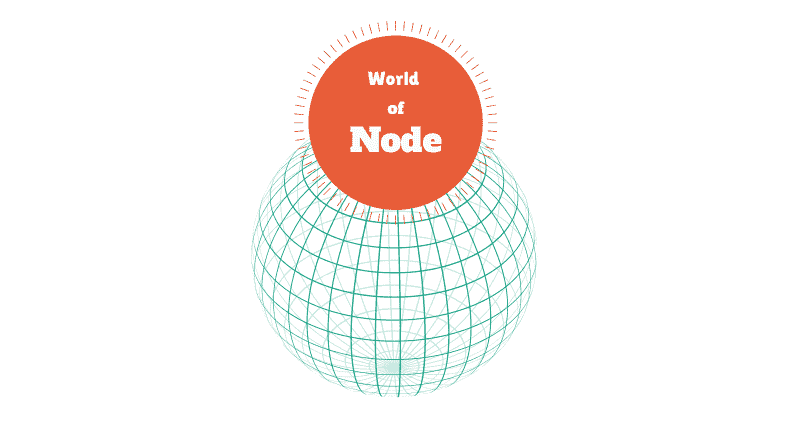
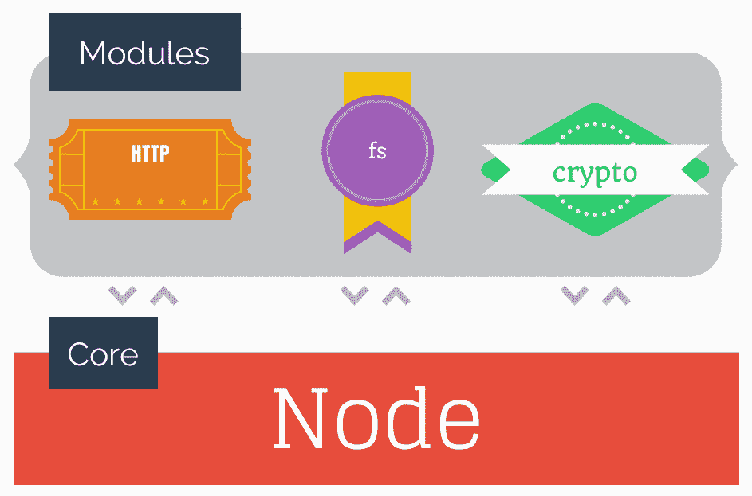

# 进入 Node.js 的世界

> 原文：<https://www.sitepoint.com/enter-world-node-js/>

这些天每个人都在谈论 [Node.js](http://nodejs.org) ，但你不太确定它是什么？或者，你只是想用一些书呆子的知识来打动你的朋友？本文将带您快速了解 Node.js 的世界！



## 背景

2009 年 5 月 27 日，Ryan Dahl 发布了用 JavaScript 和 C++编写的开源软件平台的初始版本。但他为什么把它命名为 Node 呢？[最初](http://www.theregister.co.uk/2011/03/01/the_rise_and_rise_of_node_dot_js/?page=4)这个项目，一个非阻塞的 web 服务器，被称为 **web.js** 。Ryan Dahl 很快发现一个 web 服务器是不够的，所以他创建了一个基础来控制称为节点的分布式系统之间的交互-一个事件驱动的非阻塞 I/O 系统。

Node 应用程序是使用 JavaScript 开发的，因为 Node 基于 Google 的开源 JavaScript 引擎 V8。V8 也是赋予 Chrome 卓越 JavaScript 性能的引擎。这允许您为运行在 Linux、MacOS、Windows 或 SunOS 上的每个设备创建应用程序。

您还可以获得一个大型的核心和第三方节点模块库来处理任何任务。核心模块与 Node 捆绑在一起，而第三方模块可以使用 Node 的软件包管理器来安装。而且，因为 Node 是在 MIT 许可下发布的，所以你可以免费使用所有这些！

## 模块

模块可以被认为是大型系统中最小的部分。从技术上讲，单个源文件被认为是一个模块，但通常多个文件一起工作来构成一个模块(或库)。模块旨在解决一个问题，而且仅仅是这个问题。然后，应用程序可以充当粘合剂，让这些模块一起工作。



## 安装节点

有多种方法可以在您的系统上安装 Node。您可以在任何受支持系统上从源代码构建节点，但是使用包管理器或安装程序通常更简单。

### Windows 操作系统

使用[自动安装器](https://github.com/joyent/node/wiki/Installation#wiki-automatic-install-with-microsoft-installer)安装节点。

### Linux 操作系统

安装**节点**包和你的系统[默认包管理器](https://github.com/joyent/node/wiki/Installing-Node.js-via-package-manager#wiki-ubuntu-mint-elementary-os)。

### 苹果个人计算机

可以使用[包、Flink、homebrew 或者 macports](https://github.com/joyent/node/wiki/Installing-Node.js-via-package-manager#wiki-osx) 来安装 Node。

### 是否安装了节点？

打开你的命令行，输入`node -v`。这将把当前安装的 Node 版本打印到终端窗口。如果您看不到版本号，则说明出现了问题，您应该尝试重新安装。您还应该通过键入命令`npm -v`来验证节点的程序包管理器(npm)是否已安装。

## 你好世界！

创建一个名为`hello_world.js`的文件。Node 允许您使用内置的`console.log()`功能将消息打印到终端。将以下代码添加到`hello_world.js`:

```
console.log('Hello World');
```

要执行这个程序，打开一个终端窗口并切换到包含`hello_world.js`的目录。在该目录中，键入命令`node hello_world`。这个命令调用节点并告诉它执行`hello_world.js`的内容。如果一切正常，您应该看到终端上打印出 Hello World 消息。

## 核心模块

如前所述，Node 附带了一组核心模块。本节描述了三个常用的核心模块，但本节绝不是全面的。

#### `console`

这类似于大多数 web 浏览器提供的`console`对象函数，但是输出被发送到标准输出(`stdout`)或标准错误(`stderr`)。在 Hello World 示例中，您已经看到了运行中的`console`对象。值得指出的是，`console`在每个节点应用程序中都是默认使用的，这意味着您不需要显式导入它。有关此模块的更多信息，请参见:

*   [文档](http://nodejs.org/api/console.html)
*   [来源](https://github.com/joyent/node/blob/master/lib/console.js)

#### `http`

当大多数人想到节点时，他们会想到 web 服务器。 [HTTP](http://en.wikipedia.org/wiki/Hypertext_Transfer_Protocol) 模块提供了处理 HTTP/HTTPS 流量的服务器和客户端。与`console`对象不同，`http`模块必须使用`require()`函数显式导入到应用程序中(您很快就会看到这样的例子)。关于`http`模块的更多信息可在此处获得:

*   [文档](http://nodejs.org/api/http.html)
*   [来源](https://github.com/joyent/node/blob/master/lib/http.js)

#### `fs`

`fs`模块提供了与文件系统交互的异步和同步功能。这篇文章不会深入讨论`fs`模块的细节，但是好奇的读者可以参考[网站之前关于这个主题的文章。官方节点文档和源代码也可从以下位置获得:](https://www.sitepoint.com/accessing-the-file-system-in-node-js/)

*   [文档](http://nodejs.org/api/fs.html)
*   [来源](https://github.com/joyent/node/blob/master/lib/fs.js)

## 一个简单的网络服务器

下面显示了一个非常简单的 web 服务器的源代码。该服务器利用前面提到的`http`核心模块。将下面的代码保存在`web_server.js`中。

```
// Load the "http" module
var http = require('http');

// Create a HTTP server
// - request comes from the client
// - response goes to the client
http.createServer(function(request, response) {

  // Send the HTTP status code "200 - ok" to the request 
  // and set the content type to "text/plain"
  response.writeHead(200, {'Content-Type': 'text/plain'});

  // Tell the server that everything has been sent to the client
  // so that the server considers this message as complete
  response.end('Hello World');

// Accept connections on port and IP
}).listen(1337, '127.0.0.1');

// Tell the user that the server is up and running
console.log('Server running at http://127.0.0.1:1337/');
```

通过在终端窗口中键入命令`node web_server`来运行服务器。您现在可以通过打开您最喜欢的浏览器并导航到 [http://127.0.0.1:1337/](http://127.0.0.1:1337/) 来访问服务器。您将在浏览器中看到我们美丽的 Hello World 消息。

## 节点程序包管理器

如果你想使用更多的核心模块，没有办法使用节点的包管理器，或 npm。npm 从包含 64，000 多个模块的注册表中安装第三方模块。从节点 0.6.3 版开始，npm 是自动捆绑安装的，可以马上使用。

### 安装软件包

npm 最常见的用例是从注册表安装模块。要安装一个模块，发出命令`npm install module_name`，其中`module_name`是模块在注册表中的 ID。例如，要安装 [Express](http://expressjs.com/) 框架，您可以发出以下命令:

`npm install express`

这将在您当前目录的`node_modules`子目录中安装 Express。如果您查看一下`node_modules`内部，您会看到另一个名为`express`的目录，其中包含了 Express 模块的代码。你还会在`express`中看到另一个`node_modules`目录。该目录包含 Express 依赖的所有模块。

您的代码所依赖的模块称为依赖项。在我们的示例 web 服务器中，`http`是一个依赖项，但是因为它是一个核心模块，所以我们不必担心安装它。如果您的代码依赖于第三方模块，那么 npm 需要知道它，以便可以安装它。依赖信息，以及关于应用程序的其他元数据存储在一个名为`package.json`的文件中。这个文件存储在应用程序的根目录中，包含 JSON 数据。

例如，假设您的项目依赖于`coffee-script`模块。你需要在你的`package.json`中包括这一点。幸运的是，当您使用`--save`参数安装模块时，您可以自动更新`package.json`，如下所示:

```
npm install --save coffee-script
```

当然，你可能还没有一个`package.json`文件，所以不会发生什么特别的事情。我们将很快再次访问`package.json`文件。现在，只需知道前面的命令会在您的`package.json`中创建如下内容:

```
...
  "dependencies": {
    "coffee-script": "^1.7.1"
  }
...
```

### 创建包

要创建一个包，只需要创建一个`package.json`文件。因为这是一个普通的 JSON 文件，所以您可以自己编写一个。但是，该文件应该包含某些字段，您很容易出错。因此，建议您使用`npm init`命令自动生成一个`package.json`。该命令将提示您输入重要的值。下面是一个`npm init`的例子。括号中的值是 npm 提供的建议。您可以简单地按 Enter 键接受建议，或者键入您自己的值，如`version`行所示。

```
name: (node-package.json) 
version: (0.0.0) 0.0.1
description: How to create a new package.json
entry point: (index.js) 
test command: 
git repository: (git://github.com/TimPietrusky/node-package.json.git) 
keywords: package, json
license: (ISC) MIT
```

完成所有提示后，将会创建一个`package.json`文件，其中包含项目名称(必填)、版本(必填)、描述、作者、关键字、存储库、主页和其他有用的数据。通过提供一个`package.json`文件，另一个开发人员能够轻松地安装您的模块及其所有依赖项。在[这个](https://github.com/TimPietrusky/node-package.json) GitHub repo(以及发布到 npm 注册表的任何 repo)中有一个`package.json`文件的例子。

这些只是`package.json`最基本的东西。如果你想深入了解所有可用的属性，你应该阅读 [`package.json`备忘单](http://package.json.nodejitsu.com/)。

## 结论

本文提供了使用 Node 的绝对基础知识。然而，这只是冰山一角，Node 是增长最快的社区之一。我建议查看 Node 项目的官方页面，获取代码、文章、视频等的链接。也请留意未来的 SitePoint 文章，这些文章涵盖的主题包括向 npm 发布代码、用于节点开发的 ide 以及使用 Node 的托管提供者。

*想了解更多相关信息吗？我们的姐妹公司 Learnable 有全新的 [Node.js 课程](https://learnable.com/courses/node-js-an-introduction-2866)！*

## 分享这篇文章