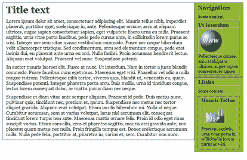
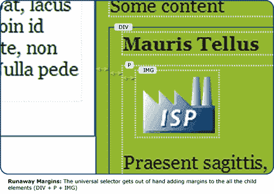

# 埃里克通用儿童选择器

> 原文：<https://www.sitepoint.com/erics-universal-child-selector/>

几周前，埃里克·迈耶发表了一篇关于模仿通用儿童选择器的小揭露。虽然我当时读了这本书，但大概花了一个星期才理解到它对我真的有用。我想我应该在这里看看。

如果您不熟悉子选择器，这里是 exec 摘要。

虽然这听起来像一些奇怪的“科幻克隆实验”，但“子选择器”实际上是一个很好的想法，它允许您设置规则，这些规则仅在给定元素直接位于指定的其他元素内部时应用。

在实践中，如果:

**'div#box p {…}'** 影响名为' #box '的 div 中任何位置的每个 P

**'div#box > p {…}'** 只影响 P 在名为' #box '的 div 中的一级。

现在，这将是非常方便的，如果不是因为 Internet Explorer 完全完全忽略了它。因此，子选择器通常只有有限的用处——最常被用作黑客/过滤器，它允许你特别针对非 IE 浏览器的样式。

这就是游戏的状态，直到几周前，Eric 指出，通过使用 IE *识别的规则组合，你可以得到一个大致相当于子选择器的东西。*

让我们看一个它派上用场的典型情况。

以这样一个典型的两列布局为例。

首先，我(像许多其他人一样)通常更喜欢通过覆盖所有“出厂设置”的边距和填充来让所有浏览器“步调一致”。使用通用选择器(' * ')，这相当容易。

**body * {margin:0 padding:0}**

当然，现在我所有的内容都将被挤到我的主要结构分区的边缘，这很不舒服。然而，用显而易见的解决方案来解决这个问题——即给它们“填充”——需要额外的复杂的盒子模型黑客和其他讨厌的东西，我宁愿不去管它们。相反，如果我可以给 div 中的项目添加“利润”,我就可以完全避开这些问题。类似这样的东西可能对我们所有的主要部门都有用。

**#content *，#nav *，# links * { margin:3px 10px 8px 10px }**

这个很好用。至少，在我们需要在 div 中放置更复杂的标记，并且我们开始遇到“失控的利润”之前是这样的。由于我们的通用选择器已经给所有的添加了边距，每个表格单元格、行、列表项、定义列表和包装器 DIV 都将自己的边距添加到周围元素的边距中，这些边距叠加在一起，给了我们一个糟糕的结果。

Eric 的简单解决方案通过打开通用选择器给了我们一个解药，就像这样:

**#nav * * {margin:0}**

正如您在[的示例](https://www.sitepoint.com/examples/universal/)中看到的，通过为#nav 中两层或两层以上的'*'设置更具体的规则，我们能够在第一层以下的所有项目上抵消我们的第一条规则(为了演示起见，#links 是不固定的)。漂亮。*

那么，有什么副作用吗？不尽然，尽管 *true* 子选择器的工作对它下面的元素没有任何影响——Eric 的解决方案意味着你强行设置那些元素，杀死任何从更高层次继承的样式。你对此无能为力。

即便如此，对我来说这看起来很方便。

## 分享这篇文章