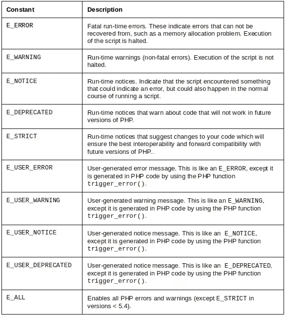
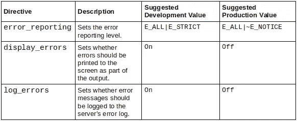
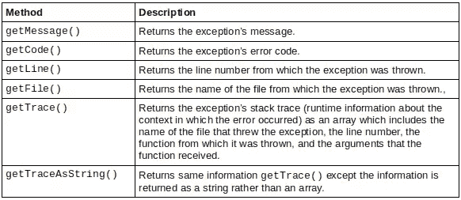

# PHP 中的错误处理

> 原文：<https://www.sitepoint.com/error-handling-in-php/>

错误是开发人员在编程时面临的最常见的事件。错误可以分为语法错误、运行时错误或逻辑错误:语句末尾缺少分号就是一个语法错误的例子；当服务器关闭时试图连接到数据库是运行时错误的一个例子；向变量提供不正确的数据是逻辑错误的一个例子。为了帮助减少代码中的错误数量，并减轻它们的影响，正确的错误处理在 web 应用程序中是必不可少的。

本文是 PHP 错误处理的速成课程。您将了解 PHP 内置的错误报告级别，以及如何使用自定义错误处理程序和异常处理来处理错误。

## PHP 错误报告级别

应记录所有错误和警告。根据错误的严重性，应该向其他系统/团队发出通知。为了更好地衡量其严重性，PHP 提供了几个内置的错误级别来描述错误的性质。每个级别由一个整数值表示，并命名为程序员可以使用的常数。下表摘自官方 PHP 文档，显示了一些不同的级别。



这些级别可以用位操作符一起屏蔽，以便在 PHP 的配置中包含或减去它们。例如，`E_ALL|E_STRICT`通过添加`E_STRICT`启用所有错误和警告(在 5.4 之前的 PHP 版本中是必需的)。

PHP 提供了一些与记录和显示错误相关的配置指令。根据系统是处于开发环境还是生产环境，它们的值通常是不同的。下表显示了一些与错误相关的指令。



配置指令既可以在`php.ini`中设置，也可以在 web 服务器配置文件(`httpd.conf`或`.htaccess`文件)中设置，或者在运行时使用`ini_set()`函数在脚本中设置。[阅读文档](http://us.php.net/manual/en/errorfunc.configuration.php "PHP: Runtime Configuration - Manual")了解更多关于指令以及如何/在哪里设置它们的信息。

## 创建自定义错误处理程序

不向最终用户显示原始错误也是一个很好的做法。显示的错误应该用友好的、自定义的错误消息来抽象。PHP 不仅提供了记录和显示错误的内置函数，还提供了引发错误的内置函数。您可以使用`trigger_error()`实际触发特定级别的错误。例如，如果`$test`的值大于 1:

```
<?php
$test = 5;
if ($test > 1) {
    trigger_error('Value of $test must be 1 or less', E_USER_NOTICE);
}
```

当您有一个错误处理基础设施时，用`trigger_error()`触发错误是很有用的，它允许您统一处理自定义错误和 PHP 引发的错误和警告。

如果您想要实现定制的错误处理策略，比如根据错误的严重性发送电子邮件或将错误记录到数据库中，那么您需要定义定制的错误处理程序`using set_error_handler()`。该函数接受两个参数:一个回调函数或静态方法，当错误发生时将被调用，以及可选的函数/方法处理的错误级别。回调的签名是:

```
handler(int $errno, string $errstr, string $errfile, int $errline, array $errcontext)
```


让我们来看看一个定制的错误处理函数。以下示例在遇到错误时将错误记录到数据库表数据库中:

```
<?php
function errorHandler($errno, $errstr, $errfile, $errline) {
    static $db;
    if (empty($db)) {
        $db = new PDO(DSN, DBUSER, DBPASS);
    }

    $query = "INSERT INTO errorlog (severity, message, filename, lineno, time) VALUES (?, ?, ?, ?, NOW())";
    $stmt = $db->prepare($query);

    switch ($errno) {
        case E_NOTICE:
        case E_USER_NOTICE:
        case E_DEPRECATED:
        case E_USER_DEPRECATED:
        case E_STRICT:
            $stmt->execute(array("NOTICE", $errstr, $errfile, $errline));
            break;

        case E_WARNING:
        case E_USER_WARNING:
            $stmt->execute(array("WARNING", $errstr, $errfile, $errline));
            break;

        case E_ERROR:
        case E_USER_ERROR:
            $stmt->execute(array("FATAL", $errstr, $errfile, $errline));
            exit("FATAL error $errstr at $errfile:$errline");

        default:
            exit("Unknown error at $errfile:$errline");
    }
}

set_error_handler("errorHandler");

$test = 5;
if ($test > 1) {
   trigger_error("Value of $test must be 1 or less", E_USER_NOTICE);
}
```

上面的代码片段注册了一个错误处理程序，它执行以下操作:当发生非致命错误时，一条记录将被插入到数据库中，而不是显示错误并将其记录到文件中；当致命错误发生时，它将被记录在数据库中并终止您的脚本。

但是，您应该知道自定义错误处理程序有一些限制。错误处理程序绕过了 PHP 的标准错误处理行为，所以它不能处理处理程序本身可能出现的错误。例如，在数据库服务器关闭的情况下，上述函数将无法记录日志。此外，错误处理程序不能捕捉某些内部错误，如定义处理程序的同一文件中的`E_CORE_ERROR`和`E_COMPILE_ERROR`或`E_STRICT`错误，因为这些错误发生在处理程序有机会被注册之前。

## 使用异常处理错误

无论您有多好的错误处理框架，在运行时总会出现问题。当然，您不希望这些错误出现在用户的浏览器中。这就是异常处理的用武之地。异常允许您优雅地处理错误和异常情况。

异常在 PHP 中由类`Excpetion`(或其任何子类)表示。它们可以用`throw`升起，也可以用`try/catch`滑车抓住。您可以扩展`Exception`来创建定制的异常类型，以捕获特定的错误。

可能触发异常的代码放在`try`块中，处理异常的代码放在`catch`块中。考虑下面的片段:

```
<?php
try {
   $data = $this->getDataFromService();
}
catch (Exception $e) {
   echo "Caught exception: " . $e->getMessage() . "n";
}
```

如果虚构的`getDataFromService()`方法抛出一个异常，它将在`catch`块中被捕获，并显示一条消息。如果`getDataFromService()`成功执行，那么流程将越过`catch`块，继续执行脚本的其余部分。任何抛出且未被捕获的异常都将生成一个`E_FATAL error`，并显示消息“未被捕获的异常”

`Exception`类提供了六种不同的方法来访问关于问题原因的信息，如下表所示。



## 创建自定义异常处理程序

PHP 将允许您抛出任何对象，就像它是一个异常一样，但是根据经验，该异常应该扩展 PHP 的内置`Exception`类。基于对象的类型，您可以用不同的方式处理异常。自定义异常处理可以执行适当的操作，如在文件中记录错误消息，通过检查调用堆栈来提供关于发生错误的行的确切详细信息，等等。看看这个例子:

```
<?php
class NameException extends Exception { }
class EmailException extends Exception { }

$name = "";
$email= "";

try {
   if (empty($name)) {
       throw new NameException();
   }
   elseif (empty($email)) {
       throw new EmailException();
   }
   else {
       echo "Name is " . $name . "<br>";
       echo "Email is " . $email;
   }
}
catch (NameException $n) {
   echo "A name was not provided.";
   error_log($n->getTraceAsString());
}
catch (EmailException $e) {
   echo "An email address was not provided.";
   error_log($e->getTraceAsString());
}
```

上面的代码定义了两个新的定制异常类型，`NameException`和`EmailException`，它们可以用来指示不同的错误。然后在`try`块中，代码检查是否为变量`$name`和`$email`提供了值。如果任一个为空，那么使用`throw`抛出适当的异常。执行相应的`catch`块来处理错误。

## 重新引发异常

`try/catch`块可以嵌套。有时您会想要捕捉一个异常，查看它的一些属性，然后再次抛出它，让父`catch`块处理它。这通常有助于检查错误情况，并决定它是否应该是致命的。此示例代码演示了如何重新引发异常:

```
<?php
class FileExistException extends Exception { }
class FileReadException extends Exception { }

$filename = 'D:Exception.txt';
try {
    try {
        $text = file_get_contents($filename);
        if ($text === false) {
            throw new Exception();
        }
    }
    catch (Exception $e) {
        if (!file_exists($filename)) {
            throw new FileExistException($filename . " does not exist.");
        }
        elseif (!is_readable($filename)) {
            throw new FileReadException($filename . " is not readable.");
        }
        else {
            throw new Exception("Unknown error accessing file.");
        }
    }
}
catch (FileExistException $fe) {
    echo $fe->getMessage();
    error_log($fe->getTraceAsString());
}
catch (FileReadException $fr) {
    echo $fr->getMessage();
    error_log($fr->getTraceAsString());
}
```

## 未捕获的异常处理程序

类似于`set_error_handler()`允许您指定一个函数来处理运行时错误，`set_exception_handler()`函数允许您处理异常，这些异常会一直向上进入调用堆栈，而不会被任何`catch`块捕获。例如，如果一个异常一直出现在堆栈中，那么将它记录到日志文件中是一个好主意。您可以创建一个回调函数并用`set_exception_handler()`注册它，如下例所示。

```
<?php
set_exception_handler(function ($exception) {
   $file = "var/log/exceptionLog.log";
   file_put_contents($file, $exception->__toString(), FILE_APPEND);
});

throw new Exception();
```

## 摘要

PHP 提供了各种处理错误情况的内置函数，包括记录和显示错误。它还为您提供了通过注册错误处理程序和使用异常来自定义错误处理策略的灵活性。错误是生活中的事实，但是希望我在本文中提供的信息能够帮助您更好地处理它们。

图片 via [伊利亚·安德里亚诺夫](http://www.shutterstock.com/gallery-460606p1.html "Stock Photos | Shutterstock: Royalty-Free Subscription Stock Photography & Vector Art")/[Shutterstock](http://www.shutterstock.com "Stock Photos and Royalty-Free Images by Subscription")

## 分享这篇文章