# 基本内容营销工具，第 2 部分

> 原文：<https://www.sitepoint.com/essential-content-marketing-tools-part-2/>

在[第一部分](https://www.sitepoint.com/essential-content-marketing-tools-part-1/)中，我与你分享了我的基本内容营销工具。概括来说，它们是:

1.  胡特苏特
2.  [Hootlet 浏览器扩展](https://hootsuite.com/features/extensions/hootlet)
3.  [Evernote](http://evernote.com)
4.  [Evernote Web Clipper](http://evernote.com/webclipper/)
5.  [饲料地](http://feedly.com/)
6.  [青紫](http://zite.com/)

将这两者结合使用，可以简化我的内容营销，让保存、安排和分享有价值的内容变得轻而易举。下面是每一种的工作原理。

## 与 Hootsuite 共享内容

假设我在电脑上看到一篇我想分享的文章。我可以立即这样做，使用右上角的 Hootlet 浏览器扩展图标。

我也可以右键单击并从菜单中选择“通过 Hootlet 共享页面”:

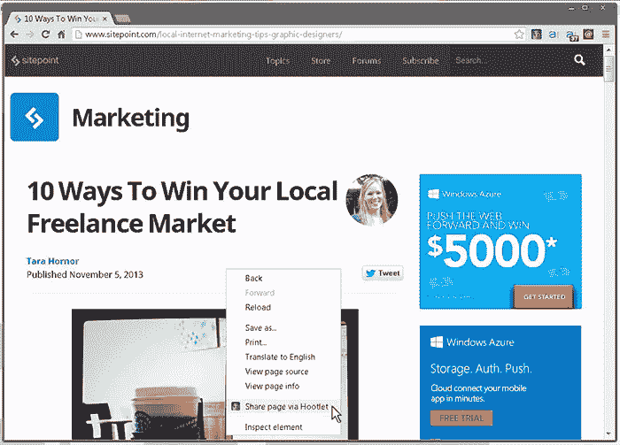

当我这样做时，Hootlet 对话框出现，允许我选择我想要共享的简档。通过点击日历图标，我可以“现在发送”或安排以后发送。

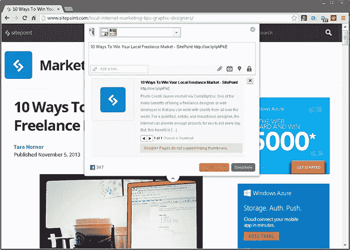

此时，我还不一定知道我最后一篇帖子安排在哪天，也不想再打开一个浏览器窗口，登录 Hootsuite 查看。Hootsuite 的移动应用成为我自己的数字编辑日历。虽然我不能用它来安排发布，但我*可以*查看“待定推文”标签，看看安排了什么，什么时候:

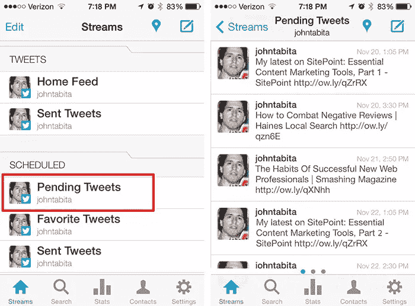

## 在 Evernote 中保存内容

然而，假设我现在没有时间安排我的文章。这就是 Evernote 派上用场的地方。当我点击右上角的 Evernote 图标时，Evernote 向我显示了页面的文本版本，可以选择将页面内容保存为笔记或作为链接发送。对于我的示例，我将选择“保存”选项。

屏幕上会闪现一条消息，确认我的便笺已发送或保存。如果我登录我的 Evernote 账户，我会看到确实是这样的:

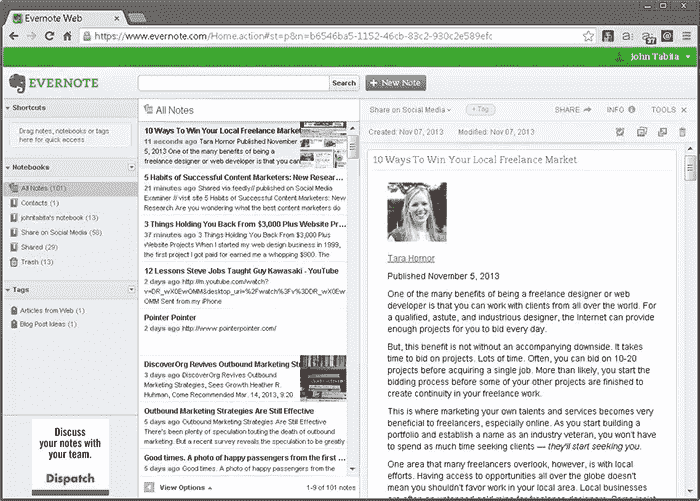

在每个已保存笔记的底部，您会找到原始文章的链接:

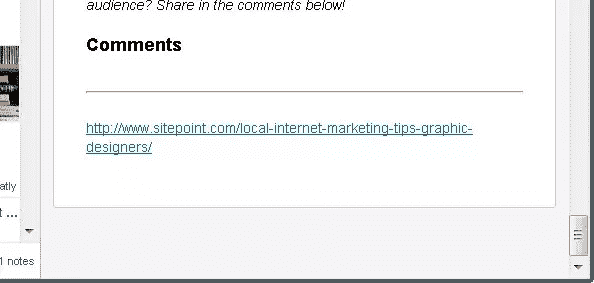

稍后，当我准备好分享它时，我会返回页面并使用 Hootlet 来安排它。

## 从移动设备共享内容

如果你和我一样，你会花更少的时间在桌面上，花更多的时间在智能手机或平板电脑上。除非你当场按下“Tweet”按钮，否则在智能手机上安排和分享内容到多个配置文件是不可行的。这就是为什么为将来存钱的能力是你新的最好的朋友。

### 从 Zite 保存到 Evernote

当我在我的 Zite 应用中看到一篇可分享的文章时…

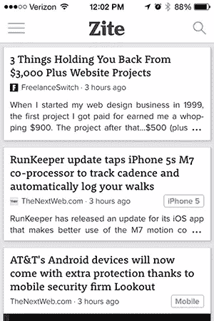

…为了阅读它，我将首先点击它。

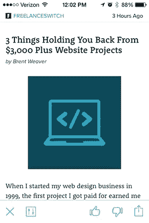

如果我认为它值得分享，我可以点击右下角的“分享”图标，从菜单中选择“Evernote”来保存它…

然后在下一个屏幕上按“发送到 Evernote ”:

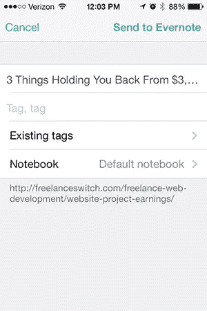

后来，我可以在 Evernote 中找到它，并按照我上面描述的方式在 Hootsuite 中安排它。

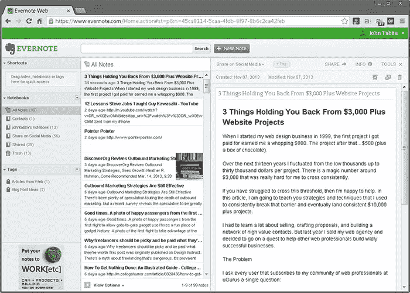

### 从 Feedly 保存到 Evernote

Feedly 中的文章可以用类似的方式保存。唯一的警告是 Feedly 的免费版本不支持直接保存到 Evernote。(您必须升级到专业版才能享受该特权。)无忧；你可以通过电子邮件将链接发送到你的 Evernote 账户。

首先，确保[你的 Evernote 邮箱地址](http://blog.evernote.com/blog/2010/03/16/emailing-into-evernote-just-got-better/)在你的通讯录中。要保存 Feedly 文章，请点击右上角的图标(看起来像三个垂直点的图标)。当“共享选项”菜单出现时，选取邮件信封。然后在“收件人”栏中输入“Evernote”(或者你在联系人中给它起的名字)。填充完成后，点击“发送”

 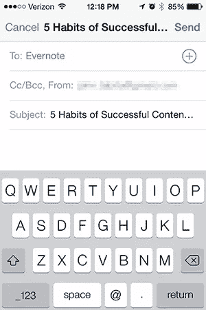

而不是完整的一页，你的笔记看起来像这样，准备在 Hootsuite 中安排:

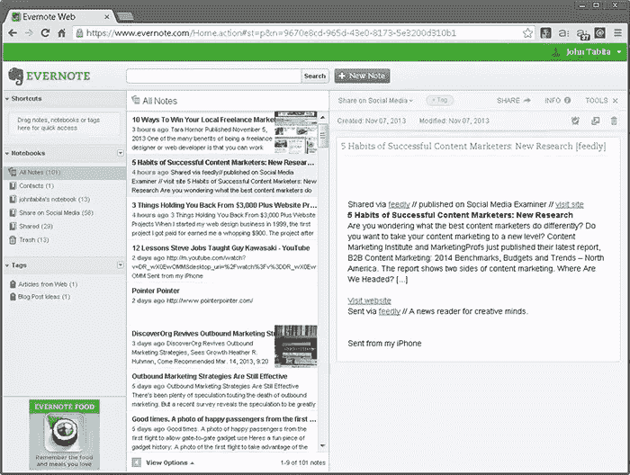

## Hootsuite 和 Evernote 的替代品

如果不提一些替代方案，那我就失职了。 [Instapaper](http://www.instapaper.com) 和 [Pocket](http://getpocket.com) 的功能与 Evernote 相似。我用 Instapaper 来保存我只是想以后阅读的文章，而不是分享。

Buffer 和 [Tweetdeck](http://tweetdeck.com) 是我过去用过的两个 Hootsuite 替代品。Tweetdeck 只支持 Twitter，Buffer 的免费版功能比 Hootsuite 少，我觉得太局限了。

内容营销不一定是全职工作。借助正确的工具和系统，您可以大幅减少花费的时间，同时仍能获得您想要的结果。你自己试试。

## 分享这篇文章