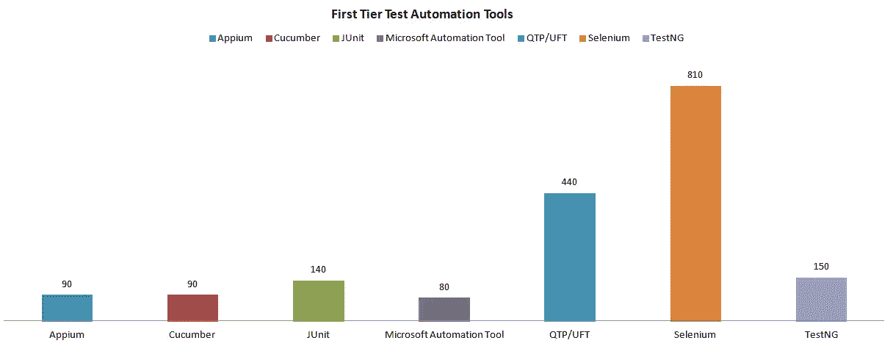
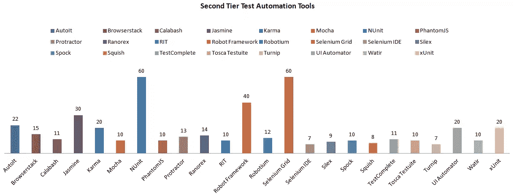
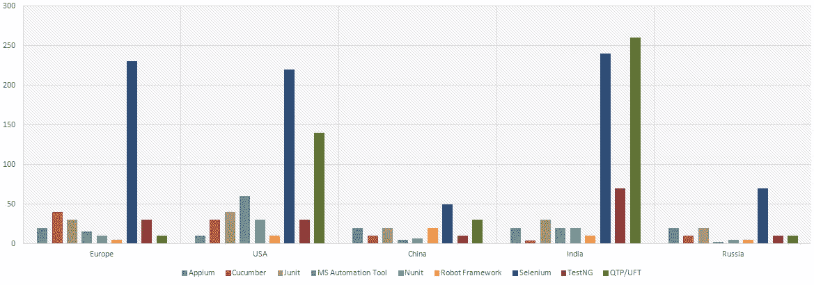
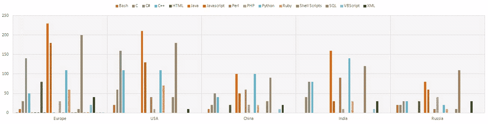

# 2018 年获得测试自动化工作的基本技能

> 原文：<https://www.sitepoint.com/essential-skills-for-landing-a-test-automation-job-in-2018/>

*本文最初由 [TestProject](https://blog.testproject.io/2017/09/26/test-automation-job/) 发布。感谢您对使 SitePoint 成为可能的合作伙伴的支持。*

每年[测试自动化](https://blog.testproject.io/2015/10/04/test-automation-whats-the-deal/)市场都会带来新的需求。测试自动化工程师必须掌握他们的技能，以便保持领先地位并获得他们梦想的工作。继我们上次的研究:[世界上最受欢迎的测试自动化技能](https://blog.testproject.io/2015/12/03/worlds-most-desirable-automation-skills/)，TestProject 调查了世界各地的顶级求职网站，以确定 2018 年最受欢迎的测试自动化技能和技术。

## 研究方法:

接受调查的国家:美国、印度、乌克兰、摩尔多瓦、德国、波兰、英国、荷兰、罗马尼亚、保加利亚、塞尔维亚、捷克共和国、匈牙利、俄罗斯和中国。

**采集的样本:** 1340

**求职网站:**[indeed.com](https://au.indeed.com/)，[glassdoor.com](https://www.glassdoor.com.au/index.htm)，[monster.com](https://www.monster.com/geo/siteselection)，[51job.com](http://www.51job.com/default-e.php)，[reed.co.uk](https://www.reed.co.uk/)，[naukri.com](https://www.naukri.com/)，[schwabjobs.com](http://schwabjobs.com/)， [stepstone.de](https://www.stepstone.de/) ，[jouwitvacature . nl](https://www.jouwictvacature.nl/)。

## 关键发现:获得测试自动化工作

*   从收集的数据来看，每四个测试自动化工程师中就有一个会与 [Jenkins](https://jenkins.io/) 共事。这很有趣，因为 Jenkins 通常使用 [CI](https://blog.testproject.io/2017/05/11/jenkins-ci/) 框架操作，而不是用于测试自动化。由此可见两个领域的密切关系以及詹金斯在很多机构的知名度。
*   在所有被调查的国家中，Java 是领先的语言，其次是 JavaScript、C#和 Python，它们都达到了第二名。
*   在测试自动化领域，Selenium 被全球评为重中之重。它从去年[的](https://blog.testproject.io/2016/03/16/test-automation-survey-2016/#Selenium) 29%上升到 36%，这意味着作为一个测试自动化工程师，应该掌握 Selenium！
*   Appium 不再是移动测试自动化的后起之秀。从去年[的](https://blog.testproject.io/2016/03/16/test-automation-survey-2016/#Selenium)需求的 8%，下降到只有 4%。这可能与最新版本的库稳定性问题有关，或者是由于最近移动测试自动化可用的解决方案的多样性。
*   行业对拥有 Linux 知识的测试自动化工程师的需求持续增长(从去年的[需求的 34%到现在的](https://blog.testproject.io/2015/12/03/worlds-most-desirable-automation-skills/#Linux)需求的 40%)，这种需求也大大绕过了微软的需求(23%)。这可能与这样一个事实有关:在过去的几年里，微软拥抱了 Linux(和一般的开源软件),现在它的使命似乎是把微软的工具带到用户所在的任何地方。除了这两个操作系统，我们还发现 Android (20%)和 macOS (17%)之间存在激烈的竞争。

## 全球需求最大的测试自动化工具

下图展示了全球 7 大测试自动化工具的分布，并得出结论:QTP/UFT 是最受欢迎的商业工具，而 Selenium 在所有类别中都占主导地位。另外， [JUnit](http://junit.org/junit4/) 和 [TestNG](https://blog.testproject.io/2017/04/03/testng-tutorial/) 是非常流行的测试自动化框架。此外， [Cucumber](https://cucumber.io/) 已经建立了它作为最流行的 BDD 测试自动化框架的声誉。

除了前七名入围者之外，还有许多其他需求的测试自动化工具，如下图所示:

## 每个国家对测试自动化工具和编程语言的高需求

获得梦想中的测试自动化工作的测试自动化技能的成功组合是:

**欧洲:** Selenium Web driver，Cucumber 测试自动化框架(表明 BDD 方法的极大流行)，Java 作为第一优先的编程语言或者 JavaScript 作为第二好的。

**美国:**抛开对 Selenium 和 Java 的传统需求，美国是唯一一个微软自动化工具非常受欢迎的国家。这与 C#是第二大需求编程语言(当然，仅次于 Java)的事实相关。

**中国:** [机器人](https://blog.testproject.io/2016/11/22/robot-framework-introduction/)和 JUnit 是主导框架，Java 和 Python 作为需求最大的编程语言正在进行一场肉搏战。此外，作为网络自动化专家的测试自动化工程师比移动自动化专家更有机会在中国找到测试自动化的工作。

**印度:**只有在印度，QTP/UFT 绕过了非常流行的 Selenium 网络驱动程序。Java 是第一优先，Python(略有不同)作为需求最大的编程语言位居第二。此外，TestNG 是最流行的框架，而 [KDT](https://blog.testproject.io/2015/09/15/kdt-keywords-driven-testing-vs-test-automation-scripts/) 是主要的方法。

**俄罗斯:**使用 Selenium 和/或 Appium 实现 JUnit 框架是最常见的，因此您必须精通这些工具才能实现您的理想工作。此外，首选的编程语言是 Java 和 JavaScript。

### 最需要的测试自动化工具

### 每个国家最需要的编程语言

## 全球需求最大的编程语言

如下图所示，根据我们之前的研究，Java 是最受欢迎的编程语言。此外，JavaScript 继续保持其受欢迎程度，这主要是由于实现 [JavaScript 开发框架和库](https://blog.testproject.io/2016/09/01/front-end-development-unit-test-automation-trends2/#JavaScript)的增加，如[react js&AngularJS](https://blog.testproject.io/2016/09/01/front-end-development-unit-test-automation-trends2/#ReactJSandAngularJS)——这两种技术主导了整个前端开发市场！

另一种流行的语言是 [Python](https://www.python.org/) ，它有大量的库和功能。Python 是操作系统无关的和直观的，这些能力使它成为测试自动化专业人员中最受欢迎的脚本语言。

## 分享这篇文章