# 以太坊 DApps:编译、部署、测试 TNS 令牌

> 原文：<https://www.sitepoint.com/ethereum-dapps-compiling-deploying-testing-tns-tokens/>

在这个用以太坊构建 DApps 的系列教程的第二部分中，我们写了 TNS 令牌的代码。但是我们还没有编译、部署、测试或验证它。让我们做好这一部分的所有工作，以便为接下来的工作做好准备。

## 收集

此时，我们有了一个包含一些 Solidity 代码的文件。但是要让以太坊虚拟机理解它，我们需要把它变成机器码。此外，为了从 web 应用程序与它通信，我们需要一个 ABI(应用程序二进制接口)，它是对某个智能契约中存在的功能的通用可读描述，无论是令牌还是更复杂的东西。通过使用 Truffle 的编译器，我们可以同时为 EVM 和 ABI 创建机器码。

在项目文件夹中，运行:

```
truffle compile 
```

该命令将查看`contracts`子文件夹，编译它们并将它们的编译版本放入`build`子文件夹。请注意，如果您使用了上一部分中的替代开发流程，TNSToken 契约继承功能的所有父契约也将在各自的文件中逐一编译。

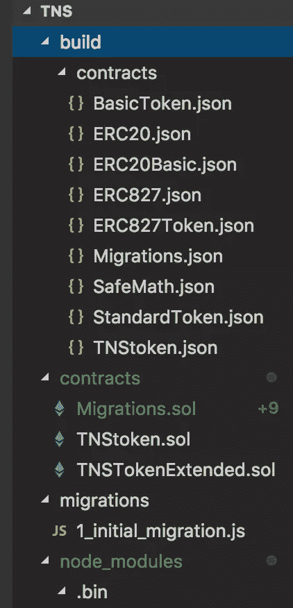

请随意检查生成的 JSON 文件的内容。我们的 TNSToken 应该有超过 10000 行的 JSON 代码。

## 部署到加纳切

现在让我们看看我们能否将它部署到我们的模拟加纳切区块链。如果 Ganache 尚未在终端的标签页或操作系统的应用程序中运行，请使用以下命令运行它:

```
ganache-cli 
```

或者运行应用程序获得如下屏幕:

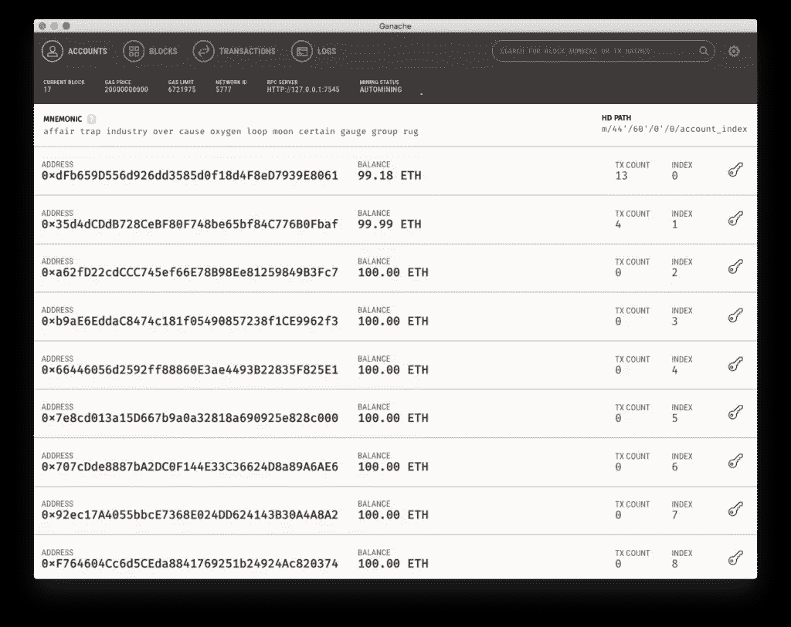

然后，回到我们刚刚编译合同的文件夹，我们必须添加一个迁移。创建文件`migrations/2_deploy_tnstoken.js`。如果你不熟悉松露生态系统中的迁徙，请看[这本指南](https://www.sitepoint.com/truffle-migrations-explained/)。

让我们将以下内容放入该文件:

```
var Migrations = artifacts.require("./Migrations.sol");
var TNSToken = artifacts.require("./TNSToken.sol");

module.exports = function(deployer, network, accounts) {
  deployer.deploy(TNSToken, {from: accounts[0]});
}; 
```

首先，执行迁移的能力是通过请求`Migrations.sol`引入的。这在每次迁移中都是必需的。接下来，部署一个令牌意味着我们需要导入它的可靠性代码，我们通过拉入`TNSToken.sol`来完成这个任务，这是我们在上一部分中编写的代码。最后，这是一个千篇一律的迁移，只有`function(deployer, network, accounts) {`和最后一个`}`之间的部分发生了变化。

在这种情况下，我们告诉部署者部署 TNSToken 并传入`from`参数，以便设置初始令牌持有者。这里使用的地址是由 Ganache 生成的随机地址，但是通过使用自动传递给部署者的`accounts`数组，我们确保可以访问运行节点中的帐户列表(无论是活动的 Geth 节点还是 Ganache)。在我的例子中，`account[0]`地址是`0xdFb659D556d926dd3585d0f18d4F8eD7939E8061`，这在上面的截图中也很明显。

我们也不要忘记在`truffle.js`中配置一个开发环境:

```
module.exports = {
  networks: {
    development: {
      host: "127.0.0.1",
      port: 7545,
      network_id: "*"
    }
  }
}; 
```

*注意:照顾好端口和 IP；你的可能不一样！*

最后，在项目文件夹中，运行`truffle migrate`。您应该会看到类似这样的内容:

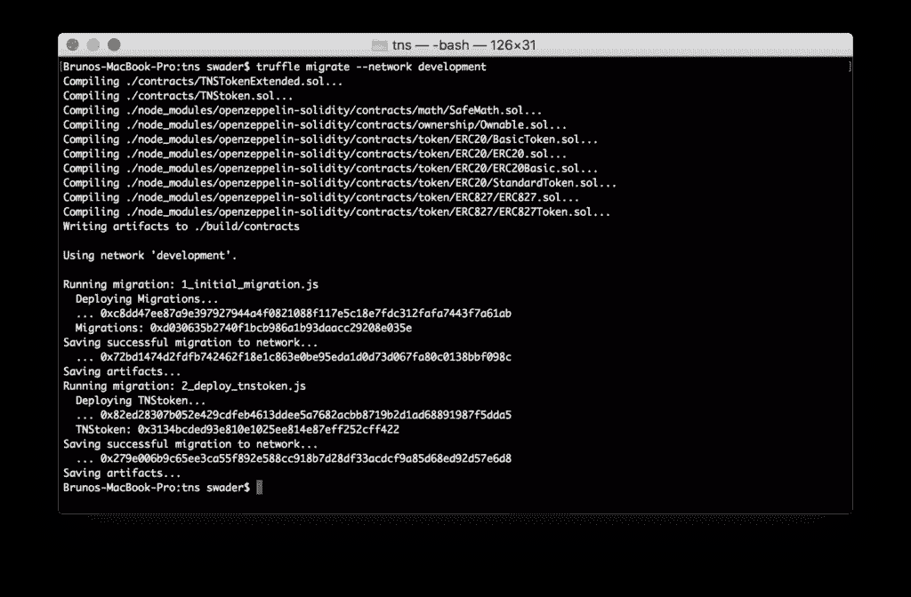

注意`TNStoken` : `0x3134bcded93e810e1025ee814e87eff252cff422`旁边的以太坊地址。这是我们的令牌被部署的地方。现在让我们来看看它的运行情况。

## 测试令牌

在这种情况下，自动化测试是不必要的。代币合同是高度标准化的，并且经过了实战检验。如果我们使用了一些超出传统令牌范围的功能，那么自动化测试就会派上用场。然而，实际上，通过向各个地址来回发送来测试它就足够了。

打开像 [MyEtherWallet](https://bitfalls.com/2018/02/19/first-ethereum-address-learning-use-myetherwallet/) 这样的钱包 UI，在右上角菜单中选择一个自定义网络。在对话框中，输入你的私人区块链给你的信息 Ganache 或实际的 PoA 区块链，根据本教程系列的[第 1 部分](https://www.sitepoint.com/building-ethereum-dapps-app-rules-blockchain-setup)选择你正在运行的。在我的例子中，`127.0.0.1`表示地址，`7545`表示端口。

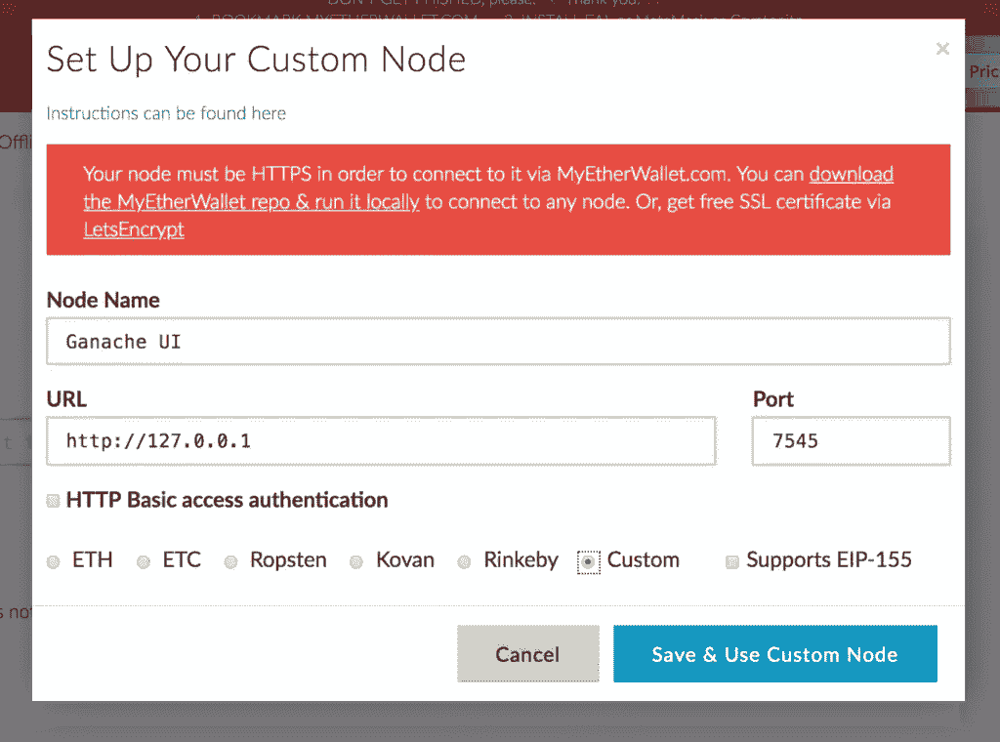

打开您在部署脚本中设置为`from`值的钱包。如果您使用的是 Ganache，您会在 Ganache UI 的屏幕上或终端的 Ganache 输出中看到它的私钥。

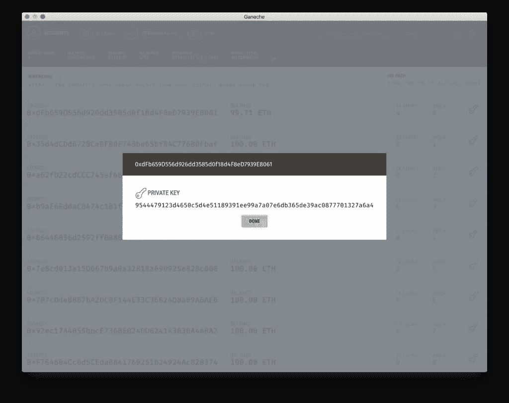

最后，需要告诉 MEW 这个令牌是存在的。我们通过添加自定义令牌来实现这一点。

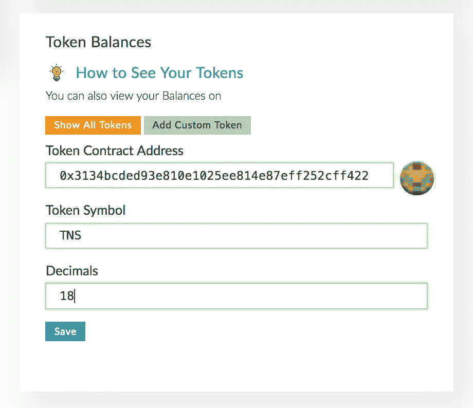

添加令牌后，您会立即注意到该帐户现在有 1 亿英镑的余额，并且可以在货币下拉选择菜单中发送它们。让我们试着发送一些到另一个地址。

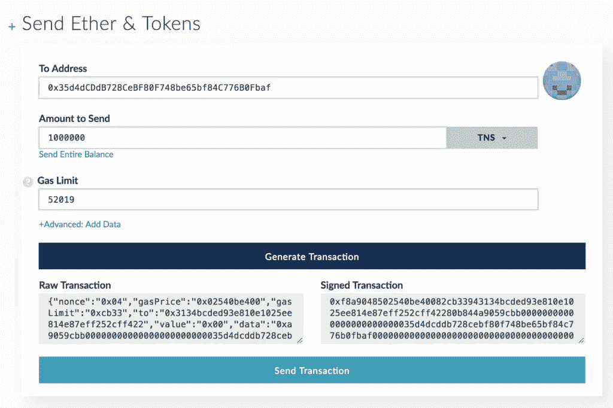

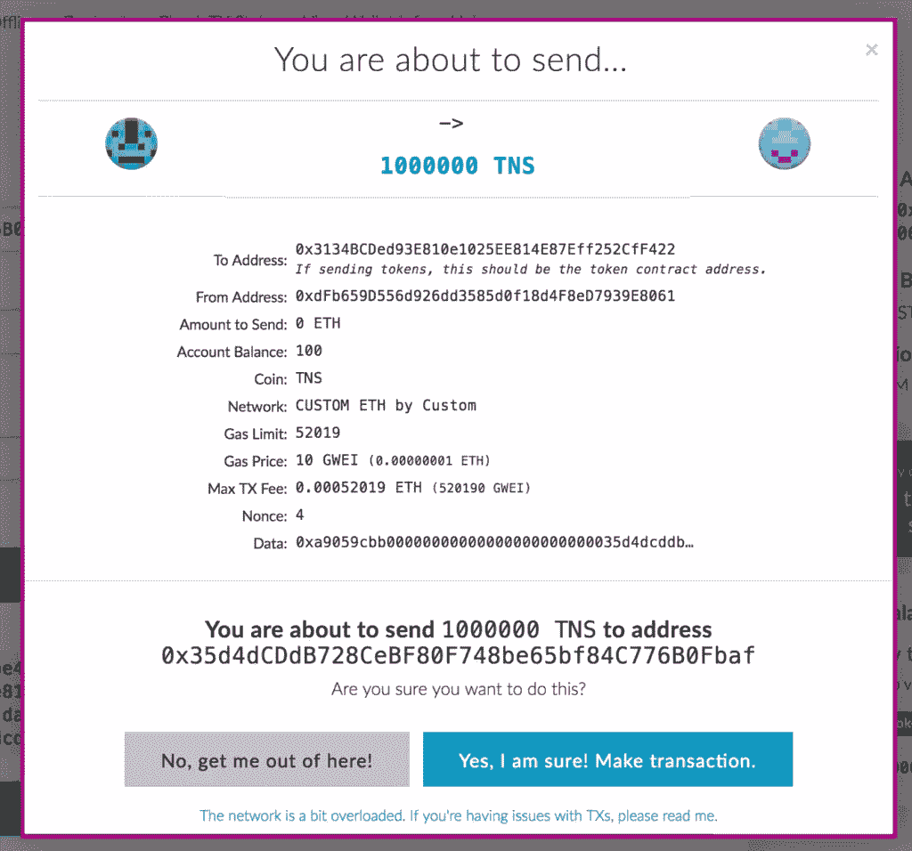

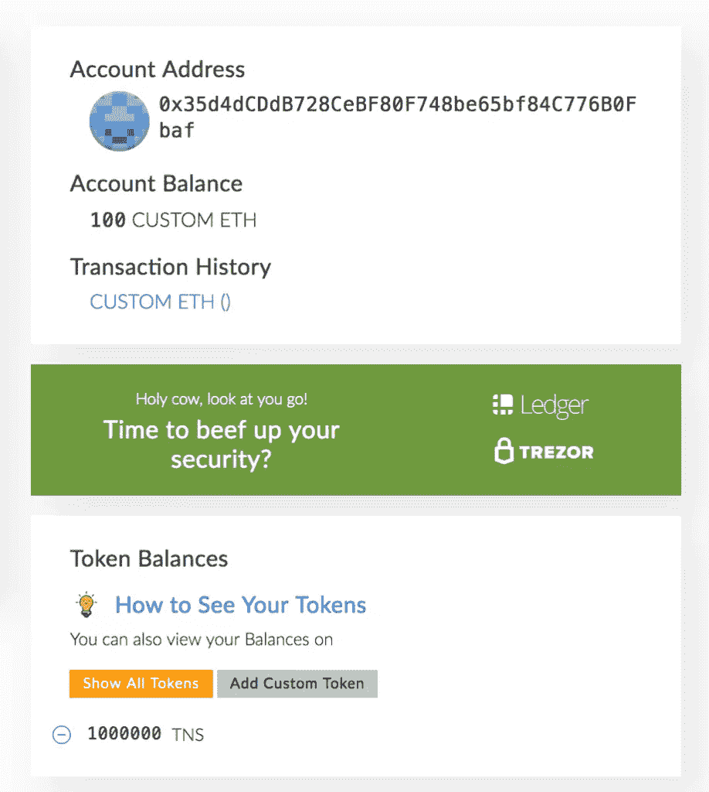

现在就把这些寄回去，让原来的账户重新回到 1 亿。我们刚刚确保令牌的基本功能按预期工作。

## 部署到实时网络

如果不在真实网络上部署，这就不是真正的令牌测试。不过，让我们不要使用 mainnet，而是使用像 Rinkeby 这样的测试网。

在`truffle.js`中，让我们添加一个新网络— `rinkeby` —这样我们的文件看起来就像这样:

```
require('dotenv').config();
const WalletProvider = require("truffle-wallet-provider");
const Wallet = require('ethereumjs-wallet');
const Web3 = require("web3");
const w3 = new Web3();

const PRIVKEY = process.env["PRIVKEY"];
const INFURAKEY = process.env["INFURAKEY"];

module.exports = {
  networks: {
    development: {
      host: "127.0.0.1",
      port: 7545,
      network_id: "*"
    },
    rinkeby: {
      provider: function() {
        return new WalletProvider(
          Wallet.fromPrivateKey(
            Buffer.from(PRIVKEY, "hex")), "https://rinkeby.infura.io/"+INFURAKEY

        );
      },
      gas: 4600000,
      gasPrice: w3.utils.toWei("50", "gwei"),
      network_id: "3",
    },
  }
}; 
```

呀！这是什么？

让我们逐行处理它。

前几行导入了一些节点模块，因此我们可以使用下面的函数。如果您得到任何一个模块丢失的消息，只需运行`npm install web3-wallet-provider truffle-wallet-provider web3 dotenv --save`就可以解决问题。

接下来，我们加载运行合同的钱包的私钥(因此钱包将获得 1 亿个令牌；我们在这里不能使用项目文件夹根目录下的`.env`文件中的`from`值。如果不存在，就创建它。该文件还有一个 Infura.io 访问密钥，这是一个托管以太坊节点的网站，允许应用程序连接到它们，这样开发人员就不需要在他们的计算机上运行完整的以太坊节点。

默认情况下，`.env`文件是隐藏的，可以在`.gitignore`中忽略，这样就不会有你的私钥泄露的危险——这是一个非常重要的预防措施！该文件包含以下内容:

```
PRIVKEY="YOUR_PRIVATE_KEY";
INFURAKEY="YOUR_INFURA_ACCESS_KEY"; 
```

您可以通过在此注册[获得您的 Infura 密钥。只要安装](https://infura.io/signup)[元掩码](https://bitfalls.com/2018/02/16/metamask-send-receive-ether/)，切换到 Rinkeby，然后去导出私钥，就可以很容易的获得私钥。任何方法都可以，所以选择你喜欢的。也可以用 Ganache 的私钥。在所有以太网上——testnet，rinkeby，mainnet，你能想到的，一个单独的私钥就能打开同一个钱包。

回到我们的配置文件。我们有一个新的`network`条目:`rinkeby`。这是我们将部署到的以太坊测试网的名称，提供者内部的代码基本上是千篇一律的复制粘贴，告诉 Truffle“获取我的私钥，对其进行十六进制编码，将其放入解锁的钱包中，然后通过它与 Infura 对话”。

最后，我们定义我们希望在执行这个合同上花费的气体限制(460 万足够了，如果需要可以改变)，气体将花费多少(50 Gwei 实际上[相当昂贵](https://bitfalls.com/2017/12/05/ethereum-gas-and-transaction-fees-explained/)，但是我们正在玩的以太是模拟的，所以这无关紧要)并且网络 ID 被设置为 4，因为这就是 Rinkeby testnet [如何被标记为](https://ethereum.stackexchange.com/questions/17051/how-to-select-a-network-id-or-is-there-a-list-of-network-ids)。

我们还需要做一件事。我们之前编写的迁移文件的目标是一个`from`地址，但是 Rinkeby 的地址是不同的。这是否意味着我们需要根据网络改变部署脚本？当然不是！让我们将`2_deploy_tnstoken.js`文件修改成这样:

```
var Migrations = artifacts.require("./Migrations.sol");
var TNSToken = artifacts.require("./TNSToken.sol");

module.exports = function(deployer, network, accounts) {
  if (network == "development") {
    deployer.deploy(TNSToken, {from: accounts[0});
  } else {
    deployer.deploy(TNSToken);
  }
}; 
```

正如您所看到的，部署脚本是简单的 JavaScript，给予部署者的第二个参数总是网络名称——这是我们可以用来区分它们的。

如果我们现在尝试使用`truffle migrate --network rinkeby`运行迁移，如果我们使用的地址是新的，将会失败:

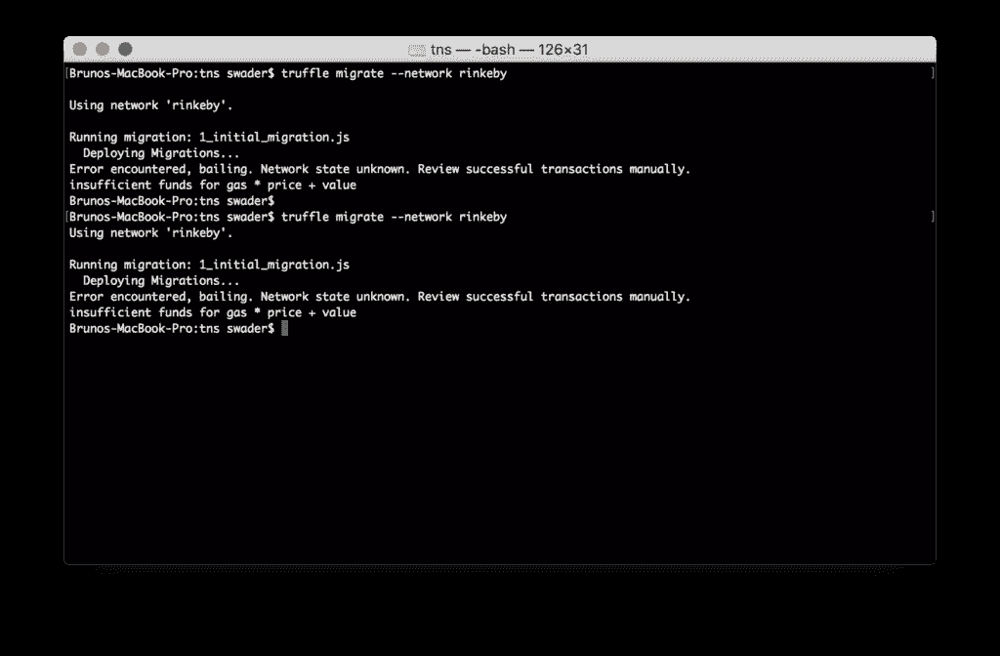

这是因为该地址没有乙醚用于部署合同。不过，这很容易解决。去 Rinkeby 水龙头那里要一些。它是免费的。

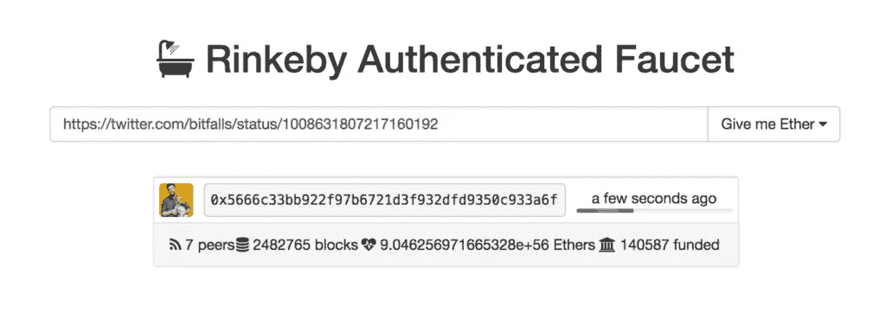

现在重新运行迁移，令牌契约将在 Rinkeby 网络上实时部署。它可以像上面的 Ganache 用例一样进行测试。一切都应该完全一样，只是现在你也可以与你的朋友和同事测试它。进步！

## 奖励:验证和 ENS

对于额外的信任点，建议您在 Etherscan 上验证令牌，并为其注册一个 ENS 域。

### 确认

**验证**是指将令牌的源代码提交给以太网扫描，以便它可以将其与网络上部署的内容进行比较，从而验证它是无后门的。这在令牌地址的*代码*标签上完成。由于我们的令牌使用了一些第三方代码，而这些代码不容易被拉入到*验证*屏幕的代码窗口中，因此我们需要*展平*我们的合同。为此，我们将使用一个叫做`truffle-flattener`的工具:

```
npm install --global truffle-flattener 
```

该工具会将所有依赖项和令牌的源代码复制到一个文件中。我们可以这样运行它:

```
truffle-flattener contracts/TNSToken.sol >> ./contracts/TNSTokenFlat.sol 
```

现在一个新文件应该出现在`contracts`文件夹中，它实际上与我们的源代码相同，但是粘贴了依赖代码(例如，`SafeMath.sol`将被粘贴在文件的顶部)。

将新文件的内容粘贴到*验证*屏幕的代码窗口中，将编译器设置为运行`truffle version`得到的任何版本，并将*优化*设置为*否*。点击*验证*和*发布*，一旦这个过程完成，你的令牌的地址栏会有新的标签:*读合同*和*写合同*，*代码*标签会有一个绿色的勾号，表示代码已经被验证。这给了你在社区中更多的信任点。

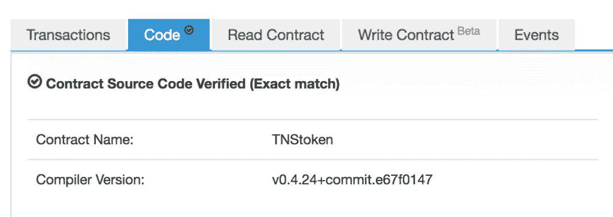

### 实体

ENS 是以太坊的名称系统。它用来给以太坊地址起一个人类可读的名字，这样你就不必记住 0xmumbojumbo 字符串，而是可以记住像`bitfalls.eth`这样的地址。你甚至可以注册像`token.bitfalls.eth`这样的子域名。注册一个 ENS 域名的过程并不简单，而且需要时间，所以如果你想这样做，我建议你阅读[这个指南](https://ens.domains/)，并按照这里[的指示](https://www.myetherwallet.com/#ens)。

## 结论

在这一部分中，我们经历了编译和部署自定义令牌。此令牌与所有交换兼容，可用作常规的 ERC20 令牌。

## 分享这篇文章