# 更多面向作者的 WordPress 插件

> 原文：<https://www.sitepoint.com/even-more-wordpress-plugins-for-writers/>

一个作家(无论是作者还是文案)的一生，一般都是相当被误解的。朋友们认为你找到了理想的工作。你不必离开休息室去工作。没有讨厌的老板盯着你。此外，如果你喜欢的话，你可以摆脱公司的束缚，每天午休四个小时。

虽然所有这些事情在某些时候都适用，但人们往往会忘记，作家的生活常常是一小时又一小时地盯着闪烁的笔记本电脑屏幕。拼命寻找合适的词，完美的短语，准确的语气。对于作家来说，收支平衡的能力往往依赖于一种无形的、不可控制的品质——灵感。如果作家无法将想法转化为文字，他们就赚不到钱。

因此，在这个相当令人沮丧的消息上，我认为这将是在线写作社区团结一致的一种姿态，来跟进我的文章，为作者和写作提供最好的 WordPress 插件，并提供一些更多的 WordPress 插件的细节，旨在使在线作者的生活变得更容易。

## [复兴旧帖](https://wordpress.org/plugins/tweet-old-post/)

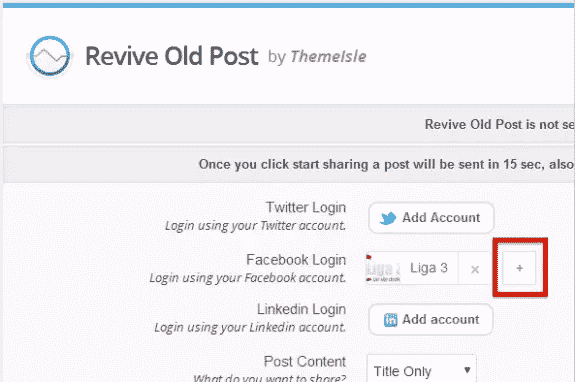

这个插件会自动将你的旧博客文章上传到你的 Twitter feed 上，让你不必为了保持相关而清理旧文章。这也有助于优化你的 Twitter feed，避免它缓慢而痛苦地死去，因为你根本没有时间更新它(或者太专注于起草你的小说而忘记了！).凭借超过 80，000 的活跃安装和定期更新，这个插件可以成为任何作家的社交媒体武库中的一个关键工具。

## [WpLike2Get](https://wordpress.org/plugins/wplike2get/)

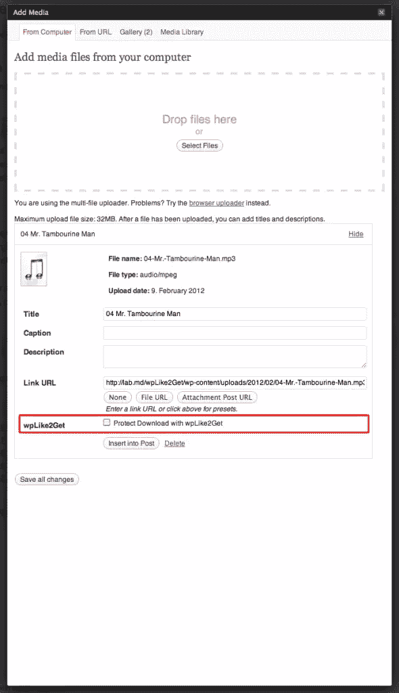

不幸的是，作家并不总是能从他们所写的一切中获得报酬，尤其是那些希望提升自己作品的崭露头角的新作家。偶尔，作家不得不写一篇博文，只是为了让我们的名字留在那里。这个 WordPress 插件是一个神奇的工具，它有效地在普通大众和你精心制作的博客之间建立了一堵墙。只要你的读者首先在社交媒体上分享你的帖子，这堵墙就可以很快很容易地被打破。这是完全免费的，也是一种很好的宣传方式。

不过，在这一点上有一个警告；如果你还没有忠实的读者，那么这个插件确实有可能适得其反。如果读者没有亲自阅读，他们可能不愿意在社交媒体上分享一些东西。

## [由 WordPress 提供的 Jetpack](https://wordpress.org/plugins/jetpack/)

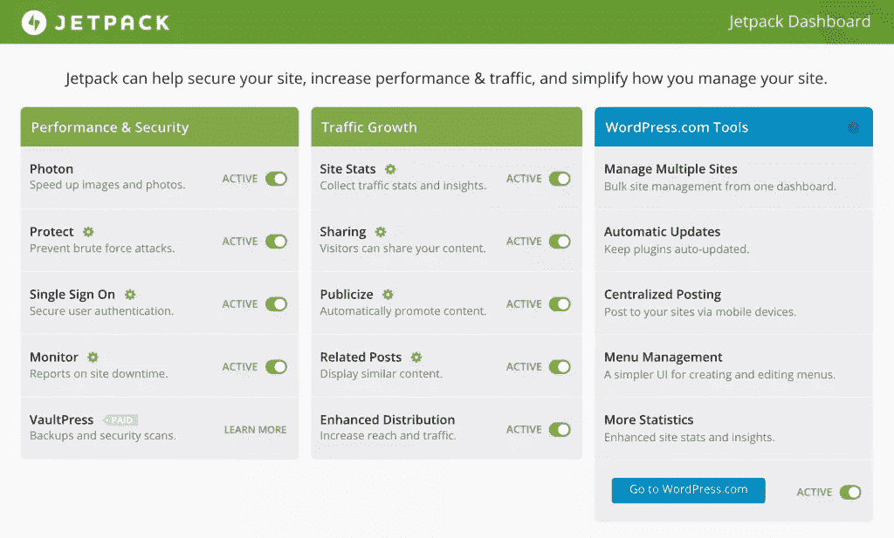

这个插件有适合每个人的东西。如果你还没有安装，那么我推荐[你看一下](https://www.sitepoint.com/a-guide-to-jetpack/)。这是一个完全免费的插件。与其在这上面废话连篇，我建议你自己去看看插件页面。你会印象深刻的。

## [升级加备份和恢复](https://wordpress.org/plugins/updraftplus/)

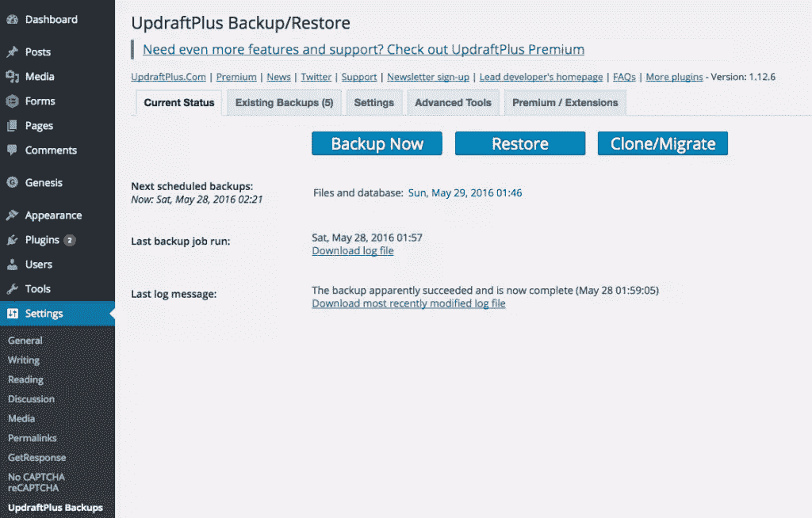

这个插件强迫你做每个作家应该经常做的事情(但是没有！)—备份他们的工作。UpdraftPlus Backup Restore 是一个自动备份系统。它甚至允许你选择存储备份的位置，集成像 Dropbox，Google Drive，亚马逊 S3，或者只是普通的旧电子邮件。根据市场宣传，UpdraftPlus 是 WordPress 知识库中排名最高的备份插件，拥有超过 800，000 个活跃安装。查看他们的介绍性 YouTube 视频了解更多细节。

## [W3 总缓存](https://wordpress.org/plugins/w3-total-cache/)

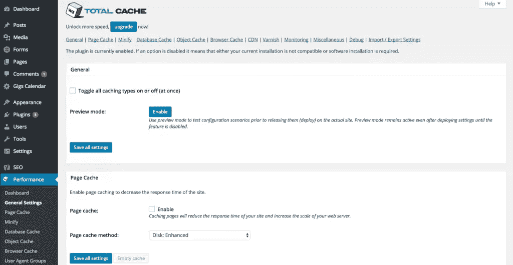

每个人都想要一个快速的网站——访问者和网站所有者都一样。一个缓慢、笨拙的网站是一张通向网上无关紧要的单程票。即使你的网站主要致力于写作(并且避免那些会降低速度的大文件和图片)，也不能成为一个缓慢加载的网站的借口。此插件通过使用诸如缩小和数据库缓存、减少下载时间、提高服务器性能以及与内容交付网络集成等技术来优化您的站点。其活跃安装数超过 100 万，其受欢迎程度不言自明。这是 YouTube 上的一个概述。

## [Akismet](https://akismet.com/)

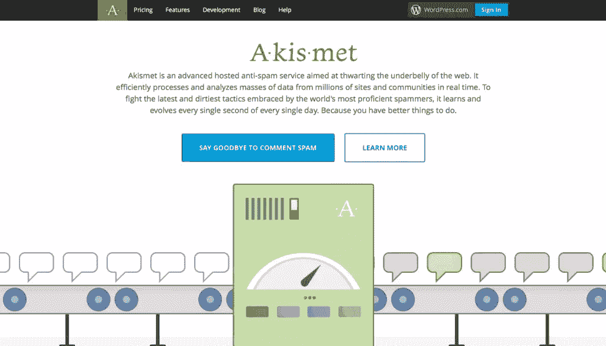

每个人都讨厌垃圾邮件。完全讨厌。这个方便的小插件可以阻止来自你网站评论区的垃圾邮件，这意味着你只需要调节和回复那些与你所研究的内容直接相关的评论。你不必删除迈克尔·迈克尔逊博士的 15 条评论，他希望你访问他的“消除粉刺五步曲”页面。您可以在您的页面上保留和回复高质量的评论，避免可怕的垃圾邮件。

## [谷歌文档嵌入器](https://wordpress.org/plugins/google-document-embedder/)

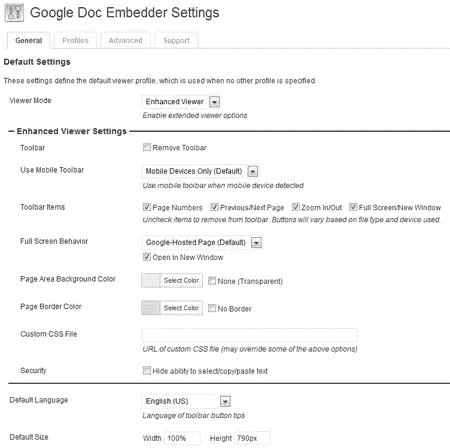

这个插件对于那些想在内容中嵌入 pdf 和其他文件的作者来说是非常棒的，并且允许他们在谷歌文档浏览器中使用。它也给你的读者提供了下载内容的选择。这意味着你可以在你的网站上添加更多你作品的综合样本。

## [亚马逊链接](https://wordpress.org/plugins/amazon-link/)

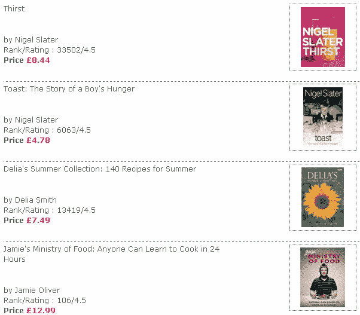

作家们经常忘记他们可以利用附属链接从他们的作品中赚点外快。如果你发现一个你喜欢或想推荐的服务或产品，使用亚马逊联盟计划(和插件)。或者，更好的是，如果你自己出版了一本书，一定要在你自己的网站上包括详细内容。你永远不知道，每次有人点击购买时，你可能就能赚一点钱。

## [S2 成员框架](https://wordpress.org/plugins/s2member/)

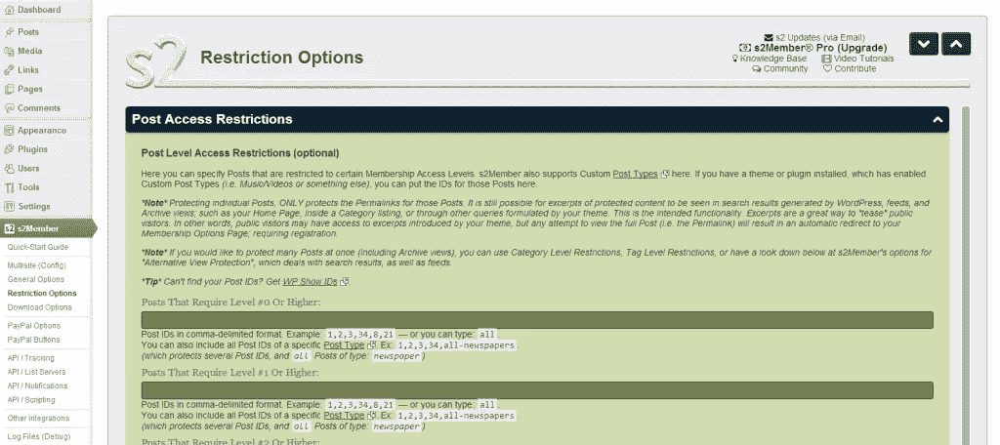

从你的博客中赚钱的一个显而易见的方法是创建一个会员专用的部分，里面塞满了你的会员付费的高质量的独家内容。这个插件可以保护 WordPress 页面、文章、标签和整个类别。它非常容易配置，有许多内置选项可用。s2Member 框架甚至可以轻松地向您的忠实在线读者出售订阅，与 PayPal 集成，帮助简化整个支付流程。既有免费的，也有付费的专业版(一次性收费 US  189)。

## [作品集图库](https://wordpress.org/plugins/portfolio-gallery/)

作家的生死取决于他们的作品集。你需要给你的观众提供一个时尚的作品样本和你参与过的项目类型。这是一个神奇的插件，可以让你做到这一点。

## [MyBookTable](https://wordpress.org/plugins/mybooktable/)

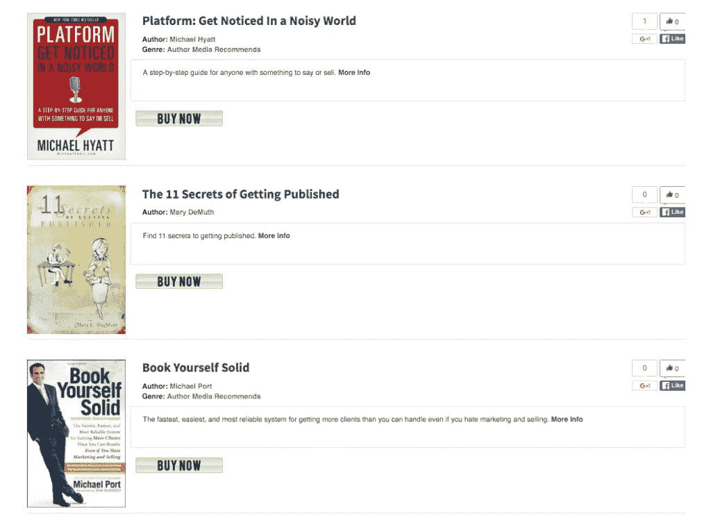

如果你在写书行业，你需要这个插件。它允许你在你的 WordPress 网站上展示你的书籍，包括描述、图片、评论和购买链接。你甚至可以绕过中间人，在你的网站上加入一个 PayPal 或 eJunkie 按钮，在你自己的前院出售书籍。

## [问题评论系统](https://wordpress.org/plugins/disqus-comment-system/)

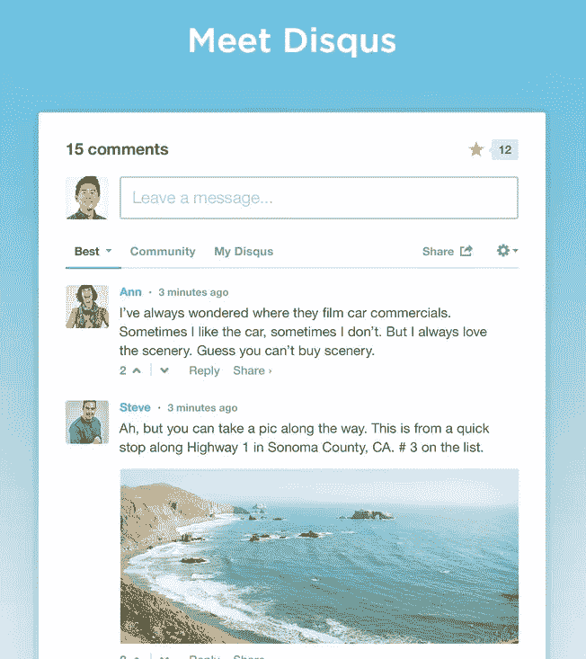

这是每个 WordPress 站点都应该有的评论系统。它像一个评论网络一样工作，这意味着在你的网站上记录的评论也会记录在 Disqus 社区上，这有助于人们发现他们可能感兴趣的内容。

## 包扎

再次强调，重要的是要记住你在 WordPress 站点上安装的插件越多，对性能的影响就越大。利用外面神奇的插件，但只安装你真正需要的。

## 分享这篇文章