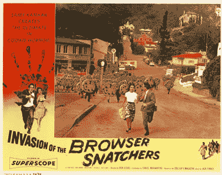

# Evercookie:浏览器掠夺者的入侵！

> 原文：<https://www.sitepoint.com/evercookie-invasion-of-the-browser-snatchers/>

在过去一年左右的时间里，随着[general](http://www.washingtonpost.com/wp-dyn/content/article/2010/05/22/AR2010052200251.html)[news](http://www.theregister.co.uk/2010/08/17/flash_cookie_lawsuit/)[media](http://www.guardian.co.uk/technology/blog/2010/jun/15/adobe-hacking)开始意识到 Flash cookies 以及它们标记和识别回头客的能力——即使在那些用户已经主动清空了他们的 HTTP cookie 缓存之后——一场喧嚣慢慢形成。

他们认为他们遇到了一些麻烦？

开发商 [Samy Kamkar](http://samy.pl/) 刚刚在[发布了一款名为 Evercookie](http://samy.pl/evercookie/) 的新 JavaScript API，它采用了十种——是的，数一数——***十种*** 不同的方法在你的浏览器上虚拟纹上一个 cookie。

Evercookie 的一些标记方法非常聪明，你只能想象 Samy 在一个秘密的火山巢穴深处编码它们，那里有亲信和鲨鱼池。目前 Evercookie 使用:

1.  标准 HTTP Cookies
2.  本地共享对象(闪存 Cookies)
3.  将 cookies 存储在自动生成的、强制缓存的 png 的 RGB 值中
4.  将 cookies 读入和读出网络历史记录
5.  将 cookies 存储在 HTTP ETags 中
6.  Internet Explorer 用户数据存储
7.  HTML5 会话存储
8.  html5 本地存储
9.  HTML5 全局存储
10.  通过 SQLite 的 HTML5 数据库存储

但现在是萨米安于现状的时候了？哦不先生！一个使用 Silverlight、Java 和 window.name 来标记用户的版本已经在计划中了

更重要的是，每当 Evercookie 发现它的任何 cookie 丢失时，它会悄悄地高效地重新创建并替换它们。人们说现在你得不到好的帮助。

虽然 Samy 采用的一些方法有很好的文档记录(例如 HTTP cookies、Flash cookies)，但据我所知，许多都是原创想法。

例如，强制缓存的 PNG 方法几乎就像一个秘密的 DIY 二维码系统。用户的唯一 ID 被转换成 PNG 中的一系列彩色像素，然后被强制缓存。当用户返回时，PNG 被悄悄地加载到一个 canvas 元素中，在这里提取 ID。

Web 历史 cookie 方法可能更加阴险。后台会创建一个临时页面，带有您的唯一 ID 的 URL，比如说“`pwn.com/yourusernameABC-`”。此页面会单独发送到您的浏览器，并记录在您的浏览器历史记录中。

下一次你返回你的浏览器步枪通过网址变化，并比较每一个你的网页历史。当找到部分匹配时(即`'pwn.com/y`’)，它锁定并移动到下一个字母——有点像地址栏中的自动完成功能。每当它到达一个连字符，它知道它有一个完整的 ID。

HTML5 似乎也为饼干开辟了许多舒适的新角落。技术进步万岁！

有趣的是，整个项目是免费和开源的，所以 Samy 似乎采取了 whitehat 黑客的方法，公布一个漏洞，让人们来对抗它。目前，唯一已知的 Evercookie 计数器是私人浏览模式下的 Safari。

我不知道你怎么想，但我不太确定是“天啊，太聪明了，蝙蝠侠”还是“极客”和过度换气、语无伦次的恐慌发作。

你呢？

## 分享这篇文章