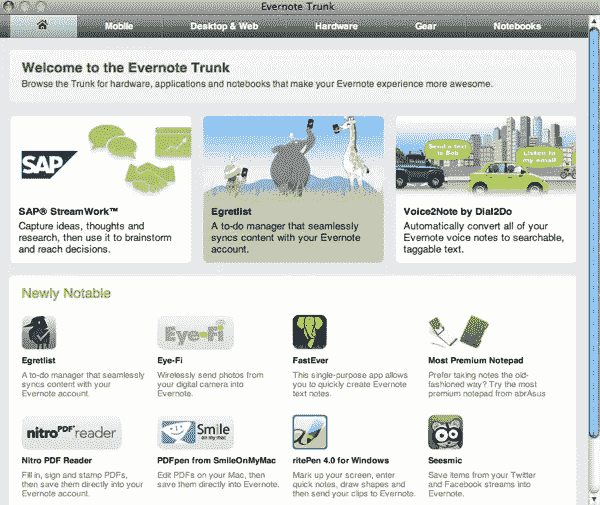

# Evernote 引入了主干

> 原文：<https://www.sitepoint.com/evernote-introduces-the-trunk/>

我的桌面 Evernote app 提示我今天更新。在这个过程之后，我注意到这个新图标位于应用程序窗口的顶部，标记为“Trunk”昨天推出的这一新功能，突出了一些为 Evernote 创建并与 Evernote 集成的惊人项目，使其成为可用的最强大的笔记工具之一。

但这还不是全部。下面看看你能用 Evernote 主干做些什么。

## 查找应用程序

当 Evernote 发布他们的 API 时，开发者开始创建支持、增强和集成 Evernote 的应用程序。但是，当你需要一个应用程序时，很难找到它，甚至不知道要找什么。Evernote Trunk 的基础是 Evernote 的应用程序和产品目录。

目前行李箱中大约有 100 件物品，分为五类:手机、桌面和网络、硬件、设备和笔记本。这不仅对 Evernote 用户来说是一个很棒的特性，而且也给了开发人员一种找到和使用他们的项目的方法。我开始四处打探，并已经注意到移动类别中的一些应用程序，我将在写完这篇文章后立即测试它们(顺便说一下，我正在 Evernote 中测试)。

## 拓展你的视野

Evernote 主干中的笔记本类别是内容共享和分发的一种新形式。它包含了一些第三方公司不同主题的笔记本，你可以直接导入 Evernote。

比方说，这个帖子启发了你去下载安装 Evernote，但是你不知道下一步该怎么做。你可以将 Evernote Tips 笔记本导入到你的账户中，获得一些如何充分使用 Evernote 的想法。

Evernote 是这样描述这个功能的:

> 就像你的书架上增加了一本新书，一旦你从我们的合作伙伴中选择了一本笔记本，它就会立即出现在你的帐户中。但这仅仅是开始。例如，如果你选择了 Make:Projects Home and Garden 笔记本，Evernote 将会在你的账户中添加一个装满 DIY 项目的笔记本。在 Evernote 中，笔记本不仅仅是一个静态的内容，它还是你遇到的所有其他 DIY 项目的起点……这些品牌笔记本如此吸引人的原因是，所有的内容都代表着你的创造力和探索的起点。

目前还没有太多可用的内容，但肯定有一些很好的潜力。

## 获得 Evernote 友好产品

你知道有直接扫描 Evernote 的扫描仪吗？或者像 OfficeDrop 这样的服务，可以让你把文件邮寄进来，扫描后直接导入你的 Evernote 账户？有很多公司正在与 Evernote 合作，整合他们的产品和服务。这些是你可能已经使用或需要的东西，可以帮助你变得更有效率，因为它们直接与 Evernote 一起工作。

## 下一步是什么？

Evernote 计划继续增加这项新功能，包括新的笔记本和应用程序。就我个人而言，我认为这是一个很酷的补充，尤其是应用程序展示。我已经在用 Evernote 进行想法管理了，但是用一种更简单的方法找到应用程序来扩展我的使用方式，在我看来这是一个胜利。

你怎么想呢?你喜欢后备箱的增加吗？你认为你会使用它吗？

## 分享这篇文章