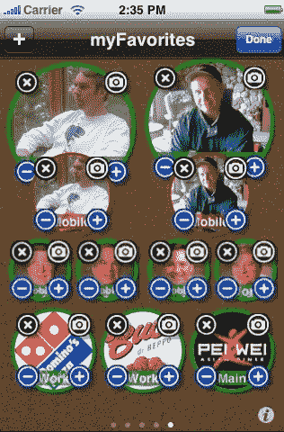
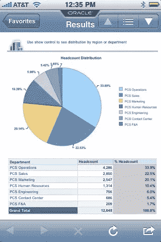
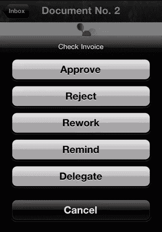

# 移动设计的例子:反模式

> 原文：<https://www.sitepoint.com/examples-mobile-design-anti-patterns/>

在[第一篇文章](https://www.sitepoint.com/examples-mobile-design-patterns/)中，我们看到了一些有用的技巧和窍门，可以更好地组织表单、图库和搜索功能；在[第二个](https://www.sitepoint.com/examples-mobile-design-pattern-part-2/ "Examples of Mobile Design Pattern: Part 2")中，我们通过一些市场上或多或少为人所知的应用程序的例子，看到了最常见的用于提供建议、发出邀请和提供反馈的移动模式。

在本系列的最后一篇文章中，您将发现最常见的反模式，并理解为什么以及何时应该避免它们。让我们发现更多关于所谓的“反模式”的世界。

## 什么是反模式？

至于“模式”的定义，让我们看看维基百科所说的“反模式”是什么:

> 反模式(或反模式)是一种在社会或业务操作或软件工程中使用的模式，它可能经常使用，但在实践中是无效的和/或适得其反的。这个术语是由安德鲁·克尼格在 1995 年创造的，灵感来自于四人帮的书《设计模式》,该书在软件领域发展了设计模式的概念。该术语在三年后因《反模式》一书而广泛流行，该书将该术语的使用扩展到了软件设计领域之外，并扩展到了一般的社会交互中。根据后者的作者，至少要有两个关键要素才能正式区分实际的反模式和简单的坏习惯、坏实践或坏想法:
> 
> *   一些重复的行为模式、过程或结构，最初看起来是有益的，但最终产生的不良后果多于有益结果；
> *   存在一个替代解决方案，它有明确的文档记录，在实际实践中得到验证，并且是可重复的。
> 
> 许多反模式的想法只不过是错误、咆哮、无法解决的问题，或者尽可能避免的坏习惯。有时被称为陷阱或黑暗模式，这个术语的非正式用法是指通常重新发明的解决问题的坏方法。

当许多网页设计师开始为新客户开发项目时，他们打算做的第一件事就是设计他们希望新颖、前卫、有创意和创新的界面。然而，并非不可能的是，他们希望的效果并没有实际产生。相反，大多数时候它们只是不好，难以理解，更难使用。

一个优秀的网页设计师应该始终牢记的是，在移动应用程序开发期间，他们应该努力摆脱旧的网页开发背景。为移动应用程序创建界面不仅仅是将旧的用户交互模型转换到新平台的行为。人们经常通过引入非标准的 UI 元素来断言自己的“创造性”和“创新性”，这一点都不好。

最近，开发人员越来越关注为移动应用程序创建图形用户界面时应遵循的良好原则。出于这个原因，他们中的许多人正在对现有的应用程序进行适当的更改，并且不总是很容易找到或多或少为人所知的反模式模型。在这方面，我认为向您提供一系列小型的“规则”(或者，如果您愿意，也可以是提示)更合适，这是一种为了避免实现不想要的反模式而要遵循的指南:

1.  提供一键访问主页:让您的用户以快速直观的方式轻松返回到您的移动应用程序的主页。
2.  如果你想插入一个“联系我们”的链接，记住它最好放在右上角而不是隐藏的页脚:清晰，可见，易于点击。
3.  例如，记住要设计标签页的样式，使每个标签页都有自己的图标，并且所选的标签页有一些可以与其他标签页区分开来的特征，比如颜色或效果，这样用户就可以知道他们在哪个空间操作。
4.  如果你正在寻找一种方法来创新你的移动应用程序，思考并专注于你的核心功能，你打算向你的用户提供什么，他们的问题和需求是什么，并依靠界面设计的最佳实践。如果你设计了一个自定义控件，不要忘记测试和改进它，以确保它易于使用。
5.  Users expect familiar icons to offer specific features, so choosing a familiar icon and using it in an unfamiliar way will cause confusion. Do you think this system to add people to the “Favourites” category is correctly thought out?

    

6.  避免所谓的“白痴盒子”，使用更有效、破坏性更小的技术来提供反馈或继续导航。
7.  If you want to display a set of data on a chart, remember to visually represent only elements in charts and graphs that are necessary to communicate the information represented on the graph. Useless data only creates confusion and slows the whole process. Look at this example:

    

8.  Don’t let your users loose in an ocean of … buttons!

    

    使用标准模式显示页面级操作，并为项目级操作提供上下文工具，而不是重复相同的按钮。

## 结论

我们已经得出了这个致力于移动设计模式的迷你系列的结论。

我希望你对这个话题感兴趣，并且这三篇文章将对你未来的工作有所帮助。

我很快会回来谈论移动应用程序的界面设计。感谢您的关注。

## 分享这篇文章