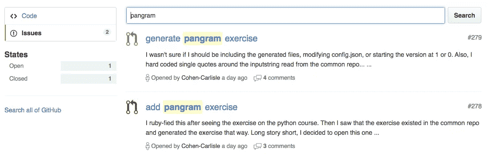

# 通过锻炼驱除你的新手恶魔

> 原文：<https://www.sitepoint.com/exorcise-your-newbie-demons-by-contributing-to-exercism/>


如果你想为开源贡献代码，你需要的技能水平是*足够好*。

不是“才华横溢”。不“流利”也不“精通”。哦，当然，有时你会需要这些。不过，有些项目可能需要你的帮助，即使你的技能水平更接近“勉强连贯”而不是“胜任”。

其中一个这样的项目是[exercisem](http://exercism.io)，其目的是帮助人们提高他们在[多种不同语言的编程技能](http://exercism.io/languages)。

最明显的方法是给人们练习题。

一个稍微不太明显的方法是鼓励同行代码评审。人们不仅可以自己解决问题，还可以进行对话。他们给予并接受反馈。他们认为。他们发现代码味道并指出风格问题。你可以从获得反馈中学到很多，甚至从给予反馈中学到更多。

超过 15，000 人像这样使用过 Exercism。

还有另一种不太明显的方式，Exercism 帮助人们提高编程技能。这是一种元博弈。不用写代码提交给 Exercism 征求反馈，你可以写代码提交给 GitHub 征求反馈。这是同样的过程——讨论、发表意见、学习。一种情况是你在解决实践问题。另一方面，你增加练习题，或者改进练习题，或者帮助建立网站本身。

Exercism 明确欢迎编程新手的贡献。它努力定义将成为良好的第一个补丁的问题。无论这是你的第一个项目补丁，还是第一个开源补丁，维护者和贡献者都希望你成功。如果你中途卡住了，他们会帮你解开，这样你的补丁就能被接受了。我应该知道，我首先创建了这个项目。

超过 650 人玩过这个元游戏，为 Exercism 的各种代码库做出了贡献。

该项目本身庞大而笨拙；它由 50 多个存储库组成。它有网站代码、API 代码和命令行代码。它有工具和服务，元数据和练习。

尽管如此，Exercism 拥有大多数项目没有的东西:40 多种不同语言的 40 多个小型独立存储库。每个语言轨道一个。

Haskell 的人不需要了解任何关于 C#的知识。Scala 的人不需要了解任何关于 Erlang 的知识。了解一点 Ruby 就可以帮助改进 Ruby track。

## xruby 资源库简介

xruby 库包含了所有的 exercisem 的 ruby 练习。这是一个提交您的第一份开源贡献的好地方，原因有几个。

首先，Ruby 练习的依赖性很小。如果你在你的机器上安装了 Ruby，那么设置好一切就很容易了。

第二，存储库只有一个工作:定义好的实践问题。好的练习题是小的，有重点的，不是特别复杂的。这有点令人困惑，但仅此而已。

第三，每个问题都是独立的。当您在做一个练习时，您可以忽略存储库中的所有其他内容。

最后，如果你需要的话，轨道维护人员会为你指明方向或握住你的手。

无论你在编程基础上有困难，或者你不能理解 Ruby，或者你只是让自己陷入了困境——不要担心。如果你能做到一半，有人会帮你把代码合并到代码库中。

有很多方法可以为 Ruby track 做贡献。本文将重点讨论其中之一:将一个练习移植到 Ruby。

## 将现有练习翻译成 Ruby

翻译一个练习比发明一个练习容易。

在 Exercism 上，同样的问题通常在几种语言中实现。这些语言有不同的约定和不同的优势。因此，它们的实现探索了问题的不同方面。然而，潜在的问题并没有改变。一旦有了描述和定义，就可以借用思路了。您不必担心要编写哪些测试——您可以专注于将这些想法转化为 Ruby 代码。

将练习移植到 Ruby track 归结为以下步骤:

1.  找一个练习来翻译。
2.  先做练习，意思是，说“先做”表示你正在做。
3.  编写测试套件和参考解决方案。
4.  配置练习。
5.  提交您的实现。
6.  讨论和迭代。
7.  庆祝。

## 找到一个要翻译的练习

弄清楚哪些练习需要移植过去是一件痛苦的苦差事。你必须仔细观察每一个语言轨迹，并试图找到一个你不认识的练习。现在有一个 API 端点会告诉你到底需要什么。

[http://x.exercism.io/v3/tracks/ruby/todo](http://x.exercism.io/v3/tracks/ruby/todo)

这报告了哪些练习已经被定义但还没有移植到 Ruby 上 <sup>1</sup> 。它列出了现有的实现，使您很容易找到可以编写的测试用例。

坏消息是你只能用眼睛解析 JSON。没有一个页面可以将这些数据转换成漂亮、友好的 HTML 页面。

抱歉。

也就是说，你可以找到一个浏览器插件来为你格式化 JSON。如果失败，请尝试 [jsonlint](http://jsonlint.com) 。将有效负载从 API 复制并粘贴到表单中。然后点击“验证 JSON”，它会把它打印成一个副作用 <sup>2</sup> 。

### 了解 JSON 有效负载

有效载荷看起来像这样:

```
{
  track_id: "ruby",
  todos: [...]
} 
```

`todos`部分是 JSON 对象的数组。每个条目都有可翻译的练习信息。这意味着至少有一个其他语言轨道已经实现了它，而 Ruby 轨道还没有。以下是 Pangram 练习的`todo`条目:

```
{
  slug: "pangram",
  readme: "https://github.com/exercism/x-common/blob/master/pangram.md",
  data: "https://github.com/exercism/x-common/blob/master/pangram.json",
  implementations: [...]
} 
```

`slug`包含问题的 URL 友好标识符。这在任何地方都会用到:目录名、散列键、文件名。

`readme`是独立于语言的问题描述的 URL。它是用 [GitHub 风格的 Markdown](https://help.github.com/articles/basic-writing-and-formatting-syntax/) 编写的，这让我们可以在网站上将它转换成 HTML，同时仍然保持它在纯文本中的可读性。请注意，文件的基本名称是问题 slug。像所有其他与语言无关的问题数据一样，自述文件位于一个名为 [x-common](https://github.com/exercism/x-common) 的独立存储库中。

如果幸运的话，`data`将是一个 URL。如果是这样，有人编制了一套规范的测试输入和期望。这是对这个问题的一个很好的指导。如果`data`是`null`，你将不得不查看`implementations`数组来寻找灵感。

`implementations`数组中的每个元素都链接到另一种语言中的一个现有实现。请注意，练习的目录名是 problem slug。

Pangram 目前有七个实现。单个实现的 JSON 输出包含语言音轨的 ID 和定义该语言练习的文件的 URL。至少会有一个测试套件和一个参考解决方案。有时你不得不搜索子目录来找到它们。

```
{
  track_id: "elm",
  url: "https://github.com/exercism/xelm/tree/master/exercises/pangram"
} 
```

花点时间通读一些阅读材料，也许浏览一些实现。找一项对你有吸引力的运动。

## 讨论这个练习

一旦你找到一个你想翻译的练习，确保没有人已经在做了。如果是，将会有一个未解决的问题或对它的拉式请求。

在[红宝石轨迹库](https://github.com/exercism/xruby)中搜索问题弹头(如`pangram`)。

搜索结果默认为“代码”，这不是你想要的。在页面左侧选择菜单选项“问题”。这将包括问题和拉取请求。



如果什么都没有，那你就可以走了。

如果有问题或拉请求，那么你需要仔细看看。有人可能正在工作，或者工作可能被放弃。或者这些问题可能是不相关的。如果有疑问，请提问！

也可能有一个合并的拉请求(就像`pangram`的情况一样)，这可能意味着您什么也不用做。通常我们每天都部署，但有时事情会变得很忙，所以实施的练习可能需要一两天才能到达现场。一旦他们到达站点，他们将从“todo”端点消失。

为了这篇文章，让我们假设您决定在`bracket-push`上工作。你会想把它占为己有，这样别人也不会开始工作了。

有两种方法可以完成练习:

1.  打开一个问题。
2.  **(首选)**打开一个进行中的拉式请求。

### (选项 1)将问题提交给 Dibs 练习

这是最简单的方法。不利的一面是，您最终会同时收到一个问题和一个拉取请求。这有点额外的噪音，但这不是问题。如果另一种方式看起来太吓人，那么不要担心——只需打开一个问题。

你的问题的主题行应该包括问题的段落，以便于在搜索结果中浏览。

```
Add 'bracket-push' exercise 
```

在问题的正文中为自己声明。

### (选项 2)打开“进行中的工作”拉式请求

这个选项需要更多的步骤，但是无论如何，大多数步骤都必须在以后完成。首先[分叉](https://github.com/exercism/xruby/fork)xruby 库，这样你就有了自己的副本。然后[克隆](https://help.github.com/articles/cloning-a-repository/)你的叉子。

转到刚才克隆的代码，创建一个新的分支。为练习命名。

```
$ git checkout -b bracket-push 
```

接下来，创建一个空提交。通常，git 不会让你不做实际工作就提交，但是如果你坚持的话，它会的:

```
$ git commit --allow-empty -m "[WIP] add bracket-push" 
```

将带有空提交的新分支推送到 GitHub 上的 fork:

```
$ git push origin bracket-push 
```

访问 GitHub 上的 fork，点击绿色的大按钮“比较和拉取请求”,这是最近创建的分支。

在表单正文中添加一条注释，说明您将处理它，然后单击“创建拉式请求”提交表单。

现在，只要人们记得检查开放的问题和拉请求，就没有人会做重复的工作。

## 编写测试套件和参考解决方案

如果您以前从未编写过任何测试，那么这将是一次很好的小小的冒险。如果你已经编写了测试，但是从来没有在 Minitest 中编写过，那么你就有机会了。Minitest 小巧、简单、令人愉快地直截了当。

1.  在`exercises`目录中，为新的实现创建一个目录。以问题鼻涕虫命名(如`bracket-push`)。
2.  创建一个空的测试文件，用下划线代替连字符(如`bracket_push_test.rb`)来命名。

```
 gem 'minitest', '>= 5.0.0'
require 'minitest/autorun'
require_relative 'bracket_push'

class BracketPushTest < Minitest::Test

end 
```

第一行保护不受支持的 Minitest 版本。

`autorun`行是 Minitest 如何让 Ruby 在运行文件时实际启动测试套件。

然后我们包括实际的解决方案，它还不存在。文件名是问题 slug，用下划线代替连字符。注意，我们希望它和测试文件在同一个目录中。Ruby 中一个松散的约定是拥有单独的`lib`和`test`目录，但是这在这里有点过头了。

最后，我们定义测试套件本身。注意，类的名称以问题 slug 的 CamelCase 版本(`BracketPushTest`)开头。

运行测试套件:

```
$ ruby bracket_push_test.rb 
```

它会抱怨，因为解决方案文件丢失了。创建一个空的`bracket_push.rb`文件并再次运行测试。它应该停止抱怨。

在`BracketPushTest`类中，您将根据需要添加尽可能多的测试。这是一个测试的样子:

```
def test_count
  assert_equal 1, Stuff.new.count
end 
```

注意方法名。从`test`开始。如果你没有用`test`启动它，Minitest 不会知道它应该是一个测试，它也不会运行。
The `assert_equal`方法是导致测试通过或失败的原因。它有两个参数:期望值和实际值。期望值通常是硬编码的，实际值是对正在测试的代码的调用。

还有其他方法来编写断言，在代码审查期间，我们可能会推荐其中的一些方法。现在，除非你已经知道更好的方法，否则使用`assert_equal`。

这就是编写测试所需的全部内容。如果有一个包含规范数据的 JSON 文件，那么就以此为灵感。否则，看看其他语言的实现。

一次添加一个测试。一边走一边充实参考解决方案。

你将会做出一些关于设计的决定。不要太担心一开始就得到它。一旦你有了一个可行的解决方案，你就可以调整它。你很快就会得到关于设计的反馈。

## 配置练习

要将完整的测试套件和解决方案转化为适当的练习，需要做一些事情。

1.  添加测试版本。
2.  重命名引用解决方案文件。
3.  除了第一个测试，其他都跳过。
4.  将练习添加到轨道配置文件中。
5.  验证轨道。

### 添加测试版本

我们会不时更新测试。这有一个令人遗憾的副作用，导致早期的解决方案看起来无效。他们在提交时就通过了，但是同行评审员不能知道这一点。人们有时抱怨旧的解决方案“通不过测试”。没错，但无关紧要。他们应该检查那里的代码。

向测试套件添加一个版本可以避免这种混淆。当有人创建一个解决方案时，他们会添加一个与测试套件相匹配的版本，评审人员会看到作者解决了这个练习的一个早期版本。

这个测试应该是最后一个，应该是这样的:

```
def test_bookkeeping
  assert_equal 1, BracketPush::VERSION
end 
```

将`VERSION`常数添加到参考溶液中进行匹配。

### 重命名引用解决方案文件

我们使用参考解决方案来测试测试套件，以确保它是可解决的。当人们使用它时，它不应该作为练习的一部分。

我们对此使用一个简单的约定:API 知道不交付名称中有`example`的文件。

将解决方案文件重命名为`example.rb`。

### 跳过除第一个测试之外的所有测试

当用户开始解决一个练习时，他们没有代码。一次看到所有测试的所有失败可能会让人不知所措。更糟糕的是，测试以随机的顺序进行。这意味着第一个失败的测试不太可能是文件中的第一个测试。

他们应该看到一个相关的失败，而不是无数令人困惑的失败。我们通过跳过除第一个测试之外的所有测试来模拟测试驱动开发。

```
def test_bookkeeping
  skip
  assert_equal 1, BracketPush::VERSION
end 
```

人们可以在下一次测试中去掉“跳过”，然后让它通过。洗涤，冲洗，重复。

### 更新配置

当有人要求下一个练习时，存储库根目录下的`config.json`文件最终决定“下一个”意味着什么。

将练习的 slug 添加到`problems`数组中。这些问题大致按照解决的难度排序:较简单的问题排在前面，较难的问题排在最后。这不是一门精确的科学，很难说它该何去何从。除非你有更好的主意，不然后半段随便贴哪儿都行。

### 验证轨道

在这一点上，很有可能一切都连接正确。虽然这有点复杂，但如果不是这样，我们有脚本来帮助解决。

首先获取 [configlet](https://github.com/exercism/configlet) ，这是我们编写的一个工具，用于验证您是否正确配置了您的练习。

您可以通过从 xruby 存储库的根目录运行以下命令来下载它:

```
$ bin/fetch-configlet 
```

您只需要这样做一次。

要验证轨迹，运行命令`bin/configlet .`(注意圆点)。如果它说“ok ”,你就很好。

然后运行`bundle install`，这将为本地状态检查安装必要的依赖项:

```
$ bin/local_status_check 
```

这验证了一些风格的东西，一些样板文件，并为每个练习运行测试，包括您刚刚添加的那个。

当您提交拉取请求时，Travis CI 将运行所有这些东西。从技术上讲，T2 没有 T3 来运行它们。在它们被推之前抓住它们会更快。

最后，确保你已经提交了所有东西，并把它推到你在 GitHub 上的项目分支。

## 提交您的实现

现在一切都应该准备好接受审查了。

为其他贡献者准备好拉请求有几个步骤。

第一步是确保提交历史是整洁的和最新的。不管你犯了多少错，这都是一个改变。至少从项目其余部分的角度来看是这样。为了清理所有的东西，返回到上游主服务器，并挤压您的提交。

查看[exercim 投稿指南](https://github.com/exercism/x-common/blob/master/CONTRIBUTING.md#git-basics)。 *Git 基础知识*部分讲述了如何重定基数和挤压。确保提交消息中包含问题的 slug，例如*实现括号推送练习*。

下一步取决于您是否有未解决的问题或`[WIP]`拉动请求。

**如果你有一个未解决的问题**用你的变更检查一个分支，把它推到 GitHub，并提交一个 pull 请求。添加短语*关闭#XYZ* ，其中 XYZ 是您打开的问题的编号。这将在拉请求被合并时[关闭问题](https://github.com/blog/1506-closing-issues-via-pull-requests)。

**如果您有一个【WIP】拉取请求**，您可以通过将更多提交推送到您的分支来添加代码。如果你改变了历史(通过重置或挤压)，那么当你按下按钮时，你需要使用`--force`标志。这将用新的历史记录覆盖您的分支，更新您的拉式请求。

```
$ git push --force origin bracket-push 
```

然后在站点上手动编辑 pull 请求，删除标题中的`[WIP]`前缀。

最后，在你的拉取请求中添加一条注释，说明你已经准备好接受审查了。这将通知维护人员，所以他们知道要查看它。

## 讨论和迭代

Ruby track 的维护人员反应迅速，你可以期待在 24 小时内收到回复。如果你在 3 天内没有听到任何消息，请在帖子中添加评论。这并不是不礼貌——有时事情会在混乱中丢失，评论会再次引起维护者的注意。

你可能会得到一些反馈和建议。进行更改，提交，压缩，然后将`--force`推回到您的分支。

继续这样做，直到你的补丁被合并。

## 庆祝

为开源做贡献是一件大事。

这不仅仅是写几行代码。有工具，有依赖。人和期望。深入了解这一切需要一定的勇气。

在开始之前，你不必知道所有的事情。有时候有人一路牵着你的手会有帮助。

* * *

[1]目前，有 66 个 Ruby 练习，根据[http://x.exercism.io/v3/tracks/ruby/todo](http://x.exercism.io/v3/tracks/ruby/todo)的说法，有 38 个练习可以添加。

[2]它可能会显示为“无效”,因为 JSON 中的键没有用双引号括起来。这实际上不是问题，所以您可以放心地忽略它。

[3]如果你不想毫无准备地直接进入 Minitest，试试 Jumpstart 实验室的[TDD 简介](http://tutorials.jumpstartlab.com/topics/testing/intro-to-tdd.html)教程，它使用 Minitest 来解释测试驱动开发的基本概念。

[4]这通常是好事；它确保了你的测试是相互独立的。您可以在测试套件的顶部调用`i_suck_and_my_tests_are_order_dependent!`方法，但是这是按照字母顺序运行它们，而不是按照它们被定义的顺序，所以它不能模拟 TDD。

## 分享这篇文章