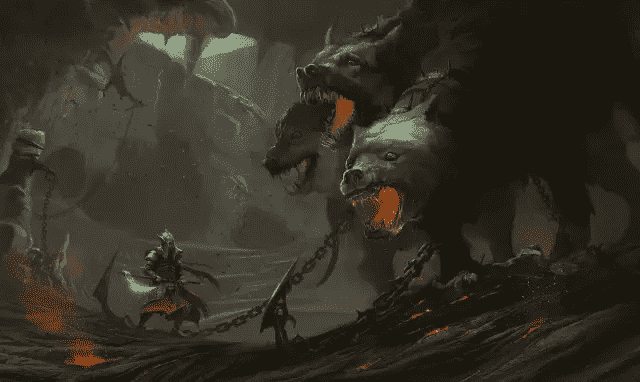
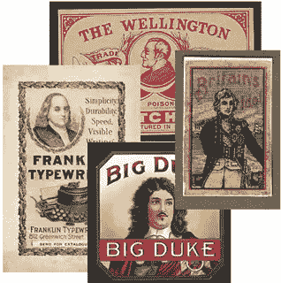
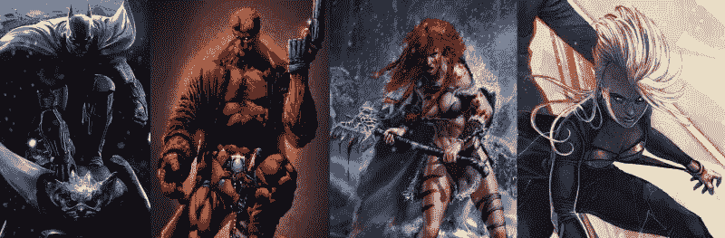
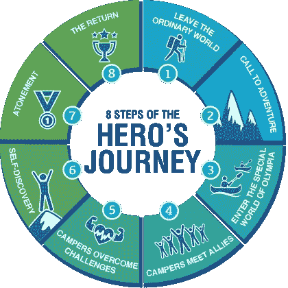
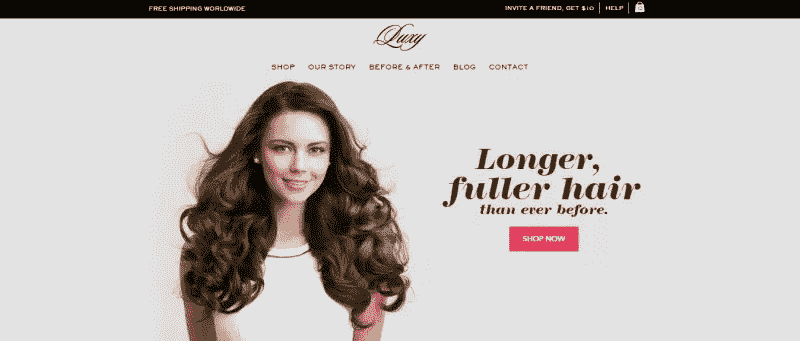
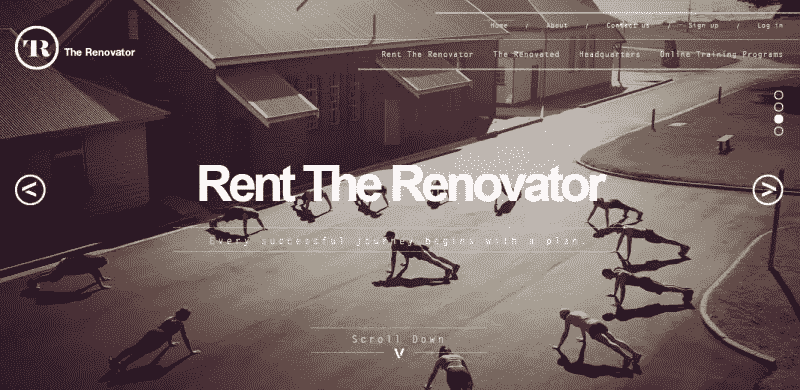
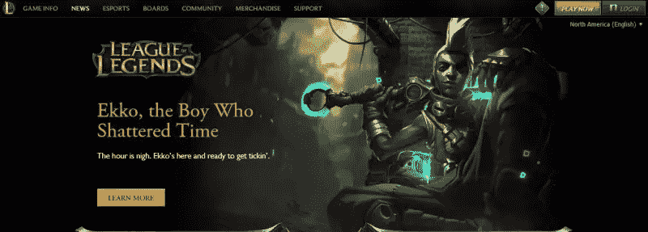
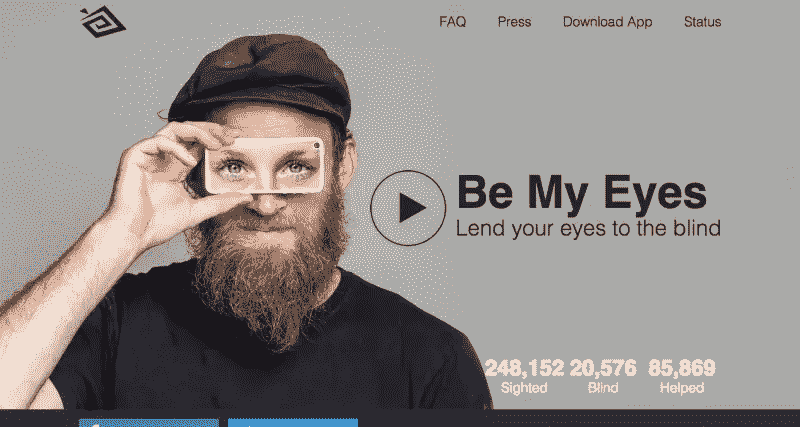
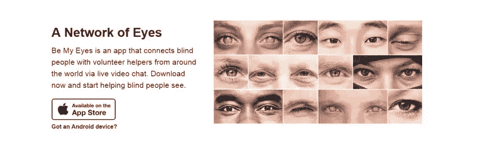

# 探索英雄部分

> 原文：<https://www.sitepoint.com/exploring-hero-section/>

根据牛津词典的定义:**英雄*/ˇhirū/*(名词)**

因勇气、杰出的成就或高尚的品质而被崇拜或理想化的人，通常指男人

:书、戏剧或电影中的主要男性角色，通常被认为具有良好的品质，并期望读者同情他

(【神话和民间传说中】)超人:具有超人品质且通常是半神血统的人，尤指其功绩和与神打交道是古希腊神话和传说主题的人。

这些都是一个词的定义，这个词来源于古希腊词ἥρως，意思是英雄。这个词有着丰富的历史，可以追溯到神与神话中的野兽发生冲突，并支持英雄在毁灭的道路上击败讨厌的敌人的时代。

但是这样一个词的词源和历史与网页设计有什么关系呢？简而言之，如果你知道如何制作砂浆，你就可以建造比稻草屋更有效的东西。

## 什么是英雄版块？

悲伤真相时间:英雄部分与你喜欢的漫画和电影英雄无关。这意味着没有蝙蝠侠、地狱男爵、钢铁侠、奇异博士或任何其他披着斗篷的十字军。

“英雄部分”——通常也被称为“英雄头”和“英雄形象”——是一种设计趋势，并不都是*新的。19 世纪的肥皂公司竞相在他们的标签和报纸广告中开发最有效的英雄面板，以可爱的孩子、慈爱的母亲和毛茸茸的小猫为特色。*

那里没什么变化。

公司也第一次开始理解将他们的产品与当代英雄联系起来的好处，包括本杰明·富兰克林、霍雷肖·纳尔逊和威灵顿公爵——并非总是得到许可。

在网页上，英雄部分通常是一个突出的图像、滑块、文本或类似的元素，位于主页布局的顶端，可能还会出现在后续页面。它就在前方，中心，在你的面前。

不要把英雄部分和那些用来代替颜色或图案的大而时髦的背景图片混淆。这些部分总是有一个目的和重点，而不仅仅是为了设定一个总体的外观和基调。

英雄部分不仅是视觉刺激，也是一个核心工具，不仅用来给设计一个焦点，还用来吸引大众，让他们着迷。英雄部分不仅是你故事中“可爱的主角”,也是让你继续读下去的书皮中的总结。

## 文学英雄

当我为艺术家创作音乐视频时(也许你不知道我是这样做的)，我经常发现自己被留在自己的设备上，除了自己的概念，没有任何概念。我发现，寻找歌曲意义和图像之间的无意识联系不仅能更好地理解这个项目，还能让我创作出让艺术家开心的视觉效果。

对于网页设计，特别是英雄部分，这个概念是非常相似的。了解过去——英雄的背景故事——你可以把它应用到现在。

早在 1947 年，约瑟夫·约翰·坎贝尔就引入了“单体”或“英雄之旅”的概念。概念是这样的:

一个英雄冒险离开平凡的世界，进入一个超自然的神奇区域:在那里遇到了神话般的力量，并赢得了决定性的胜利:英雄从这个神秘的冒险中回来，并获得了造福于他的同胞的力量。

在典型的结构中有三个动作——离开、开始和返回。每一个行为都被分解成几个阶段，这些阶段可以应用于创建和构建你网站的英雄部分。

在你的章节中使用英雄的文学和心理属性时，要记住的关键是:

*   英雄被崇拜，是他们居住的世界的主要玩家
*   英雄的旅程是一个有目的的旅程，从开始到结束
*   因此，英雄的神话是寻找真正“自我”的第一步
*   英雄的最终产品或个性化与故事的其余部分一样重要

## 将文学英雄运用到设计中

现在我们已经解决了这个问题，是时候看看文学联系和历史如何帮助塑造一个有效的英雄部分了。

*   文学英雄通常从“普通人”开始——例如《指环王》中的佛罗多——但随着故事的发展，越来越突出。将这个想法融入你的英雄部分，在它的内部和周围创造对比。让你的英雄在视觉上与众不同。
*   虽然英雄的旅程通常遵循一个值得注意的公式，但你应该有意识地努力设计自己的“路径”。不要觉得使用普通布局有压力。尝试不同的东西。
*   在英雄的旅途中，没有什么任务是无缘无故的。你的英雄部分应该总是服务于一个目的。设计时确保有 ***目的地*** 。这可能是一个问题的解决，一个恐惧的减轻，甚至只是“*更长，更浓密的头发*”。

*   虽然不是所有的文学故事都有强大的半神作为英雄，但他们确实有英雄在结尾变得勇敢。为你的标题使用大而粗的字体来表达这个想法。
*   无论是作为一个文学或心理载体，英雄有助于引导故事。挑选图片时，确保它们有助于推进你的“故事”。

*   喜欢文学，把你的设计看做一个故事。每个元素都是一个章节，所以在设计中适当考虑产生逻辑流，不仅讲述你的故事，还告诉访问者下一步去哪里。

## 伟大的英雄总是会讲故事

由于大部分英雄镜头都是静态的，甚至有可能用一张图片来讲述一个故事？

你当然可以。让我们来看看*如何成为我的眼睛*使用他们的英雄部分，以一个单一的图像推进他们的故事。

首先让我们从网站的概念开始。视障用户有时可能无法获得他们世界的重要视觉信息。这可能是从标牌到包装到邮件递送的任何东西。“成为我的眼睛”应用程序允许视障用户通过摄像头立即与视力正常的志愿者联系，后者可以提供帮助。从某种意义上说，这些志愿者是“英雄”这个词的真正体现。

但是，虽然任何人都可以成为英雄，该网站的英雄部分巧妙地使用静态图像来成功地讲述一个故事，超越了产品的简单高质量图像。

“普通人”，这个家伙的形象被塑造成视觉障碍的用户，而 iPhone 手机壳则展示出明亮、生动的眼睛，扮演英雄的角色。你看不到实际的产品，但故事很清楚。没有沉重的惯用手，没有隐晦的信息，只是一个简单的“*这就是你正在看的。这就是我们的故事*。

通过使用图像的高对比度和大胆的字体，你可以看到逻辑和进程。如果你习惯于从左到右阅读，英雄部分会更好——不可否认这是一种文化现象——因为这不仅突出了英雄的旅程，还指出了隧道尽头非常重要的光明。

这里的关键点是，如果你在英雄镜头构图中投入足够的思考，就有可能讲述一个线性的、细致入微的故事。

如果我的眼睛能做到，为什么你不能？

## 结论

对大多数人来说，应用一些与网站开发无关的设计似乎有些牵强，但是无意识的链接和有意识的运行一样有价值。如果有的话，你可以说你至少尝试了一种新的开发方法。试试吧，你永远不知道会有什么好结果。

在设计英雄部分时，你有没有使用过非常规的方法？让我们知道。

## 分享这篇文章