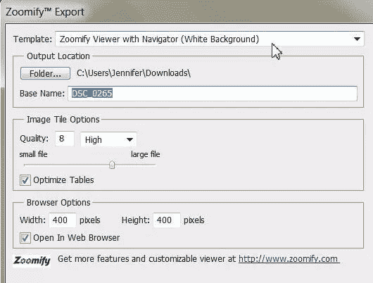
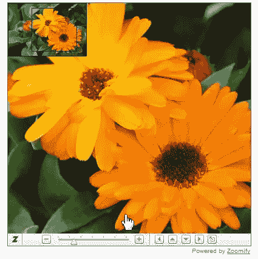

# 使用 Photoshop 为 Web 导出可缩放的图像

> 原文：<https://www.sitepoint.com/export-zoomable-images-for-the-web-using-photoshop/>

Zoomify 功能最早出现在 Photoshop CS3 中。它允许你在网上发布高分辨率的图像，观众可以平移和缩放以查看更多细节。该功能的优点在于，基本大小的图像可以与同等大小的 JPEG 文件同时下载。你可以从 Photoshop 中导出 HTML 文件和 JPEG 文件，然后上传到你的网站。Zoomify 功能适用于任何网络浏览器。

1.在 Photoshop 中，打开一个您希望用户能够平移和缩放的大图像。虽然图像在宽度和高度方面可以很大，但分辨率仍然只需要 72ppi，因为它只能在屏幕上观看。我在这个例子中使用的图像是 1200x803px 像素，分辨率为 72 像素。

你将花的图像转换成一个在屏幕上看起来更小的文件，在一个角落有一个小的放大框，在底部有缩放控件。

2.选择“文件”>“导出”>“缩放”。将打开“缩放”对话框。

Template

Sets the background and navigation for the image viewed in the browser

Output Location

Specifies the location and name of the file

Image Tile Options

Specifies the quality of the image

Browser Options

Sets the pixel width and height for the base image in the viewer’s browser

3.在“缩放导出”对话框中，单击“文件夹”，然后选择图像。对于基本名称，键入“Flowers”将质量设置为 8；查看器浏览器中基础图像的宽度为 400，高度为 400。确保选择了“在 Web 浏览器中打开”选项。

4.单击“确定”导出 HTML 文件和图像。Zoomify 会在你的浏览器中打开它们。

5.使用“缩放”窗口中的控件来缩放和平移花朵图像。

就是这样！简单的可缩放图像，您可以添加到您的网站。你可以在这里找到更多关于 Zoomify 的信息。

**note:**Want more?

如果你想阅读更多关于 Jennifer 的文章，请订阅我们每周的网页设计时事通讯，。

## 分享这篇文章