# expression Web——您的新 PHP 工具包

> 原文：<https://www.sitepoint.com/expression-web-3-php/>

我必须承认，我已经很久很久没有用可视化编辑器写网页了。我和我的文本编辑器是最好的朋友，一个可视化开发环境需要能够做很多漂亮的东西来打动我。因此，带着极大的好奇心，我开始在 Expression Web 3 内部探索，这是微软最新版本的 Web 开发工具包。Expression Web 承诺提供直观且有用的 Web 开发体验。支持许多不同语法的代码高亮和补全；除了常见的怀疑对象——HTML、CSS 和 JavaScript——您还可以享受 PHP、ASP.NET 等代码完成功能。测试工具包括对 PHP 页面实时查看的支持，一种在 Internet Explorer 6 到 8(以及 Firefox)中进行测试的全新方式，以及许多用于尝试其他已安装浏览器的快捷方式。您甚至可以从 Photoshop 文档中导入内容，从而轻松地从 PSD 中的图层中抓取图像部分，并将其包含在页面中。在这个操作指南中，我们将创建一个非常简单的 PHP 页面，使用体验来测试 Expression 的速度。我们开始吧！

### 开始的时候

首先，我们需要拿一些关键物品。

#### 拿一个 Photoshop Comp

我们将使用我之前准备的 Photoshop comp 制作一个简单的 PHP 页面。如果你想跟着这个教程走，也可以随意拿这个教程。当然，如果你喜欢冒险，这是一个很好的机会来玩你已经想好的设计！

#### 安装 Expression Web 或 Expression Studio

自然，我们需要一份 Expression Web，你可以从微软 Expression 网站下载。可以单独为 Expression Web 和 Super Preview 选择一个独立的安装程序，也可以安装完整的 Expression Studio。试用是完全无限的，持续 60 天，这应该是绰绰有余的时间来决定是否要购买。

**Check You’re Up to Date**

当我们在 2009 年 11 月底撰写本文时，Expression Web 的一个服务包已经发布。如果您在该日期之前安装了 Expression Web，请确保您拥有最新版本。

**Keep the Change**

顺便说一句，如果你决定在试用结束后购买 Expression Web 3，检查一下你是否有资格享受升级价格。自然，Expression Web 2 的用户在版本 3 上获得折扣；然而，在撰写本文时，Adobe Creative Suite、Microsoft Office 和 Visual Studio 2005 的用户也可以获得升级定价。赚取差价，在外面享受一顿丰盛的晚餐！

#### 安装 PHP

Expression Web 包含了对 PHP 编码的支持，但是如果我们想预览 PHP 页面，我们需要安装 PHP 二进制文件。如果您还没有这样做，请从 [PHP for Windows 网站](http://windows.php.net/)获取 Windows PHP 安装程序。这里最简单的选择是使用 Installer 选项，而不是源代码。PHP 一如既往的免费。但是，在继续之前，您需要检查两个重要的配置变量:创建或编辑 php.ini 文件，并查找`doc_root`和`cgi.force_redirect`行。`doc_root`必须取消注释并设置为`localhost`，`cgi.force_redirect`必须取消注释并设置为`0`。如果安装程序未能为您做到这一点，请现在编辑它。由于这将是一个开发环境，确保将`display_errors`设置为 **Yes** 可能是一个好主意。现在，您已经掌握了跟随本教程所需的所有细节。

### 探索 Expression Web

我喜欢通过直接行动来熟悉一个新的应用程序。当您第一次启动 Expression Web 时，迎接您的将是一个充满边栏、工具栏和其他好东西的工作区。在中间，您会看到您的文档。[图 1，“打开一个简单文档的 Expression Web 3 workspace”](#fig_expression_web_workspace "Figure 1\. The Expression Web 3 workspace with a simple document open")展示了它的外观。 **图一。一个简单文档打开的 Expression Web 3 工作区** 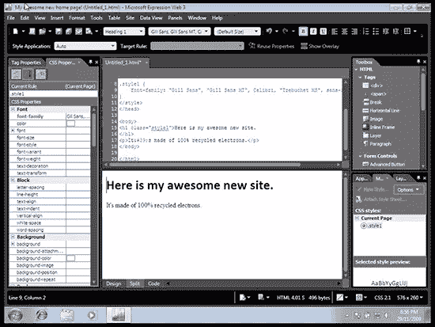这个截图在 Expression Web 的拆分视图中显示了一个简单文档，同时显示了设计和代码。可以在顶部输入标记，底部区域将显示它的外观。您可以使用该窗口底部的选项卡在代码、设计或拆分视图之间切换，如图[图 2，“在设计、拆分和代码视图之间切换”](#fig_swap_views "Figure 2\. Swap between Design, Split, and Code views")所示。 **图二。在设计视图、拆分视图和代码视图之间切换** 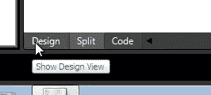左侧和右侧的面板包含一些工具，一旦我们开始工作，就会发现这些工具很有用。左侧是一个标签和 CSS 属性面板，在这里我们可以向任何元素添加各种属性和 JavaScript 事件，或者调整元素的 CSS 属性。右边是一个工具箱，我们可以从中拖放一些常见的元素，比如`div`元素、表单小部件或者 Flash 或 Silverlight 之类的组件。如果你是一名 ASP.NET 开发者，这里也有一些适合你的东西。其他面板可用，但默认情况下是隐藏的；您可以使用屏幕顶部的面板菜单来显示它们。看着我的设计作品，我对需要发生的事情有了一个相当好的想法:应该有一个容器`div`来保存页面的内容，一个漂亮的标题区域位于左边，页面的内容在右边的`div`中。 **图三。本页** 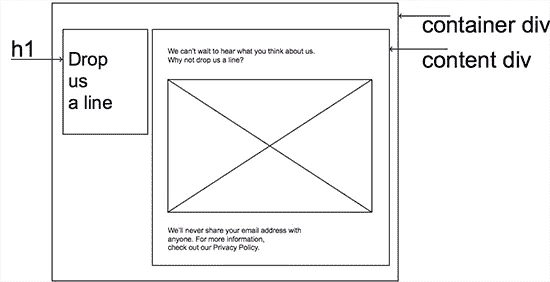结构的线框视图

### 设计视图

由于我是一名文本编辑，是那种手工编写代码的女孩，我的第一反应是跳入代码，开始打字。然而，我很好奇 Expression 的可视化编辑器将如何处理我需要的东西。让我们切换到设计视图。下面，我添加了一些非常基本的元素来为我的文档提供一个外壳。我使用我右边的工具箱面板放入了一个`div`，它将成为我的容器`div`。在里面，我为页面内容放置了另一个`div`，为标题放置了`h1`，还有一些文本占位符。在下图中，你可以看到我目前工作的`div`周围有一条虚线。顶部是一系列带元素的椭圆形——这是我在文档树中的当前位置。**图 4。卑微作者的未知领域** 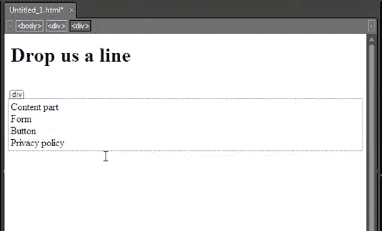让我们看看应用一些 CSS 有多简单。我们将从选择 body 元素开始。在设计视图中，点击**设计**窗口顶部的元素名称即可轻松实现。接下来，我们将添加一个新的样式，使用 CSS 面板右下角的**添加新样式**按钮。出现**风格向导**窗口，有大量有趣的选项可供选择。默认情况下，Expression 将假设您打算应用一个名为`.style1`、`.style2`等的样式。正如我们所知，这些类型的样式名称不适合语义标记。幸运的是，改变选择器非常容易，它使用了`body`元素。您可以键入，或者从下面显示的下拉列表中选择。**图 5。这里选择 body 元素** 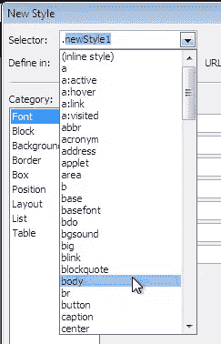这里的另一个很好的选项是选择我们是否希望将它放在页面的样式声明中，或者放在一个新的样式表中。如果我们选择将这个样式声明放在一个新的样式表中，Expression 会帮助我们创建一个。太酷了！**图 6。为什么是的，我想要那个新的样式表** 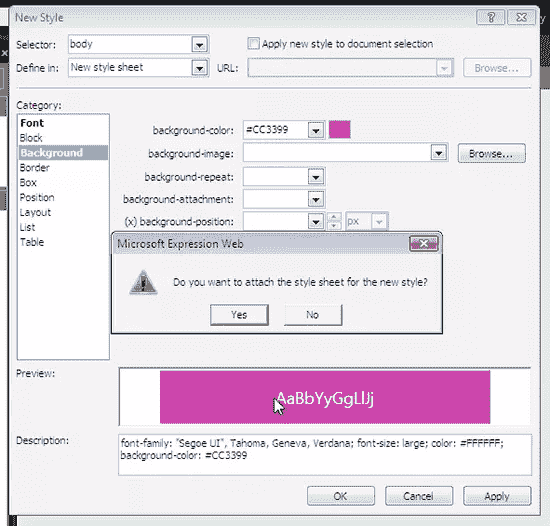使用向导，我们可以添加所有需要的属性:字体、背景和文本颜色等等。(我们的 Photoshop 构图里面有一张背景图，不过这个我们以后再处理。)声明被安排到适当的类别中，一些面板甚至给你提供了方便的指针——Box 类别向你展示了 CSS box 模型的图表，帮助你记住一个 Box 的各个部分是如何组合在一起的，这对新手来说是很棒的。**图 7。当你添加了你的声明后，一个盒子模型备忘单** 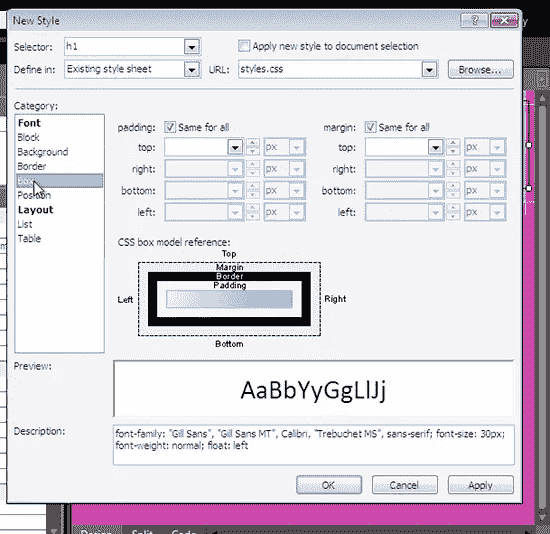点击 *OK* 。现在已经有了一个样式表，我们可以在左侧的 CSS 属性面板中查看每个元素的 CSS 属性。根据线框上的说明，我们将使用相同的过程来设置本文档其余部分的位置。要向元素添加`id`属性，使用最左侧面板上的**标签属性**选项卡，并为您想要选择的每个元素设置`id`。然后，使用**添加样式**按钮为每个 ID 添加样式。我选择了容器`div`元素`80%`宽度、`h1`元素`30%`宽度和内容`div` `65%`宽度。如果你还没有保存你的页面，现在是时候了。确保将您的 HTML 页面保存为 PHP 页面——当您在另存为对话框中时，从**另存为类型**下拉菜单中选择 PHP。

### 所见即所得蓝调

头发斑白的网络老手们讲述了可怕的故事，讲述了一个所见即所得的编辑器可能造成的那种令人费解的混乱。对 HTML 知之甚少或一无所知的人可以使用 WYSIWYG 工具创建一些非常糟糕的标记和样式，而最佳实践可能会因为易于使用而半途而废:布局表格、绝对定位的`div`和难以理解的样式表比比皆是。事实上，一个真正有决心的新手可以很容易地创建这样的网页，甚至用 Expression Web。我们在这里使用的过程是一个享受 Expression Web 的网页构造可视化方法的好处的好方法，而不会使您的文档充满奇怪的劣质标记。如果您更喜欢使用点击式工具，例如直接在屏幕上绘制`div`或使用工具栏格式化文本，请确保使用 Expression 的整理工具:优化 HTML 和 CSS 报告向导将帮助您识别任何无关的垃圾。

### 超级骗子，超级预览

现在有了一个非常基本的布局，让我们看看它是如何形成的。点击最顶端工具栏上的红蓝**超级预览**按钮。超级预览的分屏出现，询问你想使用哪个浏览器。在 Internet Explorer 端，您可以选择 IE6、IE8 和 IE7 兼容模式。如果你安装了 Firefox，这也是一个选择。超级预览还允许您打开您的样机图像进行比较，并支持几种图像文件格式，包括 PSD 文件。**图 8。预览选项的大杂烩** 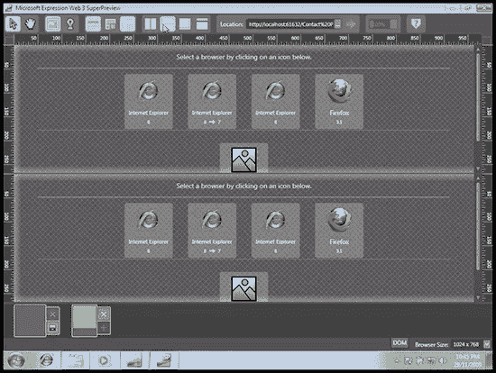我的屏幕很窄，所以我把分割窗格改为顶部/底部，而不是左侧/右侧。一旦你选择了两个浏览器进行比较，点击地址栏旁边的绿色大按钮，你的页面就会立刻在两个浏览器中加载。不过，超级预览不仅仅是一个浏览器预览窗口小部件，还有很多有趣的工具可以使用。加载预览后，尝试单击任一屏幕中的元素；两个屏幕上都将突出显示一个框，向您显示两者之间的任何细微差异。在图 9 中，我选择了 IE6 和 8 作为我的两个浏览器，然后单击了`h1`元素。显示屏告诉我，在宽度、位置和盒子大小上有很大的不同。(惊讶？我也不是。保持优雅，IE6。)超级预览提供了其他方法来比较这两者。如果您像我一样缺少屏幕空间，您可以使用叠加比较来代替。两个视图都是可见的，就像洋葱皮一样，所以很容易看出差异。**图九。细微的差异在叠加视图中突出显示** 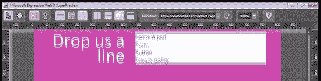在屏幕底部甚至有一个 DOM 浏览器标签，帮助你识别讨厌的元素。当然，您也可以在系统上安装的任何浏览器中预览您的作品。按 F12 启动默认浏览器并查看您的作品。在这两种情况下，Expression Development Server 都将启动。因为它是一个真正的网络服务器，而不仅仅是从你的硬盘上打开文件，你将能够看到任何动态内容，比如你使用过的 PHP 或 ASP 代码。当我们插入一些 PHP 时，这将非常方便。到目前为止，一切顺利！然而，我渴望写一些我自己的代码，如果你是一个手工程序员，我打赌你也是。让我们回到 Expression Web，这次我们将自己编辑代码。

### 代码视图

回到 Expression Web，我已经使用窗口下方的选项卡切换到代码视图。到目前为止，由设计视图创建的代码看起来相当整洁。表达式的语法突出显示相当清楚。元素的`id`属性和样式表链接本身都是超链接；按住 control 键单击其中一个会把我们带到样式表的那个部分。这很方便，也很棒。图 10。显示我的结果:**图 10。代码视图** 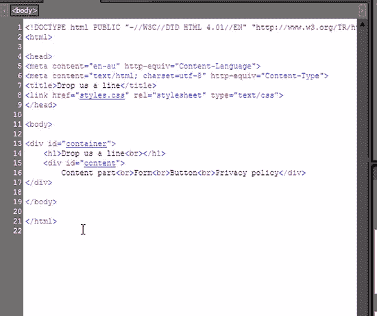让我们对表单的其余部分进行编码，并添加一些 CSS。你可以在本文的中找到我使用的标记和 CSS，但是我强烈建议你自己写。这样，您将看到 Expression Web 实用的代码完成功能。Expression Web 的代码完成助手称为 Intellisense，当我们开始编写代码时，我们将看到它发挥作用。首先，让我们删除占位符文本，并从表单顶部添加一段文本。仔细观察你的输入，你会发现智能感知开始起作用了。编写 HTML 时，Intellisense 助手会在您打开方括号时建议元素，在您输入空格时显示合适的属性或事件，在您使用等号时为您插入引号，甚至在您关闭方括号时为您插入正确的结束标记。在 CSS 视图中，缩进、结束分号和有用的建议都以同样的方式工作。为了节省更多的按键，Expression 提供了许多预设的代码片段，您可以通过按下 **Ctrl Enter** ，然后键入快捷键或从列表中选择来调用。学会所有这些需要一段时间，但是一旦你学会了，你就有了一些强大的文本宏。这些包括有用的工具，如文档类型、公共的`meta`元素、空的`script`块等等。您还会找到代码片段菜单，提供默认的代码片段集；当然，你可以配置你自己的。如果您发现您经常在许多项目中构造相同类型的文本，代码片段功能肯定会为您节省一些时间。就我而言，我发现 Intellisense 对我的口味来说有点太智能了，我经常发现自己出于习惯键入额外的结束引号和标签。随着时间的推移、练习以及调整配置以适应您自己的风格，您有可能逐渐习惯任何编辑器的代码完成工具。幸运的是，很容易配置您的智能感知和代码片段首选项:只需在应用程序的常规编辑首选项中查找它们(**工具** > **页面编辑器选项**)。当然，如果代码完成的想法让你感到困扰，你甚至可以把它们都关掉。

### 突出不良行为

Expression Web 的目标是帮助您轻松创建符合标准的代码，这里有一系列工具可以帮助我们。Expression Web 的工具足够智能，可以检测出你的文档使用的是 HTML DOCTYPE 还是 CSS schema，并相应地给出建议。在“代码”视图中，如果您尝试使用无效元素或不受支持的 CSS 属性，您将看到熟悉的红色下划线，这通常意味着您拼错了一个单词。在 Expression Web 中，红色下划线表示您使用了一些不适当的代码。当然，这对于输入错误也很方便——图 11。显示了我在`background` : **`Figure 11\. backgrond-color`中误将 u 漏掉时发生的事情的确是 CSS 2.1 schema** 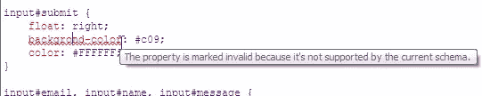不支持的我也有在 HTML 4 文档中键入自结束元素的习惯，很调皮。Expression Web 很好地告诉了我这一点。**图 12。HTML 4 ** 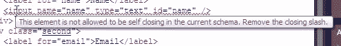中的反斜杠无效你会发现，每当你试图包含任何不合适的元素时，你都会看到这条红色下划线，这对创建基于标准的标记非常有帮助。Expression Web 还包括一系列报告器，可以帮助您识别无效标记、浏览器支持问题、潜在的可访问性问题或 CSS 问题。我已经启动了兼容性检查器(**工具** > **兼容性**)来检查我的 HTML 这将检查代码的有效性和潜在的浏览器支持问题。在下面的例子中，我正在检查我的页面中是否有任何部分会导致 IE6 出现问题。**图 13。兼容性报告选项** 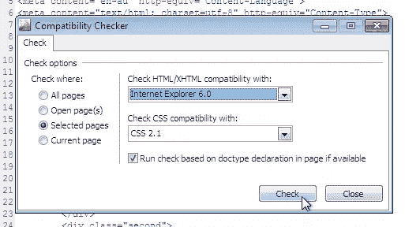我使用了相当简单的标记，所以记者对 IE6 兼容性没什么可说的。然而，它确实检测到我忽略了将`label`和`textarea`放在块级元素中，这是 HTML 4 有效性所必需的。哎呀！双击错误会显示违规的标记。**图 14。最好把它修好！**

### 从 Photoshop 导入图形

我需要从设计公司调出一个图形元素。是时候启动 Photoshop 并开始导出一些图层了，对吗？其实今天不用 Photoshop 了。Expression Web 提供了一种从应用程序中的 Photoshop 文件中提取图形的便捷方式；这意味着花更少的时间在 Photoshop 中导出单个图层，花更多的时间让东西看起来更漂亮。我工作的 PSD 有一个漩涡状的背景，我现在想添加它。从“文件”菜单中，选择**导入**>**Adobe Photoshop(PSD)**，并浏览到您的 Photoshop 文档的位置。Expression Web 将打开文档，图层保持不变。我只需要漩涡，所以我会取消所有其他层。到目前为止的结果如下所示，完全透明。**图 15。我的背景图片** 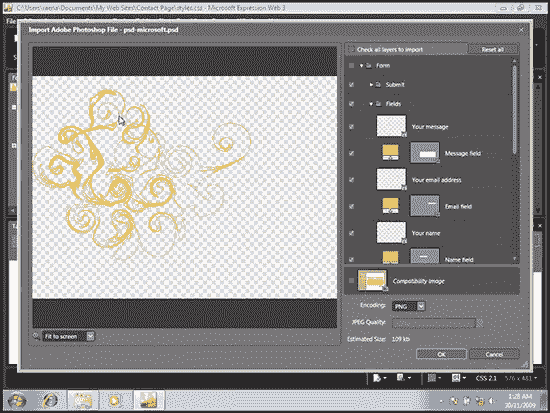当我准备保存它的时候，Expression 问我把图片放在哪里。我将把它放在与我的 CSS 和 PHP 文件相同的目录中，并将其插入到样式表中。这就是全部了！以这种方式导入图形可以节省大量时间。没有必要先将 PSD 保存为某种时髦的格式，或者预先切片图像——只需在 Expression 中直接打开文件。很好。

### 打开 PHP

我们已经添加了标记和样式，并构建了一些相当不错的静态页面——现在是时候用 PHP 为我们的表单添加一些动作了。我们将把我们的反馈存储在逗号分隔值(CSV)文件中，所以让我们将该功能添加到该表单中。记住，你应该经常保存你的工作；现在是这么做的好时机！

### 保持简单，昏迷-…呃，甜心

因为这更像是一个 Expression Web 教程，而不是 PHP 教程，所以我们将保持它非常非常简单。此示例不适合您的生产环境；在现实世界中，您需要额外的功能，例如过滤垃圾邮件发送者的方法，或者将反馈存储在数据库中。要更全面地了解表单处理和安全性，请查看我们在 SitePoint 发布的其他 PHP 教程。这里有一个非常简单的函数集，它将接受表单输入，检查姓名和消息是否被填写，并将它们写入一个文件。如果表单数据尚未提交，脚本将显示空表单。首先，我将从现有的标记中提取表单，添加一个表单动作(`action="default.php"`)并将其包含在一个新文件 form.inc.php 中。接下来，我将在 default.php 的顶部创建一些函数来处理表单的提交。`decide`选择是显示表单，还是继续检查表单。`process_form`会做一些基本的检查，以确保表单确实完成了，而`write_data`会将字段输入的三个值存储在一个 CSV 中，并以友好的消息做出响应。表单所在的页面现在有一个很大的空白；我会给那边的`decide`打电话。在下面的代码示例中，您会发现我非常简单的表单处理程序:

```
<?phpfunction decide() {if(isset($_REQUEST['submit'])) { process_form(); } else { include("form.inc.php"); }}function process_form() {if (!isset($_POST['name']) || !isset($_POST['message'])) {echo "<p>There was an error in the form: Both the name and message are required.</p>";include("form.inc.php");} else {write_data();}}function write_data() {$name = $_POST['name'];$email = $_POST['email'];$message = $_POST['message'];$data = $name . "","" . $email . "","" . $message . ""rn";$file = fopen("feedback.csv", "a+");if($file) {fwrite($file, $data);fclose($file);$response = "<p>Thanks for the feedback :D</p>";} else {$response = "<p>Sorry, there was an error storing your feedback.</p>";}}?>
```

在我编写代码的时候，很高兴看到 Expression Web 的语法突出显示和智能感知特性也帮助了我。下面，您将看到一些突出显示的代码示例——另外，这些超链接也可用于 PHP includes，这使得在需要时跳转到它们变得轻而易举。**图十六。一些清晰的语法高亮显示** 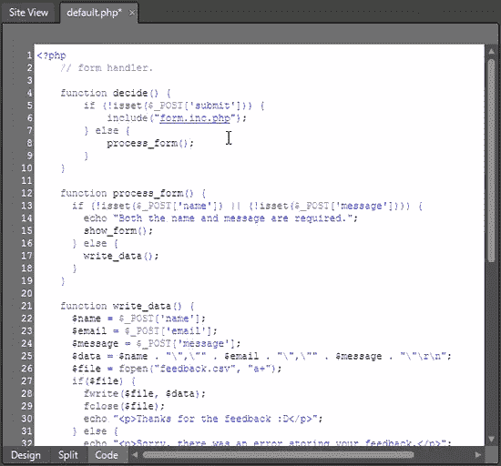如果你以前习惯于使用 Ctrl-Enter 来打开智能感知助手，那么在 PHPmode 中有一个新的击键需要学习；要查看 PHP 函数而不是 HTML 元素，请按 Control-L。您将看到一个菜单，其中有一个现成的函数参考，和以前一样，您可以通过滚动或键入来插入一些常用函数。**图 17。向前键入字符串函数** 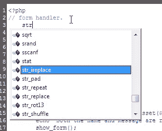当你在函数中移动时，会出现一个工具提示，让你知道预期的变量是什么。完成后，每个变量都会高亮显示。在这个例子中，我使用了`fopen`函数，它提示我继续处理所需的变量。**图 18。预期变量** 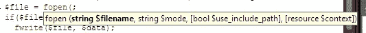的一个方便的提醒，在这里你也会得到全局变量的帮助——不会再有像这里的`$_PSOT['string']`这样可怕的错别字了！**图 19。全局变量** 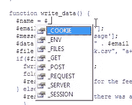你可以在我们之前提到的页面编辑器对话框中配置 Intellisense PHP 选项。值得注意的是关闭各种功能的能力；如果你正在使用 IIS 并且不使用 MySQL 或 Apache 函数，是时候整理一下菜单了！当你对你的脚本满意时，是时候测试它了！设计视图不能显示运行中的 PHP 代码，所以我们需要使用一个真正的浏览器。按 F12 启动你最喜欢的浏览器。同样，因为 Expression 包含一个 web 服务器，所以我们可以在本地测试脚本。如果一切顺利，您应该有一个好看的表单供您使用，准备收集一些反馈！

### 结论

虽然这个表单非常简单，但是我们已经涉及了很多内容。在这个过程中，我们学会了如何使用 Expression 的设计视图来可视化地编辑我们的页面，看到了它的代码完成工具如何帮助我们创建优秀、整洁的标记，从 Photoshop 中导入了一些图形，最后用 PHP 给它注入了一些活力。到目前为止，您应该对 Expression Web 3 的可能性有了一个清晰的认识。为什么不[拿起你自己的副本](http://www.microsoft.com/expression/)出去兜风呢？

## 分享这篇文章