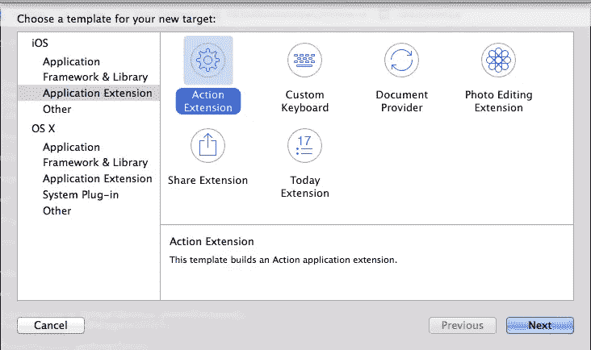

# iOS 8 和 OS X Yosemite 中的扩展指南

> 原文：<https://www.sitepoint.com/extensions-ios-8-os-x-yosemite/>

除了 iOS 之外，每个移动平台都有一个共同的功能，即无需运行应用程序就可以访问该应用程序的功能。Android 称之为“Widgets”，Windows Phone 称之为“Live Tiles”。

让我们明确一点，iOS 中的扩展不仅仅是小工具或第三方键盘。扩展是苹果公司提出的从任何应用程序扩展任何功能的新方法。苹果公司宣称这是 OS X 服务功能的继承者。

苹果如此重视扩展，以至于在 OS X 他们将许多属于 [Dashboard](https://www.apple.com/downloads/dashboard/) 的功能带到了扩展中。如果苹果在 OS X 的未来版本中完全移除 Dashboard，我不会感到惊讶，但我认为这将是迟早的事。目前，如果您在过去编写了 Dashboard 小部件，您现在应该移植它以使用扩展框架。

iOS 8 和 OS X Yosemite 中有 7 种支持的扩展类型，其中 6 种可用于 iOS，4 种可用于 OS X。我们将在本文中了解所有这些类型。

注意，苹果已经表示，在 iOS 和 OS X 的未来版本中，他们可能会添加新的扩展类型。[【1】](#fn:1 "see footnote")

<caption class="tablecaption">**Extension points in iOS and OS X. Source: Apple.**</caption>
| 

延伸点

 | 

帮助用户的应用程序扩展示例:

 |
| --- | --- |
| 今天(iOS 和 OS X) | 在通知中心的“今日”视图中获取快速更新或执行快速任务(Today 扩展称为**小部件**) |
| 分享(iOS 和 OS X) | 发布到共享网站或与其他人共享内容 |
| 行动(监督办和 OS X) | 在另一个应用程序的上下文中操作或查看内容 |
| 照片编辑(iOS) | 在“照片”应用程序中编辑照片或视频 |
| 查找器(OS X) | 直接在 Finder 中显示有关文件同步状态的信息。 |
| 文档提供商(iOS) | 提供对文件库的访问和管理。 |
| 自定义键盘(iOS) | 将 iOS 系统键盘替换为自定键盘，以便在所有应用程序中使用 |

## 今天(iOS 和 OS X)

今天的扩展类型(也称为小部件)是人们可能在其他移动平台上见过的最常见的扩展类型之一。长期以来，这一直是最受欢迎的功能之一。

一个 *Today* 扩展允许开发者在通知中心的底部放置一个自定义视图，可以在任何地方通过从屏幕顶部向下滑动来访问。这对于显示一小部分重要信息(如体育比分、股票价格或汇率)的应用程序非常有用。你可以在今天的*扩展中加入更复杂的功能，例如 [PCalc 在他们最新的更新中加入了一个迷你计算器](http://www.imore.com/pcalc-33-brings-support-extensions-iphone-6-and-more)。*

## 分享(iOS 和 OS X)

在第一版 iOS(当时是 iPhone OS)中，苹果推出了一种无需复制粘贴即可分享网页和照片的方式。事实上，复制和粘贴在整个操作系统中是不可用的。这是苹果一直延续到 iOS 7 的分享按钮的开始。在 iOS 5 中，苹果增加了分享到 Twitter 的功能，在 iOS 6 中增加了分享到脸书的功能，在 iOS 7 中增加了隔空投送和阅读列表的功能。

在 iOS 8 之前，第三方开发者无法将他们的应用程序作为共享选项之一。苹果只是在每次操作系统更新时一点一点地添加新的共享资源。当然，从长远来看，这对苹果来说从来都不是一个可扩展的选择。如果在 iOS 生命周期的中间，一个新的社交网络开始流行会怎样？如果脸书或 Twitter 在 iOS 生命周期的中期大幅改变他们的政策会怎样？

因此，Share extension 是社交网络和其他网络服务的天然选择，这些服务多年来一直希望被包含在 iOS 中。[【2】](#fn:2 "see footnote")

## 行动(监督办和 OS X)

*Action* 扩展位于 share 扩展附近，在 OS X 和 iOS 中都可以通过同一个按钮访问。在旧版本的 iOS 中，我们已经在使用动作扩展来处理诸如*添加到阅读列表*、*添加到主屏幕*、*复制*和*打印*之类的事情。

操作扩展用于在另一个应用程序的上下文中查看或转换内容。如 WWDC 的主题演讲所示，这方面的一个最好的例子是一个翻译应用程序，它有一个动作扩展，可以将 Safari 中的内容翻译成另一种语言。另一个巧妙的应用是让 1Password 这样的密码管理器编写一个动作扩展，在 Safari 页面上运行以填充密码。

## 照片编辑(iOS)

许多人都期待 iOS 中的*照片编辑*扩展。自从 Instagram 推出以来，我收到许多朋友问我:*“我可以在我的照片应用程序中使用 Instagram 滤镜吗？”*(回答:*“当然不是，要发布到 Instagram 才能得到过滤后的照片”*)。他们对 Instagram(以及其他照片编辑 iOS 应用)的想法类似于桌面上的 Photoshop。你打开一张照片，编辑，然后你得到结果。

虽然它与 iOS 中的不完全一样，但照片编辑扩展将允许用户使用他们安装的任何编辑工具在内置的照片应用程序中编辑照片。这对用户来说是一个更好的体验，因为他们所有的照片都在照片应用程序中，他们不必离开应用程序来编辑他们的照片。

## 查找器同步(OS X)

*Finder Sync* 是一个仅限 OS X 的扩展。这也是这个版本中唯一的 OS X 独家扩展。Finder Sync 扩展可用于注册要监控的文件夹，也可与远程数据源同步。如果你正在使用 Dropbox，你可能对 Finder Sync 扩展的工作原理有很好的了解。

你可以用 Finder Sync 扩展完成 Dropbox 正在做的事情。这包括在特定文件夹中显示自定义上下文菜单，并在其中的文件上显示徽章。您也可以将自定按钮添加到 Finder 工具栏。

## 文档提供商(iOS)

*文档提供者*扩展是 Finder Sync 扩展的 iOS 对应部分。使用 iOS 中的文稿提供程序扩展，当应用程序尝试在基于文稿的应用程序中存储或打开文件时，您可以提供自己的文件。

这不一定让用户能够访问您的整个文件系统，但至少允许用户保存、打开和编辑您自己的云存储中的文档。这暗示苹果现在可以让用户使用第三方云存储服务。这可能意味着人们可能会离开 iCloud，因为他们不再被迫将文档存储在 iCloud 中。

## 自定义键盘(iOS)

很明显，为什么这个扩展只在 iOS 上可用，因为它是两个平台中唯一不附带硬件键盘的平台。我很惊讶 iOS 中包含了这个。与其他扩展相比，我个人认为这是请求最少的扩展之一。

自定义键盘可以为用户提供自定义键盘界面。Swype[【3】](#fn:3 "see footnote")是来自其他平台的第三方键盘的一个最流行的例子。我对 iOS 的内置键盘相当满意。我试过使用[其他第三方键盘](http://jormy.com/hipjot/)，它们中的大部分都不太好用，也没有提供比内置键盘更多的功能。

## 我从哪里开始？

在为 iOS 8 和 OS X Yosemite 编写扩展之前，请确保您仔细考虑了用户将如何使用您的扩展。请记住，如果用户删除您的应用程序，您的分机也将从系统中删除。当你写扩展时，确保它是用户真正会使用的东西。确保他们可以将您的扩展与您的应用相关联。如果他们忘记了你的应用程序提供了某些扩展，他们不会意识到他们已经通过删除你的应用程序删除了你的扩展。

在 Xcode 6 中，创建扩展非常简单。就像 Apple 为核心数据、故事板和表格视图控制器提供模板一样，它们也为扩展提供了很好的起点。在 Xcode 6 中，可以使用 to*File>New>Target…*来访问扩展模板:

这就是扩展。这是 iOS 8 和 OS X Yosemite 中非常大的一个功能。这将是我们在未来的 iOS 和 OS X 版本中看到的进一步功能的基础。更多详细信息，请查看苹果公司的[应用扩展编程指南](https://developer.apple.com/library/prerelease/ios/documentation/General/Conceptual/ExtensibilityPG/index.html)。这是一个非常大的话题，但是我希望这篇博客文章能够温和而广泛地介绍扩展。

* * *

1.  未来可能会包括在 Apple Watch 上运行应用程序的扩展。 [↩](#fnref:1 "return to article")

2.  您好，[插接板](https://pinboard.in)。 [↩](#fnref:2 "return to article")

3.  他们可能会将其移植到 iOS。 [↩](#fnref:3 "return to article")

## 分享这篇文章