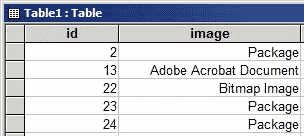
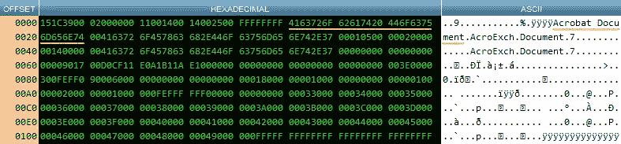
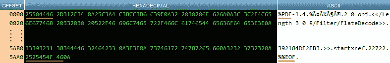
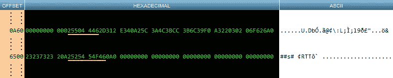
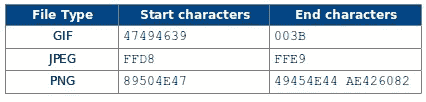
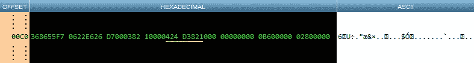

# 用 PHP 从 Access 数据库中提取对象，第 2 部分

> 原文：<https://www.sitepoint.com/extract-ole-objects-from-an-access-database-using-php-2/>

在本系列的第一部分中，我们学习了如何从遗留 Access 数据库中提取打包的对象。在第二部分中，我们将学习如何提取 Acrobat PDF 文档，并简要了解一些图像格式。

唯一相似的是 PDF，GIF，PNG 等。当存储在 Access 数据库中时，它们都被包装在由可变长度的头和尾组成的 OLE 容器中。正如我们将看到的，预告片可以被忽略，就像第 1 部分中讨论的包一样。标题更有用，但不包含我们需要的所有信息。

## Adobe Acrobat 文档

在本文使用的测试数据库中，有一个 PDF 存储在记录号 13 中:



识别 Access 数据库 OLE 对象字段中的 Adobe Acrobat 文档(PDF)的方法与我们在第 1 部分中所学的方法相同——检查前 50 个字节，寻找可识别的字符序列。

应用同样的方法从 OLE 字段中提取数据块，然后将其从十六进制转换为十进制，并在十六进制查看器中显示，可以清楚地看到，尽管我们在字段中确实存储了一个 PDF，但我们没有其他信息，如 PDF 的原始名称或其原始文件大小:



幸运的是，我们可以使用另一种技术来提取 PDF。每个 PDF 总是以字符序列%PDF 开始，以序列%%END 结束。这可以通过在纯文本编辑器中加载一个小 PDF 来轻松验证。或者，将一个加载到十六进制查看器中:



这里我只展示了第一个和最后几个字节，因为它们是 PDF 分隔符所在的位置。下一步是将此技术应用于 OLE 字段的内容，并找到嵌入 PDF 的开始和结束位置:



注意，我们需要搜索的是十六进制字符序列；也就是在使用 PHP 的`strpos()`函数寻找嵌入 PDF 的开头时，寻找 25504446。在寻找结尾时，2525454F46 是相关的字符序列。

那我们现在有什么？我们已经将 OLE 对象标识为 Acrobat Document 类型，并且我们有了嵌入文件的开始和结束位置。这样，我们就拥有了使用 PHP 的`substr()`函数从 OLE 字段中提取原始文件所需的全部内容。

## 其他对象类型

在讨论流行的图像类型之前，有必要花点时间来改进第 1 部分中的`switch`陈述。对于无所不包的默认条件，我们只显示了一条消息。如果将任何未知的 OLE 类型提取出来并保存到磁盘上以供以后分析，那就更有用了。新函数`extractUnknown()`获取 OLE 字段的全部内容，将其从十六进制转换为十进制，然后使用记录 ID 作为文件名保存到磁盘。这允许我们稍后在十六进制查看器中查看任何未知的 OLE 类型，以确定嵌入对象的类型。在下一节中，我们将需要它来识别哪些记录中嵌入了图像。

```
<?php
function extractUnknown($id, $data) {
   // convert entire object to decimal and save to disk
   file_put_contents($id . ".txt", hex2bin($data));
}
```

## 流行的图像类型

在任何给定的 Access 数据库中，不可能确切地说出如何在 OLE 头中识别图像类型。图像可能会被识别为“Paint Shop Pro 6”，或者可能会与其他一些图像编辑软件相关联。这完全取决于用于存储图像的系统所知的软件，以及所配置的任何文件关联。

为了知道这些未知的类型是什么，我们可以通过`extractUnknown()`函数运行每一条具有未知 OLE 类型的记录来制作一个列表。这将不同于现有的大量遗留 Access 数据库。

我们在这里考虑的图像格式是 BMP、GIF、JPEG 和 PNG。

### GIF、JPEG、PNG

“好消息，各位！”这三种图像类型可以以完全相同的方式进行处理。此外，这与之前提取嵌入 PDF 的方法完全相同。首先，我们需要找到嵌入图像的起始位置，然后是结束位置，然后提取这两点之间的所有内容。区别在于我们如何识别嵌入的对象。下表总结了这些关键细节:



### 位图文件的扩展名(Bitmap)

识别嵌入式 BMP 的分隔符是类似的，但是需要更多的工作。找到开始位置和上面讨论的文件类型一样容易，但是找到结束位置需要一点数学。让我们看看 hex 查看器中的两个关键元素:



前两个字节(ASCII 中的 BM)用橙色下划线标出，是嵌入式 BMP 的起始位置。下面两个带黄色下划线的字节是以 little-endian 格式存储的 BMP 的原始大小。大小需要转换成 big-endian 格式，然后乘以 2，因为对象是以十六进制格式存储的。

假设我们现在有了嵌入对象的起始位置和大小，我们可以使用与第 1 部分中从包中提取对象相同的方法来提取 BMP。

## 把所有的放在一起

接下来是第 1 部分中的 PHP 脚本，更新后包含了上述新功能。基本结构与以前的版本相同，switch()语句中的附加条件显示了扩展脚本的核心逻辑以适应其他 OLE 类型是多么容易。

```
<?php $offset = array(     "Packager Shell Object" =--> 168,
    "Package" => 140
);

if (!function_exists("hex2bin")) {
    function hex2bin($hexStr) {
        $hexStrLen = strlen($hexStr);
        $binStr = "";
        $i = 0;
        while ($i < $hexStrLen) {             $a = substr($hexStr, $i, 2);             $c = pack("H*", $a);             $binStr .= $c;             $i += 2;        }        return $binStr;     } } $dbName = "db1.mdb"; $db = new PDO("odbc:DRIVER={Microsoft Access Driver (*.mdb)}; DBQ=$dbName; Uid=; Pwd=;"); $sql = "SELECT * FROM Table1"; foreach ($db->query($sql) as $row) {
    $objName = "";

    switch (getOLEType($row["image"])) {
        case "Packager Shell Object":
            list($objName, $objData) = extractPackage($row["image"], $offset["Packager Shell Object"]);
            break;
        case "Package":
            list($objName, $objData) = extractPackage($row["image"], $offset["Package"]);
            break;
        case "Acrobat Document":
            list($objName, $objData) = extractPDF($row["id"], $row["image"]);
            break;
        case "Paint Shop Pro 6":
        case "Bitmap Image":
            list($objName, $objData) = extractImage($row["id"], $row["image"]);
            break;
        default:
            list($objName, $objData) = extractUnknown($row["id"], $row["image"]);
    }
    if ($objName != "") {
        file_put_contents($objName, $objData);
    }
}

function extractUnknown($id, $data) {
    // convert entire object to decimal and save to disk
    file_put_contents($id . ".txt", hex2bin($data));
}

function extractPackage($data, $offset) {
    // usable header size
    $headerBlock = 500;

    // find name
    $tmp = substr($data, $offset, 255);
    $nullPos = findNullPos($tmp);
    $name = substr($tmp, 0, $nullPos);
    $pos = $offset + strlen($name);

    // find data
    // 1st full path
    list($path1, $nameLen) = findFileName($data, $name, $pos, $headerBlock);
    $pos = $path1 + $nameLen;
    // 2nd full path
    list($path2, $nameLen) = findFileName($data, $name, $pos, $headerBlock);
    // check if only one full path
    if ($path2 > $pos) {
        $pos = $path2 + strlen($name);
    }
    $oleSizePos = $pos + 2;
    $oleObjSize = flipEndian(substr($data, $oleSizePos, 8), 8);
    $oleHeaderEnd = $oleSizePos + 8;
    $objName = hex2bin(substr($tmp, 0, $nullPos));

    // extract object
    $objData = getBlob($data, $oleHeaderEnd, hexdec($oleObjSize) * 2);

    return array($objName, $objData);
}

function extractPDF($id, $data) {
    $delimiter = array(
        "pdfStart" => "25504446",
        "pdfEnd" => "2525454F46"
    );
    // %PDF  - start block common to all PDFs
    $offsetStart = strpos($data, $delimiter["pdfStart"], 0);
    // %%EOF - end block common to all PDFs
    $offsetEnd   = strpos($data, $delimiter["pdfEnd"], $offsetStart) + 12;
    $objData = getBlob($data, $offsetStart, $offsetEnd - $offsetStart);
    return array($id . ".pdf", $objData);
}

function extractImage($id, $data) {
    $delimiter = array(
        "bmpStart" => "424D",
        "gifStart" => "4749463839",
        "gifEnd" => "003B",
        "jpgStart" => "FFD8",
        "jpgEnd" => "FFD9",
        "pngStart" => "89504E47",
        "pngEnd" => "49454E44AE426082"
    );
    $objName = "";
    if (strpos($data, $delimiter["bmpStart"], 0) !== false) { // is object a BMP
   	    list($objName, $objData) = extractBMP($id, $data, $delimiter["bmpStart"]);
    }
    elseif (strpos($data, $delimiter["gifStart"], 0) !== false) { // is object a GIF89
        list($objName, $objData) = extractGIF($id, $data, $delimiter["gifStart"], $delimiter["gifEnd"]);
    }
    elseif (strpos($data, $delimiter["jpgStart"], 0) !== false) { // is object a JPEG
   	    list($objName, $objData) = extractJPEG($id, $data, $delimiter["jpgStart"], $delimiter["jpgEnd"]);
    }
    elseif (strpos($data, $delimiter["pngStart"], 0) !== false) { // is object a PNG
   	    list($objName, $objData) = extractPNG($id, $data, $delimiter["pngStart"], $delimiter["pngEnd"]);
    }
    else {
        // other image types in here
    }
    // save to disk if object was found
    if ($objName != "") {
        file_put_contents($objName, $objData);
    }
}

function extractBMP($id, $data, $bmpStart) {
    $oleObjStart = strpos($data, $bmpStart, 0);
    $oleObjSize = hexdec( flipEndian(substr($data, $oleObjStart+4, 8), 8) );
    // extract object
    $objData = getBlob($data, $oleObjStart, $oleObjSize * 2);
    return array($id.".bmp", $objData);
}

function getBlob($data, $start, $end) {
    return hex2bin(substr($data, $start, $end));
}

function flipEndian($data, $size) {
    $str = "";
    for ($i = $size - 2; $i >= 0; $i -= 2) {
        $str .= substr($data, $i, 2);
    }
    return $str;
}

function findNullPos($str) {
    // must start on a two-character boundary
    return floor((strpos($str, "00") + 1) / 2) * 2;
}

function getOLEType($data) {
    // fixed position of OLE type
    $offset = 40;

    $tmp = substr($data, $offset, 255);
    $nullPos = findNullPos($tmp);
    $tmp = substr($tmp, 0, $nullPos);
    $type = hex2bin($tmp);

    return $type;
}

function hexStrToCase($str, $case) {
    $alphabet = 32;
    $tmp = "";
    $splitHex = array();
    $splitHex = str_split($str, 2);
    $splitTest = hex2bin($splitHex[0]);
    foreach ($splitHex as $key => $value) {
        switch ($case) {
            case "upper":
                if ((intval($value, 16) >= ord("a")) && (intval($value, 16) <= ord("z"))) {                     $splitHex[$key] = dechex(intval($value, 16) - $alphabet);                 }                 break;             case "lower":                 if ((intval($value, 16) >= ord("A")) && (intval($value, 16) <= ord("Z"))) {                    $splitHex[$key] = dechex(intval($value, 16) + $alphabet);                 }                 break;        }     }     $tmp = strtoupper(implode($splitHex));     return $tmp; } function hexStrToTilda1($str) {     $strDot = "2E";     $strTilda1 = "7E31";     $tmp = hexStrToCase($str, "upper");     if (strlen($tmp) > 24) {
        $dotPos = strrpos($tmp, $strDot);
        $tmp = substr($tmp, 0, 12) . $strTilda1 . substr($tmp, $dotPos, 8);
    }
    return $tmp;
}

function findFileName($data, $str, $offset, $headerBlock) {
    $strLen = 0;
    $tmp = substr($data, 0, $headerBlock);
    $strUpper = hexStrToCase($str, "upper");
    $strLower = hexStrToCase($str, "lower");
    $strTilda1 = hexStrToTilda1($str);
    $strPos = stripos($tmp, $str, $offset);
    if ($strPos === false) {
        $strPos = stripos($tmp, $strUpper, $offset);
        if ($strPos === false) {
            $strPos = stripos($tmp, $strLower, $offset);
            if ($strPos === false) {
                $strPos = stripos($tmp, $strTilda1, $offset);
                $strLen = strlen($strTilda1);
            }
            else {
                $strLen = strlen($strLower);
            }
        }
        else {
            $strLen = strlen($strUpper);
        }
    }
    else {
        $strLen = strlen($str);
    }
    return array($strPos, $strLen);
}
```

你会注意到我没有包含函数`extractGIF()`、`extractJPEG()`和`extractPNG()`的代码。那是因为我把这些作为练习留给你们，PHP 程序员伙伴们——代码将与我们讨论的其他 OLE 对象类型非常相似。

## 摘要

在本文中，我们介绍了使用 PHP 从 Microsoft Access 数据库的 OLE 字段中提取 pdf 的基本要素。我们还学习了如何识别某些图像格式，以及如何从它们的 OLE 容器中提取它们。

完成了关于如何在 Microsoft Access 数据库中存储和检索 OLE 对象的两部分介绍后，我们现在又有了另一个工具来帮助我们从旧的 Access 数据库中迁移出来。

你可以在 GitHub 上获得这个系列的代码。回购有两个分支——[part-1](https://github.com/phpmasterdotcom/ExtractObjectsFromAccessDatabase/tree/part-1 "ExtractObjectsFromAccessDatabase at part-1 - GitHub")用于第一部分的附随代码，以及 [part-2](https://github.com/phpmasterdotcom/ExtractObjectsFromAccessDatabase/tree/part-2 "ExtractObjectsFromAccessDatabase at part-2 - GitHub") 用于该部分的代码。

图片 via[Fotolia](http://us.fotolia.com/?utm_source=sitepoint&utm_medium=website_link&utm=campaign=sitepoint "Royalty Free Stock Photos at Fotolia.com")

## 分享这篇文章