# Fabric.js 简介:有趣的东西

> 原文：<https://www.sitepoint.com/fabric-js-the-fun-stuff/>

在本系列的第一篇文章中，我研究了使用 Fabric.js 的原因，它的对象模型和对象层次结构，以及 Fabric 中可用的不同种类的实体——简单的形状、图像和复杂的路径。我还描述了如何在画布上对 Fabric 对象执行简单的操作。既然大部分基础知识都已经讲清楚了，让我们开始有趣的东西吧。

## 动画

没有一个体面的画布库没有动画功能，Fabric 也不例外。鉴于 Fabric 强大的对象模型和图形功能，如果没有内置动画助手，那就太可惜了。

还记得改变任何对象的属性有多容易吗？您只需调用 set 方法，传递相应的值:

```
        rect.set('angle', 45);
```

制作一个对象的动画同样简单。每个 Fabric 对象都有一个动画方法，嗯……来制作该对象的动画。

```
        rect.animate('angle', 45, {
	  onChange: canvas.renderAll.bind(canvas)
	});
```

第一个参数是要制作动画的属性，第二个参数是动画的结束值。如果一个矩形的角度为-15 度，并且您在第二个参数中传递了 45 度，则该矩形的动画从-15 度到 45 度。第三个参数是一个可选对象，指定动画的更详细的细节，比如持续时间、回调、缓动等等。我将很快展示这些例子。

animate 方法的一个便利特性是它支持相对值。例如，如果您想以 100 像素为单位制作一个对象的 left 属性的动画，您可以这样做:

```
        rect.animate('left', '+100', { onChange: canvas.renderAll.bind(canvas) });
```

类似地，逆时针旋转对象 5 度可以这样完成:

```
        rect.animate('angle', '-5', { onChange: canvas.renderAll.bind(canvas) });
```

你可能想知道为什么我总是在这里指定一个`onChange`回调。正如我提到的，第三个参数是可选的，但是在每个动画帧上调用`canvas.renderAll`可以让你看到真正的动画。当您调用 animate 方法时，它只会按照特定的算法(例如，`easing`)随时间推移对属性值进行动画处理。因此，`rect.animate('angle', 45)`改变对象的角度，但不会在每次角度改变后重新绘制画布。显然，你需要重新渲染才能看到动画。

请记住，在画布表面下有一个完整的对象模型。对象有它们自己的属性和关系，画布只负责将对象的存在投射到外部世界。

animate 不会在每次更改后自动重新渲染画布的原因是性能。毕竟，你可以在画布上有成百上千个动画对象，如果每个对象都试图重新渲染屏幕，这是不明智的。大多数时候，您可能需要显式地将`canvas.renderAll`指定为`onChange`回调。

可以传递给动画的其他选项如下:

*   `from`允许你指定一个动画属性的起始值(如果你不想使用当前值)。
*   `duration`默认为 500 毫秒。该选项可用于改变动画的持续时间。
*   动画结束时调用的回调。
*   `easing`缓和功能。

所有这些选项都应该是不言自明的，除了`easing`。让我们仔细看看。

默认情况下，animate 对动画使用线性函数。如果这不是你所需要的，在`fabric.util.ease`中有许多放松选项。例如，如果您想要将对象向右移动，请执行以下操作:

```
        rect.animate('left', 500, {
	  onChange: canvas.renderAll.bind(canvas),
	  duration: 1000,
	  easing: fabric.util.ease.easeOutBounce
	});
```

注意`fabric.util.ease.easeOutBounce`是一个放松选项。其他值得注意的选项包括`easeInCubic`、`easeOutCubic`、`easeInElastic`、`easeOutElastic`、`easeInBounce`和`easeOutExpo`。

为了让你对 Fabric 中的动画有所了解，你可以制作一个物体角度的动画，让它旋转；动画左侧或顶部属性，使其移动；动画其宽度和高度，使其收缩和增长；动画不透明度，使其淡入淡出；诸如此类。

## 图像过滤器

在本系列的第一篇文章中，您看到了如何在 Fabric 中处理图像。有一个接受图像元素的`fabric.Image`构造函数。还有一个`fabric.Image.fromURL`方法，它可以从 URL 字符串创建一个图像实例。这些图像中的任何一个都可以像任何其他对象一样被扔在画布上呈现。

尽管处理图像很有趣，但对它们应用图像滤镜会更酷。默认情况下，Fabric 提供了一些过滤器(你可以在这里查看它们)并使定义你自己的过滤器变得容易。一些您可能已经熟悉的内置滤镜是用于移除白色背景的滤镜、灰度滤镜、反转或亮度滤镜。其他的可能不太熟悉，比如渐变透明、棕褐色或杂色。

`fabric.Image`的每个实例都有一个 filters 属性，这是一个简单的过滤器数组。该阵列中的每个筛选器都是一个结构筛选器的实例或一个自定义筛选器的实例。

下面是用来创建灰度图像的代码。**图 1** 显示了结果。

```
        fabric.Image.fromURL('pug.jpg', function(img) {
	 // add filter
	  img.filters.push(new fabric.Image.filters.Grayscale());
	  // apply filters and re-render canvas when done
	  img.applyFilters(canvas.renderAll.bind(canvas));
	  // add image onto canvas
	  canvas.add(img);
	});
```

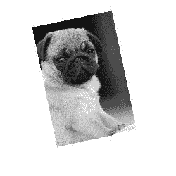
**图一。应用灰度图像过滤器**

这里是如何创建一个图像的棕褐色版本，这导致图像效果如图**图 2** 所示。

```
        fabric.Image.fromURL('pug.jpg', function(img) {
	  img.filters.push(new fabric.Image.filters.Sepia());
	  img.applyFilters(canvas.renderAll.bind(canvas));
	  canvas.add(img);
	});
```

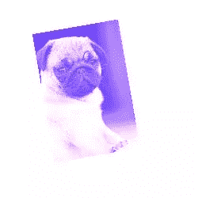
**图二。应用棕褐色图像滤镜**

因为 filters 属性是一个简单的数组，所以您可以以通常的方式对它执行任何想要的操作—删除一个滤镜(通过 pop、splice 或 shift)，添加一个滤镜(通过 push、splice、unshift)，甚至组合多个滤镜。当您调用`applyFilters`时，过滤器数组中出现的任何过滤器都将被逐个应用。

以下是如何创建既深褐色又明亮的图像。**结果如图 3** 所示。

```
        fabric.Image.fromURL('pug.jpg', function(img) {
	  img.filters.push(
	    new fabric.Image.filters.Sepia(),
	    new fabric.Image.filters.Brightness({ brightness: 100 }));
	  img.applyFilters(canvas.renderAll.bind(canvas));
	  canvas.add(img);
	});
```


**图三。结合棕褐色和明亮的图像过滤器**

请注意，我还将`{ brightness: 100 }`对象传递给了亮度过滤器。这是因为有些滤镜可以在没有任何附加配置的情况下应用(例如，灰度、反转、棕褐色)，而其他滤镜可以更好地控制它们的行为。对于亮度滤镜，是实际的亮度等级`(0–255)`。对于噪声过滤器，它是噪声值`(0–1000)`。对于“移除白色”滤镜，它是阈值和距离值。诸如此类。

既然您已经熟悉了织物过滤器，那么是时候打破常规，创建自己的过滤器了。创建过滤器的模板非常简单。您需要创建一个类，然后定义一个`applyTo`方法。或者，您可以为过滤器提供`toJSON`方法(支持 JSON 序列化)或`initialize`方法(支持可选参数)。下面是代码示例，结果如图 4 所示。

```
        fabric.Image.filters.Redify = fabric.util.createClass({
	  type: 'Redify',
	  applyTo: function(canvasEl) {
	    var context = canvasEl.getContext('2d'),
	      imageData = context.getImageData(0, 0,
	        canvasEl.width, canvasEl.height),
	      data = imageData.data;
	    for (var i = 0, len = data.length; i < len; i += 4) {
	      data[i + 1] = 0;
	      data[i + 2] = 0;
	    }
	    context.putImageData(imageData, 0, 0);
	  }
	});
	fabric.Image.filters.Redify.fromObject = function(object) {
	  return new fabric.Image.filters.Redify(object);
	};
```

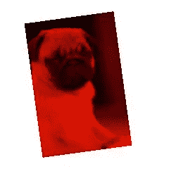
**图 4。应用自定义图像过滤器**

无需深入研究这段代码，主要操作发生在一个循环中，我用 0 替换了每个像素的绿色`(data[i+1])`和蓝色`(data[i+2])`成分，实际上是将它们移除。标准 RGB 值的红色分量保持不变，本质上是将整个图像涂成红色。正如您所看到的，`applyTo`方法被传递给表示整个图像的主画布元素。从那里，您可以迭代它的像素`(getImageData().data)`，以任何您想要的方式修改它们。

## 颜色；色彩；色调

无论您更喜欢使用十六进制、RGB 或 RGBA 颜色，Fabric 都能提供坚实的色彩基础，帮助您最自然地表达自己。以下是定义织物颜色的一些方法:

```
        new fabric.Color('#f55');
	new fabric.Color('#123123');
	new fabric.Color('356735');
	new fabric.Color('rgb(100,0,100)');
	new fabric.Color('rgba(10, 20, 30, 0.5)');
```

转换也很简单。`toHex()`方法将颜色实例转换为十六进制表示，`toRgb()`转换为 RGB 颜色，`toRgba()`转换为带有 alpha 通道的 RGB。

```
        new fabric.Color('#f55').toRgb(); // "rgb(255,85,85)"
	new fabric.Color('rgb(100,100,100)').toHex(); // "646464"
	new fabric.Color('fff').toHex(); // "FFFFFF"
```

转换不是你可以对颜色采取的唯一步骤。您也可以用一种颜色覆盖另一种颜色，或者将其转换为灰度版本。

```
        var redish = new fabric.Color('#f55');
	var greenish = new fabric.Color('#5f5');
	redish.overlayWith(greenish).toHex(); // "AAAA55"
	redish.toGrayscale().toHex(); // "A1A1A1"
```

## 梯度

一种更有表现力的处理颜色的方式是通过渐变。渐变允许您将一种颜色与另一种颜色混合，创建一些令人惊叹的图形效果。

Fabric 通过在所有对象上定义的`setGradientFill`方法支持渐变。调用`setGradientFill`就像设置对象的填充值一样，只不过你用渐变而不是单一颜色填充对象。下面是一些样例代码，视觉效果如图**图 5** 所示。

```
        var circle = new fabric.Circle({
	  left: 100,
	  top: 100,
	  radius: 50
	});
	circle.setGradientFill({
	  x1: 0,
	  y1: 0,
	  x2: 0,
	  y2: circle.height,
	  colorStops: {
	  0: '#000',
	  1: '#fff'
	}
	});
```

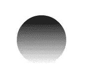
**图五。对对象应用渐变填充**

在这个例子中，我在位置`100,100,`创建了一个半径为 50px 的圆。然后我把它的填充设置为从白到黑的渐变，这个渐变跨越了这个圆的整个高度。

传递给方法的参数是一个选项对象，它需要两个坐标对(`x1, y1`和`x2, y2`)以及一个`colorStops`对象。坐标指定渐变的起点和终点。`colorStops`对象指定渐变由哪些颜色组成。您可以定义任意数量的色标，只要它们的范围从 0 到 1(例如，0、0.1、0.3、0.5、0.75、1 等等)。零(0)表示渐变的开始，1 表示渐变的结束。

下面是创建从左到右的红蓝渐变的代码。**图 6** 显示了结果。

```
        circle.setGradientFill({
	  x1: 0,
	  y1: circle.height / 2,
	  x2: circle.width,
	  y2: circle.height / 2,
	  colorStops: {
	    0: "red",
	    1: "blue"
	  }
	});
```

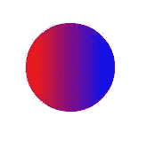
**图六。使用色标创建的渐变**

下面的代码显示了五个停止的彩虹渐变，颜色甚至跨越 20%的间隔。**图 7** 显示了结果。

```
        circle.setGradientFill({
	  x1: 0,
	  y1: circle.height / 2,
	  x2: circle.width,
	  y2: circle.height / 2,
	  colorStops: {
	  0: "red",
	    0.2: "orange",
	    0.4: "yellow",
	    0.6: "green",
	    0.8: "blue",
	    1: "purple"
	}
	});
```

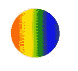
**图 7。彩虹渐变**

你能想出哪些很酷的版本？

## 文本

如果您不仅想在画布上显示图像和矢量形状，还想显示文本，该怎么办？布料可以让你穿过`fabric.Text`物体。

在 Fabric 中提供文本抽象有两个原因。首先，它允许您以面向对象的方式处理文本。像往常一样，原生画布方法只允许在非常低的级别上填充或描边文本。通过实例化`fabric.Text`实例，您可以像处理任何其他 Fabric 对象一样处理文本——移动它、缩放它、更改它的属性等等。

第二个原因是提供比 canvas 元素更丰富的功能。添加的一些面料包括:

**多行支持**原生文本方法，不幸的是，简单地忽略新行。
**文本对齐**左、中和右。在处理多行文本时非常有用。
**文字背景**背景也尊重文字对齐。
**文本修饰**下划线、上划线、删除线。
**行高**在处理多行文本时有用。

这里有一个“hello world”的例子:

```
        var text = new fabric.Text('hello world', { left: 100, top: 100 });
	  canvas.add(text);
	});
```

没错！在画布上显示文本就像在指定位置添加一个`fabric.Text`实例一样简单。如您所见，唯一需要的参数是实际的文本字符串。第二个参数是常用的 options 对象，它可以有任何常用的属性，比如 left、top、fill、opacity 等等。

但是，当然，文本对象也有自己的文本相关属性。让我们来看看其中的一些。

### 字体系列

默认设置为 Times New Roman，`fontFamily`属性允许您更改用于呈现文本对象的字体系列。更改属性会立即以新字体呈现文本。**图 8** 显示了使用以下代码创建的效果。

```
        var comicSansText = new fabric.Text("I'm in Comic Sans", {
	  fontFamily: 'Comic Sans'
	});
```

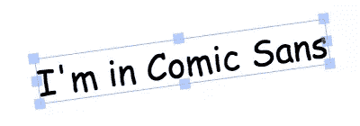
**图 8。对 fontFamily 属性的更改**

### 字体大小

字体大小控制渲染文本的大小。请注意，与 Fabric 中的其他对象不同，您不能直接更改文本对象的宽度和高度属性。相反，你需要改变`fontSize`值来使文本对象变大，正如你在**图 9** 中看到的。(或者，也可以使用`scaleX/scaleY`属性。)

```
        var text40 = new fabric.Text("I'm at fontSize 40", {
	  fontSize: 40
	});
	var text20 = new fabric.Text("I'm at fontSize 20", {
	  fontSize: 20
	});
```

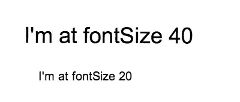
**图九。控制字体大小**

### 字体粗细

字体粗细可以让文本看起来更粗或更细。就像在 CSS 中一样，您可以使用关键字(例如 normal 或 bold—参见**图 10** 中的示例)或数字(100、200、400、600、800)。是否可以使用特定的粗细取决于该粗细对于所选字体的可用性。如果您使用远程字体，您需要确保提供正常和粗体(以及任何其他所需的粗细)字体定义。

```
        var normalText = new fabric.Text("I'm a normal text", {
	  fontWeight: 'normal'
	});
	var boldText = new fabric.Text("I'm at bold text", {
	  fontWeight: 'bold'
	});
```

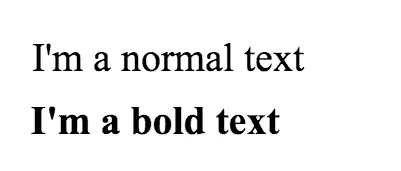
**图十。字体粗细可以由关键字或数值控制**

### 文本装饰

您可以使用文本装饰为文本添加下划线、上划线或删除线。同样，这类似于 CSS，但是 Fabric 走得更远，允许您一起使用这些装饰的任意组合。因此，你可以让文本带有下划线和上划线，带有删除线的下划线，等等，正如你在图 11 中看到的。

```
        var underlineText = new fabric.Text("I'm underlined text", {
	  textDecoration: 'underline'
	});
	var strokeThroughText = new fabric.Text("I'm stroke-through text", {
	  textDecoration: 'line-through'
	});
	var overlineText = new fabric.Text("I'm overlined text", {
	  textDecoration: 'overline'
	});
```

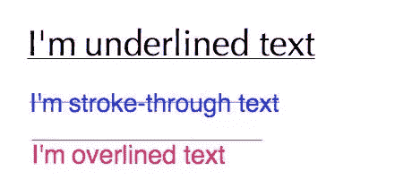
**图 11。文本装饰示例**

### 文本阴影

文本阴影由四个部分组成:颜色、水平偏移、垂直偏移和模糊大小。如果你在 CSS 中使用过阴影，这些效果可能非常熟悉。通过改变这些值，许多组合是可能的(见**图 12** )。

```
        var shadowText1 = new fabric.Text("I'm a text with shadow", {
	  textShadow: 'rgba(0,0,0,0.3) 5px 5px 5px'
	});
	var shadowText2 = new fabric.Text("And another shadow", {
	  textShadow: 'rgba(0,0,0,0.2) 0 0 5px'
	});
	var shadowText3 = new fabric.Text("Lorem ipsum dolor sit", {
	  textShadow: 'green -5px -5px 3px'
	});
```

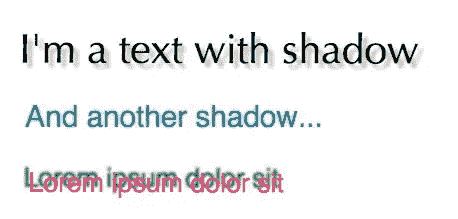
**图 12。文本阴影的例子**

### 字形

字体样式可以是两个值之一:正常或斜体。这类似于同名的 CSS 属性。下面的代码展示了一些使用`fontStyle`和**的例子，图 13** 展示了结果。

```
        var italicText = new fabric.Text("A very fancy italic text", {
	  fontStyle: 'italic',
	  fontFamily: 'Delicious'
	});
	var anotherItalicText = new fabric.Text("another italic text", {
	  fontStyle: 'italic',
	  fontFamily: 'Hoefler Text'
	});
```

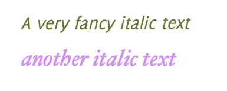
**图十三。斜体字体样式示例**

### 冲程样式和冲程宽度

通过组合`strokeStyle`(笔画的颜色)和`strokeWidth`(其宽度)，可以实现一些有趣的文字效果，如图**图十四**。下面是几个代码示例:

```
        var textWithStroke = new fabric.Text("Text with a stroke", {
	  strokeStyle: '#ff1318',
	  strokeWidth: 1
	});
	var loremIpsumDolor = new fabric.Text("Lorem ipsum dolor", {
	  fontFamily: 'Impact',
	  strokeStyle: '#c3bfbf',
	  strokeWidth: 3
	});
```

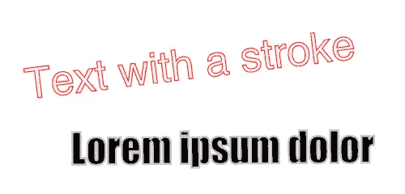
**图十四。使用 strokeStyle 和 strokeWidth 的文本效果**

### 文字型态

处理多行文字对象时，文字对齐非常有用。对于单行文本对象，边界框的宽度总是与该行的宽度相匹配，所以没有什么需要对齐的。

`textAlign`的允许值为左、中和右。**图 15** 显示右对齐文本。

```
        var text = 'this isna multilinentextnaligned right!';
	var alignedRightText = new fabric.Text(text, {
	  textAlign: 'right'
	});
```

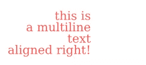
**图 15。右对齐文本**

### 线高

CSS 中可能熟悉的另一个属性是`lineHeight`。它允许您更改多行文本中文本行之间的垂直间距。在下面的例子中，第一个文本块将`lineHeight`设置为 3，第二个文本块设置为 1。您看到的结果如图**图 16** 所示。

```
        var lineHeight3 = new fabric.Text('Lorem ipsum ...', {
	  lineHeight: 3
	});
	var lineHeight1 = new fabric.Text('Lorem ipsum ...', {
	  lineHeight: 1
	});
```

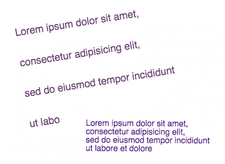
**图十六。行高示例**

### 背景颜色

最后，`backgroundColor`允许你给文本一个背景。注意，背景只填充文本字符占据的空间，而不是整个边界框，正如你在**图 17** 中看到的。这意味着文本对齐改变了文本背景的呈现方式——行高也是如此，因为背景遵循由`lineHeight`创建的行之间的垂直间距。

```
        var text = 'this isna multilinentextnwithncustom lineheightn&background';
	var textWithBackground = new fabric.Text(text, {
	  backgroundColor: 'rgb(0,200,0)'
	});
```

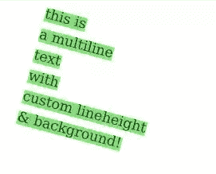
**图十七。文本背景效果**

## 事件

事件驱动的架构是框架中一些惊人的能力和灵活性的基础。Fabric 也不例外，它提供了一个广泛的事件系统，从低级的鼠标事件到高级的对象事件。

这些事件允许您利用画布上发生的各种动作的不同时刻。你想知道鼠标是什么时候按下的吗？只需观察`mouse:down`事件。当一个对象被添加到画布上时呢？在这种情况下，`object:added`就是为你准备的。当整个画布被重新渲染时呢？就用`after:render`吧。

事件 API 非常简单，类似于 jQuery、下划线. js 或其他流行的 JS 库。有一个`on`方法来初始化事件监听器，还有一个`off`方法来删除它。

这里有一个例子:

```
        var canvas = new fabric.Canvas('...');
	canvas.on('mouse:down', function(options) {
	  console.log(options.e.clientX, options.e.clientY);
	});
```

在这段代码中，我将`mouse:down`事件监听器添加到画布上，并给它一个事件处理程序，它将记录事件起源的坐标。换句话说，处理程序将记录鼠标在画布上被按下的确切位置。事件处理程序接收一个 options 对象，该对象有两个属性:`e`，它是原始事件，和`target`，它是画布上被单击的对象，如果有的话。该事件一直存在，但是只有当用户确实单击画布上的对象时，目标才存在。此外，只有在有意义的情况下，目标才会被传递给事件处理程序——例如，对于`mouse:down`，而不是`after:render`(这表示整个画布都被重画了)。

```
        canvas.on('mouse:down', function(options) {
	  if (options.target) {
	    console.log('an object was clicked! ', options.target.type);
	  }
	});
```

这个例子将记录“一个对象被点击！”如果你点击一个物体。它还会添加所单击对象的类型。

Fabric 中其他一些可用的鼠标级事件是`mouse:move`和`mouse:up`。通用事件包括`after:render`，也有选择相关事件:`before:selection:created`、`selection:created`、`selection:cleared`。最后，对象事件包括`object:modified`、`object:selected`、`object:moving`、`object:scaling`、`object:rotating`和`object:added`。

像`object:moving`(或`object:scaling`)这样的事件会在每次对象移动(或缩放)一个像素时连续触发。另一方面，像`object:modified`或`selection:created`这样的事件只在动作结束时触发(对象修改或选择创建)。

注意事件是如何直接附加到画布上的(`canvas.on('mouse:down', ...)`)。可以想象，这意味着事件的范围都是画布实例。如果一个页面上有多个画布，可以为每个画布附加不同的事件侦听器。他们都是独立的，只尊重分配给他们的事件。

为了方便起见，Fabric 进一步扩展了事件系统，允许您将侦听器直接附加到画布对象。看一下这段代码:

```
        var rect = new fabric.Rect({ width: 100, height: 50, fill: 'green' });
	rect.on('selected', function() {
	  console.log('selected a rectangle');
	});
	var circle = new fabric.Circle({ radius: 75, fill: 'blue' });
	circle.on('selected', function() {
	  console.log('selected a circle');
	});
```

在这里，我将事件侦听器直接附加到矩形和圆形实例。我使用的是选中的事件，而不是`object:selected`。类似地，我可以使用修改的事件(当附加到画布时使用`object:modified`，当附加到画布时使用旋转事件`(object:rotating`，等等。

查看此[事件演示](http://fabricjs.com/events/)，更深入地了解 Fabric 的事件系统。

在下一篇文章中，我将继续讨论更高级的特性:组、序列化(和反序列化)和类。

*本文最初发表于[http://msdn.microsoft.com/en-us/magazine/jj856929.aspx](http://msdn.microsoft.com/en-us/magazine/jj856929.aspx)，经允许在此转载。*

## 分享这篇文章