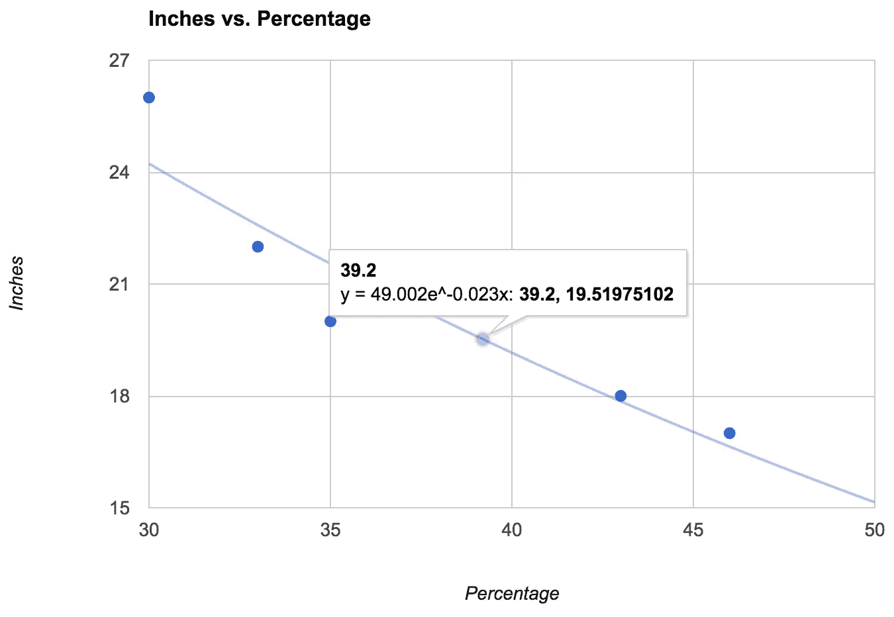

# 基于 JavaScript 的人脸邻近检测

> 原文：<https://www.sitepoint.com/face-proximity-detection-with-javascript/>

让我们假设你想让你的网站的访问者做一个视频记录或拍一张他们的脸。你如何向他们解释他们应该坐在离摄像机多近的地方？你可以写很长的说明书，但是你知道现在几乎没有人看说明书。或许，解决这个问题的更好的方法是使用面部检测算法，该算法可以评估面部与帧的比例，计算出面部是否太远或太近。

我在 Mozilla 的开发团队需要一个“视频亭”功能，让人们能够对着网络摄像头录制自己的对话，并上传和分享这些视频，所有这些都在一个网络应用程序中完成。在这种情况下，质量问题通常与音频有关。理想情况下，人们应该使用质量不错的麦克风，坐在回声最小的房间里，但这通常是不可能的。解决这个问题的最好方法是确保用户坐在笔记本电脑内置麦克风附近。为了做到这一点，我们在取景器上实现了面部检测，以告诉他们是否坐得足够近。

在本文中，我将向您展示如何构建这个功能，并了解一些相关的组件。

## 让我们让照相机开始工作

[getUserMedia 流 API](http://caniuse.com/#feat=stream) 在主流现代浏览器中一直处于紧张的变化之中。 [`navigator.getUserMedia`](https://developer.mozilla.org/en-US/docs/Web/API/Navigator/getUserMedia) API 实际上只适用于各种厂商的前缀黑客。新的`getUserMedia` stream API 可以在包括微软 Edge 在内的大多数现代桌面浏览器上运行，但不能在 Safari 或任何基于 Webkit 的 iOS 浏览器上运行。

您需要启动的最少代码如下所示:

```
navigator.mediaDevices
   .getUserMedia({audio: false, video: true})
   .then(function(stream) {
       // OK
   })
   .catch(function(error) {
       // Error
   });
```

然而， [MDN 有一个很棒的 8 liner polyfill，可以帮助你支持旧的浏览器](https://developer.mozilla.org/en-US/docs/Web/API/MediaDevices/getUserMedia#Examples)。复制之后，我们的代码应该是这样的:

```
navigator.mediaDevices = navigator.mediaDevices || ((navigator.mozGetUserMedia || navigator.webkitGetUserMedia) ? {
   getUserMedia: function(c) {
     return new Promise(function(y, n) {
       (navigator.mozGetUserMedia ||
        navigator.webkitGetUserMedia).call(navigator, c, y, n);
     });
   }
} : null);

// this is not part of the polyfill
if (!navigator.mediaDevices) {
  throw new Error('getUserMedia() not supported.');
}

navigator.mediaDevices
   .getUserMedia({audio: false, video: true})
   .then(function(stream) {
       // OK
   })
   .catch(function(error) {
       // Error
   });
```

现在您已经有了`MediaStream`对象(在上面的代码示例中只称为`stream`),您需要将它投影到某个东西上。通过使用一种叫做`URL.createObjectURL(blob)`的方法，你投射到的是一个`video`元素。我们将添加其中的一个，并在`stream`对象可用的地方继续示例代码。

```
function startCamera() {}
  return navigator.mediaDevices
    .getUserMedia({audio: false, video: true})
    .then(function(stream) {
      // assume you have a `` tag somewhere in the DOM
      var video = document.querySelector('video');
      video.src = URL.createObjectURL(stream);
      video.play();

      // return the stream so that chained promises can use it
      return stream;
    })
}
```

在我们玩第一个演示之前，让我们用一个可以启动和停止相机的按钮来修饰它。代码不是特别重要。然而，值得注意的是，我们可以使用承诺，以便能够在流开始时进行引用。下面是一个简单的实现:

```
document.querySelector('button').onclick = function() {
  var button = this;
  button.textContent = 'Starting camera';

  // the function that wraps the getUserMedia call
  startCamera()
  .then(function() {
    button.textContent = 'Stop camera';
  });
}
```

[你可以在这里找到一个稍微完整和实用的例子](http://codepen.io/SitePoint/pen/bVKxjm)。

## 取景器的一个关键技巧

如果你玩了上面的演示，你应该可以在取景器中看到你的脸的动画。但是你注意到把你自己放在中间有多难吗？那是因为取景器中的画面不是你的镜像。这是你脸的真实视图，就像你的朋友看到你一样。如果你把头偏向左耳，取景器中的人脸会向右倾斜。这很尴尬，尽管这是不应该的。毕竟，你打算记录你的面部说话，以便那些不能亲自到场的人能够受益于以后能够以视频剪辑或图片的形式查看它。我们很少在视频中看到自己的脸，但我们经常在镜子中看到自己的脸。

解决这个问题的方法出奇的简单。我们可以使用 CSS 镜像取景器图像。事实上，我们所做的是把它绕 Y 轴旋转 180 度。这个魔术是通过一个简单的`transform`规则实现的:

```
video {
  transform: rotateY(180deg);
}
```

[在 CodePen 上，您可以找到第一个增强版演示](http://codepen.io/SitePoint/pen/xwzaQE)，也可以在下面找到:

在[码笔](http://codepen.io)上通过 SitePoint ( [@SitePoint](http://codepen.io/SitePoint) )看笔 [xwzaQE](http://codepen.io/SitePoint/pen/xwzaQE/) 。

你不觉得这样看起来更自然更有期待吗？突然之间，管理如何使你的脸居中变得容易多了。

## 将画框投影到画布上

将流投影到`<video>`标签上的优点是快速高效。缺点是我们不能在那里操纵或分析它。为此，我们需要一个`<canvas>`标签和它的 2D 上下文。

基本上，这里的整个技巧可以归结为:你获取一个流(从开始一个`navigator.mediaDevices.getUserMedia`实例)并在两个地方显示它。一个给`<video>`标签(即“取景器”)，一个给`<canvas>`标签(即“分析器”)。之后，我们将`<canvas>`的每一帧发送到人脸检测软件，从中得出结论并反馈给用户。

作为第一步，让我们添加`canvas`元素，并以每 1/10 秒的速率向其输入帧。

```
// assuming you have a  tag somewhere in the DOM
var canvas = document.querySelector('canvas');
var context = canvas.getContext('2d');

function startCamera() {}
  return navigator.mediaDevices.getUserMedia({audio: false, video: true})
  .then(function(stream) {
    // same as before
    var video = document.querySelector('video');
    video.src = URL.createObjectURL(stream);
    video.play();

    // The critical point where we transfer some frames to
    // a canvas element.
    setInterval(function() {
      context.drawImage(video, 0, 0, canvas.width, canvas.height);
    }, 100);
  })
}
```

您实际上不需要让`<canvas>`可见，所以理想情况下，您只需将它添加到您的 DOM 中，然后隐藏它，如下所示:

```
canvas {
  display: none;
}
```

[这是一个使用了`canvas`元素但隐藏了](http://codepen.io/SitePoint/pen/xwzamE)的演示。

`context.drawImage` API 很牛逼。我们可以简单地给它传递一个`video`元素，然后是左上角坐标，最后是右下角坐标。

开始了。我们将网络摄像头的图像完全投射到一个`<canvas>`上。整洁！

## 带来了真正的人脸检测

我们想要使用的文件可以从[获得，这是一个名为`ccv`](https://github.com/liuliu/ccv) 的 GitHub 项目，由在 [Snapchat](https://www.snapchat.com/) 工作的[刘浏](https://www.facebook.com/lliu?_rdr=p)开发。 [CCV](http://libccv.org) 基本上是一个用 C 语言编写的项目，包含一些非平凡的学习算法，例如，当寻找人脸时，这些算法知道哪些模式是可以预期的。

然而，我们不打算使用 C 代码，因为我们将在浏览器中做任何事情，而不使用服务器。CCV 项目的美妙之处在于它的创建者有一个保存为 [236Kb JavaScript 文件](https://github.com/liuliu/ccv/blob/stable/js/face.js)的模型和一个[小脚本](https://github.com/liuliu/ccv/blob/stable/js/ccv.js)，该脚本使用这个带有`<canvas>`标签的模型。

API 的工作方式非常简单。你给它一个`<canvas>`标签，模型，一些参数，结果你得到了一个“对象”数组。在加载了`face.js`和`ccv.js`之后，您需要添加以下代码来调用它:

```
// using global `ccv` from ccv.js and `cascade` from face.js
var faces = ccv.detect_objects({
  canvas: ccv.pre(canvas),
  cascade: cascade,
  interval: 2,
  min_neighbors: 1
});
```

这些物体都是面，每个看起来都像这样:

```
{
  confidence: 0.33769726999999994,
  height: 60.97621039495391,
  width: 60.97621039495391,
  neighbors: 1,
  x: 131.5317891890668,
  y: 66.0158945945334
}
```

我们实际上如何使用它？让我们扩展现有的演示，让它在控制台上显示任何找到的面孔。

[您可以在这里找到每个检测到的人脸都被控制台记录的演示](http://codepen.io/SitePoint/pen/epKLoN)。

为了理解我们得到了什么，比较传统的做法是在图像上渲染一个正方形(在`<canvas>`中)，这样我们就可以理解这些`width`、`height`、`x`和`y`是什么。让我们通过不隐藏`canvas`并在上面画一个红色矩形来实现。

[在 CodePen 上，你可以看到在脸部周围画一个典型正方形的代码](http://codepen.io/SitePoint/pen/dYKqBV)，在下面的演示中，你可以使用它:

在[码笔](http://codepen.io)上通过 SitePoint ( [@SitePoint](http://codepen.io/SitePoint) )看笔 [dYKqBV](http://codepen.io/SitePoint/pen/dYKqBV/) 。

此时，在观看演示之前，有几件事情需要注意:

1.  面部矩形有时会消失。尤其是当你“离开视线”或者用手遮住半边脸的时候。这是因为模型并不完美。这是一个试图以最佳方式工作的近似模型。
2.  随着你越来越靠近和远离相机(即笔记本电脑的屏幕)，矩形会变小和变大。那是我们下一步的线索！

## 计算你离屏幕有多远

由于面部检测结果中的`height`值，从你的鼻子到你的屏幕(相机大概在哪里)的距离被计算出来。如果你知道脸的高度和`canvas`的高度，你可以算出一个百分比来代表“离屏幕的正确距离”。但是请注意，**你**决定这个百分比！解决这个问题的最好方法是在你自己身上测试一下，看看矩形的百分比是多少。

这个演示帮助你调试你的脸相对于画布的百分比/比率。

现在，你可能已经注意到的一件事是，这个数字“跳”了很多次。它上下闪烁，几乎很难分辨出是什么。一个简单的解决方法是计算一个“移动平均值”(意思是移动平均值)。我们不做花哨的统计，而只是平均最后五个百分比。实现这一点的函数很简单:

```
var percentages = [];
function rollingAverage(size) {
  percentages.splice(0, percentages.length - size);
  var sum = percentages.reduce(function(total, num) {
    return total + num
  }, 0);
  return sum / percentages.length;
}
```

[这个演示显示，现在百分比数字没有太大的变化](http://codepen.io/SitePoint/pen/ZbRMgG)。

## 离屏幕的实际距离呢？

如果你想知道从你的脸到屏幕的实际距离是英寸还是厘米，同样，使用你的脸占`canvas`的百分比。然而，为了进行转换，你首先要弄清楚这些百分比对你的脸意味着什么。理想的情况是，此时你应该拿一把尺子，让一个伙伴在你坐着不动的时候测量你，观察百分数。下面是通过测量几个数据点并使用 Google Docs 提取指数趋势线得出的一个结论:



如你所见，这给了我们一个公式。让我们用它来表示以英寸为单位的距离。

[这是演示的最终代码，带有将百分比转换为英寸的科学模型](http://codepen.io/SitePoint/pen/xwzavg)。下面你可以看到结果:

通过[码笔](http://codepen.io)上的 SitePoint ( [@SitePoint](http://codepen.io/SitePoint) )看笔 [xwzavg](http://codepen.io/SitePoint/pen/xwzavg/) 。