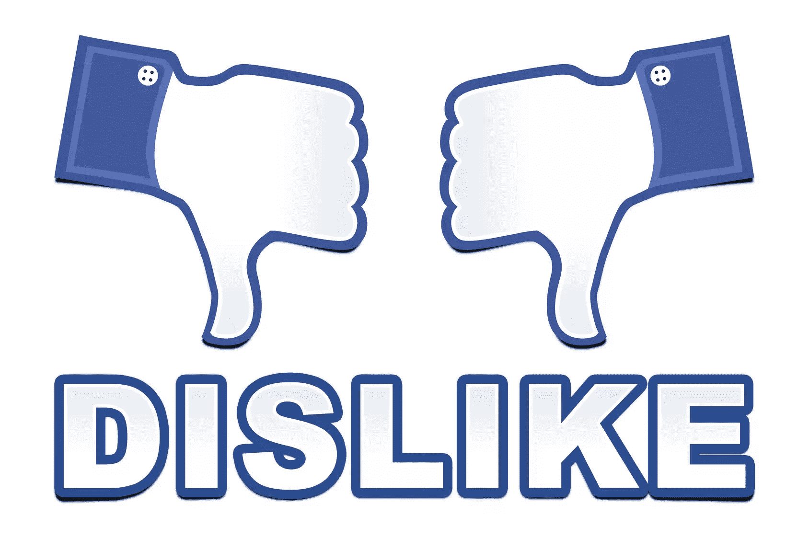

# 已经删除了你的脸书商业页面

> 原文：<https://www.sitepoint.com/facebook-algorithm-change-2015/>

似乎所有人都在谈论(或害怕)的是 mobile geddon——谷歌的算法更新，惩罚没有响应的网站。

事实证明，更新并不像每个人说的那样糟糕。然而不幸的是，谷歌不是唯一一个推出算法变化的公司。

脸书刚刚宣布它也在更新它的算法，对于我们这些试图发展自己业务的小人物来说，事情看起来会变得更加糟糕。

## 以下是脸书算法的三个更新

### 1.查看同一来源的更多内容

为了让朋友不多的用户在他们的新闻订阅中获得更好的内容，脸书现在将显示更多来自同一来源的内容。

### 2.查看所有朋友的更新

无论你的朋友分享了什么，或者他们是什么时候分享的，他们的帖子总是在你的订阅源的高端。脸书希望确保用户永远不会错过朋友的更新。

### 3.朋友的喜欢和评论

最后一次更新围绕着你现在在新闻订阅上看到的那些烦人的帖子，比如:“劳伦喜欢商业内幕的帖子。”更新之后，你可能再也看不到那些讨厌的状态更新了。

## 是时候放弃脸书营销了

基本上，脸书一直说它想成为未来的报纸。

事实上，上个月有消息称脸书正在与 Buzzfeed 等出版物进行讨论。为什么？因为想成为报纸的人可能想托管新闻网站的内容。

除了用 Chrome 浏览器的 [Buffer](http://bufferapp.com) 扩展对我在网上找到的好文章进行一键调度之外，我对我的脸书页面投入了绝对的零时间。

我不是唯一一个选择放弃脸书的人。像 [GrooveHq](https://www.groovehq.com/blog/focus) 和 [Eat24](http://blog.eat24hours.com/breakup-letter-to-facebook-from-eat24/) 这样的大品牌早就把页面删了。

以下是 Eat24 给脸书的爆笑分手信的节选。

我们很想说“不是你的问题，是我们的问题”，但这完全是你的问题。无意冒犯，但你不再是我们几年前爱上的那个聪明有趣的社交网络了。你变了。很多。

当我们第一次见面时，你让我们觉得自己很特别。我们会给你讲一个关于 Sriracha 的超级搞笑的笑话，你会告诉我们所有的朋友，然后大家一起大笑。但是现在呢？如果我们想和朋友聊天，现在你要我们给你钱。现在，当我们给你看一张裹着培根的玉米卷的照片时，你会说“推广这篇文章！多交几个朋友！”而不是因为我们是谁而喜欢我们。真是一团糟。

基本上，脸书是在利用它的力量让你们——我们——付出代价—“提高这个职位”的代价。坦白地说，我不想再在这上面浪费时间(或金钱)。

Groove 也有这种感觉。这家 SaaS 初创公司每周在 it 上花费一个小时，他们决定将这些时间(每年 52 个小时)重新分配给其他真正产生投资回报(ROI)的平台。

## 这里是你应该重新定位的地方

你可能在想:好吧，如果我不使用脸书，那么我应该使用哪些社交媒体网络呢？

Twitter 和 LinkedIn 都很好，我肯定经常使用它们，但这也不是真正的吸引力所在。

真正吸引人的是利基在线社区，如 Reddit 和 Inbound，以及论坛，如 Quora。这些网站需要更长的帖子，但是如果你的帖子很好，那么它们会自然上升到顶部。

你知道网上还有哪里吗？！

出版平台也是它的发展方向。

当我键入发布平台时，我指的是像 [Medium](http://medium.com) 和 LinkedIn Publishing 这样的地方。

我是媒体的超级粉丝，因为让你的东西被大量的观众阅读是如此的容易。这与 LinkedIn Publishing 的令人敬畏的订婚故事是同一类型的。

## 结论

已经没有肤浅的状态更新的空间了。

没有人关心你的页面当天的投票或者你现在有 500 个追随者。

他们关心的是受教育。

这就是为什么 Quora 上有帮助的论坛帖子和有价值的、深入的问题答案比安排一个完美炮制的脸书帖子更值得你花时间。

停止 Facebooking，开始帮忙吧。

#### 你认为我错了吗？企业还应该在脸书投资吗？告诉我你为什么同意或不同意我的观点。

## 分享这篇文章